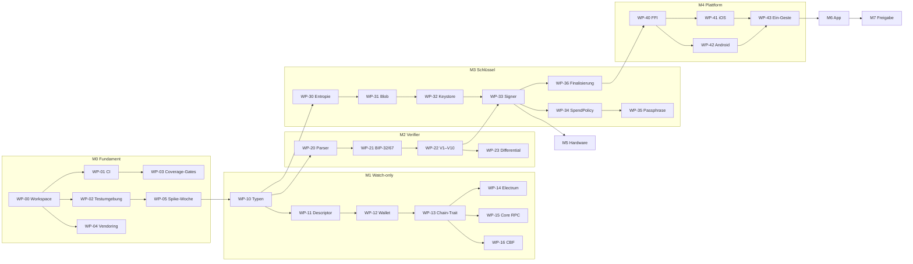

# Implementierungsplan

**Zweck:** Diese Datei ist die Arbeitsliste. Jedes Arbeitspaket (WP) ist so geschnitten, dass
ein Agent oder Entwickler es **ohne Rückfragen** abarbeiten kann: mit Eingaben, Ausgaben,
Spezifikationsverweis, Abnahmekriterien und den Tests, die grün sein müssen.

**Bezugsdokumente:**
[`SPECIFICATION.md`](SPECIFICATION.md) — das Was und Warum ·
[`TESTING.md`](TESTING.md) — Testumgebung, Coverage-Politik, CI ·
[`RECOVERY.md`](RECOVERY.md) — Nutzerdokument, Testfälle S5/S6

---

## 0. Regeln für jeden, der hier arbeitet

| # | Regel |
|---|---|
| R1 | **Ein WP = ein Branch = ein PR.** Branch-Name `wp/<id>-<kurzname>`. |
| R2 | **Kein WP gilt als fertig ohne seine Tests.** Die Testliste im WP ist die Abnahme, nicht der Code. |
| R3 | **Die Spec ist die Wahrheit.** Weicht die Umsetzung ab, wird zuerst die Spec geändert (mit Begründung im PR), dann der Code. Nie umgekehrt und nie stillschweigend. |
| R4 | **Blockiert statt geraten.** Wo die Spec ⟨API-VERIFY⟩ oder „offen" sagt, wird nicht improvisiert — Ergebnis in die Spec eintragen, dann weiter. |
| R5 | **Kein WP darf die FFI-Allowlist erweitern**, außer **WP-40** (das sie anlegt). Jede spätere Änderung braucht Zweit-Review mit Sicherheitsbegründung im PR. |
| R6 | **Coverage-Gate gilt ab dem WP, das den Crate anlegt** — nicht „später nachziehen". Siehe TESTING.md §3. |
| R7 | **Jeder PR nennt die WP-ID, die Spec-Abschnitte und die Test-IDs** in der Beschreibung. |

### Zustandslegende

`OFFEN` · `BLOCKIERT` (mit Grund) · `IN ARBEIT` · `REVIEW` · `FERTIG`

---

## 1. Meilensteine

| M | Name | Ziel | Enthält |
|---|---|---|---|
| **M0** | Fundament | Repo baut reproduzierbar, CI läuft, Testumgebung steht | WP-00 … WP-05 |
| **M1** | Watch-only-Kern | Descriptor, Adressen, UTXOs, PSBT-Bau — **ohne jedes Schlüsselmaterial** | WP-10 … WP-16 |
| **M2** | Verifier | Unabhängige Prüfung, gegen Bitcoin Core abgeglichen | WP-20 … WP-23 |
| **M3** | Schlüssel und Signatur | Entropie, Blobs, Keystore, Signatur, Ausgabegrenze | WP-30 … WP-36 |
| **M4** | Plattform und FFI | uniffi-Fassade, iOS- und Android-Keystore, Ein-Gesten-Ablauf | WP-40 … WP-46 |
| **M5** | Hardware-Signer | QR- und NFC-Transport, BIP-388, Gerätefreigabe | WP-50 … WP-54 |
| **M6** | App und UX | Onboarding, Senden, Empfangen, Recovery, Export | WP-60 … WP-68 |
| **M7** | Härtung und Freigabe | Fuzzing, Speicher-Hygiene, Audit, Nutzertest | WP-70 … WP-76 |

**M0 bis M4 sind die kritische Kette.** M5 kann ab M3 parallel laufen, M6 ab M4.

---

## 2. Abhängigkeitsgraph

---

## 3. Arbeitspakete

Jedes WP hat dieselbe Struktur. **Abnahme** ist bindend — was dort nicht steht, ist nicht Teil
des WP; was dort steht, ist ohne Ausnahme zu erfüllen.

---

### M0 — Fundament

#### WP-00 · Workspace und Pinning
**Spec:** 0.3, 1.1, 1.7 · **Blockiert:** alles · **Zustand:** OFFEN

Cargo-Workspace mit den neun Crates aus 1.1 als leere Gerüste. `[workspace.dependencies]` mit
**exakten** `=`-Pins aus der Tabelle in 0.3. `Cargo.lock` eingecheckt.
`rust-toolchain.toml` mit fester Version.

**Abnahme**
- `cargo build --workspace --locked` grün, offline (`--offline`)
- `cargo tree -d` meldet **keine** doppelten Crates — insbesondere nur **eine** `secp256k1`-Version
- `miniscript` löst auf `12.3.x` auf, **nicht** 13.x; `secp256k1` auf `0.29.1`
- `deny.toml` vorhanden mit `[licenses]` als **Allowlist** (MIT, Apache-2.0, BSD-2/3, ISC) und `[bans]`-Regel: `miniscript` ist in `trinity-verify` verboten
- `cargo deny check` grün

---

#### WP-01 · CI-Grundgerüst
**Spec:** 5.4, 5.5 · **Braucht:** WP-00 · **Zustand:** OFFEN

GitHub-Actions-Pipeline nach TESTING.md §5: `fmt` → `clippy -D warnings` → `build` →
`test` → `deny` → `audit`.

**Abnahme**
- Pipeline läuft auf jedem PR und blockiert bei Rot
- `clippy` mit `-D warnings`, keine `allow`-Ausnahmen ohne Kommentar mit Begründung
- Laufzeit des schnellen Pfades < 10 min

---

#### WP-02 · Testumgebung
**Spec:** 5.1, 5.3 · **Braucht:** WP-00 · **Zustand:** OFFEN

Reproduzierbare Umgebung nach TESTING.md §2: **Bitcoin Core 30.2** (Regtest und Signet),
Electrum-Server, CBF-Peer, alles containerisiert und über ein Skript startbar.

**Abnahme**
- `just test-env-up` bringt Core 30.2 (Regtest), electrs und einen Signet-Node hoch
- Version wird geprüft: **30.0 und 30.1 werden aktiv abgelehnt** (Wallet-Bug, 0.3)
- Deterministischer Regtest-Zustand: Skript erzeugt 101 Blöcke und eine geförderte Wallet
- `just test-env-down` räumt vollständig auf
- Läuft auf Linux **und** macOS

---

#### WP-03 · Coverage- und Mutations-Gates
**Spec:** 5.5 · **Braucht:** WP-01 · **Zustand:** OFFEN

`cargo-llvm-cov` mit **Schwellen pro Crate** nach TESTING.md §3, plus `cargo-mutants` für die
Sicherheitskerne.

**Abnahme**
- Coverage-Bericht je Crate, Gate bricht den Build bei Unterschreitung
- Ausnahmeliste existiert als Datei mit **Begründung je Eintrag**; ein Eintrag ohne Begründung bricht den Build
- `cargo-mutants` läuft gegen `trinity-verify` und `trinity-signer`, überlebende Mutanten brechen den Build

---

#### WP-04 · Vendoring und reproduzierbare Builds
**Spec:** 1.7 · **Braucht:** WP-00 · **Zustand:** OFFEN

**Abnahme**
- `vendor/` eingecheckt, `.cargo/config.toml` mit `replace-with = "vendored-sources"`
- Build ohne Netzwerk erfolgreich (im Container ohne Netz nachgewiesen)
- Zwei unabhängige CI-Runner erzeugen **bitgleiche** Artefakt-Hashes
- Dependency-Zahl im Signaturpfad wird gemessen und gegen die Grenze **≤ 40** geprüft

---

#### WP-05 · Spike-Woche: Anhang B abarbeiten
**Spec:** Anhang B (14 Punkte), O12 · **Braucht:** WP-02 · **Zustand:** OFFEN

**Alle 14 offenen Punkte** aus Anhang B klären und **die Spec aktualisieren**. Kein
Produktionscode.

**Abnahme**
- Jeder der 14 Punkte hat in der Spec ein Ergebnis oder eine begründete Vertagung
- Alle ⟨API-VERIFY⟩-Marken sind aufgelöst oder ausdrücklich verlängert
- Besonders: B.2 (uniffi-Puffernullung), B.3 (Kyoto-Peer-Verhalten), B.9 (Ledger-APDU-Referenz), B.13 (Whisper-Krypto) — sie berühren Architektur
- Coldcard-Versionsangaben gegen die **Primärquelle** verifiziert (B.6) — bis dahin darf WP-54 nicht starten

---

### M1 — Watch-only-Kern

#### WP-10 · `trinity-types`
**Spec:** 1.1, 1.3 · **Braucht:** WP-05 · **Zustand:** OFFEN

Wertetypen ohne I/O: `KeySlot`, `Network`, `PsbtB64`, `Fingerprint`, `WordCount`,
`XpubWithOrigin`, `Balance`, `AddressInfo`, `PsbtVerdict`, `SendRequest`, `SecretBytes`.

**Abnahme**
- `SecretBytes`: `ZeroizeOnDrop`, **kein** `Clone`, **kein** `Debug`/`Display` außer `"[redacted]"`
- Kompilier-Test (`trybuild`): `Clone` auf `SecretBytes` **schlägt fehl**
- Der Crate hat **keine** I/O-Abhängigkeit — per `cargo-deny [bans]` erzwungen
- Coverage 100 % Zeilen und Zweige

---

#### WP-11 · Descriptor-Erzeugung und -Persistenz
**Spec:** 2.3 · **Braucht:** WP-10 · **Zustand:** OFFEN

`wsh(sortedmulti(2,…))` mit BIP-48-Pfaden, Origin-Info, Checksum. `descriptor.json` mit
`word_count` **je Schlüssel**, `source` je Schlüssel, `policy_id`, `birthday`, Netz, Version.

**Abnahme**
- **D1** (Checksum gegen `getdescriptorinfo`, 10.000 Fälle)
- **P5** (Permutationsinvarianz), **P7** (identische Fingerprints werden abgelehnt), **P9** (fremde Grammatik abgelehnt)
- Receive- und Change-Descriptor getrennt (O8), Multipath wird **nicht** erzeugt
- Round-Trip `descriptor.json` verlustfrei, inkl. gemischter Wortlängen

---

#### WP-12 · `trinity-watch` — BDK-Wallet
**Spec:** 1.1, 3.2 · **Braucht:** WP-11 · **Zustand:** OFFEN

Wallet-Aufbau aus Descriptor, Adressableitung, UTXO-Verwaltung, `TxBuilder`, Persistenz.
Gap-Limit 20 (O10). ⟨API-VERIFY aus WP-05 einsetzen⟩

**Abnahme**
- **D2**, **D3** (Adressen gegen `deriveaddresses`, 500 Setups × 1.000 Adressen)
- **D6** (BIP-67 über alle 6 Permutationen)
- `nLockTime = Tip-Höhe`, `nSequence = 0xFFFFFFFE` (Anti-Fee-Sniping)
- Coin Selection: BnB mit SRD-Fallback; changelose Lösung wird bevorzugt
- **P8** (Gebührenidentität, Overflow-Grenzfälle)
- Dust-Change wandert in die Gebühr
- **Kein** Zugriff auf `trinity-keystore`/`-signer` — per `[bans]` erzwungen

---

#### WP-13 · `ChainBackend`-Trait
**Spec:** 1.6 · **Braucht:** WP-12 · **Zustand:** OFFEN

**Abnahme**
- Trait nach 1.6, inkl. `privacy_profile()`
- In-Memory-Fake für Tests, der ohne Netz funktioniert
- `broadcast` ist **getrennt** konfigurierbar vom Sync-Backend

---

#### WP-14 · Electrum-Backend · WP-15 · Core-RPC-Backend · WP-16 · CBF-Backend
**Spec:** 1.6 · **Braucht:** WP-13 · **Zustand:** OFFEN (parallelisierbar)

**Abnahme je Backend**
- **S2** (Saldo über alle drei Backends identisch)
- **S13** (Ausfall → sauberer Fehler, **kein** stiller Fallback auf ein anderes Backend)
- `privacy_profile()` liefert die Angaben aus der Tabelle in 1.6
- WP-16 zusätzlich: Ergebnis von Anhang B.3 ist eingearbeitet; ohne den Nachweis darf CBF **nicht** als Default gesetzt werden (O3)

---

### M2 — Verifier

#### WP-20 · Eigener Descriptor-Parser
**Spec:** 1.5, E2 · **Braucht:** WP-10 · **Zustand:** OFFEN

~250 Zeilen für **genau** die Grammatik `wsh(sortedmulti(2,·,·,·))`. Alles andere ist harter
Fehler. **Ohne `miniscript`.**

**Abnahme**
- `cargo-deny` bestätigt: `miniscript` ist keine Abhängigkeit dieses Crates
- **P9** mit zufälligen gültigen Miniscript-Descriptoren als Negativfälle
- `cargo-fuzz` ≥ 1 h ohne Fund (voller Lauf in WP-70)
- Coverage **100 % Zeilen und Zweige**, keine Ausnahmen

---

#### WP-21 · Eigene BIP-32-Ableitung und BIP-67-Sortierung
**Spec:** 1.5 · **Braucht:** WP-20 · **Zustand:** OFFEN

Eigene CKDpub, eigene Sortierung, eigener witnessScript-Bau. Geteilt bleiben nur `secp256k1`
und die Hashes — die Grenze der Unabhängigkeit ist in 1.5 tabelliert und gilt.

**Abnahme**
- **D4** (Verifier gegen `deriveaddresses`) — **der wichtigste Test des Meilensteins**
- **D5** (Verifier gegen Builder); jede Divergenz ist ein Alarm, kein Testfehler
- Coverage 100 %

---

#### WP-22 · Prüfungen V1–V10
**Spec:** 1.5, 3.3 · **Braucht:** WP-21 · **Zustand:** OFFEN

**Abnahme**
- Jede Prüfung V1–V10 hat mindestens einen Positiv- und einen Negativtest
- **P1, P2, P3, P11, P12**
- Jede Ablehnung liefert einen **konkreten** Fehlergrund, nie ein generisches „ungültig"
- Der Verifier läuft an allen **drei** Stellen aus 3.3

---

#### WP-23 · Differential-Harness
**Spec:** 5.1 · **Braucht:** WP-22, WP-02 · **Zustand:** OFFEN

Harness, das **D1–D19** gegen Bitcoin Core 30.2 fährt, mit stabilem Seed und reproduzierbaren
Fällen.

**Abnahme**
- Alle D-Tests laufen per `just diff-test` lokal und in CI
- Ein Fehlschlag zeigt Eingabe, Erwartung und Ist im Klartext
- Laufzeit < 20 min

---

### M3 — Schlüssel und Signatur

#### WP-30 · `trinity-entropy`
**Spec:** 2.2, 2.2.1–2.2.5 · **Braucht:** WP-10 · **Zustand:** OFFEN

`entropy = HMAC-SHA512(key = OS_CSPRNG(32), msg = extra_bytes)[0..L]`. Quellen Klasse A
(Würfel, Münzen, Karten) mit kanonischer Kodierung und Separator-Regel; Klasse B nur
einspeisbar, **null** anrechenbare Bit.

**Abnahme**
- **D12, D13, D17** · **P10, P14, P15, P16**
- **S20**: externes Shell-Skript rechnet `entropy` aus `raw_csprng` + `extra_bytes` nach — für **alle** Quellkombinationen
- `word_count`-Regel: C ist auf 24 festgenagelt, `SetupConfig` mit `C = 12` wird abgelehnt (**S15b**)
- Verifikationsblatt wird erzeugt und enthält `L`, die Separator-Regel und alle Zwischenwerte
- Coverage 100 %

---

#### WP-31 · Blob-Format
**Spec:** 2.4 · **Braucht:** WP-30 · **Zustand:** OFFEN

XChaCha20-Poly1305, Header als AAD, `word_count` im Header. **Kein KDF-Feld** — Argon2id sitzt
seit der Korrektur in 2.4 im Policy-Record.

**Abnahme**
- **P6** (Round-Trip, jede Header-Mutation ⇒ AEAD-Fehler), **P13** (`word_count`-Mutation)
- Blob-Format für A und B **bitgleich** — ein Test vergleicht die Layouts
- Coverage 100 %

---

#### WP-32 · `trinity-keystore`
**Spec:** 2.4, 2.5 · **Braucht:** WP-31 · **Zustand:** OFFEN

`SlotPolicy`, `PlatformKeyStore`-Callback-Trait, `POLICY_A` (`.biometryCurrentSet`) und
`POLICY_B` (`.userPresence`). Speicher-Handling nach 2.5.

**Abnahme**
- Kein `log`/`tracing` als Abhängigkeit — per `[bans]` erzwungen
- `#![deny(clippy::print_stdout, clippy::dbg_macro)]`
- Kompilier-Test: kein Secret-Typ ohne `ZeroizeOnDrop`
- `panic = "abort"` im Release-Profil
- Fake-`PlatformKeyStore` für Tests; **Mock zählt Aufrufe** (für S9, S28)
- Coverage 100 %

---

#### WP-33 · `trinity-signer`
**Spec:** 3.4 · **Braucht:** WP-32, WP-22 · **Zustand:** OFFEN

`Signer`-Trait, `LocalSigner`. RFC-6979 über `secp256k1`, low-s, `SIGHASH_ALL` ausschließlich,
Eigenverifikation nach jeder Signatur.

**Abnahme**
- **D7, D8** (bitgleich zu `walletprocesspsbt`) · **P4** (Determinismus)
- Verifier läuft **vor** jedem Schlüsselzugriff; **S9** inkl. Mock-Assertion, dass `unwrap_kek` **nicht** aufgerufen wurde
- **S10** (Manipulation zwischen A und B wird erkannt)
- Jeder andere SIGHASH als `ALL` wird abgelehnt (**P11**)
- Coverage 100 %, `cargo-mutants` ohne Überlebende

---

#### WP-34 · `SpendPolicy` und Fensterzähler
**Spec:** 3.6.3, 3.6.5, 3.6.7 · **Braucht:** WP-33 · **Zustand:** OFFEN

`clamp(20 % des Guthabens, 200 €, 500 €)` je 24 h, gleitendes Fenster, Zähler im
verschlüsselten Kernzustand. Anrechnung **exakt** nach 3.6.7.

**Abnahme**
- **S28** (Grenze greift, kein `unwrap_kek`, kein Biometrie-Prompt)
- **S29** (Stückelung hilft nicht), **S29b** (alle drei Bereiche + Grenzfälle), **S29f** (Invariante `Sockel ≤ Deckel`)
- **S29h** (Anrechnung: Gebühr, Change, Selbstüberweisung, RBF-Delta, verworfene Tx)
- **S29i** (unbestätigte Fremdzahlung hebt die Bezugsgröße **nicht**)
- **S29j** (gleitendes Fenster über Kalendergrenze)
- Zähler überlebt Neustart und Reboot; nicht durch Löschen JS-lesbarer Dateien rücksetzbar
- Coverage 100 %, `cargo-mutants` ohne Überlebende

---

#### WP-35 · Passphrase-Verifier und Fiat-Verankerung
**Spec:** 2.4 („Autorisierungsgeheimnis"), 3.6.6, 3.6.8 · **Braucht:** WP-34 · **Zustand:** OFFEN

`H = SHA-256(Argon2id(pass, pp_salt, profil))`, Vergleich in konstanter Zeit.
Diceware-Prüfung ≥ 6 Wörter. Fiat→Sat-Verankerung mit Plausibilitätsfilter und Asymmetrie.

**Abnahme**
- **D16** (Argon2id gegen RFC-9106-Vektoren, beide Profile)
- **S29c** (Kursmanipulation in 5 Varianten; **Assertion: kein Netzwerkabruf zur Signaturzeit**)
- **S29d**, **S29g** (Anheben verlangt Passphrase — auch direkt über die FFI, nicht nur über die UI)
- **S29e** (Signieren im Flugmodus), **S30**, **S31**
- **S35** (Erinnerungsübung nach 60 Tagen), **S36** (vergessene Passphrase ist kein Geldverlust)
- Vergleich nachweislich konstantzeitig (`subtle` o.ä., kein `==` auf Bytes)
- Coverage 100 %

---

#### WP-36 · Finalisierung und Broadcast
**Spec:** 3.5 · **Braucht:** WP-33 · **Zustand:** OFFEN

Witness in **BIP-67-Reihenfolge** (nicht in Signaturreihenfolge — häufige Fehlerquelle),
Konsensprüfung über `bitcoinconsensus` (O7), vsize-Messung gegen `max_feerate`.

**Abnahme**
- **D10** (Raw-Tx bitgleich zu `finalizepsbt`), **D11** (`testmempoolaccept` erlaubt)
- **S11** (Fee-Angriff wird vor jedem Schlüsselzugriff abgelehnt), **S12** (RBF-Bump)
- Ein Test vertauscht bewusst die Signaturreihenfolge und erwartet dennoch eine gültige Witness

---

### M4 — Plattform und FFI

#### WP-40 · `trinity-ffi`
**Spec:** 1.3 · **Braucht:** WP-36 · **Zustand:** OFFEN

uniffi-Fassade **exakt** nach der Signaturliste in 1.3, plus `ffi-allowlist.toml` und
CI-Gate.

**Abnahme**
- CI-Gate `ffi-boundary` bricht bei jeder Signaturänderung außerhalb der Allowlist
- Kein exportierter Aufruf gibt Seed, Mnemonic oder xpriv zurück — automatisiert geprüft
- **S23** ist ein **Build-brechender** Signatur-Check, keine Laufzeit-Assertion
- Ergebnis aus Anhang B.2 (`RustBuffer`-Nullung) ist umgesetzt

---

#### WP-41 · iOS-Plattformschicht · WP-42 · Android-Plattformschicht
**Spec:** 2.4, 3.6.2 · **Braucht:** WP-40 · **Zustand:** OFFEN (parallelisierbar)

Keychain/Keystore, `PlatformKeyStore`-Implementierung, Passphrase-Eingabe **ohne `String`**.

**Abnahme**
- iOS: SE-P-256-Schlüssel, `kSecAttrAccessibleWhenPasscodeSetThisDeviceOnly`; A `.biometryCurrentSet`, B `.userPresence`
- Android: StrongBox mit Feature-Detection; A `AUTH_BIOMETRIC_STRONG` + `setInvalidatedByBiometricEnrollment(true)`; B zusätzlich `AUTH_DEVICE_CREDENTIAL`, Enrollment-Invalidierung **aus**
- Passphrase nie als `String` — Code-Review-Checkliste **plus** Lint
- **S14**, **S33** (Enrollment-Wechsel: A weg, **B lebt**), **S34** (nur Passcode ⇒ nur B)
- Verhalten bei App-Deinstallation dokumentiert (Anhang B.4)

---

#### WP-43 · Ein-Gesten-Ablauf
**Spec:** 3.6.2 · **Braucht:** WP-41, WP-42 · **Zustand:** OFFEN

iOS: ein `LAContext` für beide Zugriffe. Android: zeitbasierte Autorisierung, Fenster so kurz
wie technisch möglich, **nicht** konfigurierbar.

**Abnahme**
- **S27**: **genau ein** biometrischer Prompt pro Send unterhalb der Grenze. Zwei Prompts sind ein Fehlschlag.
- Gesamtdauer ≤ 5 s auf dem Referenzgerät der unteren Leistungsklasse
- Auf echten Geräten geprüft, nicht nur im Simulator

---

#### WP-44 · Speicher-Hygiene-Harness · WP-45 · Signet-E2E-Harness · WP-46 · Export
**Spec:** 5.4, 5.3, 2.3 · **Braucht:** WP-43 · **Zustand:** OFFEN

**Abnahme**
- WP-44: Heap-Dump nach `sign_*` enthält die bekannte Entropie **nicht**; Linux und Android; iOS-Lücke dokumentiert
- WP-45: **S1–S8** laufen automatisiert auf Signet und Regtest
- WP-45 zusätzlich **S32** — die vollständige Diebstahl-Simulation: entsperrtes Gerät, Angreifer schöpft die Quote aus, danach Recovery mit Backup-B + C auf einem zweiten Gerät. **Das ist der Testfall, der die zentrale Produktaussage aus 3.6.4 belegt**; reißt er, ist die Aussage nicht haltbar und das Release blockiert (5.5, Punkt 5b).
- WP-46: **D14, D15** (Sparrow, BSMS), **S5**, `export_core_importdescriptors` erzeugt lauffähige Befehle für RECOVERY.md §3

---

### M5 — Hardware-Signer

#### WP-50 · Transport-Trait · WP-51 · QR (BBQr/UR) · WP-52 · NFC · WP-53 · BIP-388 · WP-54 · Gerätefreigabe
**Spec:** 2.7.1–2.7.9 · **Braucht:** WP-33 (Trait), WP-50 (Rest) · **Zustand:** OFFEN

**Abnahme**
- WP-51: **D19** (BBQr/UR-Round-Trip, mehrframige 5–20 KB PSBTs)
- WP-52: Ergebnis aus Anhang B.10 (CoreNFC-Entitlement) eingearbeitet
- WP-53: **D18**, **S16**, **S18** (Gerät zeigt Change **als eigenen** an)
- WP-54: **S21** (Firmware-Gate greift, Mk2/Mk3 bleiben in jeder Version gesperrt), **S22** (Import eines bestehenden Geräte-Seeds für Slot C wird abgelehnt, **herstellerunabhängig**)
- **BLOCKIERT bis Anhang B.6** — Coldcard-Versionsangaben gegen die Primärquelle. Eine zu niedrige Schwelle gäbe ein betroffenes Gerät frei.
- **S17** (Signatur mit Hardware-C im Recovery-Fall)

---

### M6 — App und UX

#### WP-60 … WP-68
**Spec:** 6.1–6.6 · **Braucht:** WP-43 · **Zustand:** OFFEN

| WP | Inhalt | Abnahme |
|---|---|---|
| WP-60 | RN-Gerüst, **keine** dynamischen Nachladewege | Kein CodePush, kein Remote-Config; per Lint erzwungen (1.7) |
| WP-61 | Onboarding nach 6.1 | **S1**, **S15**, **S19**; Backup-Nachweis **blockiert** `reveal_next_address` |
| WP-62 | Nativer Bestätigungsdialog | Aus `PsbtVerdict` gerendert, **nicht** aus JS-State; **S3** |
| WP-63 | Passphrase-Eingabe nach 6.2.1 | **S25** (≤ 15 s), Autovervollständigung, KDF vorgezogen |
| WP-64 | Empfangen nach 6.3 | Ein-Tipp-Verifikation der Adresse gegen den Descriptor |
| WP-65 | Recovery-Flow nach 6.4 | **S4** — Veto-Test, gemischte Wortlängen |
| WP-66 | Schlüsseltausch nach 6.5 | **S7**; alter Descriptor wird **stillgelegt, nicht gelöscht** |
| WP-67 | Address-Poisoning-Schutz | Kein Kopieren aus der Historie; Dust markiert und aus der Coin Selection ausgeschlossen; Ähnlichkeitswarnung (T8) |
| WP-68 | Einstellungen: `SpendPolicy`, Backend, Argon-Profil | Lockerungen verlangen Passphrase; Backend-Auswahl zeigt den Privacy-Text aus 1.6 **direkt**, nicht in einer Hilfeseite |

---

### M7 — Härtung und Freigabe

| WP | Inhalt | Abnahme |
|---|---|---|
| WP-70 | Fuzzing | ≥ 24 h ohne Fund auf Descriptor-Parser, PSBT-Deserialisierung, Blob-Header |
| WP-71 | Interop-Regression | **D14, D15, S5, S6** gegen die **aktuelle** Sparrow-Version, protokolliert |
| WP-72 | RECOVERY.md verifizieren | Jemand ohne App-Kenntnis führt S5 **nur anhand des Dokuments** durch |
| WP-73 | Nutzertest | **≥ 10 Teilnehmer**, Abbruchquote je Schritt erhoben, drei häufigste Abbruchstellen benannt (T20); O15 und O17 mit Daten unterlegt |
| WP-74 | Externes Security-Audit | Scope: `keystore`, `signer`, `verify`, `ffi`, beide Plattformschichten. Kritisch und hoch geschlossen |
| WP-75 | Reproducible-Build-Verifikation | ≥ 2 unabhängige Verifizierer, Hashes veröffentlicht |
| WP-76 | Freigabe-Checkliste | **Alle 20 Punkte** aus 5.5 abgehakt und belegt |

---

## 4. Was ein WP blockiert

| Blocker | Betrifft | Auflösung |
|---|---|---|
| ⟨API-VERIFY⟩ offen | WP-12, WP-13, WP-40 | WP-05 |
| Anhang B.6 (Coldcard-Primärquelle) | **WP-54** | WP-05 |
| Anhang B.3 (Kyoto-Peers) | CBF als Default (O3) | WP-05 |
| O13 (Entropie-Quellen) | WP-30 | Entscheidung vor WP-30 |
| O6 (Crash-Reporting) | WP-60 | Entscheidung vor WP-60 |
| O14 (BLE-Reihenfolge) | v1.1, nicht v1 | nach WP-54 |

---

## 5. Vollständigkeitsnachweis: jeder Test hat ein WP

| Testgruppe | WPs |
|---|---|
| **D1–D19** | WP-11 (D1), WP-12 (D2/D3/D6), WP-21 (D4/D5), WP-33 (D7/D8), WP-36 (D10/D11), WP-30 (D12/D13/D17), WP-46 (D14/D15), WP-35 (D16), WP-53 (D18), WP-51 (D19), WP-23 (Harness), WP-54 (D9) |
| **P1–P16** | WP-22 (P1/P2/P3/P11/P12), WP-33 (P4), WP-11 (P5/P7/P9), WP-31 (P6/P13), WP-12 (P8), WP-30 (P10/P14/P15/P16) |
| **S1–S36** | WP-45 (S1–S8, **S32**), WP-33 (S9/S10), WP-36 (S11/S12), WP-14/15/16 (S13), WP-41/42 (S14/S33/S34), WP-61 (S15/S19), WP-30 (S15b/S20), WP-53/54 (S16–S18, S21, S22), WP-40 (S23), WP-63 (S24/S25), WP-52 (S26), WP-43 (S27), WP-34 (S28–S29j), WP-35 (S30/S31/S35/S36), WP-65 (S4), WP-66 (S7), WP-46 (S5) |

### 5.1 Jede Entscheidung hat ein umsetzendes WP

| Entscheidung | Inhalt | Umgesetzt in | Nachgewiesen durch |
|---|---|---|---|
| **E1** | FFI-Grenze: nur PSBT rein/raus, Callback fürs KEK-Unwrapping | **WP-40** (Fassade + Allowlist + CI-Gate), WP-10 (`SecretBytes`) | `ffi-boundary`, S23 |
| **E2** | Verifier ohne `miniscript`, eigener Parser | **WP-20**, WP-21 | `cargo-deny [bans]`, D4, D5 |
| **E3** | Entropie-Konstruktion, Zusatzquellen optional aber vorausgewählt | **WP-30** | D12, D13, S19, S20, P10, P14, P15 |
| **E3b** | Wortlänge je Schlüssel; C fest 24, A und B wählbar | **WP-30** (Erzeugung), WP-11 (Persistenz), WP-31 (Header), WP-61 (Onboarding), WP-65 (Recovery) | D17, S15, S15b, P13, P16 |
| **E4** | Argon2id-Profile, Profil-ID im Policy-Record | **WP-35** | D16 |
| **E5** | B als austauschbarer Signer ab Tag 1 | **WP-33** (Trait), **WP-50** (Transport), WP-51 | S8, S17 |
| **E6** | Hardware-Signer optional für C, vier Transporte, BIP-388 | **WP-50 … WP-54** | D18, D19, S16–S18, S21, S22 |
| **E7** | Ein-Gesten-Signatur mit Ausgabegrenze im Rust-Kern | **WP-34** (Grenze), **WP-35** (Passphrase), **WP-43** (eine Geste) | S27, S28, S29–S29j, S30, S31, **S32**, S35, S36 |

### 5.2 Jede Bedrohung wird berührt

22 Bedrohungen (T1–T20, mit T4a/T4b und T5a/T5b). Die Zuordnung wird **nicht** hier gepflegt,
sondern von `just check-plan` aus SPECIFICATION.md §4.1 und §4.2 erzeugt: Jede Bedrohung muss
entweder mindestens einen Test nennen oder in §4.2 ausdrücklich als „nicht abgedeckt" geführt
sein. Fehlt beides, bricht die Prüfung. Aktuell ausdrücklich **nicht abgedeckt**: T4b, T5b,
T12, T17 sowie die vier weiteren Punkte in §4.2.

> **Diese Tabelle ist ein Testfall für sich.** Ein Skript in CI prüft, dass jede in
> SPECIFICATION.md definierte Test-ID hier genau einem WP zugeordnet ist und dass keine ID
> zugeordnet ist, die es nicht gibt. Läuft es rot, ist der Plan unvollständig — siehe
> TESTING.md §6.
