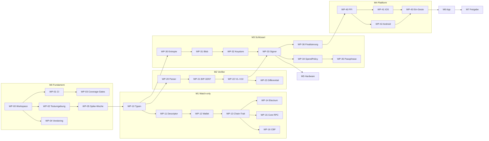

# Implementierungsplan

**Zweck:** Diese Datei ist die Arbeitsliste. Jedes Arbeitspaket (WP) ist so geschnitten, dass
ein Agent oder Entwickler es **ohne Rückfragen** abarbeiten kann: mit Eingaben, Ausgaben,
Spezifikationsverweis, Abnahmekriterien und den Tests, die grün sein müssen.

**Bezugsdokumente:**
[`SPECIFICATION.md`](SPECIFICATION.md) — das Was und Warum ·
[`TESTING.md`](TESTING.md) — Testumgebung, Coverage-Politik, CI ·
[`RECOVERY.md`](RECOVERY.md) — Nutzerdokument, Testfälle S5/S6

---

## 0. Regeln für jeden, der hier arbeitet

| # | Regel |
|---|---|
| R1 | **Ein WP = ein Branch = ein PR.** Branch-Name `wp/<id>-<kurzname>`. |
| R2 | **Kein WP gilt als fertig ohne seine Tests.** Die Testliste im WP ist die Abnahme, nicht der Code. |
| R3 | **Die Spec ist die Wahrheit.** Weicht die Umsetzung ab, wird zuerst die Spec geändert (mit Begründung im PR), dann der Code. Nie umgekehrt und nie stillschweigend. |
| R4 | **Blockiert statt geraten.** Wo die Spec ⟨API-VERIFY⟩ oder „offen" sagt, wird nicht improvisiert — Ergebnis in die Spec eintragen, dann weiter. |
| R5 | **Kein WP darf die FFI-Allowlist erweitern**, außer **WP-40** (das sie anlegt). Jede spätere Änderung braucht Zweit-Review mit Sicherheitsbegründung im PR. |
| R6 | **Coverage-Gate gilt ab dem WP, das den Crate anlegt** — nicht „später nachziehen". Siehe TESTING.md §3. |
| R7 | **Jeder PR nennt die WP-ID, die Spec-Abschnitte und die Test-IDs** in der Beschreibung. |
| R8 | **Keine Zahl wird abgeschrieben.** Anzahlen (Arbeitspakete, Freigabepunkte, Crates, Abhängigkeiten) stehen an genau einer Stelle und werden von `check_plan.py` bzw. `dep_budget.py` gegen die Wirklichkeit gehalten. Wer eine Zahl in einen Fließtext schreibt, macht sie damit prüfpflichtig. |
| R9 | **Ein Widerspruch zwischen zwei Dokumenten ist ein Blocker, kein Detail.** Wer beim Abarbeiten eines Pakets auf einen stößt, hält an und meldet ihn, statt sich für eine Lesart zu entscheiden. R3 (Spec zuerst ändern) gilt dann für die Auflösung. |

### Zustandslegende

`OFFEN` · `BLOCKIERT` (mit Grund) · `IN ARBEIT` · `REVIEW` · `FERTIG`

> **`FERTIG` ist keine Meinung.** Sobald ein WP diesen Zustand trägt, verlangt
> `scripts/check_plan.py` für **jede** ihm zugeordnete Test-ID eine Testfunktion und bricht
> sonst den Build. So entstehen keine unbemerkten Testschulden.

### Stand (2026-08-09)

| WP | Zustand | Belegt | Was fehlt |
|---|---|---|---|
| **WP-00** | **FERTIG** | `cargo build --workspace --locked` **und** `--offline` grün · `cargo deny check` **ausgeführt und grün** · Pinning verifiziert · Signaturpfad gemessen: **40 externe Crates** (MEASURED in `dep_budget.py`), `trinity-verify` allein **22** · `fmt` und `clippy -D warnings` sauber | — |
| WP-01 | IN ARBEIT | Workflow geschrieben, YAML valide. Jobs `differential`/`signet` gated auf Harness-Verzeichnisse (fail-closed statt sofort rot). Alle aufgerufenen Skripte existieren und laufen lokal grün. | **Nie auf einem Runner ausgeführt.** `cargo-audit` nicht installiert. |
| WP-02 | IN ARBEIT | `test-env.sh` (Syntax geprüft, Core-Versionssperre implementiert) und `docker/compose.yml` (valide; Images noch per Tag) | **Nie gestartet.** Image-**Digests fehlen**. Kein `bitcoind`, kein `electrs` gezogen. |
| WP-03 | IN ARBEIT | `coverage_gate.py`, `check_plan.py`, `dep_budget.py` fail-closed: fehlende Zweigdaten und fehlende Crate-Einträge sind Befunde; Test-Zuordnung aus WP-Blöcken; Zahlenprüfung. | `cargo-llvm-cov`/`cargo-mutants` — realer Coverage-/Mutationslauf ausstehend; Zweigabdeckbarkeit der gepinnten Toolchain in TESTING.md §3.1 dokumentiert. |
| WP-04 | **OFFEN** | — | `vendor/`, `.cargo/config.toml`, Build ohne Netz im Container, Reproducible-Build-Nachweis durch zwei Runner. |

**Also: nein, M0 ist nicht fertig.** Fertig ist WP-00. Die drei Pakete in Arbeit hängen
sämtlich daran, dass Werkzeuge und Container in dieser Umgebung fehlen — nicht an
ungeschriebenem Code.

**Nächster Schritt: WP-05.** Es ist das einzige Paket, das jetzt inhaltlich weiterführt, und es
gibt M1 bis M5 frei.

---

## 1. Meilensteine

| M | Name | Ziel | Enthält |
|---|---|---|---|
| **M0** | Fundament | Repo baut reproduzierbar, CI läuft, Testumgebung steht | WP-00 … WP-05 |
| **M1** | Watch-only-Kern | Descriptor, Adressen, UTXOs, PSBT-Bau — **ohne jedes Schlüsselmaterial** | WP-10 … WP-16 |
| **M2** | Verifier | Unabhängige Prüfung, gegen Bitcoin Core abgeglichen | WP-20 … WP-23 |
| **M3** | Schlüssel und Signatur | Entropie, Blobs, Keystore, Signatur, Ausgabegrenze | WP-30 … WP-36 |
| **M4** | Plattform und FFI | uniffi-Fassade, iOS- und Android-Keystore, Ein-Gesten-Ablauf | WP-40 … WP-46 |
| **M5** | Hardware-Signer | QR- und NFC-Transport, BIP-388, Gerätefreigabe | WP-50 … WP-54 |
| **M6** | App und UX | Onboarding, Senden, Empfangen, Recovery, Export | WP-60 … WP-68 |
| **M7** | Härtung und Freigabe | Fuzzing, Speicher-Hygiene, Audit, Nutzertest | WP-70 … WP-76 |

**M0 bis M4 sind die kritische Kette.** M5 kann ab M3 parallel laufen, M6 ab M4.

---

## 2. Abhängigkeitsgraph

---

## 3. Arbeitspakete

Jedes WP hat dieselbe Struktur. **Abnahme** ist bindend — was dort nicht steht, ist nicht Teil
des WP; was dort steht, ist ohne Ausnahme zu erfüllen. Die Zuordnung Test-ID → WP steht in der
`**Tests:**`-Zeile; `scripts/check_plan.py` erzwingt Vollständigkeit in beide Richtungen und
Eindeutigkeit.

---

### M0 — Fundament

#### WP-00 · Workspace und Pinning
**Spec:** 0.3, 1.1, 1.7 · **Braucht:** — · **Zustand:** FERTIG

Cargo-Workspace mit den zehn Crates aus 1.1 als leere Gerüste. `[workspace.dependencies]` mit
**exakten** `=`-Pins aus der Tabelle in 0.3. `Cargo.lock` eingecheckt.
`rust-toolchain.toml` mit fester Version.

**Dateien:** `Cargo.toml`, `Cargo.lock`, `rust-toolchain.toml`, `deny.toml`, `crates/*/Cargo.toml`, `crates/*/src/lib.rs`
**Verbote:** Keine Fachlogik; keine neuen Abhängigkeiten ohne Eintrag in 0.3; kein Anfassen von `app/` oder `platform/`.

**Abnahme**
- `cargo build --workspace --locked` grün, offline (`--offline`)
- `cargo tree -d` meldet nur die in `deny.toml` **mit Begründung** eingetragenen Duplikate — insbesondere nur **eine** `secp256k1`-Version
- ✅ **Am 2026-08-08 verifiziert:** `secp256k1 0.29.1`, `miniscript 12.3.7`, `bitcoin 0.32.11` je genau einmal. Akzeptiert und begründet: `bitcoin_hashes 1.2.0` (nur über `ur` im QR-Transport, außerhalb des Signaturpfads), `getrandom 0.2.17` und `rand_core 0.6.4` (über `argon2` → `password-hash`)
- `miniscript` löst auf `12.3.x` auf, **nicht** 13.x; `secp256k1` auf `0.29.1`
- `deny.toml` vorhanden mit `[licenses]` als **Allowlist** nach §1.7 (Datei-Copyleft MPL-2.0 zugelassen; Projekt-Copyleft GPL/AGPL/SSPL/BUSL und Nutzungsgebühr ausgeschlossen) und `[bans]`-Regel: `miniscript` ist in `trinity-verify` verboten
- `cargo deny check` grün

**Tests:** —

---

#### WP-01 · CI-Grundgerüst
**Spec:** 5.4, 5.5 · **Braucht:** WP-00 · **Zustand:** IN ARBEIT

GitHub-Actions-Pipeline nach TESTING.md §5: `fmt` → `clippy -D warnings` → `build` →
`test` → `deny` → `audit`. Differential bei jedem PR, sobald der Harness existiert; Signet/Mutants nach `main`.

**Dateien:** `.github/workflows/ci.yml`
**Verbote:** Keine Secrets in Logs; keine `allow`-Clippy-Ausnahmen ohne Kommentar mit Begründung; Cargo-Features `differential`/`signet` hier nicht anlegen (WP-23 bzw. WP-45).

**Abnahme**
- Pipeline läuft auf jedem PR und blockiert bei Rot
- `clippy` mit `-D warnings`, keine `allow`-Ausnahmen ohne Kommentar mit Begründung
- Laufzeit des schnellen Pfades < 10 min
- Jobs `differential` und `signet` sind auf Harness-Verzeichnisse gated und brechen nicht mehr ohne Harness ab

**Tests:** —

---

#### WP-02 · Testumgebung
**Spec:** 5.1, 5.3 · **Braucht:** WP-00 · **Zustand:** IN ARBEIT

Reproduzierbare Umgebung nach TESTING.md §2: **Bitcoin Core 30.2** (Regtest; Signet als
Abnahmeziel), Electrum-Server, CBF über denselben Regtest-Node mit Filter-Indizes, alles
containerisiert und über ein Skript startbar.

**Dateien:** `docker/compose.yml`, `scripts/test-env.sh`, `justfile` (test-env-*)
**Verbote:** Keine Image-Tags ohne TODO(WP-02)-Digest-Hinweis als endgültig behaupten; Core 30.0/30.1 nicht zulassen.

**Abnahme**
- `just test-env-up` bringt Core 30.2 (Regtest), electrs und CBF-fähigen Node hoch
- Version wird geprüft: **30.0 und 30.1 werden aktiv abgelehnt** (Wallet-Bug, 0.3)
- Deterministischer Regtest-Zustand: Skript erzeugt 101 Blöcke und eine geförderte Wallet
- `just test-env-down` räumt vollständig auf
- Läuft auf Linux **und** macOS
- Image-Digests eingetragen (Abnahmekriterium; heute noch offen)

**Tests:** —

---

#### WP-03 · Coverage- und Mutations-Gates
**Spec:** 5.5 · **Braucht:** WP-01 · **Zustand:** IN ARBEIT

`cargo-llvm-cov` mit **Schwellen pro Crate** nach TESTING.md §3, plus `cargo-mutants` für die
Sicherheitskerne. Gates sind fail-closed: fehlende Zeilen- oder Zweigdaten für Crates mit
Quellcode sind Befunde, keine stillen 100 %.

**Dateien:** `scripts/coverage_gate.py`, `scripts/check_plan.py`, `scripts/dep_budget.py`, `coverage-exclusions.toml`, `justfile`, `.github/workflows/ci.yml` (coverage-Job)
**Verbote:** Keine Ausnahme für `trinity-verify`; keine Zahl behaupten, die nicht gemessen wird.

**Abnahme**
- Coverage-Bericht je Crate, Gate bricht den Build bei Unterschreitung
- Ausnahmeliste existiert als Datei mit **Begründung je Eintrag**; ein Eintrag ohne Begründung bricht den Build
- `cargo-mutants` läuft gegen `trinity-verify` und `trinity-signer`, überlebende Mutanten brechen den Build
- Fehlende BRF/BRH-Zeilen im lcov sind ein Befund (nicht still 100 % Zweige)
- Zweigabdeckbarkeit der gepinnten Toolchain ist in TESTING.md §3.1/§3.2 als Messung oder benannte Lücke dokumentiert

**Tests:** —

---

#### WP-04 · Vendoring und reproduzierbare Builds
**Spec:** 1.7 · **Braucht:** WP-00 · **Zustand:** OFFEN

**Dateien:** `vendor/`, `.cargo/config.toml`, CI-Job oder Skript für Offline-Build
**Verbote:** `vendor/` nicht in `.gitignore`; Build darf im freigegebenen Zustand nicht aus dem Netz ziehen.

**Abnahme**
- `vendor/` eingecheckt, `.cargo/config.toml` mit `replace-with = "vendored-sources"`
- Build ohne Netzwerk erfolgreich (im Container ohne Netz nachgewiesen)
- Zwei unabhängige CI-Runner erzeugen **bitgleiche** Artefakt-Hashes
- `scripts/dep_budget.py` läuft in CI; Budget-Grenze **45**, gemessen **40 externe Crates** (`MEASURED` in `dep_budget.py`, Stand 2026-08-09)

**Tests:** —

---

#### WP-05 · Spike-Woche: Anhang B abarbeiten
**Spec:** Anhang B (14 Punkte), O12 · **Braucht:** WP-02 · **Zustand:** OFFEN

**Alle 14 offenen Punkte** aus Anhang B klären und **die Spec aktualisieren**. Kein
Produktionscode.

**Dateien:** `docs/SPECIFICATION.md` (Anhang B, markierte ⟨API-VERIFY⟩-Stellen)
**Verbote:** Kein Produktionscode in `crates/`; keine ⟨API-VERIFY⟩ stillschweigend erfinden.

**Abnahme**
- Jeder der 14 Punkte hat in der Spec ein Ergebnis oder eine begründete Vertagung
- Alle ⟨API-VERIFY⟩-Marken sind aufgelöst oder ausdrücklich verlängert
- Besonders: B.2 (uniffi-Puffernullung), B.3 (Kyoto-Peer-Verhalten), B.9 (Ledger-APDU-Referenz), B.13 (Whisper-Krypto) — sie berühren Architektur
- Coldcard-Versionsangaben gegen die **Primärquelle** verifiziert (B.6) — bis dahin darf WP-54 nicht starten

**Tests:** —

---

### M1 — Watch-only-Kern

#### WP-10 · `trinity-types`
**Spec:** 1.1, 1.3 · **Braucht:** WP-05 · **Zustand:** OFFEN

Wertetypen ohne I/O: `KeySlot`, `Network`, `PsbtB64`, `Fingerprint`, `WordCount`,
`XpubWithOrigin`, `Balance`, `AddressInfo`, `PsbtVerdict`, `SendRequest`, `SecretBytes`.

**Dateien:** `crates/trinity-types/**`
**Verbote:** Keine I/O-Abhängigkeit; kein Zugriff auf Keystore/Signer; keine Secrets in `Debug`/`Display`.

**Abnahme**
- `SecretBytes`: `ZeroizeOnDrop`, **kein** `Clone`, **kein** `Debug`/`Display` außer `"[redacted]"`
- Kompilier-Test (`trybuild`): `Clone` auf `SecretBytes` **schlägt fehl**
- Der Crate hat **keine** I/O-Abhängigkeit — per `cargo-deny [bans]` erzwungen
- Coverage 100 % Zeilen und Zweige

**Tests:** —

---

#### WP-11 · Descriptor-Erzeugung und -Persistenz
**Spec:** 2.3 · **Braucht:** WP-10 · **Zustand:** OFFEN

`wsh(sortedmulti(2,…))` mit BIP-48-Pfaden, Origin-Info, Checksum. `descriptor.json` mit
`word_count` **je Schlüssel**, `source` je Schlüssel, `policy_id`, `birthday`, Netz, Version.

**Dateien:** `crates/trinity-watch/**` (Descriptor-Teile), ggf. `crates/trinity-types/**` (Descriptor-Typen)
**Verbote:** Kein Multipath-Descriptor; kein Schlüsselmaterial; kein Zugriff auf `trinity-keystore`/`trinity-signer`.

**Abnahme**
- **D1** (Checksum gegen `getdescriptorinfo`, 10.000 Fälle)
- **P5** (Permutationsinvarianz), **P7** (identische Fingerprints werden abgelehnt), **P9** (fremde Grammatik abgelehnt)
- Receive- und Change-Descriptor getrennt (O8), Multipath wird **nicht** erzeugt
- Round-Trip `descriptor.json` verlustfrei, inkl. gemischter Wortlängen

**Tests:** D1, P5, P7, P9

---

#### WP-12 · `trinity-watch` — BDK-Wallet
**Spec:** 1.1, 3.2 · **Braucht:** WP-11 · **Zustand:** OFFEN

Wallet-Aufbau aus Descriptor, Adressableitung, UTXO-Verwaltung, `TxBuilder`, Persistenz.
Gap-Limit 20 (O10). ⟨API-VERIFY aus WP-05 einsetzen⟩

**Dateien:** `crates/trinity-watch/**`
**Verbote:** Kein Zugriff auf `trinity-keystore`/`trinity-signer` — per `[bans]` erzwungen.

**Abnahme**
- **D2**, **D3** (Adressen gegen `deriveaddresses`, 500 Setups × 1.000 Adressen)
- **D6** (BIP-67 über alle 6 Permutationen)
- `nLockTime = Tip-Höhe`, `nSequence = 0xFFFFFFFE` (Anti-Fee-Sniping)
- Coin Selection: BnB mit SRD-Fallback; changelose Lösung wird bevorzugt
- **P8** (Gebührenidentität, Overflow-Grenzfälle)
- Dust-Change wandert in die Gebühr

**Tests:** D2, D3, D6, P8

---

#### WP-13 · `ChainBackend`-Trait
**Spec:** 1.6 · **Braucht:** WP-12 · **Zustand:** OFFEN

**Dateien:** `crates/trinity-chain/src/lib.rs` (Trait), Tests unter `crates/trinity-chain/**`
**Verbote:** Keine konkrete Backend-Implementierung außer In-Memory-Fake; kein Netzwerkzwang in Unit-Tests.

**Abnahme**
- Trait nach 1.6, inkl. `privacy_profile()`
- In-Memory-Fake für Tests, der ohne Netz funktioniert
- `broadcast` ist **getrennt** konfigurierbar vom Sync-Backend

**Tests:** —

---

#### WP-14 · Electrum-Backend
**Spec:** 1.6 · **Braucht:** WP-13 · **Zustand:** OFFEN

**Dateien:** `crates/trinity-chain/**` (Electrum-Backend)
**Verbote:** Kein stiller Fallback auf Core-RPC oder CBF; kein Schlüsselmaterial.

**Abnahme**
- **S2** (Saldo über alle drei Backends identisch — Mitwirkung dieses Backends)
- **S13** (Ausfall → sauberer Fehler, **kein** stiller Fallback auf ein anderes Backend)
- `privacy_profile()` liefert die Angaben aus der Tabelle in 1.6

**Tests:** S13

---

#### WP-15 · Core-RPC-Backend
**Spec:** 1.6 · **Braucht:** WP-13 · **Zustand:** OFFEN

**Dateien:** `crates/trinity-chain/**` (Core-RPC-Backend)
**Verbote:** Kein stiller Fallback; kein Schlüsselmaterial.

**Abnahme**
- Saldo identisch zu den anderen Backends im Rahmen von S2 (Eigentum von WP-45)
- Ausfallverhalten analog S13 (sauberer Fehler, kein stiller Fallback)
- `privacy_profile()` liefert die Angaben aus der Tabelle in 1.6

**Tests:** —

---

#### WP-16 · CBF-Backend
**Spec:** 1.6 · **Braucht:** WP-13 · **Zustand:** OFFEN

**Dateien:** `crates/trinity-chain/**` (CBF-Backend)
**Verbote:** CBF nicht als Default setzen, solange Anhang B.3 offen ist (O3); kein stiller Fallback.

**Abnahme**
- Saldo identisch im Rahmen von S2; Ausfall analog S13
- `privacy_profile()` liefert die Angaben aus der Tabelle in 1.6
- Ergebnis von Anhang B.3 ist eingearbeitet; ohne den Nachweis darf CBF **nicht** als Default gesetzt werden (O3)

**Tests:** —

---

### M2 — Verifier

#### WP-20 · Eigener Descriptor-Parser
**Spec:** 1.5, E2 · **Braucht:** WP-10 · **Zustand:** OFFEN

~250 Zeilen für **genau** die Grammatik `wsh(sortedmulti(2,·,·,·))`. Alles andere ist harter
Fehler. **Ohne `miniscript`.**

**Dateien:** `crates/trinity-verify/**` (Parser)
**Verbote:** Keine `miniscript`-Abhängigkeit; kein Zugriff auf `trinity-keystore` oder `trinity-signer`.

**Abnahme**
- `cargo-deny` bestätigt: `miniscript` ist keine Abhängigkeit dieses Crates
- Negativfälle mit zufälligen gültigen Miniscript-Descriptoren (Ergänzung zu P9)
- `cargo-fuzz` ≥ 1 h ohne Fund (voller Lauf in WP-70)
- Coverage **100 % Zeilen und Zweige**, keine Ausnahmen

**Tests:** —

---

#### WP-21 · Eigene BIP-32-Ableitung und BIP-67-Sortierung
**Spec:** 1.5 · **Braucht:** WP-20 · **Zustand:** OFFEN

Eigene CKDpub, eigene Sortierung, eigener witnessScript-Bau. Geteilt bleiben nur `secp256k1`
und die Hashes — die Grenze der Unabhängigkeit ist in 1.5 tabelliert und gilt.

**Dateien:** `crates/trinity-verify/**`
**Verbote:** Keine `miniscript`-Abhängigkeit; kein Keystore/Signer.

**Abnahme**
- **D4** (Verifier gegen `deriveaddresses`) — **der wichtigste Test des Meilensteins**
- **D5** (Verifier gegen Builder); jede Divergenz ist ein Alarm, kein Testfehler
- Coverage 100 %

**Tests:** D4, D5

---

#### WP-22 · Prüfungen V1–V10
**Spec:** 1.5, 3.3 · **Braucht:** WP-21 · **Zustand:** OFFEN

**Dateien:** `crates/trinity-verify/**`
**Verbote:** Keine `miniscript`-Abhängigkeit; kein Keystore/Signer.

**Abnahme**
- Jede Prüfung V1–V10 hat mindestens einen Positiv- und einen Negativtest
- **P1, P2, P3, P11, P12**
- Jede Ablehnung liefert einen **konkreten** Fehlergrund, nie ein generisches „ungültig"
- Der Verifier läuft an allen **drei** Stellen aus 3.3

**Tests:** P1, P2, P3, P11, P12

---

#### WP-23 · Differential-Harness
**Spec:** 5.1 · **Braucht:** WP-22, WP-02 · **Zustand:** OFFEN

Harness, das **D1–D19** gegen Bitcoin Core 30.2 fährt, mit stabilem Seed und reproduzierbaren
Fällen. Legt das Cargo-Feature `differential` an und das Verzeichnis `tests/differential/`,
damit der CI-Job reaktiviert werden kann.

**Dateien:** `tests/differential/**`, Feature `differential` in betroffenen `Cargo.toml`, `justfile` (`diff-test`)
**Verbote:** Keine Fachlogik-Änderungen in Verify/Signer außer Harness-Anbindung; Features nicht anlegen ohne echte Tests.

**Abnahme**
- Cargo-Feature `differential` ist definiert und an den Harness gebunden
- Verzeichnis `tests/differential/` existiert und enthält lauffähige Tests
- Alle D-Tests laufen per `just diff-test` lokal und in CI
- Ein Fehlschlag zeigt Eingabe, Erwartung und Ist im Klartext
- Laufzeit < 20 min
- Nach diesem WP entfällt die `hashFiles`-Bedingung am CI-Job `differential`

**Tests:** —

---

### M3 — Schlüssel und Signatur

#### WP-30 · `trinity-entropy`
**Spec:** 2.2, 2.2.1–2.2.5 · **Braucht:** WP-10 · **Zustand:** OFFEN

`entropy = HMAC-SHA512(key = OS_CSPRNG(32), msg = extra_bytes)[0..L]`. Quellen Klasse A
(Würfel, Münzen, Karten) mit kanonischer Kodierung und Separator-Regel; Klasse B nur
einspeisbar, **null** anrechenbare Bit. Zusatzentropie optional (E3), auch für C.

**Dateien:** `crates/trinity-entropy/**`
**Verbote:** Keine Pflicht-Zusatzentropie; keine I/O außer Entropiequellen; kein Keystore.

**Abnahme**
- **D12, D13, D17** · **P10, P14, P15, P16**
- **S20**: externes Shell-Skript rechnet `entropy` aus `raw_csprng` + `extra_bytes` nach — für **alle** Quellkombinationen
- `word_count`-Regel: C ist auf 24 festgenagelt, `SetupConfig` mit `C = 12` wird abgelehnt (**S15b**)
- Verifikationsblatt wird erzeugt und enthält `L`, die Separator-Regel und alle Zwischenwerte
- Coverage 100 %

**Tests:** D12, D13, D17, P10, P14, P15, P16, S15b, S20

---

#### WP-31 · Blob-Format
**Spec:** 2.4 · **Braucht:** WP-30 · **Zustand:** OFFEN

XChaCha20-Poly1305, Header als AAD, `word_count` im Header. **Kein KDF-Feld** — Argon2id sitzt
seit der Korrektur in 2.4 im Policy-Record.

**Dateien:** `crates/trinity-keystore/**` (Blob)
**Verbote:** Kein KDF im Blob-Header; kein Logging von Klartext-Entropie.

**Abnahme**
- **P6** (Round-Trip, jede Header-Mutation ⇒ AEAD-Fehler), **P13** (`word_count`-Mutation)
- Blob-Format für A und B **bitgleich** — ein Test vergleicht die Layouts
- Coverage 100 %

**Tests:** P6, P13

---

#### WP-32 · `trinity-keystore`
**Spec:** 2.4, 2.5 · **Braucht:** WP-31 · **Zustand:** OFFEN

`SlotPolicy`, `PlatformKeyStore`-Callback-Trait, `POLICY_A` (`.biometryCurrentSet`) und
`POLICY_B` (`.userPresence`). Speicher-Handling nach 2.5.

**Dateien:** `crates/trinity-keystore/**`
**Verbote:** Kein `log`/`tracing`; keine Secrets ohne `ZeroizeOnDrop`; kein `print!`/`dbg!`.

**Abnahme**
- Kein `log`/`tracing` als Abhängigkeit — per `[bans]` erzwungen
- `#![deny(clippy::print_stdout, clippy::dbg_macro)]`
- Kompilier-Test: kein Secret-Typ ohne `ZeroizeOnDrop`
- `panic = "abort"` im Release-Profil
- Fake-`PlatformKeyStore` für Tests; **Mock zählt Aufrufe** (für S9, S28)
- Coverage 100 %

**Tests:** —

---

#### WP-33 · `trinity-signer`
**Spec:** 3.4 · **Braucht:** WP-32, WP-22 · **Zustand:** OFFEN

`Signer`-Trait, `LocalSigner`. RFC-6979 über `secp256k1`, low-s, `SIGHASH_ALL` ausschließlich,
Eigenverifikation nach jeder Signatur. Crate-interne `sign_a`/`sign_b`; exportiert wird
später nur `sign_ab` (WP-40).

**Dateien:** `crates/trinity-signer/**`
**Verbote:** Kein RNG im Signaturpfad; kein Export von Seeds; kein SIGHASH außer ALL.

**Abnahme**
- **D7, D8** (bitgleich zu `walletprocesspsbt`) · **P4** (Determinismus)
- Verifier läuft **vor** jedem Schlüsselzugriff; **S9** inkl. Mock-Assertion, dass `unwrap_kek` **nicht** aufgerufen wurde
- **S10** (Manipulation zwischen A und B wird erkannt)
- Jeder andere SIGHASH als `ALL` wird abgelehnt (**P11** — Eigentum WP-22; hier Mitwirkung)
- Coverage 100 %, `cargo-mutants` ohne Überlebende

**Tests:** D7, D8, P4, S9, S10

---

#### WP-34 · `SpendPolicy` und Fensterzähler
**Spec:** 3.6.3, 3.6.5, 3.6.7 · **Braucht:** WP-33 · **Zustand:** OFFEN

`clamp(20 % des Guthabens, 200 €, 500 €)` je 24 h, gleitendes Fenster, Zähler im
verschlüsselten Kernzustand. Anrechnung **exakt** nach 3.6.7.

**Dateien:** `crates/trinity-signer/**` (SpendPolicy), ggf. `crates/trinity-types/**`
**Verbote:** Keine Policy-Durchsetzung in der JS-Schicht; kein Kursabruf zur Signaturzeit.

**Abnahme**
- **S28** (Grenze greift, kein `unwrap_kek`, kein Biometrie-Prompt)
- **S29** (Stückelung hilft nicht), **S29b** (alle drei Bereiche + Grenzfälle), **S29f** (Invariante `Sockel ≤ Deckel`)
- **S29h** (Anrechnung: Gebühr, Change, Selbstüberweisung, RBF-Delta, verworfene Tx)
- **S29i** (unbestätigte Fremdzahlung hebt die Bezugsgröße **nicht**)
- **S29j** (gleitendes Fenster über Kalendergrenze)
- Zähler überlebt Neustart und Reboot; nicht durch Löschen JS-lesbarer Dateien rücksetzbar
- Coverage 100 %, `cargo-mutants` ohne Überlebende

**Tests:** S28, S29, S29b, S29f, S29h, S29i, S29j

---

#### WP-35 · Passphrase-Verifier und Fiat-Verankerung
**Spec:** 2.4 („Autorisierungsgeheimnis"), 3.6.6, 3.6.8 · **Braucht:** WP-34 · **Zustand:** OFFEN

`H = SHA-256(Argon2id(pass, pp_salt, profil))`, Vergleich in konstanter Zeit.
Diceware-Prüfung ≥ 6 Wörter. Fiat→Sat-Verankerung mit Plausibilitätsfilter und Asymmetrie.

**Dateien:** `crates/trinity-keystore/**`, `crates/trinity-signer/**` (Policy-Verifier)
**Verbote:** Passphrase nie als `String`; kein `==` auf Secret-Bytes; kein Netzwerk in der Signaturprüfung.

**Abnahme**
- **D16** (Argon2id gegen RFC-9106-Vektoren, beide Profile)
- **S29c** (Kursmanipulation in 5 Varianten; **Assertion: kein Netzwerkabruf zur Signaturzeit**)
- **S29d**, **S29g** (Anheben verlangt Passphrase — auch direkt über die FFI, nicht nur über die UI)
- **S29e** (Signieren im Flugmodus), **S30**, **S31**
- **S35** (Erinnerungsübung nach 60 Tagen), **S36** (vergessene Passphrase ist kein Geldverlust)
- Vergleich nachweislich konstantzeitig (`subtle` o.ä., kein `==` auf Bytes)
- Coverage 100 %

**Tests:** D16, S29c, S29d, S29e, S29g, S30, S31, S35, S36

---

#### WP-36 · Finalisierung und Broadcast
**Spec:** 3.5 · **Braucht:** WP-33 · **Zustand:** OFFEN

Witness in **BIP-67-Reihenfolge** (nicht in Signaturreihenfolge — häufige Fehlerquelle),
Konsensprüfung über `bitcoinconsensus` (O7), vsize-Messung gegen `max_feerate`.

**Dateien:** `crates/trinity-signer/**`, `crates/trinity-watch/**` (Finalize/Broadcast-Anbindung)
**Verbote:** Keine Signaturreihenfolge als Witness-Reihenfolge; kein Broadcast ohne Konsensprüfung.

**Abnahme**
- **D10** (Raw-Tx bitgleich zu `finalizepsbt`), **D11** (`testmempoolaccept` erlaubt)
- **S11** (Fee-Angriff wird vor jedem Schlüsselzugriff abgelehnt), **S12** (RBF-Bump)
- Ein Test vertauscht bewusst die Signaturreihenfolge und erwartet dennoch eine gültige Witness

**Tests:** D10, D11, S11, S12

---

### M4 — Plattform und FFI

#### WP-40 · `trinity-ffi`
**Spec:** 1.3 · **Braucht:** WP-36 · **Zustand:** OFFEN

uniffi-Fassade **exakt** nach der Signaturliste in 1.3 (`sign_ab`, `sign_with_recovery_key`,
kein exportiertes `sign_a`/`sign_b`), plus `ffi-allowlist.toml` und CI-Gate-Skript.

**Dateien:** `crates/trinity-ffi/**`, `crates/trinity-ffi/ffi-allowlist.toml`, `scripts/check_ffi_boundary.py`
**Verbote:** Keine Erweiterung der Allowlist außerhalb dieses WP ohne Zweit-Review; kein Export von Seed/Mnemonic/xpriv; `sign_a`/`sign_b` nicht exportieren.

**Abnahme**
- CI-Gate `ffi-boundary` bricht bei jeder Signaturänderung außerhalb der Allowlist
- Skript `scripts/check_ffi_boundary.py` und Allowlist `crates/trinity-ffi/ffi-allowlist.toml` existieren
- Kein exportierter Aufruf gibt Seed, Mnemonic oder xpriv zurück — automatisiert geprüft
- **S23** ist ein **Build-brechender** Signatur-Check (kein Secret-Export; `blob_B` nur nach SpendPolicy; keine Policy-/Schlüsselexporte ohne `SecretBytes`)
- `sign_ab` und `sign_with_recovery_key` sind exportiert und in der Allowlist
- Ergebnis aus Anhang B.2 (`RustBuffer`-Nullung) ist umgesetzt

**Tests:** S23

---

#### WP-41 · iOS-Plattformschicht
**Spec:** 2.4, 3.6.2 · **Braucht:** WP-40 · **Zustand:** OFFEN

Keychain, `PlatformKeyStore`-Implementierung, Passphrase-Eingabe **ohne `String`**.

**Dateien:** `platform/ios/**`
**Verbote:** Passphrase nie als Swift-`String`; Slot B nicht mit `.biometryCurrentSet` anlegen; kein iCloud-Backup der KEKs.

**Abnahme**
- SE-P-256-Schlüssel, `kSecAttrAccessibleWhenPasscodeSetThisDeviceOnly`; A `.biometryCurrentSet`, B `.userPresence`
- Passphrase nie als `String` — Code-Review-Checkliste **plus** Lint
- **S14**, **S33** (Enrollment-Wechsel: A weg, **B lebt**), **S34** (nur Passcode ⇒ nur B)
- Verhalten bei App-Deinstallation dokumentiert (Anhang B.4)

**Tests:** S14, S33, S34

---

#### WP-42 · Android-Plattformschicht
**Spec:** 2.4, 3.6.2 · **Braucht:** WP-40 · **Zustand:** OFFEN

Keystore, `PlatformKeyStore`-Implementierung, Passphrase-Eingabe **ohne `String`**.

**Dateien:** `platform/android/**`
**Verbote:** Passphrase nie als Kotlin-`String`; Enrollment-Invalidierung für B nicht einschalten; kein Klartext in Autofill.

**Abnahme**
- StrongBox mit Feature-Detection; A `AUTH_BIOMETRIC_STRONG` + `setInvalidatedByBiometricEnrollment(true)`; B zusätzlich `AUTH_DEVICE_CREDENTIAL`, Enrollment-Invalidierung **aus**
- Passphrase nie als `String` — Code-Review-Checkliste **plus** Lint
- Dieselben Verhaltensanforderungen wie S14/S33/S34 auf Android (Eigentum der IDs: WP-41)
- Verhalten bei App-Deinstallation dokumentiert (Anhang B.4)

**Tests:** —

---

#### WP-43 · Ein-Gesten-Ablauf
**Spec:** 3.6.2 · **Braucht:** WP-41, WP-42 · **Zustand:** OFFEN

iOS: ein `LAContext` für beide Zugriffe. Android: zeitbasierte Autorisierung, Fenster so kurz
wie technisch möglich, **nicht** konfigurierbar. Ein Aufruf `sign_ab` — nicht zwei exportierte
Signaturen mit JS dazwischen.

**Dateien:** `platform/ios/**`, `platform/android/**`, Anbindung an `crates/trinity-ffi/**`
**Verbote:** Keine zwei biometrischen Prompts unterhalb der Quote; `sign_a`/`sign_b` nicht aus JS aufrufen.

**Abnahme**
- **S27**: **genau ein** biometrischer Prompt pro Send unterhalb der Grenze. Zwei Prompts sind ein Fehlschlag.
- Gesamtdauer ≤ 5 s auf dem Referenzgerät der unteren Leistungsklasse
- Auf echten Geräten geprüft, nicht nur im Simulator

**Tests:** S27

---

#### WP-44 · Speicher-Hygiene-Harness
**Spec:** 5.4 · **Braucht:** WP-43 · **Zustand:** OFFEN

**Dateien:** `tests/**` (Hygiene-Harness), ggf. CI-Job
**Verbote:** Keine Secrets in Test-Fixtures im Klartext dauerhaft speichern.

**Abnahme**
- Heap-Dump nach `sign_*` enthält die bekannte Entropie **nicht**
- Läuft unter Linux und Android; iOS-Lücke dokumentiert

**Tests:** —

---

#### WP-45 · Signet-E2E-Harness
**Spec:** 5.3 · **Braucht:** WP-43 · **Zustand:** OFFEN

Harness für Signet/Regtest-Szenarien. Legt das Cargo-Feature `signet` und
`tests/signet-e2e/` an, damit der CI-Job reaktiviert werden kann.

**Dateien:** `tests/signet-e2e/**`, Feature `signet` in betroffenen `Cargo.toml`, `justfile` (`signet-test`)
**Verbote:** Features nicht anlegen ohne echte Tests; S4/S5/S6/S7 gehören anderen WPs.

**Abnahme**
- Cargo-Feature `signet` ist definiert und an den Harness gebunden
- Verzeichnis `tests/signet-e2e/` existiert
- **S1, S2, S3, S8** laufen automatisiert auf Signet und Regtest
- **S32** — die vollständige Diebstahl-Simulation: entsperrtes Gerät, Angreifer schöpft die Quote aus, danach Recovery mit Backup-B + C auf einem zweiten Gerät. **Veto 5b**
- Nach diesem WP entfällt die `hashFiles`-Bedingung am CI-Job `signet`

**Tests:** S1, S2, S3, S8, S32

---

#### WP-46 · Export
**Spec:** 2.3 · **Braucht:** WP-43 · **Zustand:** OFFEN

**Dateien:** `crates/trinity-export/**`
**Verbote:** Kein privates Schlüsselmaterial im Export; keine Passphrase in Dateien.

**Abnahme**
- **D14, D15** (Sparrow, BSMS)
- **S5** (Recovery ohne diese App über Core — automatisiert)
- **S6** (Sparrow-Import — je Release manuell verifiziert und dokumentiert)
- `export_core_importdescriptors` erzeugt lauffähige Befehle für RECOVERY.md §3

**Tests:** D14, D15, S5, S6

---

### M5 — Hardware-Signer

#### WP-50 · Transport-Trait
**Spec:** 2.7.1–2.7.2 · **Braucht:** WP-33 · **Zustand:** OFFEN

**Dateien:** `crates/trinity-transport/**` (Trait), `crates/trinity-signer/**` (ExternalSigner-Anbindung)
**Verbote:** Kein privates Material über den Transport; kein BLE-Zwang in v1.

**Abnahme**
- `PsbtTransport`-Trait nach 2.7; nur PSBT/xpub/Policy über den Kanal
- `ExternalSigner` nutzt den Trait; Software-B bleibt Default

**Tests:** —

---

#### WP-51 · QR (BBQr/UR)
**Spec:** 2.7.3–2.7.4 · **Braucht:** WP-50 · **Zustand:** OFFEN

**Dateien:** `crates/trinity-transport/**` (QR)
**Verbote:** Kein privates Material im QR; kein Kamera-Zwang in Unit-Tests (Frame-Injection).

**Abnahme**
- **D19** (BBQr/UR-Round-Trip, mehrframige 5–20 KB PSBTs)

**Tests:** D19

---

#### WP-52 · NFC
**Spec:** 2.7.5 · **Braucht:** WP-50 · **Zustand:** OFFEN

**Dateien:** `crates/trinity-transport/**` (NFC), `platform/ios/**` / `platform/android/**` (Entitlements)
**Verbote:** Kein privates Material über NFC.

**Abnahme**
- Ergebnis aus Anhang B.10 (CoreNFC-Entitlement) eingearbeitet
- **S26** (NFC-Tap-Performance ≤ 5 s mit Hardware-B)

**Tests:** S26

---

#### WP-53 · BIP-388
**Spec:** 2.7.3, 2.7.6 · **Braucht:** WP-50 · **Zustand:** OFFEN

**Dateien:** `crates/trinity-export/**`, `crates/trinity-transport/**`
**Verbote:** Policy-ID nicht nur im Telefonspeicher; Import ohne Displaybestätigung ablehnen.

**Abnahme**
- **D18**, **S16**, **S18** (Gerät zeigt Change **als eigenen** an)

**Tests:** D18, S16, S18

---

#### WP-54 · Gerätefreigabe
**Spec:** 2.7.9 · **Braucht:** WP-50 · **Zustand:** BLOCKIERT (Anhang B.6 — Coldcard-Primärquelle)

**Dateien:** `crates/trinity-transport/**`, `crates/trinity-export/**`, Geräte-Allowlist-Daten
**Verbote:** Mk2/Mk3 in keiner Version freigeben; bestehende Geräte-Seeds für Slot C nicht importieren.

**Abnahme**
- **D9** (PSBT-Signatur C bitgleich)
- **S21** (Firmware-Gate greift, Mk2/Mk3 bleiben in jeder Version gesperrt)
- **S22** (Import eines bestehenden Geräte-Seeds für Slot C wird abgelehnt, **herstellerunabhängig**)
- **S17** (Signatur mit Hardware-C im Recovery-Fall)
- **BLOCKIERT bis Anhang B.6** — Coldcard-Versionsangaben gegen die Primärquelle

**Tests:** D9, S17, S21, S22

---

### M6 — App und UX

#### WP-60 · RN-Gerüst
**Spec:** 1.7, 6.1 · **Braucht:** WP-43 · **Zustand:** OFFEN

**Dateien:** `app/**` (Gerüst, Lint-Regeln)
**Verbote:** Kein CodePush, kein Remote-Config, kein dynamisches Nachladen von Code.

**Abnahme**
- Kein CodePush, kein Remote-Config; per Lint erzwungen (1.7)

**Tests:** —

---

#### WP-61 · Onboarding
**Spec:** 6.1 · **Braucht:** WP-60 · **Zustand:** OFFEN

**Dateien:** `app/**` (Onboarding-Flows)
**Verbote:** Backup-Nachweis nicht überspringbar machen; C nicht mit 12 Wörtern anbieten.

**Abnahme**
- **S15**, **S19**
- Onboarding-Pfad von **S1** (Eigentum WP-45) ist hier implementiert; der E2E-Lauf liegt im Signet-Harness
- Backup-Nachweis **blockiert** `reveal_next_address`

**Tests:** S15, S19

---

#### WP-62 · Nativer Bestätigungsdialog
**Spec:** 6.2 · **Braucht:** WP-60 · **Zustand:** OFFEN

**Dateien:** `platform/ios/**`, `platform/android/**`, `app/**` (Anbindung)
**Verbote:** Bestätigungstexte nicht aus JS-State rendern, sondern aus `PsbtVerdict`.

**Abnahme**
- Dialog aus `PsbtVerdict` gerendert, **nicht** aus JS-State
- **S3** (Senden end-to-end — Mitwirkung; Eigentum der ID: WP-45)

**Tests:** —

---

#### WP-63 · Passphrase-Eingabe
**Spec:** 6.2.1 · **Braucht:** WP-60 · **Zustand:** OFFEN

**Dateien:** `platform/ios/**`, `platform/android/**`, `app/**`
**Verbote:** Passphrase nie als `String`; kein Autofill; kein Persistieren.

**Abnahme**
- **S25** (≤ 15 s), Autovervollständigung, KDF vorgezogen
- **S24** (Sitzungsfenster: KEK_B in allen vier Fällen genullt)

**Tests:** S24, S25

---

#### WP-64 · Empfangen
**Spec:** 6.3 · **Braucht:** WP-60 · **Zustand:** OFFEN

**Dateien:** `app/**`
**Verbote:** Keine Adresswiederverwendung; keine Anzeige ohne Verifier-Abgleich.

**Abnahme**
- Ein-Tipp-Verifikation der Adresse gegen den Descriptor

**Tests:** —

---

#### WP-65 · Recovery-Flow
**Spec:** 6.4 · **Braucht:** WP-60 · **Zustand:** OFFEN

**Dateien:** `app/**`, Anbindung `sign_with_recovery_key` in `crates/trinity-ffi/**`
**Verbote:** Mnemonics nie als JS-`String`; Wortliste nur über `SecretBytes` aus der nativen Schicht.

**Abnahme**
- **S4** — Veto-Test, gemischte Wortlängen
- Einziger Pfad, auf dem eine Wortliste in den Kern gelangt: `sign_with_recovery_key`

**Tests:** S4

---

#### WP-66 · Schlüsseltausch
**Spec:** 6.5 · **Braucht:** WP-60 · **Zustand:** OFFEN

**Dateien:** `app/**`
**Verbote:** Alter Descriptor wird stillgelegt, nicht gelöscht.

**Abnahme**
- **S7**; alter Descriptor wird **stillgelegt, nicht gelöscht**

**Tests:** S7

---

#### WP-67 · Address-Poisoning-Schutz
**Spec:** 4.1 (T8), 6.3 · **Braucht:** WP-60 · **Zustand:** OFFEN

**Dateien:** `app/**`, `crates/trinity-watch/**` (Coin Selection)
**Verbote:** Kein Kopieren aus der Historie als Default-Empfänger.

**Abnahme**
- Kein Kopieren aus der Historie; Dust markiert und aus der Coin Selection ausgeschlossen; Ähnlichkeitswarnung (T8)

**Tests:** —

---

#### WP-68 · Einstellungen
**Spec:** 1.6, 3.6.5 · **Braucht:** WP-60 · **Zustand:** OFFEN

**Dateien:** `app/**`
**Verbote:** Lockerungen der SpendPolicy ohne Passphrase; Privacy-Text nicht nur in Hilfeseiten verstecken.

**Abnahme**
- Lockerungen verlangen Passphrase
- Backend-Auswahl zeigt den Privacy-Text aus 1.6 **direkt**, nicht in einer Hilfeseite

**Tests:** —

---

### M7 — Härtung und Freigabe

#### WP-70 · Fuzzing
**Spec:** 5.4, 5.5 · **Braucht:** WP-20, WP-22, WP-31 · **Zustand:** OFFEN

**Dateien:** `fuzz/**` oder `crates/*/fuzz/**`
**Verbote:** Gefundene Crashes nicht still schließen ohne Regressionstest.

**Abnahme**
- ≥ 24 h ohne Fund auf Descriptor-Parser, PSBT-Deserialisierung, Blob-Header

**Tests:** —

---

#### WP-71 · Interop-Regression
**Spec:** 5.3, 5.5 · **Braucht:** WP-46 · **Zustand:** OFFEN

**Dateien:** Protokolle unter `tests/manual/**`, ggf. Skripte
**Verbote:** Keine zweite Eigentümerschaft an Test-IDs — dieses WP **wiederholt** D14, D15, S5 und S6 gegen die aktuelle Sparrow-Version, besitzt sie aber nicht (Eigentum: WP-46).

**Abnahme**
- **D14, D15, S5, S6** gegen die **aktuelle** Sparrow-Version ausgeführt und protokolliert (Wiederholung, nicht Eigentum)

**Tests:** —

---

#### WP-72 · RECOVERY.md verifizieren
**Spec:** 5.5 · **Braucht:** WP-46 · **Zustand:** OFFEN

**Dateien:** `docs/RECOVERY.md` (nur Korrekturen nach Fund), Protokoll
**Verbote:** Keine App-Kenntnis im Testdurchlauf voraussetzen.

**Abnahme**
- Jemand ohne App-Kenntnis führt S5 **nur anhand des Dokuments** durch

**Tests:** —

---

#### WP-73 · Nutzertest
**Spec:** 5.5, T20 · **Braucht:** WP-61 · **Zustand:** OFFEN

**Dateien:** Protokoll / Auswertung (kein Produktcode-Zwang)
**Verbote:** Keine Telemetrie nach außen.

**Abnahme**
- **≥ 10 Teilnehmer**, Abbruchquote je Schritt erhoben, drei häufigste Abbruchstellen benannt (T20)
- O15 und O17 mit Daten unterlegt

**Tests:** —

---

#### WP-74 · Externes Security-Audit
**Spec:** 5.5 · **Braucht:** WP-40, WP-41, WP-42 · **Zustand:** OFFEN

**Dateien:** Audit-Bericht (extern), Fix-PRs nach Befund
**Verbote:** Kritische/hohe Findings nicht mit „später" belassen.

**Abnahme**
- Scope: `keystore`, `signer`, `verify`, `ffi`, beide Plattformschichten
- Kritisch und hoch geschlossen

**Tests:** —

---

#### WP-75 · Reproducible-Build-Verifikation
**Spec:** 1.7, 5.5 · **Braucht:** WP-04 · **Zustand:** OFFEN

**Dateien:** Build-Skripte, veröffentlichte Hashes
**Verbote:** Keine undokumentierte Toolchain-Abweichung.

**Abnahme**
- ≥ 2 unabhängige Verifizierer, Hashes veröffentlicht

**Tests:** —

---

#### WP-76 · Freigabe-Checkliste
**Spec:** 5.5 · **Braucht:** WP-70, WP-71, WP-72, WP-73, WP-74, WP-75 · **Zustand:** OFFEN

**Dateien:** Checklisten-Protokoll zum Release
**Verbote:** Keinen Punkt per Ausnahme überspringen.

**Abnahme**
- **Alle 21 Punkte** aus 5.5 abgehakt und belegt

**Tests:** —

---

## 4. Was ein WP blockiert

| Blocker | Betrifft | Auflösung |
|---|---|---|
| ⟨API-VERIFY⟩ offen | WP-12, WP-13, WP-40 | WP-05 |
| Anhang B.6 (Coldcard-Primärquelle) | **WP-54** | WP-05 |
| Anhang B.3 (Kyoto-Peers) | CBF als Default (O3) | WP-05 |
| O13 (Entropie-Quellen) | WP-30 | Entscheidung vor WP-30 |
| O6 (Crash-Reporting) | WP-60 | Entscheidung vor WP-60 |
| O14 (BLE-Reihenfolge) | v1.1, nicht v1 | nach WP-54 |

---

## 5. Vollständigkeitsnachweis

Die Zuordnung Test-ID → Arbeitspaket steht in der `**Tests:**`-Zeile des jeweiligen WP-Blocks
in §3. `scripts/check_plan.py` erzwingt:

- jede in SPECIFICATION.md definierte Test-ID (D/P/S) steht auf **genau einer** `**Tests:**`-Zeile;
- jede ID auf einer `**Tests:**`-Zeile existiert in der Spec;
- keine Bereiche, Schrägstriche oder Sammelnotationen.

§5.1 und §5.2 bleiben die Nachweise für Entscheidungen und Bedrohungen.

### 5.1 Jede Entscheidung hat ein umsetzendes WP

| Entscheidung | Inhalt | Umgesetzt in | Nachgewiesen durch |
|---|---|---|---|
| **E1** | FFI-Grenze: nur PSBT rein/raus, Callback fürs KEK-Unwrapping | **WP-40** (Fassade + Allowlist + CI-Gate), WP-10 (`SecretBytes`) | `ffi-boundary`, S23 |
| **E2** | Verifier ohne `miniscript`, eigener Parser | **WP-20**, WP-21 | `cargo-deny [bans]`, D4, D5 |
| **E3** | Entropie-Konstruktion, Zusatzquellen optional aber vorausgewählt | **WP-30** | D12, D13, S19, S20, P10, P14, P15 |
| **E3b** | Wortlänge je Schlüssel; C fest 24, A und B wählbar | **WP-30** (Erzeugung), WP-11 (Persistenz), WP-31 (Header), WP-61 (Onboarding), WP-65 (Recovery) | D17, S15, S15b, P13, P16 |
| **E4** | Argon2id-Profile, Profil-ID im Policy-Record | **WP-35** | D16 |
| **E5** | B als austauschbarer Signer ab Tag 1 | **WP-33** (Trait), **WP-50** (Transport), WP-51 | S8, S17 |
| **E6** | Hardware-Signer optional für C, vier Transporte, BIP-388 | **WP-50 … WP-54** | D18, D19, S16–S18, S21, S22 |
| **E7** | Ein-Gesten-Signatur mit Ausgabegrenze im Rust-Kern | **WP-34** (Grenze), **WP-35** (Passphrase), **WP-43** (eine Geste) | S27, S28, S29–S29j, S30, S31, **S32**, S35, S36 |

### 5.2 Jede Bedrohung wird berührt

22 Bedrohungen (T1–T20, mit T4a/T4b und T5a/T5b). Die Zuordnung wird **nicht** hier gepflegt,
sondern von `just check-plan` aus SPECIFICATION.md §4.1 und §4.2 erzeugt: Jede Bedrohung muss
entweder mindestens einen Test nennen oder in §4.2 ausdrücklich als „nicht abgedeckt" geführt
sein. Fehlt beides, bricht die Prüfung. Aktuell ausdrücklich **nicht abgedeckt**: T4b, T5b,
T12, T17 sowie die vier weiteren Punkte in §4.2.

> **Dieser Abschnitt ist ein Testfall für sich.** Ein Skript in CI prüft, dass jede in
> SPECIFICATION.md definierte Test-ID genau einem WP zugeordnet ist und dass keine ID
> zugeordnet ist, die es nicht gibt. Läuft es rot, ist der Plan unvollständig — siehe
> TESTING.md §6.
