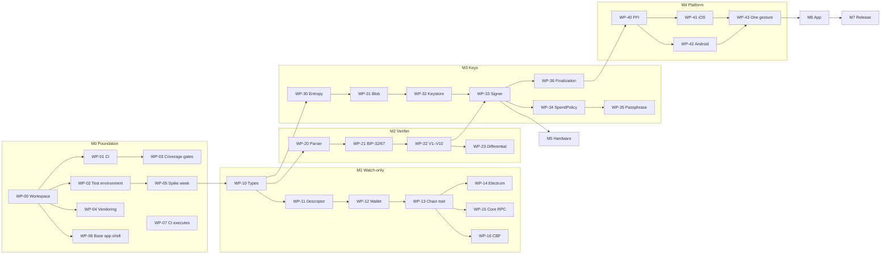

Trinity — serverloses 2-von-3 Wallet-Schema. Entwurf: Joshua Krüger, 2026.

# Implementation Plan

**Purpose:** This file is the work list. Each work package (WP) is cut so that
an agent or developer can complete it **without follow-up questions**: with inputs, outputs,
specification reference, acceptance criteria, and the tests that must pass.

**Reference documents:**
[`SPECIFICATION.md`](SPECIFICATION.md) — the what and why ·
[`TESTING.md`](TESTING.md) — test environment, coverage policy, CI ·
[`RECOVERY.md`](RECOVERY.md) — user document, test cases S5/S6 ·
[`BUILD_PLAN.md`](BUILD_PLAN.md) — how an executing agent takes a WP from OPEN to DONE

---

## 0. Rules for everyone working here

| # | Rule |
|---|---|
| R1 | **One WP = one branch = one PR.** Branch name `wp/<id>-<shortname>`. |
| R2 | **No WP is done without its tests.** The test list in the WP is the acceptance, not the code. |
| R3 | **The Spec is the truth.** If the implementation diverges, change the Spec first (with justification in the PR), then the code. Never the other way around and never silently. |
| R4 | **Block rather than guess.** Where the Spec says ⟨API-VERIFY⟩ or "open", do not improvise — record the result in the Spec, then continue. |
| R5 | **No WP may extend the FFI allowlist**, except **WP-40** (which creates it). Any later change needs second review with a security justification in the PR. |
| R6 | **Coverage gate applies from the WP that creates the crate** — not "catch up later". See TESTING.md §3. |
| R7 | **Every PR names the WP-ID, the Spec sections, and the test IDs** in the description. |
| R8 | **No number is copied by hand.** Counts (work packages, release criteria, crates, dependencies) live in exactly one place and are held against reality by `check_plan.py` or `dep_budget.py`. Anyone who writes a number into prose makes it subject to checking. |
| R9 | **A contradiction between two documents is a blocker, not a detail.** Anyone who hits one while working a package stops and reports it, rather than choosing one reading. R3 (change Spec first) then applies to the resolution. |

### State legend

`OPEN` · `BLOCKED` (with reason) · `IN PROGRESS` · `REVIEW` · `DONE`

> **`DONE` is not an opinion.** Once a WP carries this state,
> `scripts/check_plan.py` requires a test function for **every** test ID assigned to it and
> otherwise breaks the build. That way unnoticed test debt cannot accumulate.

### Status (2026-08-09)

| WP | State | Evidence | What's missing |
|---|---|---|---|
| **WP-00** | **DONE** | `cargo build --workspace --locked` **and** `--offline` green · `cargo deny check` **run and green** · Pinning verified · Signature path measured: **40 external crates** (MEASURED in `dep_budget.py`, union of shipped targets `aarch64-apple-ios` + `aarch64-linux-android`), `trinity-verify` alone **22** · `fmt` and `clippy -D warnings` clean | — |
| WP-01 | IN PROGRESS | Workflow rewritten without job-level `hashFiles`; always-on check/test/supply-chain/coverage; FFI/differential/signet use in-job harness detection; actions pinned to full commit SHAs; `permissions.contents: read`; checkout `persist-credentials: false`; tools pinned `tool@x.y.z` with `fallback: none`. Gate tests under `scripts/tests/`. | **Never executed on a runner** (local structural tests ≠ GitHub acceptance). |
| WP-02 | IN PROGRESS | `test-env.sh` (syntax checked, Core version lock implemented) and `docker/compose.yml` (valid; images still by tag; published host ports bound to `127.0.0.1`) | **Never started.** Image-**digests missing**. No `bitcoind`, no `electrs` pulled. |
| WP-03 | IN PROGRESS | `coverage_gate.py` (`--source-state` probe), `check_plan.py` (incl. fail-closed `INVENTORY_BASELINE`), `dep_budget.py` (shipped-target union) fail-closed; coverage **job** always schedules and no-ops on pure scaffolds until real source; gate tests wired into fast path. | Real coverage/mutation run pending until domain source exists; branch coverage feasibility of the pinned toolchain documented in TESTING.md §3.1. Not claimed green on GitHub. |
| WP-04 | **OPEN** | — | `vendor/`, `.cargo/config.toml`, build without network in container, reproducible-build proof via two runners. |
| WP-07 | **OPEN** | Repo-side cause repaired locally: job-level `hashFiles` rejected the workflow before jobs scheduled; workflow no longer uses it (in-job harness detection, SHA-pinned actions). Local structural tests pass. | **Post-repair GitHub runner evidence still missing** — no claim that GitHub accepted or ran the new workflow. Account-side causes (minutes / spending limit) remain **unconfirmed** until a post-repair run is observed. |

**So: no, M0 is not done.** What is done is WP-00. The three packages in progress still hang
on tools/containers and on **runner evidence**. The confirmed job-level `hashFiles` reject
path is repaired in-repo; until a post-repair GitHub run is observed, WP-07 stays open.

**Next step: WP-05** (content unlock for M1–M5), **WP-07** (make gates measurable), and
**WP-04** (vendoring) — see [`BUILD_PLAN.md`](BUILD_PLAN.md) §3 for waves.

---

## 1. Milestones

| M | Name | Goal | Contains |
|---|---|---|---|
| **M0** | Foundation | Repo builds reproducibly, CI runs, test environment stands | WP-00 … WP-07 |
| **M1** | Watch-only core | Descriptor, addresses, UTXOs, PSBT build — **without any key material** | WP-10 … WP-16 |
| **M2** | Verifier | Independent checking, aligned against Bitcoin Core | WP-20 … WP-23 |
| **M3** | Keys and signature | Entropy, blobs, keystore, signature, spending limit | WP-30 … WP-36 |
| **M4** | Platform and FFI | uniffi facade, iOS and Android keystore, one-gesture flow | WP-40 … WP-46 |
| **M5** | Hardware signer | QR and NFC transport, BIP-388, device allowlisting | WP-50 … WP-54 |
| **M6** | App and UX | Onboarding, send, receive, recovery, export | WP-60 … WP-68 |
| **M7** | Hardening and release | Fuzzing, memory hygiene, audit, user test | WP-70 … WP-76 |

**M0 through M4 are the critical chain.** M5 can run in parallel from M3, M6 from M4.

---

## 2. Dependency graph

---

## 3. Work packages

Every WP has the same structure. **Acceptance** is binding — what is not listed there is not part
of the WP; what is listed there must be met without exception. The assignment test-ID → WP is in the
`**Tests:**` line; `scripts/check_plan.py` enforces completeness in both directions and
uniqueness.

---

### M0 — Foundation

#### WP-00 · Workspace and pinning
**Spec:** 0.3, 1.1, 1.7 · **Needs:** — · **State:** DONE

Cargo workspace with the ten crates from 1.1 as empty scaffolds. `[workspace.dependencies]` with
**exact** `=`-pins from the table in 0.3. `Cargo.lock` checked in.
`rust-toolchain.toml` with fixed version.

**Files:** `Cargo.toml`, `Cargo.lock`, `rust-toolchain.toml`, `deny.toml`, `crates/*/Cargo.toml`, `crates/*/src/lib.rs`
**Prohibited:** No domain logic; no new dependencies without an entry in 0.3; no touching of `app/` or `platform/`.

**Acceptance**
- `cargo build --workspace --locked` green, offline (`--offline`)
- `cargo tree -d` reports only the duplicates entered in `deny.toml` **with justification** — in particular only **one** `secp256k1` version
- ✅ **Verified 2026-08-08:** `secp256k1 0.29.1`, `miniscript 12.3.7`, `bitcoin 0.32.11` exactly once each. Accepted and justified: `bitcoin_hashes 1.2.0` (only via `ur` in QR transport, outside the signature path), `getrandom 0.2.17` and `rand_core 0.6.4` (via `argon2` → `password-hash`)
- `miniscript` resolves to `12.3.x`, **not** 13.x; `secp256k1` to `0.29.1`
- `deny.toml` present with `[licenses]` as an **allowlist** per §1.7 (file-copyleft MPL-2.0 allowed; project-copyleft GPL/AGPL/SSPL/BUSL and usage fees excluded) and `[bans]` rule: `miniscript` is banned in `trinity-verify`
- `cargo deny check` green

**Toolchain follow-up (2026-08-11 — SPECIFICATION.md §0.3, TESTING.md §3.1 option (b)):**
Build/test/clippy/fmt/deny stay on pinned **1.94.1** via `rust-toolchain.toml` (unchanged).
Branch coverage is measured only under **nightly** in the CI `coverage` job and
`just coverage` (`cargo +nightly llvm-cov … --branch`). Nightly is a measurement
toolchain for instrumentation, not a ship pin. See §0.3 table "Toolchain: build pin
vs. coverage measurement".

**Tests:** —

---

#### WP-01 · CI scaffold
**Spec:** 5.4, 5.5 · **Needs:** WP-00 · **State:** IN PROGRESS

GitHub Actions pipeline per TESTING.md §5: `fmt` → `clippy -D warnings` → `build` →
gate tests → `check-plan` → `dep-budget` → `test` → `deny` → `audit`. Differential on
every PR once the harness exists (in-job detection; no job-level `hashFiles`);
Signet/Mutants after `main`.

**Files:** `.github/workflows/ci.yml`, `scripts/tests/`
**Prohibited:** No secrets in logs; no `allow` Clippy exceptions without a comment with justification; do not create Cargo features `differential`/`signet` here (WP-23 and WP-45 respectively); do not use job-level `hashFiles`; do not pin actions by floating tag.

**Acceptance**
- Pipeline runs on every PR and blocks on red
- `clippy` with `-D warnings`, no `allow` exceptions without a comment with justification
- Fast-path runtime < 10 min
- Jobs `differential` and `signet` detect harnesses in-job and no-op successfully without harness; cleanup under `always()` only when the env was started
- External actions pinned to full 40-hex SHAs; least-privilege `permissions`; checkout does not persist credentials
- Selected cargo tools installed as exact `tool@x.y.z` with install-action `fallback: none`

**Tests:** —

---

#### WP-02 · Test environment
**Spec:** 5.1, 5.3 · **Needs:** WP-00 · **State:** IN PROGRESS

Reproducible environment per TESTING.md §2: **Bitcoin Core 30.2** (Regtest; Signet as
acceptance target), Electrum server, CBF via the same Regtest node with filter indices, all
containerized and startable via a script.

**Files:** `docker/compose.yml`, `scripts/test-env.sh`, `justfile` (test-env-*)
**Prohibited:** Do not claim image tags without a TODO(WP-02) digest note as final; do not allow Core 30.0/30.1.

**Acceptance**
- `just test-env-up` brings up Core 30.2 (Regtest), electrs, and a CBF-capable node
- Version is checked: **30.0 and 30.1 are actively rejected** (wallet bug, 0.3)
- Deterministic Regtest state: script produces 101 blocks and a funded wallet
- `just test-env-down` cleans up fully
- Runs on Linux **and** macOS
- Image digests entered (acceptance criterion; still open today)

**Tests:** —

---

#### WP-03 · Coverage and mutation gates
**Spec:** 5.5 · **Needs:** WP-01 · **State:** IN PROGRESS

`cargo-llvm-cov` with **thresholds per crate** per TESTING.md §3, plus `cargo-mutants` for the
security cores. Gates are fail-closed: missing line or branch data for crates with
source code are findings, not silent 100 %. On pure scaffolds, `cargo llvm-cov`
exits with `no coverage data found` before the gate can run; CI therefore probes
with `coverage_gate.py --source-state` and only runs report+gate when real source
exists. The coverage **job** still schedules every push (no job-level skip).

**Files:** `scripts/coverage_gate.py`, `scripts/check_plan.py`, `scripts/dep_budget.py`, `coverage-exclusions.toml`, `justfile`, `.github/workflows/ci.yml` (coverage job)
**Prohibited:** No exception for `trinity-verify`; no claiming a number that is not measured; do not convert llvm-cov/gate failure into a skip once real source is present; no placeholder domain code solely to force a green coverage report.

**Acceptance**
- Coverage **job** schedules on every covered PR/push; explicit WP-03 no-op while every threshold crate is a pure scaffold
- First non-scaffold source activates fail-closed `cargo llvm-cov` + `coverage_gate.py`
- Coverage report per crate; gate breaks the build on under-threshold
- Exception list exists as a file with **justification per entry**; an entry without justification breaks the build
- `cargo-mutants` runs against `trinity-verify` and `trinity-signer`; surviving mutants break the build
- Missing BRF/BRH lines in lcov are a finding (not silent 100 % branches)
- Branch coverage: CI/`just coverage` run `cargo +nightly llvm-cov … --branch` (decision recorded in SPECIFICATION.md §0.3 / WP-00); missing BRF/BRH remains a finding if the report lacks branch data

**Tests:** —

---

#### WP-04 · Vendoring and reproducible builds
**Spec:** 1.7 · **Needs:** WP-00 · **State:** OPEN

**Files:** `vendor/`, `.cargo/config.toml`, CI job or script for offline build
**Prohibited:** Do not put `vendor/` in `.gitignore`; build must not pull from the network in the released state.

**Acceptance**
- `vendor/` checked in, `.cargo/config.toml` with `replace-with = "vendored-sources"`
- Build without network succeeds (proven in a container without network)
- Two independent CI runners produce **bit-identical** artifact hashes
- `scripts/dep_budget.py` runs in CI; budget limit **45**, measured **40 external crates** (`MEASURED` in `dep_budget.py`; union of shipped targets `aarch64-apple-ios` + `aarch64-linux-android`)

**Tests:** —

---

#### WP-05 · Spike week: work through Appendix B
**Spec:** Appendix B (14 points), O12 · **Needs:** WP-02 · **State:** OPEN

Clarify **all 14 open points** from Appendix B and **update the Spec**. No
production code.

**Files:** `docs/SPECIFICATION.md` (Appendix B, marked ⟨API-VERIFY⟩ places)
**Prohibited:** No production code in `crates/`; do not invent ⟨API-VERIFY⟩ silently.

**Acceptance**
- Each of the 14 points has a result in the Spec or a justified deferral
- All ⟨API-VERIFY⟩ marks are resolved or explicitly extended
- Especially: B.2 (uniffi buffer zeroing), B.3 (Kyoto peer behaviour), B.9 (Ledger APDU reference), B.13 (Whisper crypto) — they touch architecture
- Coldcard version claims verified against the **primary source** (B.6) — ✅ done 2026-08-10; WP-54 is no longer blocked on that
- **Progress 2026-08-10:** **7 of 14 closed** — B.1 (BDK 3.1.0 signatures from pinned crate source; build RNG + interior mutability recorded), B.2 (borrowed `&[u8]`, no RustBuffer intermediate), B.5 (`cargo audit` clean), B.6 (Coldcard primary), B.7 (`sortedmulti` permutation invariance), B.8 (`bitbox-api` has no BLE), B.9 (no Ledger Bitcoin app crate). **7 still open** (B.3, B.4, B.10–B.14). Package stays **OPEN** until all 14 are answered.

**Tests:** —

---

#### WP-06 · Base decision app shell
**Spec:** 1.3, 1.7, 6.1 · **Needs:** — · **State:** REVIEW

Spike, no build: on which basis the app shell (navigation, onboarding, send,
receive, QR, address book, settings) is created — null variant, WDK shell without
wallet half, BlueWallet as template, Nunchuk only as GPL exclusion. The Rust core
(`bdk_wallet` + uniffi) and E1 remain untouched. Result is a decision paper with
measurable criteria K1–K9 and a recommendation; the project owner makes the choice.

**Files:** `docs/APP_SHELL_DECISION.md`, `docs/IMPLEMENTATION_PLAN.md` (this package, M6 references)
**Prohibited:** No application code; no fork; no `npx create-expo-app`; no `npm install` of
candidates; no change to `docs/SPECIFICATION.md`; no decision in JK's place
(recommendation only); no commit/push by the spike executor.

**Acceptance**
- `docs/APP_SHELL_DECISION.md` exists with: question, non-debate (core/E1), table K1–K9
  across four rows with numbers or "not measured", hard §1.3 check with file/line,
  recommendation including counter-arguments, revision costs, "not measured" list
- M6 packages (at least WP-60) reference dependency on this package's result
- `python3 scripts/check_plan.py` green

**Tests:** —

---

#### WP-07 · Make CI actually execute
**Spec:** 5.4, 5.5 · **Needs:** — · **State:** OPEN

Find and remove the cause that makes every GitHub Actions workflow run end after **zero
seconds** with **no job ever scheduled**. A pipeline that only parses locally is not
enough while runners never start.

**Repo-side defect fixed in this import repair (not yet runner-evidenced):** job-level
`if: hashFiles(...)` is rejected by GitHub before jobs schedule — that matches the
observed `total_count=0` pattern. The workflow no longer uses job-level `hashFiles`;
harness detection is in-job. Local structural tests cover the invariants; they do **not**
prove GitHub accepted or ran the file.

**Earlier measured finding (2026-08-10):** across workflow runs then available, every run
had `conclusion=failure`, duration **0 s**, and `total_count=0` for jobs. Account-side
causes (minutes / spending limit) remain possible until a post-repair run is observed.

**Files:** `.github/workflows/ci.yml`, documentation of the root cause in this plan's
status table and/or `docs/TESTING.md` §5
**Prohibited:** Do not change jobs only to make them "green"; the goal is a **run that
actually executes**, not a skipped or hollow success. Do not disable checks, soft-fail
gates, or remove steps to dodge a red result.

**Acceptance**
- At least one workflow run on a real runner with **at least one job that executed**
  (non-zero job duration or completed steps — not `total_count=0`)
- Root cause named and written down (status table or TESTING.md §5) after a post-repair run
- If a remaining cause is an **account setting** (minutes, spending limit, plan), record it
  as such — not as a repository defect
- Fast path remains under **10 minutes** once it runs (same bound as WP-01)

**Tests:** —

---

### M1 — Watch-only core

#### WP-10 · `trinity-types`
**Spec:** 1.1, 1.3 · **Needs:** WP-05 · **State:** OPEN

Value types without I/O: `KeySlot`, `Network`, `PsbtB64`, `Fingerprint`, `WordCount`,
`XpubWithOrigin`, `Balance`, `AddressInfo`, `PsbtVerdict`, `SendRequest`, crate-internal
`SecretBytes` (not an exported uniffi type — Appendix B.2).

**Files:** `crates/trinity-types/**`
**Prohibited:** No I/O dependency; no access to keystore/signer; no secrets in `Debug`/`Display`;
do not export `SecretBytes` via uniffi.

**Acceptance**
- `SecretBytes`: crate-internal `ZeroizeOnDrop` wrapper, **no** `Clone`, **no** `Debug`/`Display` except `"[redacted]"`
- Compile test (`trybuild`): `Clone` on `SecretBytes` **fails**
- **No** `#[uniffi::export]` / `uniffi::Object` on `SecretBytes` — passphrase crosses FFI as borrowed `&[u8]` only
- The crate has **no** I/O dependency — enforced via `cargo-deny [bans]`
- Coverage 100 % lines and branches

**Tests:** —

---

#### WP-11 · Descriptor generation and persistence
**Spec:** 2.3 · **Needs:** WP-10 · **State:** OPEN

`wsh(sortedmulti(2,…))` with BIP-48 paths, origin info, checksum. `descriptor.json` with
`word_count` **per key**, `source` per key, `policy_id`, `birthday`, network, version.

**Files:** `crates/trinity-watch/**` (descriptor parts), optionally `crates/trinity-types/**` (descriptor types)
**Prohibited:** No multipath descriptor; no key material; no access to `trinity-keystore`/`trinity-signer`.

**Acceptance**
- **D1** (checksum against `getdescriptorinfo`, 10,000 cases)
- **P5** (permutation invariance), **P7** (identical fingerprints rejected), **P9** (foreign grammar rejected)
- Receive and change descriptors separate (O8), multipath is **not** produced
- Round-trip `descriptor.json` lossless, including mixed word lengths

**Tests:** D1, P5, P7, P9

---

#### WP-12 · `trinity-watch` — BDK wallet
**Spec:** 1.1, 3.2 · **Needs:** WP-11 · **State:** OPEN

Wallet build from descriptor, address derivation, UTXO management, `TxBuilder`, persistence.
Gap limit 20 (O10). BDK 3.1.0 signatures resolved (Appendix B.1, 2026-08-10):
`KeychainKind::External` = receive, `::Internal` = change;
`BranchAndBoundCoinSelection<SingleRandomDraw>` default;
iterators collected before any higher layer.

**Files:** `crates/trinity-watch/**`
**Prohibited:** No access to `trinity-keystore`/`trinity-signer` — enforced via `[bans]`.

**Acceptance**
- **D2**, **D3** (addresses against `deriveaddresses`, 500 setups × 1,000 addresses)
- **D6** (BIP-67 across all 6 permutations)
- `nLockTime = tip height`, `nSequence = 0xFFFFFFFE` (anti-fee-sniping)
- Coin selection: `BranchAndBoundCoinSelection` with `SingleRandomDraw` type-parameter default; changeless solution preferred
- **P8** (fee identity, overflow edge cases)
- Dust change goes into the fee
- **In tests that build a PSBT, finish via `finish_with_aux_rand` with a fixed seed** (Spec §3.2; TESTING.md §2.4) — production may use `finish()`; signature path unchanged

**Tests:** D2, D3, D6, P8

---

#### WP-13 · `ChainBackend` trait
**Spec:** 1.6 · **Needs:** WP-12 · **State:** OPEN

**Files:** `crates/trinity-chain/src/lib.rs` (trait), tests under `crates/trinity-chain/**`
**Prohibited:** No concrete backend implementation except in-memory fake; no network requirement in unit tests.

**Acceptance**
- Trait per 1.6, including `privacy_profile()`
- In-memory fake for tests that works without network
- `broadcast` is **separately** configurable from the sync backend

**Tests:** —

---

#### WP-14 · Electrum backend
**Spec:** 1.6 · **Needs:** WP-13 · **State:** OPEN

**Files:** `crates/trinity-chain/**` (Electrum backend)
**Prohibited:** No silent fallback to Core RPC or CBF; no key material.

**Acceptance**
- **S2** (balance identical across all three backends — this backend contributes)
- **S13** (failure → clean error, **no** silent fallback to another backend)
- `privacy_profile()` returns the data from the table in 1.6

**Tests:** S13

---

#### WP-15 · Core RPC backend
**Spec:** 1.6 · **Needs:** WP-13 · **State:** OPEN

**Files:** `crates/trinity-chain/**` (Core RPC backend)
**Prohibited:** No silent fallback; no key material.

**Acceptance**
- Balance identical to the other backends within S2 (owned by WP-45)
- Failure behaviour analogous to S13 (clean error, no silent fallback)
- `privacy_profile()` returns the data from the table in 1.6

**Tests:** —

---

#### WP-16 · CBF backend
**Spec:** 1.6 · **Needs:** WP-13 · **State:** OPEN

**Files:** `crates/trinity-chain/**` (CBF backend)
**Prohibited:** Do not set CBF as default while Appendix B.3 is open (O3); no silent fallback.

**Acceptance**
- Balance identical within S2; failure analogous to S13
- `privacy_profile()` returns the data from the table in 1.6
- Result of Appendix B.3 is incorporated; without that evidence CBF must **not** be set as default (O3)

**Tests:** —

---

### M2 — Verifier

#### WP-20 · Own descriptor parser
**Spec:** 1.5, E2 · **Needs:** WP-10 · **State:** OPEN

~250 lines for **exactly** the grammar `wsh(sortedmulti(2,·,·,·))`. Everything else is a hard
error. **Without `miniscript`.**

**Files:** `crates/trinity-verify/**` (parser)
**Prohibited:** No `miniscript` dependency; no access to `trinity-keystore` or `trinity-signer`.

**Acceptance**
- `cargo-deny` confirms: `miniscript` is not a dependency of this crate
- Negative cases with random valid Miniscript descriptors (supplement to P9)
- `cargo-fuzz` ≥ 1 h without finding (full run in WP-70)
- Coverage **100 % lines and branches**, no exceptions

**Tests:** —

---

#### WP-21 · Own BIP-32 derivation and BIP-67 sorting
**Spec:** 1.5 · **Needs:** WP-20 · **State:** OPEN

Own CKDpub, own sorting, own witnessScript construction. Shared remain only `secp256k1`
and the hashes — the independence boundary is tabulated in 1.5 and applies.

**Files:** `crates/trinity-verify/**`
**Prohibited:** No `miniscript` dependency; no keystore/signer.

**Acceptance**
- **D4** (verifier against `deriveaddresses`) — **the most important test of the milestone**
- **D5** (verifier against builder); every divergence is an alarm, not a test failure
- Coverage 100 %

**Tests:** D4, D5

---

#### WP-22 · Checks V1–V10
**Spec:** 1.5, 3.3 · **Needs:** WP-21 · **State:** OPEN

**Files:** `crates/trinity-verify/**`
**Prohibited:** No `miniscript` dependency; no keystore/signer.

**Acceptance**
- Every check V1–V10 has at least one positive and one negative test
- **P1, P2, P3, P11, P12**
- Every rejection returns a **concrete** error reason, never a generic "invalid"
- The verifier runs at all **three** places from 3.3

**Tests:** P1, P2, P3, P11, P12

---

#### WP-23 · Differential harness
**Spec:** 5.1 · **Needs:** WP-22, WP-02 · **State:** OPEN

Harness that runs **D1–D19** against Bitcoin Core 30.2, with stable seed and reproducible
cases. Creates the Cargo feature `differential` and the directory `tests/differential/`,
so the CI job can be reactivated.

**Files:** `tests/differential/**`, feature `differential` in affected `Cargo.toml`, `justfile` (`diff-test`)
**Prohibited:** No domain-logic changes in Verify/Signer except harness wiring; do not create features without real tests.

**Acceptance**
- Cargo feature `differential` is defined and bound to the harness
- Directory `tests/differential/` exists and contains runnable tests
- All D-tests run via `just diff-test` locally and in CI
- A failure shows input, expected, and actual in plain text
- Runtime < 20 min
- After this WP the differential harness is present so the in-job detection step runs the suite (no longer a successful no-op)

**Tests:** —

---

### M3 — Keys and signature

#### WP-30 · `trinity-entropy`
**Spec:** 2.2, 2.2.1–2.2.5 · **Needs:** WP-10 · **State:** OPEN

`entropy = HMAC-SHA512(key = OS_CSPRNG(32), msg = extra_bytes)[0..L]`. Sources class A
(dice, coins, cards) with canonical encoding and separator rule; class B injectable only,
**zero** countable bits. Additional entropy optional (E3), also for C.

**Files:** `crates/trinity-entropy/**`
**Prohibited:** No mandatory additional entropy; no I/O except entropy sources; no keystore.

**Acceptance**
- **D12, D13, D17** · **P10, P14, P15, P16**
- **S20**: external shell script recomputes `entropy` from `raw_csprng` + `extra_bytes` — for **all** source combinations
- `word_count` rule: C is fixed at 24, `SetupConfig` with `C = 12` is rejected (**S15b**)
- Verification printout is produced and contains `L`, the separator rule, and all intermediate values
- Coverage 100 %

**Tests:** D12, D13, D17, P10, P14, P15, P16, S15b, S20

---

#### WP-31 · Blob format
**Spec:** 2.4 · **Needs:** WP-30 · **State:** OPEN

XChaCha20-Poly1305, header as AAD, `word_count` in the header. **No KDF field** — Argon2id sits
since the correction in 2.4 in the policy record.

**Files:** `crates/trinity-keystore/**` (blob)
**Prohibited:** No KDF in the blob header; no logging of plaintext entropy.

**Acceptance**
- **P6** (round-trip, every header mutation ⇒ AEAD error), **P13** (`word_count` mutation)
- Blob format for A and B **bit-identical** — one test compares the layouts
- Coverage 100 %

**Tests:** P6, P13

---

#### WP-32 · `trinity-keystore`
**Spec:** 2.4, 2.5 · **Needs:** WP-31 · **State:** OPEN

`SlotPolicy`, `PlatformKeyStore` callback trait, `POLICY_A` (`.biometryCurrentSet`) and
`POLICY_B` (`.userPresence`). Memory handling per 2.5.

**Files:** `crates/trinity-keystore/**`
**Prohibited:** No `log`/`tracing`; no secrets without `ZeroizeOnDrop`; no `print!`/`dbg!`.

**Acceptance**
- No `log`/`tracing` as a dependency — enforced via `[bans]`
- `#![deny(clippy::print_stdout, clippy::dbg_macro)]`
- Compile test: no secret type without `ZeroizeOnDrop`
- `panic = "abort"` in the release profile
- Fake `PlatformKeyStore` for tests; **mock counts calls** (for S9, S28)
- Coverage 100 %

**Tests:** —

---

#### WP-33 · `trinity-signer`
**Spec:** 3.4 · **Needs:** WP-32, WP-22 · **State:** OPEN

`Signer` trait, `LocalSigner`. RFC-6979 via `secp256k1`, low-s, `SIGHASH_ALL` exclusively,
self-verification after every signature. Crate-internal `sign_a`/`sign_b`; later only
`sign_ab` / `sign_ab_with_passphrase` are exported (WP-40).

**Files:** `crates/trinity-signer/**`
**Prohibited:** No RNG on the signature path; no export of seeds; no SIGHASH except ALL.

**Acceptance**
- **D7, D8** (bit-identical to `walletprocesspsbt`) · **P4** (determinism)
- Verifier runs **before** every key access; **S9** including mock assertion that `unwrap_kek` was **not** called
- **S10** (manipulation between A and B is detected)
- Every SIGHASH other than `ALL` is rejected (**P11** — owned by WP-22; contribution here)
- Coverage 100 %, `cargo-mutants` without survivors

**Tests:** D7, D8, P4, S9, S10

---

#### WP-34 · `SpendPolicy` and window counter
**Spec:** 3.6.3, 3.6.5, 3.6.7, O18 · **Needs:** WP-33 · **State:** OPEN

`clamp(20 % of balance, 200 €, 500 €)` per 24 h, sliding window, counter in
encrypted core state. Accounting **exactly** per 3.6.7. Window time source per O18
(open); fail-closed on wall-clock jump per 3.6.7 in every case.

**Files:** `crates/trinity-signer/**` (SpendPolicy), optionally `crates/trinity-types/**`
**Prohibited:** No policy enforcement in the JS layer; no rate fetch at signature time;
no wall-clock-only advancement of the spend window.

**Acceptance**
- **S28** (limit applies, no `unwrap_kek`, no biometry prompt)
- **S29** (splitting does not help), **S29b** (all three ranges + edge cases), **S29f** (invariant `floor ≤ cap`)
- **S29h** (accounting: fee, change, self-transfer, RBF delta, dropped tx)
- **S29i** (unconfirmed external payment does **not** raise the reference size)
- **S29j** (sliding window across calendar boundary)
- **S29k** (device-clock +24 h / backward / auto-sync off never resets the window; no `unwrap_kek`)
- Counter survives restart and reboot; not resettable by deleting JS-readable files
- Coverage 100 %, `cargo-mutants` without survivors

**Tests:** S28, S29, S29b, S29f, S29h, S29i, S29j, S29k

---

#### WP-35 · Passphrase verifier and fiat anchoring
**Spec:** 2.4 ("authorization secret"), 3.6.6, 3.6.8 · **Needs:** WP-34 · **State:** OPEN

`H = SHA-256(Argon2id(pass, pp_salt, profile))`, comparison in constant time.
Diceware check ≥ 6 words. Fiat→sat anchoring with plausibility filter and asymmetry.

**Files:** `crates/trinity-keystore/**`, `crates/trinity-signer/**` (policy verifier)
**Prohibited:** Passphrase never as `String`; no `==` on secret bytes; no network in signature checking.

**Acceptance**
- **D16** (Argon2id against RFC-9106 vectors, both profiles)
- **S29c** (rate manipulation in 5 variants; **assertion: no network fetch at signature time**)
- **S29d**, **S29g** (raising requires passphrase — also directly via FFI, not only via UI)
- **S29e** (signing in airplane mode), **S30**, **S31**
- **S35** (reminder exercise after 60 days), **S36** (forgotten passphrase is not loss of funds)
- Comparison demonstrably constant-time (`subtle` or similar, no `==` on bytes)
- Coverage 100 %

**Tests:** D16, S29c, S29d, S29e, S29g, S30, S31, S35, S36

---

#### WP-36 · Finalization and broadcast
**Spec:** 3.5 · **Needs:** WP-33 · **State:** OPEN

Witness in **BIP-67 order** (not signature order — common error source),
consensus check via `bitcoinconsensus` (O7), vsize measurement against `max_feerate`.

**Files:** `crates/trinity-signer/**`, `crates/trinity-watch/**` (finalize/broadcast wiring)
**Prohibited:** No signature order as witness order; no broadcast without consensus check.

**Acceptance**
- **D10** (raw tx bit-identical to `finalizepsbt`), **D11** (`testmempoolaccept` allows)
- **S11** (fee attack rejected before every key access), **S12** (RBF bump)
- One test deliberately swaps signature order and still expects a valid witness

**Tests:** D10, D11, S11, S12

---

### M4 — Platform and FFI

#### WP-40 · `trinity-ffi`
**Spec:** 1.3 · **Needs:** WP-36 · **State:** OPEN

uniffi facade **exactly** per the signature list in 1.3 (`sign_ab`, `sign_ab_with_passphrase`,
`sign_with_recovery_key` with borrowed `&[u8]`; no exported `sign_a`/`sign_b`; no exported
`SecretBytes` type), plus `ffi-allowlist.toml` and CI gate script.

**Files:** `crates/trinity-ffi/**`, `crates/trinity-ffi/ffi-allowlist.toml`, `scripts/check_ffi_boundary.py`
**Prohibited:** No allowlist extension outside this WP without second review; no export of seed/mnemonic/xpriv; do not export `sign_a`/`sign_b`; do not export `SecretBytes` as a uniffi type.

**Acceptance**
- CI gate `ffi-boundary` breaks on every signature change outside the allowlist
- Script `scripts/check_ffi_boundary.py` and allowlist `crates/trinity-ffi/ffi-allowlist.toml` exist
- No exported call returns seed, mnemonic, or xpriv — checked automatically
- **S23** is a **build-breaking** signature check (no secret export; `blob_B` only after SpendPolicy; no policy/key exports without a passphrase parameter)
- `sign_ab`, `sign_ab_with_passphrase`, and `sign_with_recovery_key` are exported and on the allowlist
- Result from Appendix B.2 is implemented: facade uses **borrowed** platform buffers (`&[u8]`); `SecretBytes` is **crate-internal only**; **no** exported `SecretBytes` type; uniffi does not introduce a passphrase intermediate copy
- **Interior mutability (Appendix B.1):** `TrinityCore` holds the BDK wallet behind a `Mutex`/`RwLock` (sixteen `Wallet` methods take `&mut self`; uniffi exports take `&self` on an `Arc`-shared object). The lock **must not** be held across a signing call that waits on user input (biometrics, passphrase, hardware confirmation)
- BDK iterators (`list_unspent` / `list_output` / `transactions`) are collected into `Vec` before export

**Tests:** S23

---

#### WP-41 · iOS platform layer
**Spec:** 2.4, 3.6.2 · **Needs:** WP-40 · **State:** OPEN

Keychain, `PlatformKeyStore` implementation, passphrase entry **without `String`**.

**Files:** `platform/ios/**`
**Prohibited:** Passphrase never as Swift `String`; do not create slot B with `.biometryCurrentSet`; no iCloud backup of KEKs.

**Acceptance**
- SE-P-256 keys, `kSecAttrAccessibleWhenPasscodeSetThisDeviceOnly`; A `.biometryCurrentSet`, B `.userPresence`
- Passphrase never as `String` — code-review checklist **plus** lint
- **S14**, **S33** (enrollment change: A gone, **B lives**), **S34** (device passcode only ⇒ only B)
- Behaviour on app uninstall documented (Appendix B.4)

**Tests:** S14, S33, S34

---

#### WP-42 · Android platform layer
**Spec:** 2.4, 3.6.2 · **Needs:** WP-40 · **State:** OPEN

Keystore, `PlatformKeyStore` implementation, passphrase entry **without `String`**.

**Files:** `platform/android/**`
**Prohibited:** Passphrase never as Kotlin `String`; do not enable enrollment invalidation for B; no plaintext in autofill.

**Acceptance**
- StrongBox with feature detection; A `AUTH_BIOMETRIC_STRONG` + `setInvalidatedByBiometricEnrollment(true)`; B additionally `AUTH_DEVICE_CREDENTIAL`, enrollment invalidation **off**
- Passphrase never as `String` — code-review checklist **plus** lint
- Same behavioural requirements as S14/S33/S34 on Android (ID ownership: WP-41)
- Behaviour on app uninstall documented (Appendix B.4)

**Tests:** —

---

#### WP-43 · One-gesture flow
**Spec:** 3.6.2 · **Needs:** WP-41, WP-42 · **State:** OPEN

iOS: one `LAContext` for both accesses. Android: time-based authorization, window as short
as technically possible, **not** configurable. One call that signs both slots — not two
exported A/B steps with JS in between. The passphrase split (`sign_ab` vs
`sign_ab_with_passphrase`) is orthogonal and still keeps both signatures crate-internal.

**Files:** `platform/ios/**`, `platform/android/**`, wiring to `crates/trinity-ffi/**`
**Prohibited:** No two biometric prompts below the quota; do not call `sign_a`/`sign_b` from JS.

**Acceptance**
- **S27**: **exactly one** biometric prompt per send below the limit. Two prompts are a failure.
- Total duration ≤ 5 s on the lower-performance-class reference device
- Checked on real devices, not only in the simulator

**Tests:** S27

---

#### WP-44 · Memory hygiene harness
**Spec:** 5.4 · **Needs:** WP-43 · **State:** OPEN

**Files:** `tests/**` (hygiene harness), optionally CI job
**Prohibited:** Do not permanently store secrets in test fixtures in plaintext.

**Acceptance**
- Heap dump after `sign_*` does **not** contain the known entropy
- Runs under Linux and Android; iOS gap documented

**Tests:** —

---

#### WP-45 · Signet E2E harness
**Spec:** 5.3 · **Needs:** WP-43 · **State:** OPEN

Harness for Signet/Regtest scenarios. Creates the Cargo feature `signet` and
`tests/signet-e2e/`, so the CI job can be reactivated.

**Files:** `tests/signet-e2e/**`, feature `signet` in affected `Cargo.toml`, `justfile` (`signet-test`)
**Prohibited:** Do not create features without real tests; S4/S5/S6/S7 belong to other WPs.

**Acceptance**
- Cargo feature `signet` is defined and bound to the harness
- Directory `tests/signet-e2e/` exists
- **S1, S2, S3, S8** run automated on Signet and Regtest
- **S32** — the full theft simulation: unlocked device, attacker exhausts the quota, then recovery with backup B + C on a second device. **Veto 5b**
- After this WP the signet harness is present so the in-job detection step runs the suite (no longer a successful no-op)

**Tests:** S1, S2, S3, S8, S32

---

#### WP-46 · Export
**Spec:** 2.3 · **Needs:** WP-43 · **State:** OPEN

**Files:** `crates/trinity-export/**`
**Prohibited:** No private key material in the export; no passphrase in files.

**Acceptance**
- **D14, D15** (Sparrow, BSMS)
- **S5** (recovery without this app via Core — automated)
- **S6** (Sparrow import — manually verified and documented per release)
- `export_core_importdescriptors` produces runnable commands for RECOVERY.md §3

**Tests:** D14, D15, S5, S6

---

### M5 — Hardware signer

#### WP-50 · Transport trait
**Spec:** 2.7.1–2.7.2 · **Needs:** WP-33 · **State:** OPEN

**Files:** `crates/trinity-transport/**` (trait), `crates/trinity-signer/**` (ExternalSigner wiring)
**Prohibited:** No private material over the transport; no BLE requirement in v1.

**Acceptance**
- `PsbtTransport` trait per 2.7; only PSBT/xpub/policy over the channel
- `ExternalSigner` uses the trait; software B remains default

**Tests:** —

---

#### WP-51 · QR (BBQr/UR)
**Spec:** 2.7.3–2.7.4 · **Needs:** WP-50 · **State:** OPEN

**Files:** `crates/trinity-transport/**` (QR)
**Prohibited:** No private material in the QR; no camera requirement in unit tests (frame injection).

**Acceptance**
- **D19** (BBQr/UR round-trip, multi-frame 5–20 KB PSBTs)

**Tests:** D19

---

#### WP-52 · NFC
**Spec:** 2.7.5 · **Needs:** WP-50 · **State:** OPEN

**Files:** `crates/trinity-transport/**` (NFC), `platform/ios/**` / `platform/android/**` (entitlements)
**Prohibited:** No private material over NFC.

**Acceptance**
- Result from Appendix B.10 (CoreNFC entitlement) incorporated
- **S26** (NFC tap performance ≤ 5 s with hardware B)

**Tests:** S26

---

#### WP-53 · BIP-388
**Spec:** 2.7.3, 2.7.6 · **Needs:** WP-50 · **State:** OPEN

**Files:** `crates/trinity-export/**`, `crates/trinity-transport/**`
**Prohibited:** Policy ID not only in phone storage; reject import without display confirmation.

**Acceptance**
- **D18**, **S16**, **S18** (device shows change **as own**)

**Tests:** D18, S16, S18

---

#### WP-54 · Device allowlisting
**Spec:** 2.7.9 · **Needs:** WP-50 · **State:** OPEN

**Files:** `crates/trinity-transport/**`, `crates/trinity-export/**`, device allowlist data
**Prohibited:** Do not allowlist Mk2/Mk3 in any version; do not import existing device seeds for slot C.

**Acceptance**
- **D9** (PSBT signature C bit-identical)
- **S21** (firmware gate applies, Mk2/Mk3 remain blocked in every version)
- **S22** (import of an existing device seed for slot C is rejected, **vendor-independent**)
- **S17** (signature with hardware C in the recovery case)
- Version thresholds match Spec 2.7.9 / 0.3 (primary source resolved 2026-08-10; Appendix B.6 closed)

**Tests:** D9, S17, S21, S22

---

### M6 — App and UX

#### WP-60 · RN scaffold
**Spec:** UX_CONCEPT.md · 1.7, 6.1 · **Needs:** WP-43, WP-06 · **State:** OPEN

Scope depends on **WP-06**: after the base decision either empty Expo/RN scaffold
(null variant) or adopt/hollow out a chosen shell — see
`docs/APP_SHELL_DECISION.md`. The title "RN scaffold" remains until the decision; the content
follows the choice recorded there.

**Files:** `app/**` (scaffold, lint rules)
**Prohibited:** No CodePush, no remote config, no dynamic code loading; no
adopting wallet halves that hold seed/xpriv as a JS string (§1.3).

**Acceptance**
- No CodePush, no remote config; enforced via lint (1.7)
- Scaffold matches the base decision made in WP-06

**Tests:** —

---

#### WP-61 · Onboarding
**Spec:** UX_CONCEPT.md · 6.1 · **Needs:** WP-60 · **State:** OPEN

Scope (which screens new vs. from a template) depends on **WP-06** via WP-60.

**Files:** `app/**` (onboarding flows)
**Prohibited:** Do not make backup proof skippable; do not offer C with 12 words.

**Acceptance**
- **S15**, **S19**
- Onboarding path of **S1** (owned by WP-45) is implemented here; the E2E run lives in the Signet harness
- Backup proof **blocks** `reveal_next_address`

**Tests:** S15, S19

---

#### WP-62 · Native confirmation dialog
**Spec:** UX_CONCEPT.md · 6.2 · **Needs:** WP-60 · **State:** OPEN

Scope of app wiring depends on **WP-06** via WP-60.

**Files:** `platform/ios/**`, `platform/android/**`, `app/**` (wiring)
**Prohibited:** Do not render confirmation texts from JS state, but from `PsbtVerdict`.

**Acceptance**
- Dialog rendered from `PsbtVerdict`, **not** from JS state
- **S3** (send end-to-end — contribution; ID ownership: WP-45)

**Tests:** —

---

#### WP-63 · Passphrase entry
**Spec:** UX_CONCEPT.md · 6.2.1 · **Needs:** WP-60 · **State:** OPEN

Scope of app wiring depends on **WP-06** via WP-60.

**Files:** `platform/ios/**`, `platform/android/**`, `app/**`
**Prohibited:** Passphrase never as `String`; no autofill; no persisting.

**Acceptance**
- **S25** (≤ 15 s), autocomplete, KDF precomputed
- **S24** (session window: KEK_B zeroed in all four cases)

**Tests:** S24, S25

---

#### WP-64 · Receive
**Spec:** UX_CONCEPT.md · 6.3 · **Needs:** WP-60 · **State:** OPEN

Scope depends on **WP-06** via WP-60.

**Files:** `app/**`
**Prohibited:** No address reuse; no display without verifier counter-check.

**Acceptance**
- One-tap verification of the address against the descriptor

**Tests:** —

---

#### WP-65 · Recovery flow
**Spec:** UX_CONCEPT.md · 6.4 · **Needs:** WP-60 · **State:** OPEN

Scope depends on **WP-06** via WP-60.

**Files:** `app/**`, wiring `sign_with_recovery_key` in `crates/trinity-ffi/**`
**Prohibited:** Mnemonics never as JS `String`; word list only via borrowed `&[u8]` from the native layer into `sign_with_recovery_key` (crate-internal `SecretBytes` after copy-on-entry).

**Acceptance**
- **S4** — veto test, mixed word lengths
- Only path on which a word list reaches the core: `sign_with_recovery_key`

**Tests:** S4

---

#### WP-66 · Key rotation
**Spec:** UX_CONCEPT.md · 6.5 · **Needs:** WP-60 · **State:** OPEN

Scope depends on **WP-06** via WP-60.

**Files:** `app/**`
**Prohibited:** Old descriptor is retired, not deleted.

**Acceptance**
- **S7**; old descriptor is **retired, not deleted**

**Tests:** S7

---

#### WP-67 · Address-poisoning protection
**Spec:** UX_CONCEPT.md · 4.1 (T8), 6.3 · **Needs:** WP-60 · **State:** OPEN

Scope of the UI depends on **WP-06** via WP-60.

**Files:** `app/**`, `crates/trinity-watch/**` (coin selection)
**Prohibited:** No copying from history as default recipient.

**Acceptance**
- No copying from history; dust marked and excluded from coin selection; similarity warning (T8)

**Tests:** —

---

#### WP-68 · Settings
**Spec:** UX_CONCEPT.md · 1.6, 3.6.5 · **Needs:** WP-60 · **State:** OPEN

Scope depends on **WP-06** via WP-60.

**Files:** `app/**`
**Prohibited:** Loosening of SpendPolicy without passphrase; do not hide privacy text only in help pages.

**Acceptance**
- Loosenings require passphrase
- Backend selection shows the privacy text from 1.6 **directly**, not in a help page

**Tests:** —

---

### M7 — Hardening and release

#### WP-70 · Fuzzing
**Spec:** 5.4, 5.5 · **Needs:** WP-20, WP-22, WP-31 · **State:** OPEN

**Files:** `fuzz/**` or `crates/*/fuzz/**`
**Prohibited:** Do not silently close found crashes without a regression test.

**Acceptance**
- ≥ 24 h without finding on descriptor parser, PSBT deserialization, blob header

**Tests:** —

---

#### WP-71 · Interop regression
**Spec:** 5.3, 5.5 · **Needs:** WP-46 · **State:** OPEN

**Files:** protocols under `tests/manual/**`, optionally scripts
**Prohibited:** No second ownership of test IDs — this WP **repeats** D14, D15, S5 and S6 against the current Sparrow version, but does not own them (ownership: WP-46).

**Acceptance**
- **D14, D15, S5, S6** run against the **current** Sparrow version and logged (repeat, not ownership)

**Tests:** —

---

#### WP-72 · Verify RECOVERY.md
**Spec:** 5.5 · **Needs:** WP-46 · **State:** OPEN

**Files:** `docs/RECOVERY.md` (corrections after findings only), protocol
**Prohibited:** Do not assume app knowledge in the test run.

**Acceptance**
- Someone without app knowledge completes S5 **using only the document**

**Tests:** —

---

#### WP-73 · User test
**Spec:** 5.5, T20 · **Needs:** WP-61 · **State:** OPEN

**Files:** protocol / evaluation (no product-code requirement)
**Prohibited:** No telemetry outward.

**Acceptance**
- **≥ 10 participants**, drop-off rate per step collected, three most common drop-off points named (T20)
- O15 and O17 backed with data

**Tests:** —

---

#### WP-74 · External security audit
**Spec:** 5.5 · **Needs:** WP-40, WP-41, WP-42 · **State:** OPEN

**Files:** Audit report (external), fix PRs after findings
**Prohibited:** Do not leave critical/high findings with "later".

**Acceptance**
- Scope: `keystore`, `signer`, `verify`, `ffi`, both platform layers
- Critical and high closed

**Tests:** —

---

#### WP-75 · Reproducible-build verification
**Spec:** 1.7, 5.5 · **Needs:** WP-04 · **State:** OPEN

**Files:** Build scripts, published hashes
**Prohibited:** No undocumented toolchain deviation.

**Acceptance**
- ≥ 2 independent verifiers, hashes published

**Tests:** —

---

#### WP-76 · Release checklist
**Spec:** 5.5 · **Needs:** WP-70, WP-71, WP-72, WP-73, WP-74, WP-75 · **State:** OPEN

**Files:** Checklist protocol for the release
**Prohibited:** Do not skip any criterion by exception.

**Acceptance**
- **All 21 criteria** from 5.5 checked off and evidenced

**Tests:** —

---

## 4. What blocks a WP

| Blocker | Affects | Resolution |
|---|---|---|
| CI never executes jobs (0 s runs, `total_count=0`) | **All gates** — differential, coverage, mutants, signet, check-plan in CI, release evidence | **WP-07** (repo-side `hashFiles` reject repaired locally; post-repair runner evidence still required; account-side unconfirmed until then) |
| ~~⟨API-VERIFY⟩ open (BDK signatures) / B.1~~ | ~~WP-12, WP-13, WP-40~~ | ✅ Resolved 2026-08-10 — signatures + build RNG + interior mutability in Spec; WP-12/WP-13/WP-40 implement against recorded types |
| ~~⟨API-VERIFY⟩ uniffi passphrase / B.2~~ | ~~**WP-40**~~ | ✅ Resolved 2026-08-10 — borrowed `&[u8]`; WP-40 implements the new facade |
| ~~Appendix B.6 (Coldcard primary source)~~ | ~~**WP-54**~~ | ✅ Resolved 2026-08-10 — WP-54 OPEN |
| Appendix B.3 (Kyoto peers) | CBF as default (O3) | WP-05 |
| Appendix B.4 (Keychain after uninstall) | WP-41 wipe path | WP-05 |
| O13 (entropy sources) | WP-30 | Decision before WP-30 |
| O18 (window time source) | WP-34 | Decision before WP-34 implements the source; fail-closed rule in 3.6.7 is fixed either way |
| O6 (crash reporting) | WP-60 | Decision before WP-60 |
| Base decision open | M6 | WP-06 |
| O14 (BLE order) | v1.1, not v1 | after WP-54 |

---

## 5. Completeness proof

The assignment test-ID → work package is in the `**Tests:**` line of each WP block
in §3. `scripts/check_plan.py` enforces:

- every test ID (D/P/S) defined in SPECIFICATION.md appears on **exactly one** `**Tests:**` line;
- every ID on a `**Tests:**` line exists in the Spec;
- no ranges, slashes, or collective notations.

§5.1 and §5.2 remain the proofs for decisions and threats.

### 5.1 Every decision has an implementing WP

| Decision | Content | Implemented in | Proven by |
|---|---|---|---|
| **E1** | FFI boundary: only PSBT in/out, callback for KEK unwrapping | **WP-40** (facade + allowlist + CI gate), WP-10 (`SecretBytes`) | `ffi-boundary`, S23 |
| **E2** | Verifier without `miniscript`, own parser | **WP-20**, WP-21 | `cargo-deny [bans]`, D4, D5 |
| **E3** | Entropy construction, additional sources optional but preselected | **WP-30** | D12, D13, S19, S20, P10, P14, P15 |
| **E3b** | Word length per key; C fixed 24, A and B choosable | **WP-30** (generation), WP-11 (persistence), WP-31 (header), WP-61 (onboarding), WP-65 (recovery) | D17, S15, S15b, P13, P16 |
| **E4** | Argon2id profiles, profile ID in policy record | **WP-35** | D16 |
| **E5** | B as swappable signer from day 1 | **WP-33** (trait), **WP-50** (transport), WP-51 | S8, S17 |
| **E6** | Hardware signer optional for C, four transports, BIP-388 | **WP-50 … WP-54** | D18, D19, S16–S18, S21, S22 |
| **E7** | One-gesture signature with spending limit in the Rust core | **WP-34** (limit), **WP-35** (passphrase), **WP-43** (one gesture) | S27, S28, S29–S29k, S30, S31, **S32**, S35, S36 |

### 5.2 Every threat is touched

23 threats (T1–T21, with T4a/T4b and T5a/T5b). The mapping is **not** maintained here,
but produced by `just check-plan` from SPECIFICATION.md §4.1 and §4.2: every threat must
either name at least one test or be listed in §4.2 explicitly as "not covered".
If both are missing, the check fails. Currently explicitly **not covered**: T4b, T5b,
T12, T17 plus the four further points in §4.2.

> **This section is a test case in itself.** A script in CI checks that every test ID
> defined in SPECIFICATION.md is assigned to exactly one WP and that no ID is
> assigned that does not exist. If it runs red, the plan is incomplete — see
> TESTING.md §6.
