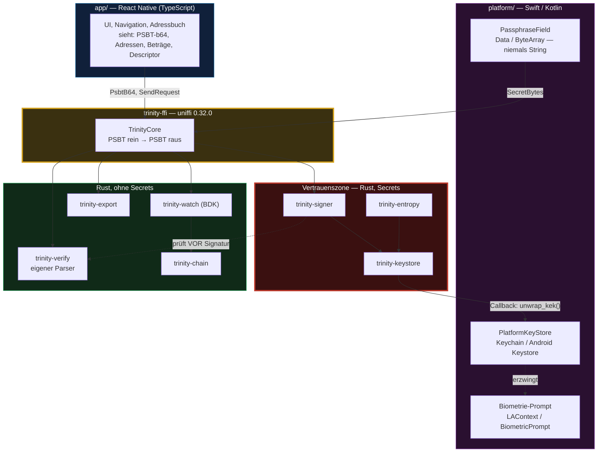
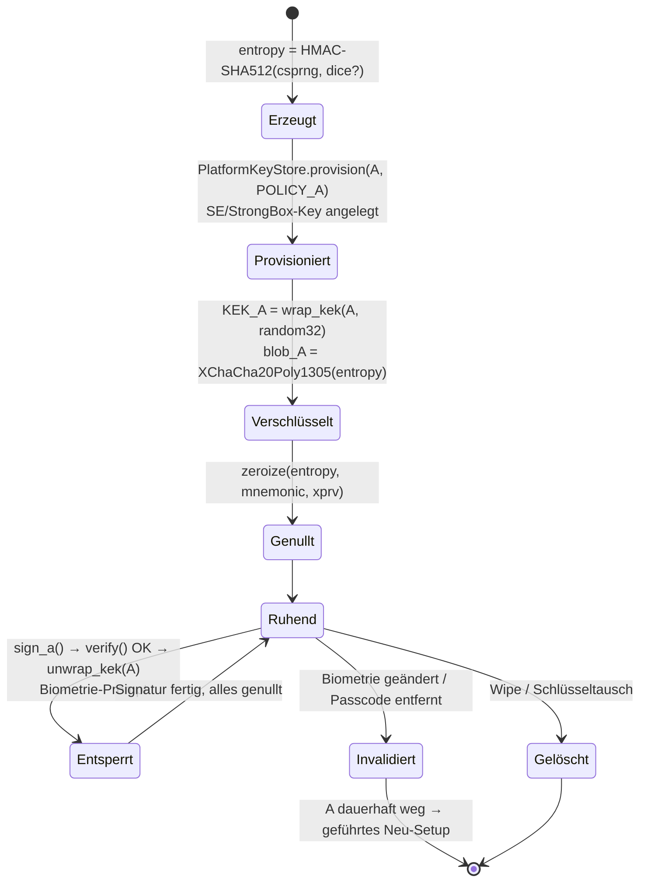
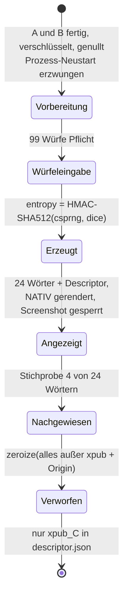
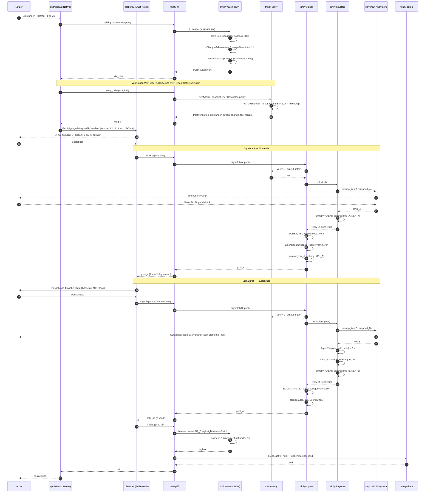
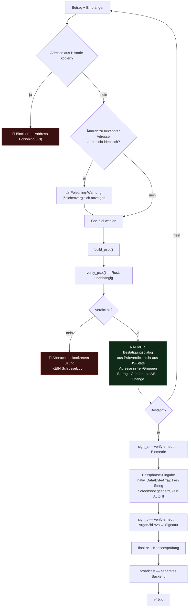
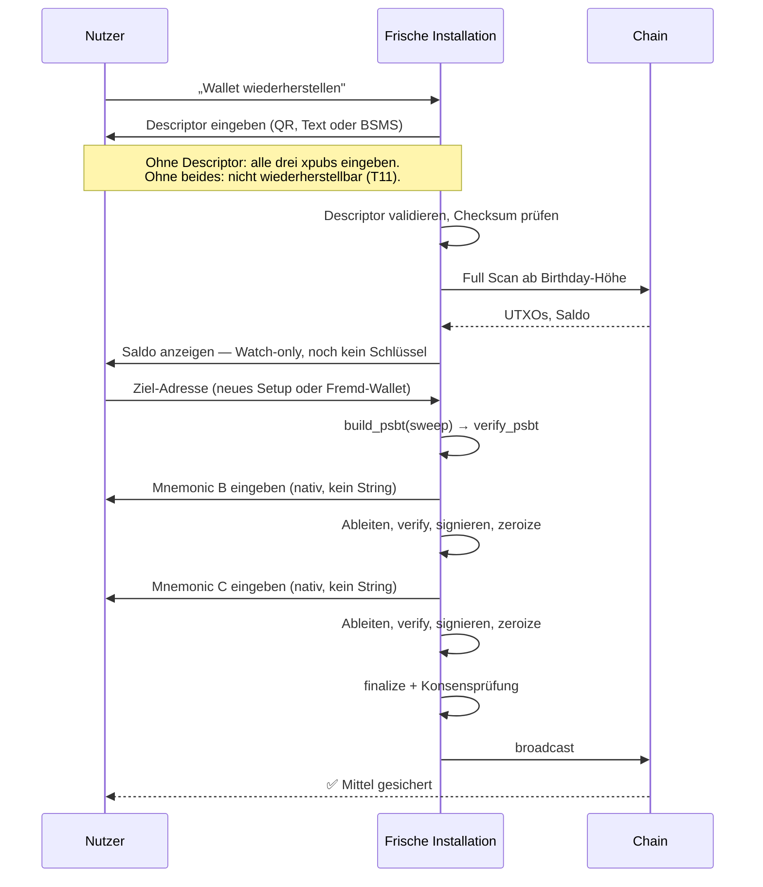
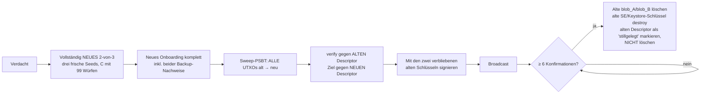
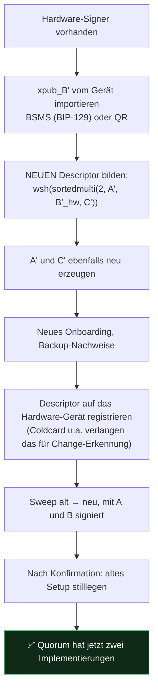

# BTC Trinity — Technische Spezifikation

**Bitcoin-only 2-von-3 Multisig-Wallet, drei gleichberechtigte Schlüssel, kein Zustand, keine Dienste.**

| | |
|---|---|
| Dokumentversion | 1.0-draft |
| Recherchestand | 2026-08-08 |
| Status | Spezifikation zur Review — **keine Freigabe zur Implementierung, bevor Abschnitt 7 entschieden ist** |
| Gestrichen (nicht in Scope) | Timelock-Recovery, Watchtower, Betriebsmodi, Miniscript-Policies jenseits `sortedmulti`, Monetarisierung |

---

## 0. Executive Summary

### Die Architektur in fünf Sätzen

1. Ein Rust-Kern (rust-bitcoin / BDK, über uniffi eingebunden) hält **alles Geheime**; die Schnittstelle zur UI-Schicht ist ausschließlich **PSBT rein → PSBT raus**, und weder Seed noch xpriv noch Passphrase überqueren jemals die JS-Bridge.
2. Die Wallet ist ein `wsh(sortedmulti(2, A, B, C))` über **drei unabhängig erzeugte Master-Seeds** auf BIP-48-Pfaden (`m/48'/0'/0'/2'`), von denen A und B als hardware-gebundene, verschlüsselte Blobs auf dem Telefon liegen (A: biometrischer Zugriff, B: Argon2id-Passphrase ⊕ Hardware-Key) und C als Papier-/Stahl-Backup offline bleibt.
3. Der Code ist in einen **Watch-only-Kern ohne jeden Schlüsselzugriff** (Descriptor, Adressen, UTXOs, PSBT-Bau, Chain-Anbindung) und ein **Signing-Modul** getrennt — der Großteil der App ist damit ohne Schlüsselmaterial testbar und der Sparrow-/Core-Export fällt als Nebenprodukt an.
4. Vor jeder Signatur prüft ein **vom Builder unabhängiges `verify`-Modul** das PSBT gegen den gespeicherten Descriptor neu — Change-Zugehörigkeit, Ableitungspfade, Gebührenplausibilität — weil die gefälschte Change-Adresse der eine reale Angriffsvektor ist, der nach allen anderen Maßnahmen übrig bleibt.
5. Korrektheit wird nicht durch eigene Assertions behauptet, sondern durch **Differential Testing gegen Bitcoin Core 30.2** (`deriveaddresses`, `walletprocesspsbt`) und einen **Signet-Recovery-Durchlauf in CI** belegt.

### Die drei größten Risiken

| # | Risiko | Warum es das größte ist | Was die Architektur dagegen tut | Restrisiko |
|---|---|---|---|---|
| **R1** | **Kompromittiertes Telefon** | A und B liegen auf demselben Gerät. Wer Code im App-Kontext ausführt und Biometrie sowie Passphrase-Eingabe abfangen kann, hat das Quorum. Kein Multisig-Schema repariert das. | Rust-Kern statt JS-Heap (kein Seed in Crash-Dumps), Passphrase nie als String, `zeroize`, hardware-gebundene KEKs, Verifier vor Signatur. | **Nicht abgedeckt.** Ein Angreifer mit Codeausführung im Prozess *zur Zeit einer Signatur* gewinnt. Einzige echte Gegenmaßnahme: B auf externe Hardware verlagern (Abschnitt 6.6). |
| **R2** | **Eine Implementierung für zwei Schlüssel** | A und B teilen RNG, Bibliothek, Build und Update-Kanal. Ein RNG-Bug oder ein Supply-Chain-Angriff trifft beide gleichzeitig — das Quorum hat faktisch **eine** Implementierung, nicht zwei. Der Coldcard-Vorfall vom Juli 2026 (Abschnitt 2.1) ist der Beleg, dass genau das passiert. | Nachweisbare Entropie (extern nachrechenbar), Würfel-Option, C zwingend außerhalb der A/B-Session erzeugt, reproducible builds, `cargo vendor`, gepinnte Deps, PSBT-Pfad zu Fremd-Hardware ab v1. | **Teilweise.** C ist die einzige echte Implementierungsdiversität — und C allein kann nichts. Bis B auf Fremd-Hardware liegt, bleibt das Quorum implementierungsseitig 1-von-1. |
| **R3** | **Descriptor-Verlust / falsche Backup-Verteilung** | Der häufigste Multisig-Totalverlust ist nicht der verlorene Schlüssel, sondern der verlorene Descriptor. Der zweithäufigste ist Backup-B und C in derselben Schublade — dann ist ein Einbruch ein Totalverlust ohne jede Kryptografie. | Descriptor als Pflichtbestandteil jedes Backup-Ausdrucks, erzwungener Backup-Nachweis im Onboarding, explizite Ortstrennungs-Abfrage, BSMS-Export (BIP-129), dokumentierte Recovery ohne diese App. | **Verhalten des Nutzers.** Die App kann die räumliche Trennung weder prüfen noch erzwingen. Nur UX-Verankerung und Wiederholung. |

### Entscheidungen, die vor der ersten Zeile Code stehen müssen

Diese sechs sind nachträglich nicht oder nur unter Neuaufbau korrigierbar. Details und Empfehlungen in **Abschnitt 7**.

| # | Entscheidung | Warum jetzt | Empfehlung |
|---|---|---|---|
| **E1** | Lage der FFI-Vertrauensgrenze: nur `PSBT ⟶ PSBT` + Callback-Interface für KEK-Unwrapping | Wird die Grenze später gezogen, sind Seeds längst durch JS-Heaps gewandert. Praktisch nicht nachrüstbar. | **Verbindlich festschreiben** (Abschnitt 1.3), CI-Lint gegen verbotene FFI-Typen. |
| **E2** | Verifier baut auf eigenem, minimalem Descriptor-Parser statt auf `miniscript` | Wenn der Verifier dieselbe Bibliothek nutzt wie der Builder, bestätigt sich ein Bug selbst. Später umzubauen heißt: den Verifier neu schreiben. | Eigener ~250-Zeilen-Parser für genau die Grammatik `wsh(sortedmulti(2,…))`, eigene BIP-32-Ableitung; geteilt bleiben nur secp256k1 und Hashes (Abschnitt 1.5). |
| **E3** | Entropie-Konstruktion und Anzeigbarkeit der Roh-Entropie | Ein Seed, der unter falscher Konstruktion entstanden ist, wird durch kein Update repariert (Coldcard 2026). Das Format muss ab dem allerersten erzeugten Seed stehen. | `entropy = HMAC-SHA512(key = OS_CSPRNG(32), msg = würfel_bytes)[0..32]`, Roh-Entropie anzeigbar, BIP-39-Ableitung extern nachrechenbar, Würfel **Pflicht für C** (Abschnitt 2.2). |
| **E3b** | Wortlänge: 24 Wörter (256 bit) vs. 12 (128 bit) | Bestimmt Backup-Format, Stahlplatten-Kauf, Onboarding-UX und Stichproben-Design. | **24 Wörter** für alle drei Schlüssel. Konsistenz > Bequemlichkeit; 256 bit passt zur `HMAC-SHA512[0..32]`-Konstruktion ohne Kürzung. |
| **E4** | Argon2id-Parameter und deren Speicherung im Blob-Header | Ein späterer Parameterwechsel erzwingt Re-Encryption aller Blobs und einen Migrationspfad. | `m = 262144 KiB (256 MiB), t = 3, p = 4`, Fallback-Profil `m = 65536 KiB, t = 6, p = 4` auf Geräten < 4 GB RAM; Profil-ID **im Blob-Header** (Abschnitt 2.4). |
| **E5** | B ist ab v1 ein austauschbarer Signer hinter derselben PSBT-Schnittstelle | Wenn `sign_with_b` intern an den lokalen Keystore gekoppelt wird, ist der Wechsel auf Fremd-Hardware eine Architekturänderung statt eines Drop-in. | `trait Signer { fn sign(&self, psbt: Psbt) -> Result<Psbt>; }` mit `LocalSigner` und `ExternalSigner` ab Tag 1; der `ExternalSigner`-Pfad muss in v1 real getestet sein, auch wenn kein Gerät ausgeliefert wird (Abschnitt 6.6). |

> **Zwei Annahmen, die dieses Dokument durchzieht und die vor Implementierungsbeginn bestätigt werden müssen:**
> **(A1)** Zielplattformen sind iOS ≥ 16 und Android ≥ 10 (API 29). Darunter fehlen `kSecAccessControlBiometryCurrentSet`-Semantiken bzw. `setUnlockedDeviceRequired` in verlässlicher Form.
> **(A2)** Die UI-Schicht ist React Native. Wäre sie nativ (SwiftUI/Compose), entfiele Anforderung 1 nicht — sie würde nur billiger.

---

## 0.1 Geltungsbereich, Nicht-Ziele, ehrliche Grenzen

### In Scope
Erzeugung und Verwahrung dreier Schlüssel; Watch-only-Betrieb; PSBT-Bau, -Verifikation, -Signatur, -Finalisierung, -Broadcast; Backup und Recovery; Schlüsseltausch; Teststrategie; UX-Flows.

### Nicht-Ziele
Timelocks, Zeitschlösser, Erbschaftsregelungen, Watchtower, Serverdienste, Gebührenmodelle, Betriebsmodi, Multi-Account-Verwaltung, Coinjoin, Lightning, Altcoins, Fiat-Anbindung.

### Ehrliche Grenzen — explizit und unverhandelbar zu kommunizieren

| Grenze | Konsequenz |
|---|---|
| **Zwei von drei Schlüsseln liegen auf einem Gerät.** | Ein kompromittiertes Telefon ist **kein** abgedeckter Fall. Das Modell schützt gegen Geräteverlust, Diebstahl, Backup-Verlust und Einzelschlüssel-Leak — nicht gegen Codeausführung im App-Kontext. |
| **A liegt nicht in der Secure Enclave.** | Die SE beherrscht ausschließlich NIST-P-256; Bitcoin braucht secp256k1. A ist ein verschlüsselter Blob, dessen Schlüsselverschlüsselungsschlüssel (KEK) hardware-gebunden ist. **Biometrie ist eine Zugriffsschranke, kein kryptografischer Faktor** — sie geht nicht in Schlüsselmaterial ein. |
| **A und B stammen aus derselben Codebasis.** | Gleicher RNG, gleiche Bibliothek, gleicher Update-Kanal. Ein Implementierungsfehler trifft beide gleichzeitig. Das Quorum hat faktisch eine Implementierung. Der PSBT-Pfad zu Fremd-Hardware ist die Antwort darauf und muss ab v1 existieren, nicht ab v2. |
| **Die Passphrase schützt nur die Gerätekopie von B.** | Das externe Backup von B ist die BIP-39-Wortliste auf Papier — sie ist **nicht** passphrasegeschützt. Wer Backup-B und C findet, braucht keine Passphrase. Deshalb trägt die räumliche Trennung (Randbedingung 3) das gesamte Modell. Nutzer, die glauben, ihre Passphrase schütze das Papier-Backup, sind falsch informiert; das ist im Onboarding zu adressieren. |
| **`sortedmulti` verbirgt nicht, welcher Schlüssel signiert hat.** | Die Witness zeigt öffentlich, welche zwei der drei Pubkeys signiert haben. Kein Datenschutzproblem für Fremde ohne Descriptor, aber gegenüber jemandem mit dem Descriptor (z.B. dem Watch-only-Server) ist das Signaturmuster sichtbar. |
| **Watch-only-Backends sehen etwas.** | Siehe Privacy-Tabelle in Abschnitt 1.6. Kein Backend ist ohne Leak; die Größenordnungen unterscheiden sich um Faktoren, nicht um Grade. |

---

## 0.2 Recherchestand: verifizierte Versionen und Belege

Alle Versionsstände unten wurden am **2026-08-08** direkt gegen `crates.io/api/v1` abgefragt, nicht aus dem Gedächtnis geschrieben. Auflösung der Abhängigkeitsbäume ebenfalls über die Registry-API.

### Der real auflösende Rust-Stack

> **Wichtiger Befund — „neueste Version" ist hier die falsche Regel.** `bdk_wallet 3.1.0` deklariert `miniscript ^12.3.5` und `bitcoin ^0.32.8`. Die neuesten Registry-Versionen sind `miniscript 13.1.0` und `secp256k1 0.31.1` — beide sind **nicht** im BDK-Baum. Wer `secp256k1 = "0.31"` oder `miniscript = "13"` direkt in die `Cargo.toml` schreibt, bekommt zwei parallel gelinkte Kopien von libsecp256k1 und inkompatible Typen an den Modulgrenzen. Die Pins unten sind die tatsächlich koexistierenden Versionen.

| Crate | Pin | Registry-Stand | Rolle |
|---|---|---|---|
| `bdk_wallet` | `=3.1.0` | 3.1.0 (2026-06-14) | Watch-only-Kern, TxBuilder, Descriptor-Wallet |
| `bdk_chain` | `=0.23.3` | 0.23.3 (2026-03-26) | Chain-Datenstrukturen |
| `bdk_core` | `=0.6.3` | 0.6.3 (2026-03-26) | Kernprimitive |
| `bitcoin` | `=0.32.11` | 0.32.11 (2026-07-22) | rust-bitcoin; `0.33.0-beta` **nicht** verwenden |
| `miniscript` | `=12.3.7` | 12.3.7 (2026-05-27) | **nicht 13.1.0** — BDK 3.1.0 fordert `^12.3.5` |
| `secp256k1` | *transitiv* `0.29.1` | 0.29.1 (2024-09-06) | via `bitcoin 0.32` (`^0.29.0`); **nicht direkt deklarieren** |
| `bip39` | `=2.2.2` | 2.2.2 (2025-12-04) | Mnemonic; über BDK-Feature `keys-bip39` |
| `zeroize` | `=1.9.0` | 1.9.0 (2026-06-12) | Secret-Löschung, `ZeroizeOnDrop` |
| `argon2` | `=0.5.3` | 0.5.3 stabil; `0.6.0-rc.8` (2026-03-22) | KDF für B. **RC nicht in den Signaturpfad.** |
| `getrandom` | `=0.4.3` | 0.4.3 (2026-06-17) | OS-CSPRNG-Zugriff |
| `uniffi` | `=0.32.0` | 0.32.0 (2026-06-30) | FFI-Generierung Swift/Kotlin |
| `bdk_electrum` | `=0.24.0` | 0.24.0 (2026-05-08) | → `electrum-client 0.25.0` |
| `bdk_bitcoind_rpc` | `=0.22.0` | 0.22.0 (2025-09-12) | → `bitcoincore-rpc 0.19.0` |
| `bdk_kyoto` | `=0.17.0` | 0.17.0 (2026-05-12) | → `bip157 0.6.3` (2026-07-21), BIP-157/158 |

**Kompatibilitätsprüfung:** `bdk_electrum 0.24.0` fordert `bdk_core ^0.6.1`, `bdk_bitcoind_rpc 0.22.0` fordert `bdk_core ^0.6.1` und `bitcoin ^0.32.0`, `bdk_kyoto 0.17.0` fordert `bdk_wallet ^3`. Alle drei koexistieren mit dem obigen Pinning. ✔

### Externe Referenzen und Vorfälle

| Sachverhalt | Stand | Quelle / Belegqualität |
|---|---|---|
| **Coldcard-Entropie-Vorfall** | Advisory 2026-07-30, erweitert 2026-08-01. Mk2/Mk3 Firmware 4.0.0/4.0.1–4.1.9; Mk4/Mk5 vor 5.6.0; Q vor 1.5.0Q; Edge 6.6.0X / 6.6.0QX. Effektive Entropie ≈ 72 bit (Mk4/Mk5/Q), ≈ 40 bit (Mk3) statt 128 bit. Ein Angreifer räumte ≈ 594 BTC (≈ 38 Mio USD) aus ≈ 500 Single-Sig-Wallets in ≈ 25 Minuten. Firmware-Update repariert **keinen** bereits erzeugten Seed. Seeds mit ≥ 50 privaten Würfelwürfen blieben geschützt. | ⚠️ **Sekundärquellen.** `blog.coinkite.com` ist aus der Recherche-Umgebung per Egress-Proxy blockiert; die Primäradvisory (`/coldcard-mk3-seed-generation-warning/`, `/entropy-technical-backgrounder/`) konnte **nicht direkt gelesen** werden. Versionsnummern vor Verwendung im Nutzertext gegen die Primärquelle verifizieren. |
| **Bitcoin Core Referenzversion** | **30.2** verwenden. 30.0 und 30.1 hatten einen Wallet-Migrations-Bug, der beim Migrieren einer unbenannten Legacy-BDB-Wallet in einem Custom-Wallet-Verzeichnis bei aktiviertem Pruning **alle** Wallet-Dateien des Knotens löschen konnte; Binaries wurden am 2026-01-05 von bitcoincore.org zurückgezogen. | bitcoincore.org Advisory 2026-01-05; Release-Notes 30.2 |
| **Argon2id-Parameter** | RFC 9106 Option 1: `m=2 GiB, t=1, p=4`. Option 2 (speicherbeschränkt): `m=64 MiB, t=3, p=4`. OWASP-Minimum: `m=19 MiB, t=2, p=1`. | RFC 9106; OWASP Password Storage Cheat Sheet |
| **iOS Keychain** | `kSecAttrAccessibleWhenPasscodeSetThisDeviceOnly`: nur bei gesetztem Passcode, **nie** in iCloud- oder lokalem Backup; Entfernen des Passcodes **löscht** die Items. `kSecAccessControlBiometryCurrentSet`: bindet an den aktuellen Biometrie-Enrollment-Satz; Neuregistrierung invalidiert. | Apple Developer Documentation |
| **Android Keystore** | `setIsStrongBoxBacked(true)` (dedizierter Sicherheitschip, z.B. Titan M2); `setInvalidatedByBiometricEnrollment(true)` invalidiert bei Änderung der Biometrie-Registrierung; `setUnlockedDeviceRequired(true)` verbietet Nutzung bei gesperrtem Gerät. | Android Developers / AOSP Keystore Features |
| **Descriptor-Interop** | Sparrow übersetzt `wsh(multi(...))` beim Import nach `wsh(sortedmulti(...))`; BIP-48-Unterstützung impliziert BIP-67-Sortierung. BSMS (BIP-129) seit Sparrow v1.7.3; Coldcard als Signer und Coordinator. | bips.dev/129, Sparrow-Release-Notes, Coldcard-Doku |
| **bdk-ffi** | 3.0.0 (Juni 2026): produktionsreife Bindings für Kotlin/JVM, Swift, Python. React-Native- und Dart-Bindings 2026 in Integrationstests. | ⚠️ Sekundärquelle (Blogaggregation); `github.com/bitcoindevkit/bdk-ffi` war in dieser Session nicht abrufbar. |
| **Address Poisoning 2026** | Industrialisiert: Bots erzeugen Lookalike-Adressen mit identischen Anfangs- und Endzeichen und platzieren Dust in der Historie des Opfers. Ein einzelner Angreifer-Contract erreichte ≈ 3 Mio Dust-Transfers an > 1 Mio Adressen für ≈ 5.175 USD. Fortgeschrittene Varianten beobachten den Mempool auf Test-Transaktionen und vergiften unmittelbar danach. | Chainalysis, Blockaid, Branchenberichte 2026 |

### Bekannte Lücken dieser Recherche

Ehrlich benannt statt gefüllt:

1. **`docs.rs` war per Egress-Proxy blockiert.** Konkrete Methodensignaturen von `bdk_wallet::Wallet` und `TxBuilder` in 3.1.0 (Coin-Selection-Enum, `finish()`, `sign_with_signers`, `reveal_next_address`, Persistenz-API) sind in diesem Dokument **absichtlich nicht erfunden**. Sie sind mit `⟨API-VERIFY⟩` markiert und müssen in der ersten Implementierungswoche gegen die Doku fixiert werden.
2. **Coldcard-Primäradvisory nicht direkt gelesen** (siehe oben). Für Marketing- oder Nutzertexte ungeeignet, bis verifiziert.
3. **Kyotos Peer-Auswahl beim Blockdownload** — ob ein Match-Block von einem *anderen* Peer als der Filter-Peer geladen wird, konnte nicht belegt werden. Das ist für die Privacy-Aussage in 1.6 relevant und **muss im Quellcode von `bip157 0.6.3` nachgelesen werden**, bevor CBF als „privater Default" beworben wird.
4. **`secp256k1 0.29.1` ist vom 2024-09-06** und damit deutlich älter als der übrige Stack. Ob es dafür relevante Advisories gibt, wurde nicht geprüft. `cargo audit` gegen den vollen Lockfile ist Teil des Definition-of-Done (Abschnitt 5.5), nicht dieses Dokuments.

---

## 1. Modulschnitt und Datenfluss

### 1.1 Repo-Struktur

```
btc-trinity/
├── Cargo.toml                     # Workspace, resolver = "2", [workspace.dependencies] mit '='-Pins
├── Cargo.lock                     # eingecheckt, verpflichtend
├── rust-toolchain.toml            # exakte Toolchain-Version, kein "stable"
├── vendor/                        # cargo vendor, eingecheckt; .cargo/config.toml zeigt hierauf
├── deny.toml                      # cargo-deny: Lizenzen, Advisories, Duplikate
│
├── crates/
│   ├── trinity-types/             # ⬜ Kerntypen: Descriptor-String, PsbtB64, Fingerprint,
│   │                              #    KeySlot{A,B,C}, Network. Keine I/O, keine Secrets.
│   ├── trinity-entropy/           # 🟥 Entropie-Erzeugung, Würfel, BIP-39-Ableitung
│   ├── trinity-keystore/          # 🟥 Blob-Format, AEAD, Argon2id, KEK-Handling, zeroize
│   ├── trinity-signer/            # 🟥 Signer-Trait, LocalSigner, ExternalSigner-Adapter
│   ├── trinity-verify/            # ⬜ UNABHÄNGIGER PSBT-Verifier. Darf `miniscript` NICHT nutzen.
│   ├── trinity-watch/             # ⬜ BDK-Wallet, Descriptor-Persistenz, TxBuilder, Adressen
│   ├── trinity-chain/             # ⬜ ChainBackend-Trait + Electrum / Core-RPC / CBF
│   ├── trinity-export/            # ⬜ Sparrow-JSON, BSMS (BIP-129), Core-`importdescriptors`,
│   │                              #    Backup-PDF/Druckansicht
│   └── trinity-ffi/               # 🟨 uniffi-Fassade. EINZIGER Crate mit #[uniffi::export].
│
├── platform/
│   ├── ios/TrinityPlatform/       # Swift: Keychain, SecAccessControl, LAContext,
│   │                              #    PassphraseField (kein String!), PlatformKeyStore-Impl
│   └── android/trinity-platform/  # Kotlin: KeyStore, BiometricPrompt, StrongBox,
│                                  #    PassphraseField (CharArray/ByteArray), PlatformKeyStore-Impl
│
├── app/                           # React Native / TypeScript. Sieht ausschließlich PSBTs,
│                                  #    Adressen, Beträge, Descriptor. Nie ein Secret.
│
├── tests/
│   ├── differential/              # gegen Bitcoin Core 30.2 (regtest)
│   ├── property/                  # proptest
│   ├── vectors/                   # eingefrorene Testvektoren, inkl. BIP-48/67-Fälle
│   └── signet-e2e/                # vollständiger Recovery-Durchlauf, läuft in CI
│
└── docs/
    ├── SPECIFICATION.md           # dieses Dokument
    └── RECOVERY.md                # Wiederherstellung ohne diese App (Sparrow, Bitcoin Core)
```

**Legende:** 🟥 sieht Schlüsselmaterial · 🟨 Vertrauensgrenze · ⬜ nie Schlüsselmaterial

### 1.2 Verantwortlichkeiten und Abhängigkeitsrichtung



**Regel:** Abhängigkeiten zeigen nie von `CLEAN` nach `SECRET`. `trinity-verify` hängt weder von `trinity-signer` noch von `trinity-keystore` noch von `miniscript` ab — durchgesetzt per `cargo-deny` `[bans]` und CI-Check.

### 1.3 Die Vertrauensgrenze — exakt (Entscheidung E1)

Der Crate `trinity-ffi` ist der **einzige** mit `#[uniffi::export]`. Alles, was diese Grenze überquert, steht hier vollständig:

#### Erlaubte Typen über die Grenze

| Typ | Richtung | Inhalt |
|---|---|---|
| `String` (PSBT base64) | ⇄ | PSBT nach BIP-174. Enthält xpubs und Ableitungspfade, **nie** privates Material. |
| `String` (Descriptor) | ⇄ | `wsh(sortedmulti(2,…))` mit Origin-Info und Checksum. |
| `String` (Adresse, txid, tx hex) | ⇄ | Öffentlich. |
| `u64` (Satoshi), `u32` (Höhe, Index) | ⇄ | Öffentlich. |
| `SecretBytes` | **nur ⟶ Rust** | UTF-8-Bytes der Passphrase bzw. Würfelwürfe. Custom uniffi-Typ, siehe unten. |
| `Arc<dyn PlatformKeyStore>` | Callback ⟵ Rust | Rust ruft die Plattform. Nicht umgekehrt. |
| Structs aus `trinity-types` | ⇄ | Reine Wertetypen ohne Secrets (`Balance`, `AddressInfo`, `PsbtVerdict`, `SendRequest`). |

#### Verbotene Typen über die Grenze — CI-erzwungen

`Mnemonic`, `Xpriv`, `SecretKey`, `[u8; 32]`-Entropie, `Seed`, jeder Typ aus `trinity-keystore` außer `KeySlot`, und **jeder `String`, der Geheimes tragen könnte**.

> **CI-Gate `ffi-boundary`:** Ein Skript parst alle `#[uniffi::export]`-Signaturen in `trinity-ffi` und vergleicht sie gegen eine eingecheckte Allowlist (`crates/trinity-ffi/ffi-allowlist.toml`). Jede neue oder geänderte Signatur bricht den Build, bis die Allowlist bewusst angepasst wird. Diese Grenze ist zu wichtig, um sie Code-Review zu überlassen.

#### `SecretBytes` — warum ein eigener Typ

```rust
// crates/trinity-types/src/secret.rs
#[derive(uniffi::Object)]
pub struct SecretBytes(zeroize::Zeroizing<Vec<u8>>);

#[uniffi::export]
impl SecretBytes {
    /// Nimmt Bytes von der Plattformschicht entgegen. NIEMALS aus JS aufrufen.
    #[uniffi::constructor]
    pub fn from_platform(bytes: Vec<u8>) -> Arc<Self> { /* … */ }
    /// Länge zur UI-Rückmeldung — der einzige lesende Zugriff über FFI.
    pub fn len(&self) -> u32 { /* … */ }
}
// Drop ⇒ zeroize
```

**Was dieser Typ leistet und was nicht — ehrlich:**

- ✔ Der Inhalt ist über FFI **nicht auslesbar**; nur `len()` ist exportiert.
- ✔ Auf der Rust-Seite wird beim Drop zuverlässig genullt.
- ⚠️ **uniffi kopiert `Vec<u8>` durch einen `RustBuffer`.** Diese Zwischenkopie muss explizit genullt werden, sonst ist die Passphrase noch im FFI-Puffer. Die Nullung ist im Konstruktor durchzuführen; **⟨API-VERIFY⟩** ob uniffi 0.32.0 hierfür einen Hook bietet oder ob der Puffer manuell über `RustBuffer::destroy` behandelt werden muss.
- ⚠️ **Die Plattform-Kopie muss die Plattform nullen.** Swift-`String` und Kotlin-`String` sind — wie JS-Strings — unveränderlich und nicht überschreibbar. **Die Passphrase darf auch in Swift und Kotlin nie als `String` existieren.**
  - iOS: `UITextField` mit eigenem `UIKeyInput`-Delegate, Zeichen direkt in ein `UnsafeMutableRawBufferPointer`; Löschung per `memset_s`. Kein `.text`-Zugriff, kein SwiftUI-`@State private var pass: String`.
  - Android: `EditText` mit `getText().getChars(...)` in ein `CharArray`, Umwandlung in `ByteArray`, danach `Arrays.fill(chars, '')` und `ByteArray.fill(0)`. Kein `.toString()`.
- ❌ **Nicht geleistet:** Schutz gegen Swapping, Speicher-Snapshots des Betriebssystems oder einen Debugger im Prozess. `mlock`/`memlock` ist auf iOS für Apps nicht verfügbar; auf Android nur eingeschränkt. **Diese Lücke bleibt offen und ist nicht schließbar.**

#### Die exportierte Fassade

```rust
// crates/trinity-ffi/src/lib.rs — vollständige exportierte Oberfläche

#[derive(uniffi::Object)]
pub struct TrinityCore { /* Wallet, Backend, Keystore-Handles */ }

#[uniffi::export]
impl TrinityCore {
    // ── Watch-only ─────────────────────────────────────────────────
    pub fn descriptor(&self) -> String;
    pub fn balance(&self) -> Balance;
    pub fn reveal_next_address(&self) -> AddressInfo;              // ⟨API-VERIFY⟩ BDK-3.1-Signatur
    pub fn list_transactions(&self) -> Vec<TxSummary>;
    pub fn sync(&self) -> Result<SyncReport, ChainError>;

    // ── PSBT-Bau ───────────────────────────────────────────────────
    pub fn build_psbt(&self, req: SendRequest) -> Result<String, TxError>;

    // ── Verifikation (unabhängig vom Builder) ──────────────────────
    pub fn verify_psbt(&self, psbt_b64: String) -> Result<PsbtVerdict, VerifyError>;

    // ── Signatur: PSBT rein → PSBT raus ────────────────────────────
    pub fn sign_a(&self, psbt_b64: String) -> Result<String, SignError>;
    pub fn sign_b(&self, psbt_b64: String, pass: Arc<SecretBytes>) -> Result<String, SignError>;

    // ── Abschluss ──────────────────────────────────────────────────
    pub fn finalize(&self, psbt_b64: String) -> Result<String, FinalizeError>;   // → tx hex
    pub fn broadcast(&self, tx_hex: String) -> Result<String, ChainError>;       // → txid

    // ── Onboarding / Export ────────────────────────────────────────
    pub fn begin_setup(&self, cfg: SetupConfig) -> Result<SetupHandle, SetupError>;
    pub fn quiz_challenge(&self, slot: KeySlot) -> Vec<u32>;        // Wortindizes, nicht Wörter
    pub fn quiz_answer(&self, slot: KeySlot, answers: Vec<String>) -> QuizResult;
    pub fn export_bsms(&self) -> String;
    pub fn export_sparrow(&self) -> String;
    pub fn export_core_importdescriptors(&self) -> String;
}

/// Rust ruft die Plattform — nicht umgekehrt. Kein JS im Pfad.
#[uniffi::export(with_foreign)]
pub trait PlatformKeyStore: Send + Sync {
    /// Entpackt den KEK. iOS: SE-ECIES-Unwrap. Android: Keystore-AES-GCM-Unwrap.
    /// Löst plattformseitig Biometrie (Slot A) bzw. Passcode (Slot B) aus.
    fn unwrap_kek(&self, slot: KeySlot, wrapped: Vec<u8>) -> Result<Vec<u8>, PlatformError>;
    fn wrap_kek(&self, slot: KeySlot, plain: Vec<u8>) -> Result<Vec<u8>, PlatformError>;
    fn provision(&self, slot: KeySlot, policy: SlotPolicy) -> Result<(), PlatformError>;
    fn destroy(&self, slot: KeySlot) -> Result<(), PlatformError>;
}
```

**Was über diese Grenze *nicht* geht und warum das die zentrale Aussage ist:** Es gibt keine exportierte Funktion, die einen Seed, ein Mnemonic oder einen xpriv zurückgibt. Auch nicht für „Backup anzeigen" — der Backup-Screen wird **nativ** gerendert (Abschnitt 6.1), aus Daten, die der Rust-Kern über einen Callback direkt in eine plattformseitige, nicht-`String`-Darstellung schreibt. Der JS-Heap sieht die Wörter nie.

### 1.4 Datenfluss: was liegt wo

| Datum | Ort | Verschlüsselt | Backup | JS sichtbar |
|---|---|---|---|---|
| Seed A (32 B Entropie) | `blob_A` im App-Sandbox-Dateisystem | ✔ XChaCha20-Poly1305 | **nein** (bewusst) | nein |
| Seed B (32 B Entropie) | `blob_B` im App-Sandbox-Dateisystem | ✔ XChaCha20-Poly1305 | Papier (Pflicht) | nein |
| Seed C | ausschließlich Papier/Stahl | — | Papier (Pflicht) | nein |
| KEK A | iOS: SE-gewrappt · Android: Keystore-gewrappt | ✔ hardwaregebunden | nein | nein |
| KEK B | HW-Anteil gewrappt + Argon2id-Anteil (nicht gespeichert) | ✔ | nein | nein |
| xpubs A/B/C + Origin | `descriptor.json`, Klartext | nein | Papier + Cloud erlaubt | **ja** |
| Descriptor | `descriptor.json`, Klartext | nein | **Papier, Pflicht** | **ja** |
| UTXO-Set, Adressindex, Tx-Historie | SQLite (`bdk_chain` rusqlite) | nein | optional | ja |
| PSBTs | flüchtig | nein | — | **ja** |

> **Warum blob_A bewusst kein Backup hat:** A ist der Schlüssel, dessen Verlust das System aushalten *muss* (Geräteverlust → B + C). Ein Backup von A würde die Anzahl der Orte erhöhen, an denen Schlüsselmaterial existiert, ohne die Sicherheitsaussage zu verbessern. Das ist eine bewusste Entscheidung, kein Versäumnis — und im Onboarding so zu erklären.

> **Privacy-Hinweis zum JS-Heap:** PSBTs und der Descriptor enthalten xpubs. Ein Angreifer mit JS-Zugriff kennt damit alle Adressen der Wallet, vergangene wie künftige — aber kann nichts ausgeben. Da der Descriptor ohnehin in der Watch-only-DB liegt, ist das **kein** zusätzlicher Leak durch die JS-Schicht. Erwähnt, damit es niemand für eine Lücke hält.

### 1.5 `trinity-verify` — Unabhängigkeit vom Builder (Entscheidung E2)

**Das Problem:** Wenn `miniscript` den Descriptor sowohl beim Bauen als auch beim Prüfen parst, bestätigt ein Parser-Bug sich selbst. Der Verifier wäre eine Tautologie.

**Die Lösung — und ihre exakte Reichweite:**

`trinity-verify` implementiert einen **eigenen, minimalen Parser** für genau eine Grammatik:

```
descriptor := "wsh(" sortedmulti ")" "#" checksum
sortedmulti := "sortedmulti(" k "," keyexpr ("," keyexpr){2} ")"
keyexpr := "[" fingerprint "/" origin_path "]" xpub "/" derivation
```

Alles andere ist ein **harter Fehler**, kein Fallback. Der Parser akzeptiert weder `multi`, noch `sh(wsh(…))`, noch `tr(…)`, noch andere k/n. Der Wertebereich ist so klein, dass ~250 Zeilen genügen und vollständige Testabdeckung realistisch ist.

Der Verifier leitet **selbst** ab:

```rust
// crates/trinity-verify/src/lib.rs — keine miniscript-Abhängigkeit
pub fn verify(psbt: &Psbt, descriptor: &str, policy: &VerifyPolicy) -> Result<PsbtVerdict, VerifyError> {
    let d = parse_trinity_descriptor(descriptor)?;   // eigener Parser
    // eigene BIP-32-CKDpub, eigene BIP-67-Sortierung, eigener witnessScript-Bau
    // ...
}
```

**Prüfliste — jeder Punkt ist eine harte Ablehnung, kein Warnhinweis:**

| # | Prüfung | Wogegen |
|---|---|---|
| V1 | Descriptor-Checksum (BIP-380) valide | Übertragungsfehler, manipulierter Descriptor-String |
| V2 | Jeder Input-`witness_utxo.script_pubkey` ist `OP_0 <sha256(witnessScript)>` und der witnessScript ist unabhängig aus dem Descriptor rekonstruiert | Fremde Inputs, falsches Skript |
| V3 | Für **jeden** Output: entweder in `policy.declared_recipients` **oder** eine aus dem Descriptor unabhängig abgeleitete Change-Adresse im aktuellen Gap-Fenster | **Gefälschte Change-Adresse** — der zentrale Angriff |
| V4 | Für jede Change-Ableitung: `bip32_derivation` enthält alle drei Fingerprints, Pfade sind `m/48'/0'/0'/2'/1/i`, und die daraus abgeleiteten Pubkeys ergeben nach BIP-67-Sortierung genau den witnessScript des Outputs | Manipulierte Ableitungspfade, untergeschobene Keys |
| V5 | `fee = Σ inputs − Σ outputs`, `fee > 0`, `fee ≤ policy.max_absolute_fee` **und** `feerate ≤ policy.max_feerate` | Fee-Sniping-Angriff, „Gebühr frisst Wallet" |
| V6 | Summe an Nicht-Change-Outputs == vom Nutzer bestätigter Betrag, bitgenau | Betragsmanipulation zwischen Bestätigung und Signatur |
| V7 | Keine Inputs, die nicht in der Watch-only-UTXO-Liste stehen | Untergeschobene Fremd-Inputs |
| V8 | `PSBT_GLOBAL_UNSIGNED_TX` ist konsistent zu allen Input/Output-Maps; keine unbekannten Proprietary-Felder | PSBT-Feld-Verwirrung |
| V9 | Alle Inputs haben `witness_utxo`; kein `non_witness_utxo`-only | Fee-Manipulation über fehlende Betragsinformation |
| V10 | Nach Signatur: die eigene Signatur ist **low-s** und deterministisch reproduzierbar | Nonce-Fehler (siehe 3.4) |

**Wo die Unabhängigkeit endet — explizit:**

| Schicht | Builder | Verifier | Unabhängig? |
|---|---|---|---|
| Descriptor-Parsing | `miniscript 12.3.7` | eigener Parser | ✔ **ja** |
| BIP-32-Ableitung | `bitcoin::bip32` | eigene CKDpub-Implementierung | ✔ **ja** |
| BIP-67-Sortierung | `miniscript` | eigene Sortierung | ✔ **ja** |
| Skript-Konstruktion | `miniscript` | eigener Builder | ✔ **ja** |
| PSBT-Deserialisierung | `bitcoin::psbt` | `bitcoin::psbt` | ❌ geteilt |
| SHA-256 / RIPEMD-160 | `bitcoin_hashes` | `bitcoin_hashes` | ❌ geteilt |
| EC-Punktarithmetik | `secp256k1 0.29.1` | `secp256k1 0.29.1` | ❌ geteilt |

Die geteilte Kryptografie **nicht** zu teilen hieße, secp256k1 oder SHA-256 selbst zu schreiben. Das ist verboten (Randbedingung: keine eigene Kryptografie) und wäre schlechter. Die dritte Meinung für diese Schicht kommt aus dem Differential Testing gegen Bitcoin Core (Abschnitt 5.1) — offline, in CI, nicht zur Laufzeit.

**Wo der Verifier läuft:** In `sign_a` und `sign_b`, **vor** jedem Zugriff auf Schlüsselmaterial. Zusätzlich exportiert über `verify_psbt`, damit die UI vor der Bestätigung anzeigen kann, was signiert würde. Ein Fehlschlag in `sign_*` bricht ab, bevor der KEK überhaupt angefordert wird — die Biometrie-Abfrage erscheint gar nicht erst.

### 1.6 `trinity-chain` — austauschbare Anbindung

```rust
// crates/trinity-chain/src/lib.rs
pub trait ChainBackend: Send + Sync {
    fn full_scan(&self, req: FullScanRequest) -> Result<Update, ChainError>;   // ⟨API-VERIFY⟩
    fn sync(&self, req: SyncRequest) -> Result<Update, ChainError>;            // ⟨API-VERIFY⟩
    fn broadcast(&self, tx: &Transaction) -> Result<Txid, ChainError>;
    fn fee_estimates(&self) -> Result<FeeEstimates, ChainError>;
    fn tip_height(&self) -> Result<u32, ChainError>;
    fn privacy_profile(&self) -> PrivacyProfile;    // für die UI-Anzeige, s.u.
}
```

| Impl | Crates | Konfiguration |
|---|---|---|
| `ElectrumBackend` | `bdk_electrum 0.24.0` → `electrum-client 0.25.0` | Host, Port, TLS-Pin, optional SOCKS5 (Tor) |
| `CoreRpcBackend` | `bdk_bitcoind_rpc 0.22.0` → `bitcoincore-rpc 0.19.0` | RPC-URL, Cookie oder User/Pass; getestet gegen **Core 30.2** |
| `CbfBackend` | `bdk_kyoto 0.17.0` → `bip157 0.6.3` | Peer-Liste oder DNS-Seeds, optional feste Peers, optional Tor |

**Kein Default-Server des Herstellers.** Es gibt keinen von uns betriebenen Electrum- oder Esplora-Endpunkt. Der Default ist CBF; wer einen Server will, trägt ihn selbst ein.

#### Was ein Backend im Standardfall sieht — ehrlich

| Backend | Der Gegenüber lernt | Größenordnung |
|---|---|---|
| **Electrum, eigener Server** | Alle scriptPubKeys, den vollständigen Wallet-Graphen, jeden Saldo, jede Sync-Zeit, die IP. | Nur der eigene Hoster/VPS-Anbieter — bei Betrieb zu Hause: niemand außerhalb. |
| **Electrum, fremder Server** | Dasselbe, aber für einen Dritten. **Die Wallet ist gegenüber diesem Server vollständig deanonymisiert.** | ⚠️ Muss in der UI unmissverständlich stehen, nicht in einer Hilfeseite. |
| **Bitcoin Core RPC, eigener Node** | Nichts über den Node hinaus. Der Node selbst leakt beim P2P-Verkehr keine Wallet-Information (kein Bloom-Filter). | Beste Option, wenn ein Node existiert. |
| **CBF (BIP-157/158)** | Peers lernen: eine IP lädt Header und Filter (verrät **nichts** über die Wallet) und lädt anschließend **bestimmte Blöcke vollständig** (verrät: „in diesem Block ist wahrscheinlich eine für mich relevante Transaktion"). Über viele Blöcke hinweg ist das ein statistischer Leak. | Deutlich besser als Electrum, **nicht** null. |
| **Broadcast** | Der Peer/Server, der die Transaktion zuerst sieht, kann sie mit der IP verknüpfen. | Getrennt zu behandeln, s.u. |

**Zwei daraus folgende Anforderungen:**

1. **Broadcast über einen anderen Weg als Sync.** Wer über Electrum synct und über denselben Server broadcastet, liefert die stärkste mögliche Verknüpfung. Der `broadcast`-Aufruf muss ein eigenes, unabhängig konfigurierbares Backend nutzen dürfen (Default: CBF-Peers oder Tor).
2. **Der CBF-Privacy-Anspruch ist zu belegen, bevor er behauptet wird.** Ob `bip157 0.6.3` Match-Blöcke von einem *anderen* Peer lädt als demjenigen, der die Filter lieferte, ist offen (Abschnitt 0.2, Lücke 3). Ohne diesen Nachweis darf die UI CBF nicht als „privat" labeln, sondern nur als „privater als ein fremder Electrum-Server".

### 1.7 Abhängigkeitsminimierung und Supply Chain (Anforderung 10)

| Maßnahme | Konkret |
|---|---|
| Exakte Pins | `=`-Versionen im `[workspace.dependencies]`, nicht `^`. `Cargo.lock` eingecheckt. |
| Vendoring | `cargo vendor` nach `vendor/`, eingecheckt, `.cargo/config.toml` mit `replace-with = "vendored-sources"`. Der Build zieht **nichts** aus dem Netz. |
| Toolchain-Pin | `rust-toolchain.toml` mit exakter Version + Komponenten-Hashes. Kein `stable`. |
| Reproducible Builds | Deterministische `--remap-path-prefix`, `SOURCE_DATE_EPOCH`, Build im Container mit gepinntem Digest. Verifikation durch mindestens zwei unabhängige Builder vor jedem Release. |
| Audit-Gates | `cargo-deny` (Advisories, Lizenzen, **Duplikat-Crates**, `[bans]` für `miniscript` in `trinity-verify`), `cargo-audit` gegen den gesamten Lockfile, `cargo-vet` für Review-Status der Deps. |
| Keine dynamischen Nachladewege | Keine OTA-Bundles, kein CodePush, kein Remote-Config, kein Feature-Flag-Dienst. Der JS-Bundle ist Teil des signierten App-Binaries. **Diese Regel ist bei React Native aktiv durchzusetzen — sie ist nicht der Default.** |
| Signaturpfad-Budget | Harte Obergrenze für die transitive Dependency-Zahl von `trinity-signer` + `trinity-keystore` + `trinity-verify`. Vorschlag: **≤ 40 Crates**, CI-geprüft, Überschreitung erfordert explizite Freigabe. |

> **Ehrlicher Hinweis zu React Native:** Die JS-Schicht bringt hunderte npm-Abhängigkeiten mit. Diese liegen zwar außerhalb des Signaturpfads (sie sehen nie ein Secret), aber sie können **anzeigen, was sie wollen** — insbesondere eine falsche Empfängeradresse. Der Verifier (1.5) und die native Bestätigungsanzeige (Abschnitt 6.2) sind die Antwort darauf. Die npm-Supply-Chain ist damit nicht harmlos, sondern auf „kann täuschen, kann nicht stehlen" reduziert.

---

## 2. Schlüssel-Lebenszyklus

### 2.1 Warum Entropie hier zuerst kommt

Der Coldcard-Vorfall vom Juli 2026 ist der Grund, warum dieser Abschnitt vor allem anderen steht. Eine Änderung im Firmware-Build ersetzte den Hardware-RNG durch einen vorhersagbaren Software-Ersatz; die effektive Entropie fiel von 128 auf ~72 bit (Mk4/Mk5/Q) bzw. ~40 bit (Mk3). Ein Angreifer räumte in etwa 25 Minuten rund 594 BTC aus etwa 500 Wallets. **Das Firmware-Update reparierte keinen einzigen bereits erzeugten Seed.**

Drei Lehren, die sich hier direkt in Anforderungen übersetzen:

1. Ein schwacher Seed ist **permanent**. Es gibt kein nachträgliches Reparieren, nur Migration.
2. Wer Würfel benutzt hatte, war geschützt. Nutzerseitige Entropie ist kein Ritual — sie war der Unterschied.
3. Der Fehler war **nicht** im Krypto-Algorithmus, sondern im Build. Reproducible Builds und ein extern nachrechenbarer Ableitungspfad sind deshalb Sicherheitsmaßnahmen, keine Hygiene.

### 2.2 Entropieerzeugung (Anforderung 3, Entscheidung E3)

```
raw_csprng  := getrandom(32)                              // OS-CSPRNG
dice_bytes  := kanonische Kodierung der Würfe (s.u.)      // ggf. leer
extract     := HMAC-SHA512(key = raw_csprng, msg = dice_bytes)
entropy     := extract[0..32]                             // 256 bit
mnemonic    := BIP-39(entropy)                            // 24 Wörter
seed        := PBKDF2-HMAC-SHA512(mnemonic, "mnemonic", 2048, 64)   // BIP-39, ohne Passphrase
xprv        := BIP-32-Master(seed)
```

**Warum diese Konstruktion sicher ist — die Kette, nicht die Behauptung:**

HMAC ist die Extract-Stufe von HKDF (RFC 5869) und ein etablierter Randomness-Extractor. Für die Kombination zweier Quellen ergibt sich:

| Fall | `raw_csprng` | `dice_bytes` | Entropie des Ergebnisses |
|---|---|---|---|
| Normalfall | 256 bit gut | leer oder bekannt | **256 bit** — HMAC mit unbekanntem Key ist ein PRF |
| CSPRNG gebrochen (Coldcard-Szenario) | 0 bit, Angreifer kennt den Key | 128+ bit geheim | **≥ 128 bit** — Angreifer muss die Würfe raten |
| Beides gebrochen | 0 bit | 0 bit | 0 bit — nicht reparierbar, aber auch nicht schlechter als jede Alternative |

Die Konstruktion ist damit ein **OR-Kombinierer**: sie ist so stark wie die *stärkere* der beiden Quellen. Genau das ist die Eigenschaft, die im Coldcard-Fall gefehlt hätte, wenn der Nutzer keine Würfel benutzt hätte.

**Kanonische Würfelkodierung** (muss extern nachrechenbar sein, deshalb exakt festgelegt):
`dice_bytes` = ASCII-Bytes der Würfe in Eingabereihenfolge, Ziffern `1`–`6`, ohne Trennzeichen, ohne abschließenden Zeilenumbruch. Beispiel: 5 Würfe 3,1,6,6,2 → `"31662"` → `0x33 0x31 0x36 0x36 0x32`. Bei leerer Würfelmenge ist `dice_bytes` die leere Bytefolge.

**Würfelanforderungen** (log₂ 6 ≈ 2,585 bit pro Wurf):

| Schlüssel | Würfel | Mindestwürfe | Erreichte Wurf-Entropie |
|---|---|---|---|
| **C** | **Pflicht** | **99** | ≈ 256 bit |
| A, B | optional, ab v1 angeboten | 50 (wenn genutzt) | ≈ 129 bit |

Begründung der Pflicht für C: C ist der einzige Schlüssel, der die Implementierungsdiversität herstellt (R2). Ein C aus derselben RNG-Quelle wie A und B trägt dazu nichts bei. 99 Würfe sind mühsam — das ist der Preis dafür, dass ein RNG-Bug nicht alle drei Schlüssel gleichzeitig entwertet.

**Nachweisbarkeit — was die App anzeigen und exportieren können muss:**

1. `raw_csprng` als 64 Hex-Zeichen, auf Wunsch anzeigbar
2. `dice_bytes` als eingegebene Ziffernfolge, anzeigbar
3. `entropy` als 64 Hex-Zeichen, anzeigbar
4. Die 24 BIP-39-Wörter
5. Ein **Verifikationsblatt** mit exakt der obigen Formelkette, sodass jeder mit `openssl dgst -sha512 -hmac` und einem BIP-39-Tool die Ableitung offline nachrechnen kann

Punkt 5 ist die eigentliche Anforderung. Ohne ihn ist „nachweisbare Entropie" ein Wort ohne Inhalt.

**C außerhalb der A/B-Session erzeugen** — konkret:
Die C-Erzeugung läuft in einem separaten Ablauf, der (a) erst startet, nachdem A und B erzeugt, verschlüsselt und aus dem Speicher genullt wurden, (b) einen expliziten Prozess-Neustart erzwingt (`exit(0)` und Kaltstart, nicht nur Screen-Wechsel), (c) den Flugmodus prüft und bei aktiver Netzwerkverbindung warnt, (d) keinen Schreibzugriff auf `blob_A`/`blob_B` hat. Nach Abschluss existiert von C **nur** der xpub in `descriptor.json`.

> **Offene Alternative (Abschnitt 7, O4):** C stattdessen auf einer Fremd-Hardware-Wallet erzeugen und nur den xpub importieren. Sicherheitstechnisch überlegen (echte Implementierungsdiversität statt nur Session-Trennung), aber es setzt Hardwarebesitz voraus.

### 2.3 Ableitung und Descriptor (Anforderung 6)

```
Pfad je Schlüssel:  m / 48' / 0' / 0' / 2'
                          │     │    │    └─ Skripttyp 2 = P2WSH (BIP-48)
                          │     │    └────── Account 0
                          │     └─────────── Coin 0 = Bitcoin Mainnet (Signet/Testnet: 1')
                          └───────────────── Purpose 48 (BIP-48, Multisig)

Descriptor (Receive):
wsh(sortedmulti(2,
  [fpA/48h/0h/0h/2h]xpubA/0/*,
  [fpB/48h/0h/0h/2h]xpubB/0/*,
  [fpC/48h/0h/0h/2h]xpubC/0/*))#checksum

Descriptor (Change):  identisch, /1/* statt /0/*
```

| Regel | Begründung |
|---|---|
| `sortedmulti`, nicht `multi` | BIP-67: Schlüssel werden lexikografisch nach der 33-Byte-komprimierten Pubkey sortiert. Die Reihenfolge der Schlüssel im Descriptor wird damit für die Adressableitung irrelevant — ein Recovery-Fehler weniger. Sparrow und Nunchuk sortieren ohnehin automatisch. |
| Origin-Info `[fingerprint/pfad]` **immer** | Ohne sie kann ein fremder Signer nicht wissen, welchen Ableitungspfad er nehmen soll. Ihr Fehlen ist eine der häufigsten Ursachen gescheiterter Multisig-Recovery. |
| Checksum (BIP-380) **immer** mit exportieren | Bitcoin Core verlangt sie bei `importdescriptors` und `deriveaddresses`. |
| Getrennte Receive-/Change-Descriptoren | Explizit statt BIP-389-Multipath. `bdk_wallet 2.1.0+` unterstützt Multipath, aber die Interop-Unterstützung bei anderen Wallets ist schwächer. Zwei Zeilen auf Papier sind billiger als ein gescheitertes Recovery. |
| Drei getrennte Master-Seeds | Randbedingung 1. Ein Seed mit drei Ableitungspfaden macht das Quorum wertlos: wer den Seed hat, hat alle drei Schlüssel. **CI-Test:** Setup wird abgelehnt, wenn zwei der drei Master-Fingerprints identisch sind (Abschnitt 5.2, P7). |
| Netzwerk-Trennung | Signet/Testnet nutzen Coin-Type `1'` und einen separaten Descriptor-Store. Kein gemeinsamer Zustand mit Mainnet. |

**Descriptor-Persistenz:** `descriptor.json` mit Klartext-Descriptor, allen drei xpubs mit Origin, `birthday_height` je Schlüssel, Netzwerk, Erstellungszeitstempel und einer Format-Version. Zusätzlich als **BSMS-Record (BIP-129)** exportierbar — der Standard, den Sparrow seit v1.7.3 und Coldcard als Signer und Coordinator unterstützen.

### 2.4 Schlüssel A und B: symmetrische Implementierung (Anforderung 2)

**Ein Codepfad, zwei Konfigurationen.** Der Unterschied zwischen A und B ist ausschließlich eine `SlotPolicy`:

```rust
// crates/trinity-keystore/src/policy.rs
pub struct SlotPolicy {
    pub slot: KeySlot,                    // A oder B
    pub unlock: UnlockFactor,             // Biometry | Passphrase
    pub hw_binding: HwBinding,            // SecureEnclaveEcies | KeystoreAesGcm
    pub argon: Option<ArgonProfile>,      // None für A, Some(..) für B
    pub invalidate_on_biometric_change: bool,
    pub require_device_unlocked: bool,
}

pub const POLICY_A: SlotPolicy = SlotPolicy {
    slot: KeySlot::A,
    unlock: UnlockFactor::Biometry,
    argon: None,
    invalidate_on_biometric_change: true,
    require_device_unlocked: true,
    /* … */
};

pub const POLICY_B: SlotPolicy = SlotPolicy {
    slot: KeySlot::B,
    unlock: UnlockFactor::Passphrase,
    argon: Some(ArgonProfile::HIGH),
    invalidate_on_biometric_change: false,   // B hängt nicht an Biometrie — Randbedingung 4
    require_device_unlocked: true,
    /* … */
};
```

#### Blob-Format (identisch für A und B)

```
┌─ Header (AAD, authentifiziert, unverschlüsselt) ──────────────────┐
│ magic       "TRIN"                        4 B                     │
│ version     u8 = 1                        1 B                     │
│ slot        u8 (0=A, 1=B)                 1 B                     │
│ kdf_profile u8 (0=none, 1=HIGH, 2=LOW)    1 B    ← Entscheidung E4 │
│ reserved    u8 = 0                        1 B                     │
│ argon_salt  16 B (nur wenn kdf_profile≠0)                         │
│ nonce       24 B (XChaCha20 random)                               │
│ birthday    u32 LE (Blockhöhe)            4 B                     │
├─ Ciphertext ──────────────────────────────────────────────────────┤
│ entropy     32 B                                                  │
│ created_at  u64 LE                         8 B                    │
├─ Tag ─────────────────────────────────────────────────────────────┤
│ Poly1305    16 B                                                  │
└───────────────────────────────────────────────────────────────────┘
```

- **AEAD:** XChaCha20-Poly1305. Gewählt gegen AES-256-GCM wegen des 192-bit-Nonce (zufällige Nonces ohne Kollisionsrisiko, kein Zählerzustand) und weil die Software-Implementierung auf Mobilgeräten ohne AES-NI nicht seitenkanalanfällig über Tabellen-Lookups ist.
- **Header als AAD:** Ein Angreifer kann `kdf_profile` nicht auf ein schwächeres Profil herunterdrehen — der Tag würde nicht verifizieren.
- **`kdf_profile` im Header:** Entscheidung E4. Ohne das Feld ist ein Parameterwechsel eine Migration mit Re-Encryption; mit ihm ist er ein neuer Enum-Wert.
- **Gespeichert wird `entropy` (32 B), nicht der Mnemonic-String.** Der Mnemonic wird bei Bedarf deterministisch neu erzeugt. Ein String weniger im Speicher.

#### KEK-Ableitung

```
Slot A:   KEK_A = unwrap_kek(A, wrapped_A)              // Plattform, biometriegeschützt
Slot B:   KEK_B = unwrap_kek(B, wrapped_B)              // Plattform, passcodegeschützt
                  XOR
                  Argon2id(pass, argon_salt, profile)   // 32 B Output
```

**Zur XOR-Kombination:** Zwei unabhängige 256-bit-Werte per XOR zu kombinieren ist als Schlüsselkombinierer korrekt — der Angreifer braucht **beide**. Das Konzept schreibt `⊕` vor, und so wird es implementiert. Der Vollständigkeit halber der benannte Trade-off: `HKDF-Extract(salt = argon_out, ikm = hw_key)` wäre bei gleichen Kosten geringfügig besser, weil es zusätzlich Domain-Separation und Bindung an einen Kontext-String liefert und gegen verwandte-Schlüssel-Effekte robuster ist. Sicherheitsrelevant ist der Unterschied hier **nicht**, weil beide Eingaben gleichverteilt und unabhängig sind. Aufgeführt in Abschnitt 7 (O5), nicht als Blocker.

#### Argon2id-Profile (Entscheidung E4)

| Profil | m (KiB) | t | p | Output | Zielgerät | Erwartete Dauer |
|---|---|---|---|---|---|---|
| `HIGH` (Default) | 262144 (**256 MiB**) | 3 | 4 | 32 B | ≥ 4 GB RAM | ~1,5–3 s |
| `LOW` (Fallback) | 65536 (**64 MiB**) | 6 | 4 | 32 B | < 4 GB RAM | ~1,5–3 s |

**Begründung — und wogegen das *nicht* schützt:**

- `LOW` ist exakt RFC 9106 Option 2 (`m=64 MiB, t=3, p=4`) mit verdoppeltem `t`, um den geringeren Speicher teilweise zu kompensieren. RFC 9106 Option 1 (`m=2 GiB`) ist auf iOS nicht praktikabel — eine 2-GiB-Allokation führt zuverlässig zu Jetsam-Termination.
- Beide Profile liegen **deutlich über** dem OWASP-Minimum (`m=19 MiB, t=2, p=1`), was angemessen ist: hier wird nicht ein Server-Login geschützt, sondern ein Bitcoin-Schlüssel gegen einen Angreifer mit physischem Gerätezugriff und unbegrenzter Zeit.
- **Ehrlich:** Argon2id verlangsamt Offline-Brute-Force um einen konstanten Faktor. Bei 256 MiB und ~2 s pro Versuch schafft ein Angreifer mit spezialisierter Hardware vielleicht 10³–10⁵ Versuche/Sekunde statt 10¹⁰. Das rettet eine **starke** Passphrase; eine schwache rettet es **nicht**. Die eigentliche Sicherheit liegt in der Passphrase-Entropie, nicht in der KDF. Deshalb:

#### Passphrase-Anforderungen (Randbedingung 4)

| Anforderung | Wert | Erzwungen? |
|---|---|---|
| Erzeugung | **Diceware**, in der App mit Würfeln oder CSPRNG, EFF-Long-Wordlist (7776 Wörter) | angeboten, empfohlen |
| Mindestlänge | **6 Diceware-Wörter** ≈ 77,5 bit | **hart erzwungen** |
| Empfohlen | 7 Wörter ≈ 90,5 bit | Default der Erzeugungshilfe |
| Bei Selbstwahl | Mindestens 6 Wörter **oder** eine gemessene Entropieschätzung ≥ 77 bit (zxcvbn-artig, konservativ), zusätzlich Abgleich gegen eine eingebettete Liste häufiger Passwörter | hart erzwungen |
| **Keine PIN** | Numerische Eingaben werden komplett abgelehnt | hart |
| **Nicht der Gerätepasscode** | Vergleich gegen den Gerätepasscode ist technisch unmöglich; stattdessen explizite Bestätigungsabfrage und Warnung im Onboarding | UX-Maßnahme, nicht erzwingbar — **ehrlich zu benennen** |
| **Nicht im Keychain** | Die Passphrase wird zu **keinem** Zeitpunkt persistiert. Kein „Merken"-Schalter, keine Autofill-Integration, `isSecureTextEntry`/`IMPORTANT_FOR_AUTOFILL_NO`, Screenshot-Sperre auf dem Eingabescreen | hart |
| **Kein Biometrie-Shortcut** | Es gibt keinen Codepfad, in dem Biometrie die Passphrase ersetzt. `POLICY_B.unlock` ist ein Enum ohne `Biometry`-Variante für Slot B | hart, typsystem-erzwungen |

> **Warum Randbedingung 4 typsystem-erzwungen wird:** „Es gibt keinen Biometrie-Shortcut" als Kommentar überlebt keine sechs Monate Produktentwicklung. Als Enum-Variante, die für Slot B schlicht nicht existiert, überlebt es.

#### Plattform-Flags — exakt

**iOS (≥ 16):**

```swift
// KEK-Wrapping-Schlüssel: P-256 in der Secure Enclave.
// Die SE kann kein secp256k1 — aber sie kann ECIES über P-256,
// und damit einen 32-Byte-KEK ent-/verpacken. Das ist der ganze Trick.
let access = SecAccessControlCreateWithFlags(
    nil,
    kSecAttrAccessibleWhenPasscodeSetThisDeviceOnly,   // nie in ein Backup, weg ohne Passcode
    [.privateKeyUsage, .biometryCurrentSet],           // Slot A: neue Biometrie ⇒ invalidiert
    &error)!

let attrs: [String: Any] = [
    kSecAttrKeyType as String:        kSecAttrKeyTypeECSECPrimeRandom,
    kSecAttrKeySizeInBits as String:  256,
    kSecAttrTokenID as String:        kSecAttrTokenIDSecureEnclave,
    kSecPrivateKeyAttrs as String: [
        kSecAttrIsPermanent as String:   true,
        kSecAttrApplicationTag as String: tag(for: slot),
        kSecAttrAccessControl as String:  access,
    ],
]
// Slot B: [.privateKeyUsage, .devicePasscode] statt .biometryCurrentSet
// → Randbedingung 4: kein Biometrie-Pfad zu B.
// Unwrap: SecKeyCreateDecryptedData(privKey, .eciesEncryptionCofactorX963SHA256AESGCM, wrapped)
```

| Flag | Wirkung | Warum hier |
|---|---|---|
| `kSecAttrAccessibleWhenPasscodeSetThisDeviceOnly` | Nicht in iCloud- **und nicht in lokalen** Backups; verlangt gesetzten Passcode; **wird gelöscht, wenn der Nutzer den Passcode entfernt** | Blob-Schlüssel wandert nie in ein Backup. Nebeneffekt: Passcode-Entfernung ⇒ A ist weg ⇒ Gerät ist ein „Verlustfall". Das ist gewollt und **muss im Onboarding stehen**. |
| `.biometryCurrentSet` (Slot A) | Bindet an den aktuellen Enrollment-Satz; Hinzufügen/Ändern eines Fingerabdrucks oder Gesichts invalidiert den Schlüssel | Ein Angreifer, der das entsperrte Gerät hat und sein eigenes Gesicht hinzufügt, bekommt **kein** A. |
| `.devicePasscode` (Slot B) | Nur Passcode, keine Biometrie | Randbedingung 4 auf Plattformebene. |

**Android (≥ 10 / API 29):**

```kotlin
val spec = KeyGenParameterSpec.Builder(alias(slot),
        KeyProperties.PURPOSE_ENCRYPT or KeyProperties.PURPOSE_DECRYPT)
    .setBlockModes(KeyProperties.BLOCK_MODE_GCM)
    .setEncryptionPaddings(KeyProperties.ENCRYPTION_PADDING_NONE)
    .setKeySize(256)
    .setRandomizedEncryptionRequired(true)
    .setUnlockedDeviceRequired(true)                      // beide Slots
    .setUserAuthenticationRequired(true)
    .apply {
        if (slot == Slot.A) {
            setUserAuthenticationParameters(0, KeyProperties.AUTH_BIOMETRIC_STRONG)
            setInvalidatedByBiometricEnrollment(true)     // Pendant zu .biometryCurrentSet
        } else {
            setUserAuthenticationParameters(0,
                KeyProperties.AUTH_DEVICE_CREDENTIAL)     // kein Biometrie-Pfad zu B
        }
        if (hasStrongBox()) setIsStrongBoxBacked(true)    // Titan M2 o.ä.
    }
    .build()
```

| Flag | Wirkung |
|---|---|
| `setIsStrongBoxBacked(true)` | Schlüssel liegt in einem dedizierten Sicherheitschip statt nur im TEE. **Feature-Detection nötig** (`FEATURE_STRONGBOX_KEYSTORE`); StrongBox ist langsamer und hat Größenbeschränkungen — deshalb wrappt es nur den 32-Byte-KEK, nicht die Nutzdaten. |
| `setInvalidatedByBiometricEnrollment(true)` | Schlüssel wird bei Änderung der Biometrie-Registrierung permanent ungültig. |
| `setUnlockedDeviceRequired(true)` | Keine Nutzung bei gesperrtem Gerät — verhindert Hintergrundnutzung. |
| `AUTH_DEVICE_CREDENTIAL` für B | Kein Biometrie-Shortcut. |

> **Beobachtbare Konsequenz beider Plattformen:** Ein neuer Fingerabdruck oder ein entfernter Passcode **zerstört A**. Das ist die gewollte Sicherheitseigenschaft und gleichzeitig ein Supportfall. Die App muss (a) diesen Zustand beim Start erkennen, (b) ihn klar benennen („Schlüssel A ist nicht mehr verfügbar — Ihre Wallet ist weiterhin sicher, aber Sie brauchen jetzt B + C"), (c) einen geführten Weg zu einem frischen Setup anbieten. Ein stiller Fehler an dieser Stelle ist ein Vertrauensverlust und potenziell ein Fundverlust.

### 2.5 Lebenszyklus je Schlüssel

#### Speicher-Handling — die Regeln

| Regel | Umsetzung |
|---|---|
| Jeder Secret-Typ implementiert `ZeroizeOnDrop` | `zeroize 1.9.0`, `#[derive(ZeroizeOnDrop)]`; CI-Lint prüft, dass kein `struct` in `trinity-keystore`/`trinity-signer` ohne dieses Derive Secret-Felder hält |
| Kein `Clone` auf Secret-Typen | Typsystem verhindert unbemerkte Kopien |
| Kein `Debug`/`Display` auf Secret-Typen | Manuelle Impls, die `"[redacted]"` ausgeben; verhindert Leaks in Logs und Panics |
| Keine `String`-Repräsentation | Mnemonic intern als `[u16; 24]` Wortindizes, nicht als String |
| Signatur-Session ist eng | Der xpriv existiert nur innerhalb eines `sign_*`-Aufrufs. Kein Caching, keine `static`, keine `OnceCell`. Der Aufruf ist die Lebensdauer. |
| `panic = "abort"` in Release | Kein Unwinding ⇒ keine halb aufgeräumten Secrets auf dem Stack; zusätzlich kein Panic-Handler, der Speicher dumpt |
| Kein Backtrace, kein Crash-Reporter über dem Rust-Kern | Kein Sentry/Crashlytics mit Speicherzugriff. Wenn Crash-Reporting gewünscht ist: nur Metadaten, kein Speicherinhalt — **explizit zu entscheiden (Abschnitt 7, O6)** |
| Kein Logging in `trinity-keystore`/`trinity-signer` | `#![deny(clippy::print_stdout, clippy::dbg_macro)]` plus `[bans]` gegen `log`/`tracing` in diesen Crates |

> **Was `zeroize` nicht kann — ehrlich:** Der Compiler darf Werte in Registern und auf dem Stack kopieren, bevor `zeroize` greift. `zeroize` nutzt `write_volatile` + Compiler-Fence und ist damit gegen Wegoptimierung geschützt, aber **nicht** gegen bereits entstandene Zwischenkopien in Registern oder gespillte Stack-Slots. Ebenso wenig gegen Swapping oder OS-Speicher-Snapshots. Das ist eine bekannte, in Rust nicht abschließend lösbare Lücke. Sie reduziert das Zeitfenster von „bis Prozessende" auf „Bruchteile einer Sekunde" — das ist der reale Gewinn, und mehr sollte nicht behauptet werden.

#### A — Lebenszyklus



**Kein Backup, keine Anzeige.** Der Mnemonic von A wird dem Nutzer nach dem Onboarding-Nachweis **nie wieder** angezeigt. Es gibt keine exportierte Funktion dafür. Verlust von A ist ein vorgesehener, abgedeckter Zustand.

#### B — Lebenszyklus

Identisch zu A bis auf: `POLICY_B`, zusätzlichen Argon2id-Anteil im KEK, **und ein erzwungenes externes Backup** (Randbedingung 2). Ohne bestandenen Backup-Nachweis für B wird das Setup nicht abgeschlossen — die Wallet erhält keine Empfangsadresse. Details in Abschnitt 6.1.

#### C — Lebenszyklus



**C wird nie persistiert.** Nach dem Onboarding kennt die App von C ausschließlich `[fpC/48h/0h/0h/2h]xpubC`. Es gibt keinen Codepfad, der C's xpriv speichert — auch nicht temporär, auch nicht „für die Signatur".

**C signiert im Normalbetrieb nicht.** Das 2-von-3 wird durch A + B erfüllt. C kommt nur bei Geräteverlust oder Schlüsseltausch zum Einsatz, und dann über den Import-Weg: Mnemonic-Eingabe in eine frische Installation oder — bevorzugt — Signatur in Sparrow.

### 2.6 Löschung

| Auslöser | Wirkung |
|---|---|
| Nutzer wählt „Wallet löschen" | `destroy(A)`, `destroy(B)` (SE-/Keystore-Schlüssel unwiederbringlich weg), `blob_A`/`blob_B` mit Zufallsdaten überschreiben und löschen, Watch-only-DB löschen. **`descriptor.json` bleibt** mit einer expliziten Abfrage — ohne Descriptor sind die Papier-Backups wertlos (R3). |
| Schlüsseltausch abgeschlossen | Erst nach bestätigter Konfirmation der Sweep-Transaktion (Abschnitt 6.5), dann wie oben. Vorher **nicht**. |
| Biometrie-Änderung | A allein invalidiert; B, C und Descriptor bleiben unberührt. |
| App-Deinstallation | iOS: Keychain-Items mit `…ThisDeviceOnly` überleben eine Deinstallation je nach iOS-Version **möglicherweise**. `blob_A`/`blob_B` verschwinden mit der Sandbox, damit ist der KEK ohne Nutzen. ⟨**verifizieren**: Verhalten unter iOS 17/18/19 testen und dokumentieren⟩ |

---

## 3. Signaturfluss

### 3.1 Sequenzdiagramm — vollständiger Sendevorgang



### 3.2 PSBT-Bau und Coin Selection

| Aspekt | Festlegung | Begründung |
|---|---|---|
| Coin Selection | BDK-Default: Branch-and-Bound, Fallback Single Random Draw ⟨API-VERIFY: exakter Enum-Name in `bdk_wallet 3.1.0`⟩ | BnB findet changelose Lösungen, wenn möglich — kein Change-Output heißt kein Change-Angriffsvektor und kein Fingerprint. |
| `nLockTime` | `= aktuelle Tip-Höhe`, `nSequence = 0xFFFFFFFE` | Anti-Fee-Sniping: Ein Reorg-Miner kann die Transaktion nicht in einen älteren Block ziehen. Standardverhalten von Core und Sparrow — Abweichung wäre ein Fingerprint. |
| RBF | `nSequence` signalisiert Replaceability | Gebührenerhöhung ohne neuen Schlüsselzugriff möglich; Fee-Bump-Flow durchläuft dieselbe Verifikation. |
| Change-Ableitung | Immer aus dem Change-Descriptor `/1/*`, nächster unbenutzter Index | Nie Wiederverwendung. |
| Dust-Schwelle | Change unterhalb der Dust-Schwelle wandert in die Gebühr | Kein unspendbarer Output. |
| Fee-Obergrenzen | `max_absolute_fee` und `max_feerate` in der `VerifyPolicy`, nutzerkonfigurierbar mit konservativen Defaults | V5. Schützt gegen einen kompromittierten Fee-Estimator. |
| **Konsolidierung nach Poisoning** | UTXOs, die als Dust unterhalb einer Schwelle eingehen, werden per Default **nicht** in die Coin Selection aufgenommen und in der UI markiert | Address Poisoning setzt Dust in der Historie ab; siehe Bedrohung T8. |

### 3.3 Verifikation vor Signatur

Der Verifier läuft **dreimal** pro Transaktion, und das ist Absicht, nicht Redundanz aus Unsicherheit:

1. **Nach dem Bau, für die Anzeige** (`verify_psbt`) — der Nutzer sieht, was der Verifier sieht, nicht was der Builder behauptet.
2. **In `sign_a`, vor jedem Schlüsselzugriff** — schlägt die Prüfung fehl, erscheint der Biometrie-Prompt gar nicht erst.
3. **In `sign_b`, vor jedem Schlüsselzugriff** — weil zwischen A und B das PSBT durch die JS-Schicht gewandert ist und dort manipuliert worden sein könnte. **Dieser dritte Lauf ist der wichtigste** und der Grund, warum die Verifikation nicht einmalig zentral stattfindet.

Zusätzlich prüft `sign_b`, dass die bereits vorhandene Signatur von A zum erwarteten Pubkey gehört und das `unsigned_tx` sich zwischen den beiden Aufrufen **nicht verändert** hat (Vergleich über den Txid des `unsigned_tx`).

### 3.4 Signatur — deterministische Nonces (Anforderung 4)

| Festlegung | Detail |
|---|---|
| Algorithmus | ECDSA über secp256k1, Nonce nach **RFC 6979** |
| Implementierung | `secp256k1 0.29.1` → libsecp256k1, `secp256k1_ecdsa_sign` mit der Default-Nonce-Funktion `nonce_function_rfc6979`. **Nichts selbst geschrieben, keine eigene Nonce-Ableitung, kein eigener RNG im Signaturpfad.** |
| Low-s | Signaturen werden normalisiert (BIP-62/Policy-Regel). libsecp256k1 erzeugt low-s per Default; wird zusätzlich geprüft. |
| SIGHASH | `SIGHASH_ALL` (0x01), ausschließlich. Jeder andere Wert im PSBT ist ein harter Fehler. |
| **Eigenverifikation** | Nach jeder Signatur verifiziert der Signer die eigene Signatur gegen den eigenen Pubkey und den Sighash. Kostet Mikrosekunden, fängt Fehlableitungen und Speicherkorruption. |
| **Determinismus-Test** | Zweimaliges Signieren desselben PSBT mit demselben Schlüssel muss **bitgleiche** Signaturen ergeben. Als Property-Test in CI (Abschnitt 5.2, P4) und als optionale Laufzeit-Selbstprüfung. |

> **Warum das ausreicht und wo die Grenze liegt:** Eine schwache Nonce leakt den privaten Schlüssel aus einer **einzigen** Signatur — bei wiederverwendeter Nonce über zwei Signaturen ist die Extraktion trivial. RFC 6979 leitet die Nonce deterministisch aus privatem Schlüssel und Nachrichten-Hash ab; es gibt keinen RNG, der versagen kann. Die verbleibende Grenze ist ein Seitenkanal in libsecp256k1 selbst — dagegen hilft nur, dass libsecp256k1 die am intensivsten geprüfte Implementierung ist und konstante Laufzeit anstrebt. Eine Eigenimplementierung wäre in jeder Hinsicht schlechter.

### 3.5 Finalisierung und Broadcast

| Schritt | Prüfung |
|---|---|
| Finalisierung | Witness `OP_0 <sigA> <sigB> <witnessScript>`; die Signaturreihenfolge muss der **BIP-67-sortierten Pubkey-Reihenfolge** im witnessScript folgen, nicht der Signaturreihenfolge. Häufige Fehlerquelle. |
| Konsens-Prüfung | Die finalisierte Transaktion wird lokal gegen die Skript-Regeln validiert, bevor sie das Gerät verlässt ⟨optional `bitcoinconsensus` — Abwägung: eine Dependency mehr im kritischen Pfad vs. eine echte Konsensvalidierung. **Empfehlung: ja**, weil sie einen ganzen Bug-Klasse ausschließt.⟩ |
| Größe/Gebühr final | vsize der fertigen Transaktion wird gemessen; die effektive Feerate wird gegen `max_feerate` geprüft. Eine finalisierte Transaktion, die über der Obergrenze liegt, wird **nicht** gesendet. |
| Broadcast | Über ein separat konfigurierbares Backend (1.6). Fehlschlag ⇒ die Transaktion wird lokal aufbewahrt und kann erneut gesendet werden; kein automatischer Rebroadcast über einen anderen Weg ohne Nutzeraktion. |

---

## 4. Bedrohungsmodell

**Lesart der Spalten:** „Greift die Architektur" beschreibt die konkrete Stelle, an der die Angriffskette bricht. Wo die Kette **nicht** bricht, steht das dort.

### 4.1 Bedrohungstabelle

| ID | Angriff | Betroffene Schlüssel | Greift die Architektur — wo genau die Kette bricht | Restrisiko |
|---|---|---|---|---|
| **T1** | **Seed-Leak eines einzelnen Schlüssels** (z.B. C fotografiert) | C (oder A oder B) | ✅ **Ja.** 2-von-3: ein Schlüssel signiert nicht. Die Kette bricht bei der Skriptauswertung — `OP_CHECKMULTISIG` mit k=2 lehnt eine Signatur ab. Reaktion: Sweep in ein frisches Setup mit den zwei verbliebenen (6.5). | Der Angreifer weiß, dass er einen Schlüssel hat, und kann gezielt den zweiten suchen. **Zeitkritisch:** der Sweep muss stattfinden, nicht nur möglich sein. |
| **T2** | **Geräteverlust** (Diebstahl ohne Entsperrung, Verlust, Defekt, Wasserschaden) | A und B (Gerätekopien) | ✅ **Ja.** Backup-B + C rekonstruieren das Quorum sofort, ohne Wartezeit, ohne Dienst. Die Kette bricht, weil die Gerätekopien nie die einzige Instanz von B waren (Randbedingung 2, erzwungen). | **Nur wenn das B-Backup existiert.** Ohne es ist Geräteverlust Totalverlust — deshalb ist der Backup-Nachweis blockierend und nicht empfehlend. |
| **T3** | **Malware ohne Root/Jailbreak**, andere App auf demselben Gerät | keine | ✅ **Ja.** iOS/Android-Sandbox trennt Prozessspeicher und Dateisystem; `…ThisDeviceOnly` + SE/StrongBox verhindern KEK-Export; `blob_*` liegt in der App-Sandbox. Die Kette bricht an der OS-Prozessisolation. | Eine Kernel-Lücke oder ein Sandbox-Escape hebt das auf. Dann gilt T4. |
| **T4** | **Kompromittiertes Telefon** — Codeausführung im App-Kontext, Jailbreak/Root, Zero-Day | **A und B** | ❌ **Nein.** Der Angreifer kann die Biometrie-Freigabe abwarten, die Passphrase-Eingabe abgreifen und beide Schlüssel im Moment der Signatur lesen. Rust-Kern, `zeroize` und Hardware-Bindung **verkleinern das Zeitfenster**, schließen es aber nicht. | 🔴 **Vollständiger Verlust. Explizit nicht abgedeckt.** Einzige echte Gegenmaßnahme: B auf externe Hardware (6.6) — dann braucht der Angreifer zusätzlich das physische Gerät. |
| **T5** | **Diebstahl mit beobachteter Passphrase** (Shoulder-Surfing, Kamera, Nötigung) + entsperrbares Gerät | **A und B** | ❌ **Nein.** Wer das entsperrte Gerät und die Passphrase hat, hat A (Biometrie) und B (Passphrase) — das Quorum. | 🔴 **Vollständiger Verlust.** Teilminderungen: Screenshot-Sperre auf dem Eingabescreen, keine Zeichenvorschau, kein Autofill. Ein Duress-Wallet ist **nicht** vorgesehen (Zustand, gestrichen). **Ehrlich zu kommunizieren:** dieses Modell schützt nicht gegen einen Angreifer, der Gerät *und* Passphrase hat. |
| **T6** | **Manipulierte Change-Adresse** — kompromittierter Builder oder JS-Schicht leitet Change an den Angreifer | keine (Schlüssel bleiben sicher) | ✅ **Ja, das ist der Kernzweck von `trinity-verify`.** Die Kette bricht bei V3/V4: Jeder Output, der weder ein erklärter Empfänger noch eine **unabhängig aus dem gespeicherten Descriptor abgeleitete** Change-Adresse ist, führt zur Ablehnung **vor** jedem Schlüsselzugriff. Da der Verifier weder `miniscript` noch den Builder-Code nutzt, kann sich ein Builder-Bug nicht selbst bestätigen. | Ein Angreifer, der zusätzlich `descriptor.json` **und** `trinity-verify` ersetzt, gewinnt — das ist aber bereits T4 oder T9. Restrisiko: ein Bug im eigenen Parser. Gegenmaßnahme: Differential Testing gegen Core (5.1). |
| **T7** | **Manipulierte Empfängeradresse** — JS-Schicht zeigt X, PSBT enthält Y | keine | ✅ **Weitgehend.** Die Kette bricht an der **nativen** Bestätigungsanzeige: der Dialog wird aus dem `PsbtVerdict` des Rust-Verifiers gerendert, nicht aus JS-State. Der Nutzer sieht, was tatsächlich im PSBT steht. | Der Nutzer muss die Adresse **lesen**. Gegenmaßnahme: Anzeige in Vierergruppen, erste und letzte 8 Zeichen hervorgehoben, plus ein Adressbuch mit Wiedererkennung bekannter Empfänger. |
| **T8** | **Address Poisoning** — Lookalike-Adresse mit identischen Anfangs-/Endzeichen wird per Dust in die Historie gesetzt; 2026 industrialisiert (≈ 3 Mio Dust-Transfers durch einen einzelnen Contract) | keine | ⚠️ **Teilweise.** Maßnahmen: (a) **Kein Copy-Paste aus der Transaktionshistorie** — Adressen aus eingehenden Transaktionen sind in der UI nicht als Sendeziel wählbar; (b) eingehender Dust unterhalb einer Schwelle wird markiert und aus der Coin Selection ausgeschlossen; (c) Adressbucheinträge nur explizit mit Label anlegbar; (d) Warnung, wenn eine neue Zieladresse mit einer bekannten in den ersten/letzten 6 Zeichen übereinstimmt, aber nicht identisch ist. | Ein Nutzer, der außerhalb der App kopiert (Messenger, E-Mail), ist ungeschützt. Die Warnung nach (d) ist der letzte Schutz und hängt davon ab, dass die echte Adresse bereits bekannt ist. |
| **T9** | **Supply-Chain-Angriff auf die App** — kompromittierte Dependency, Build-Server oder Update | **A und B gleichzeitig** | ⚠️ **Teilweise, und das ist die unangenehmste Zeile der Tabelle.** Maßnahmen: `cargo vendor`, exakte Pins, reproducible builds mit ≥ 2 unabhängigen Verifizierern, `cargo-deny`/`-audit`/`-vet`, keine dynamischen Nachladewege, Dependency-Budget für den Signaturpfad. **Aber:** A und B teilen die Codebasis — ein erfolgreicher Angriff trifft beide. Der Coldcard-Fall war genau das: ein Build-Fehler, keine Kryptografie-Schwäche. | 🔴 **Hoch.** Die einzige strukturelle Antwort ist Implementierungsdiversität: B auf Fremd-Hardware (6.6) und C aus einer anderen Quelle. Bis dahin ist das Quorum implementierungsseitig 1-von-1. **Muss so im Onboarding stehen.** |
| **T10** | **RNG-Fehler** — OS-CSPRNG schwach, virtualisiert, oder Build-Fehler wie bei Coldcard | alle drei bei Erzeugung | ✅ **Ja, bei genutzter Würfeloption.** Die Kette bricht am OR-Kombinierer (2.2): mit ≥ 50 geheimen Würfen bleiben ≥ 128 bit, selbst wenn der CSPRNG vollständig vorhersagbar ist. Für C sind 99 Würfe **Pflicht**. Zusätzlich: Roh-Entropie anzeigbar, Ableitung extern nachrechenbar. | Für A und B ist die Würfeloption freiwillig — wer sie überspringt, ist gegen T10 ungeschützt. **Zu erwägen (Abschnitt 7, O2): Würfel auch für B verpflichtend machen.** |
| **T11** | **Descriptor-Verlust** — Backups vorhanden, aber die Wallet-Konfiguration fehlt | keine, aber Mittel unzugänglich | ✅ **Ja, wenn die UX-Maßnahmen greifen.** Descriptor ist Pflichtbestandteil jedes Backup-Ausdrucks, wird beim Backup-Nachweis mit abgefragt, ist als BSMS-Record (BIP-129) exportierbar und liegt zusätzlich unverschlüsselt in `descriptor.json` (Cloud-Backup ausdrücklich **erlaubt** — er ist nicht geheim). | Mit allen drei xpubs, aber ohne Descriptor, ist die Rekonstruktion trivial (`wsh(sortedmulti(2,…))`, Reihenfolge egal dank BIP-67). Mit nur zwei Seeds und **ohne** dritten xpub ist die Wallet **unwiederbringlich verloren** — kein Brute-Force möglich. 🔴 Deshalb ist der Descriptor auf Papier nicht optional. |
| **T12** | **Backup-B und C am selben Ort** — Einbruch, Hausdurchsuchung, Feuer | **B und C** | ❌ **Nein — und diese Regel trägt das gesamte Modell.** Wer beide Papier-Backups findet, hat das Quorum. Die Passphrase hilft **nicht**: sie schützt nur die Gerätekopie von B, nicht das Papier. | 🔴 **Vollständiger Verlust.** Nur durch UX adressierbar: Ortstrennung ist Pflichtabfrage im Onboarding, wird beim Backup-Ausdruck wiederholt, und die App fragt periodisch nach Bestätigung. Die App kann es nicht prüfen. **Feuer/Wasser sind der Gegenfall:** dieselbe Trennung, die vor Einbruch schützt, schützt auch vor dem Verlust beider Backups in einem Brand. |
| **T13** | **Nonce-Fehler / Nonce-Wiederverwendung** | der signierende Schlüssel | ✅ **Ja.** RFC 6979 über libsecp256k1, kein RNG im Signaturpfad, plus Determinismus-Test in CI und Eigenverifikation nach jeder Signatur (3.4). | Seitenkanal in libsecp256k1 selbst. Nicht durch uns adressierbar; libsecp256k1 ist die am intensivsten geprüfte Implementierung. |
| **T14** | **Biometrie-Umgehung** — Angreifer registriert eigenes Gesicht/Fingerabdruck auf dem entsperrten Gerät | A | ✅ **Ja.** `.biometryCurrentSet` (iOS) bzw. `setInvalidatedByBiometricEnrollment(true)` (Android) invalidieren den KEK-Schlüssel bei jeder Enrollment-Änderung. Die Kette bricht beim `unwrap_kek`-Aufruf: der Schlüssel existiert nicht mehr. | A ist danach **weg** — für den Angreifer wie für den Nutzer. Das ist ein Verlustfall (Recovery über B + C), kein Diebstahlfall. Muss in der UI korrekt erklärt werden, sonst wirkt es wie ein Bug. |
| **T15** | **Bösartiges PSBT von außen** (importiert, per QR, aus einer Fremdanwendung) | keine | ✅ **Ja.** Jedes PSBT durchläuft V1–V9, egal woher es kommt. Fremde Inputs (V7), fremde Skripte (V2) und implausible Gebühren (V5) führen zur Ablehnung. | Der Nutzer kann eine korrekt aufgebaute Transaktion an einen falschen Empfänger bestätigen. Das ist T7. |
| **T16** | **Watch-only-Server als Beobachter** (Electrum-Betreiber, CBF-Peers) | keine | ⚠️ **Nur Privacy, kein Fundverlust.** Ein fremder Electrum-Server sieht den vollständigen Wallet-Graphen. CBF reduziert das erheblich. Backend ist frei wählbar, kein Hersteller-Default. | Vollständige Deanonymisierung gegenüber einem fremden Electrum-Server. **Muss in der UI direkt bei der Auswahl stehen, nicht in einer Hilfeseite.** |
| **T17** | **Nötigung** („$5 wrench attack") | alle | ❌ **Nein.** Ein Duress-Wallet würde Zustand einführen und ist gestrichen. | 🔴 **Explizit nicht abgedeckt.** Ehrlich zu benennen: Wer den Nutzer zwingen kann, kann die Wallet leeren. |
| **T18** | **Fehler im eigenen Verifier-Parser** | keine, aber V3/V4 wirkungslos | ⚠️ **Teilweise.** Der Parser ist klein (~250 Zeilen, eine Grammatik) und vollständig testabgedeckt; zusätzlich Differential Testing gegen Bitcoin Core `deriveaddresses` und Property-based Tests über zufällige Descriptoren. | Ein Bug, der sowohl den eigenen Parser als auch die Core-Referenz gleich betrifft, ist praktisch ausgeschlossen — dafür sind sie zu verschieden. |

### 4.2 Was ausdrücklich nicht abgedeckt ist

Diese Liste gehört in die App, nicht nur in dieses Dokument.

1. **Kompromittiertes Telefon** (T4) — zwei Schlüssel auf einem Gerät. Kein Multisig-Schema repariert Codeausführung im eigenen Prozess.
2. **Diebstahl mit beobachteter Passphrase** (T5) — Gerät + Passphrase = Quorum.
3. **Beide Papier-Backups am selben Ort** (T12) — die eine Regel, die der Nutzer einhalten muss und die die App nicht prüfen kann.
4. **Nötigung** (T17).
5. **Supply-Chain-Angriff auf die App** (T9) — nur reduziert, nicht ausgeschlossen, solange A und B dieselbe Implementierung teilen.
6. **Verlust von Descriptor *und* drittem xpub** bei nur zwei vorhandenen Seeds (T11) — kryptografisch unwiederbringlich.
7. **Nutzer, der die Empfängeradresse nicht liest** (T7, T8).

---

## 5. Teststrategie

### 5.1 Differential-Test-Matrix

Der Grundgedanke: Eigene Assertions belegen, dass der Code tut, was der Autor dachte. Differential Testing belegt, dass er dasselbe tut wie eine unabhängige Referenzimplementierung. Nur das zweite ist hier eine Aussage über Korrektheit.

**Referenz: Bitcoin Core 30.2** (nicht 30.0/30.1 — Wallet-Migrations-Bug, Binaries zurückgezogen; siehe 0.2).

| ID | Was | Unser Pfad | Referenz | Vergleichskriterium | Umfang |
|---|---|---|---|---|---|
| **D1** | Descriptor-Checksum | eigener BIP-380-Impl in `trinity-verify` | `getdescriptorinfo` | Checksum bitgleich | 10.000 zufällige Descriptoren |
| **D2** | Receive-Adressen | `trinity-watch` (BDK/miniscript) | `deriveaddresses(desc, [0,999])` | Alle 1.000 Adressen identisch | 500 zufällige 2-von-3-Setups |
| **D3** | Change-Adressen | `trinity-watch`, `/1/*` | `deriveaddresses` | identisch | wie D2 |
| **D4** | **Verifier gegen Referenz** | `trinity-verify` (eigener Parser + eigene BIP-32) | `deriveaddresses` | identisch | wie D2 — **der wichtigste Test: er prüft die Unabhängigkeit selbst** |
| **D5** | **Verifier gegen Builder** | `trinity-verify` | `trinity-watch` | identisch | wie D2 — Divergenz ist ein Alarm, kein Testfehler |
| **D6** | BIP-67-Sortierung | eigene Sortierung | `sortedmulti` in Core | Adressen identisch bei permutierter Schlüsselreihenfolge | alle 6 Permutationen je Setup |
| **D7** | PSBT-Signatur A | `sign_a` | `walletprocesspsbt` mit importiertem xprv_A | Signatur **bitgleich** (RFC 6979 ⇒ deterministisch) | 1.000 PSBTs |
| **D8** | PSBT-Signatur B | `sign_b` | `walletprocesspsbt` mit xprv_B | bitgleich | 1.000 PSBTs |
| **D9** | PSBT-Signatur C | Sparrow / Core mit C | `walletprocesspsbt` | bitgleich | 200 PSBTs |
| **D10** | Finalisierung | `finalize` | `finalizepsbt` | Raw-Tx-Hex bitgleich | 1.000 PSBTs |
| **D11** | Konsens-Validität | `finalize` + lokale Prüfung | `testmempoolaccept` | `allowed = true` | alle finalisierten Tx |
| **D12** | BIP-39-Ableitung | `trinity-entropy` | BIP-39-Testvektoren + unabhängiges Tool | Mnemonic und Seed identisch | offizielle Vektoren + 1.000 zufällige |
| **D13** | Entropie-Nachrechenbarkeit | angezeigte Formelkette | `openssl dgst -sha512 -hmac` in einem Shell-Skript | `entropy` identisch | 1.000 Fälle |
| **D14** | Descriptor-Import Sparrow | `export_sparrow` | Sparrow-Import, Adressvergleich | erste 20 Receive- und Change-Adressen identisch | manuell je Release, dokumentiert |
| **D15** | BSMS-Record | `export_bsms` | Sparrow-BSMS-Import (≥ v1.7.3) | Wallet identisch rekonstruiert | manuell je Release |
| **D16** | Argon2id | `argon2 0.5.3` | RFC-9106-Testvektoren + `argon2` CLI | Output bitgleich für beide Profile | Vektoren + 100 zufällige |

**D7/D8 verdienen eine Erklärung:** Dass zwei unabhängige Implementierungen *bitgleiche* Signaturen erzeugen, ist nur wegen RFC 6979 möglich. Wäre die Nonce zufällig, könnte man nur „beide verifizieren" prüfen — deutlich schwächer. Der Determinismus ist damit nicht nur eine Sicherheitseigenschaft, sondern auch das, was diesen Test überhaupt scharf macht.

### 5.2 Property-based Tests (`proptest`)

| ID | Eigenschaft | Generierte Parameter |
|---|---|---|
| **P1** | Für jedes gültige Setup und jedes daraus gebaute PSBT gilt: `verify(build(req)) == Ok` | Beträge, Fee-Raten, UTXO-Sets, Empfängeranzahl |
| **P2** | Jede Mutation eines Change-Outputs (Adresse, Betrag, Ableitungspfad) führt zu `verify → Err` | zufällige Bitflips und semantische Mutationen |
| **P3** | Jede Mutation der Ableitungspfade in `bip32_derivation` führt zu `verify → Err` | zufällige Pfade |
| **P4** | `sign(k, psbt) == sign(k, psbt)`, bitgleich | zufällige Schlüssel und PSBTs |
| **P5** | `sortedmulti` ist permutationsinvariant: alle 6 Schlüsselreihenfolgen ergeben identische Adressen | zufällige xpubs |
| **P6** | Blob-Roundtrip: `decrypt(encrypt(e, kek), kek) == e` für alle Profile; jede Header-Mutation ⇒ AEAD-Fehler | zufällige Entropie, Salts, Nonces, Header-Bitflips |
| **P7** | **Ein Setup mit zwei identischen Master-Fingerprints wird abgelehnt** | konstruierte Kollisionsfälle — Randbedingung 1 |
| **P8** | `fee = Σin − Σout` gilt für jedes gebaute PSBT; kein Overflow, kein negativer Wert | Extremwerte nahe `u64::MAX`, Dust-Grenzen |
| **P9** | Der Verifier akzeptiert **keinen** Descriptor außerhalb der Grammatik `wsh(sortedmulti(2,·,·,·))` | zufällige gültige Miniscript-Descriptoren als Negativfälle |
| **P10** | Entropie-Kombinierer: bei festem `raw_csprng` sind unterschiedliche Würfelfolgen ⇒ unterschiedliche Entropie (Kollisionsfreiheit in der Stichprobe) | zufällige Würfelfolgen |
| **P11** | Ein PSBT mit anderem SIGHASH als `SIGHASH_ALL` wird abgelehnt | alle SIGHASH-Werte |
| **P12** | Ein PSBT mit `non_witness_utxo` statt `witness_utxo` wird abgelehnt (V9) | konstruiert |

### 5.3 Signet-CI-Szenarien

Läuft bei jedem Merge in `main` gegen Signet **und** gegen einen lokalen Regtest-Node (Core 30.2). Signet, weil es echte Netzwerkbedingungen liefert; Regtest, weil es deterministisch und schnell ist.

| ID | Szenario | Erfolgskriterium |
|---|---|---|
| **S1** | Vollständiges Onboarding: A, B, C erzeugen; Backup-Nachweis simulieren; Descriptor exportieren | Descriptor valide, drei verschiedene Fingerprints, BSMS-Record parst |
| **S2** | Empfangen: Adresse ableiten, Coins senden, Sync über **alle drei** Backends | Saldo in allen drei identisch |
| **S3** | Senden: PSBT bauen → verifizieren → A signieren → B signieren → finalisieren → broadcasten → Konfirmation | Transaktion konfirmiert, Empfänger und Betrag stimmen |
| **S4** | **Recovery-Vollszenario:** `blob_A` und `blob_B` löschen (Geräteverlust simulieren) → frische Installation → B aus Mnemonic + C aus Mnemonic + Descriptor importieren → gesamten Saldo verschieben | **Der zentrale Test.** Erfolgreicher Sweep. Bricht dieser Test, ist das Release blockiert, unabhängig von allem anderen. |
| **S5** | Recovery **ohne diese App:** Descriptor in Bitcoin Core 30.2 importieren, PSBT bauen, mit B und C signieren, broadcasten — vollständig scriptgesteuert | Sweep erfolgreich. Anforderung 6 der Randbedingungen. |
| **S6** | Recovery **in Sparrow:** Descriptor importieren, PSBT bauen und signieren | Sweep erfolgreich. **Teilautomatisiert** — Sparrow-Import je Release manuell verifiziert und dokumentiert. |
| **S7** | Schlüsseltausch nach Kompromittierung: neues 2-von-3 erzeugen, alles vom alten ins neue verschieben | Alter Saldo 0, neuer Saldo = alter minus Gebühr |
| **S8** | Wechsel Software-B → Hardware-B: neues Setup mit `ExternalSigner`, Sweep | Sweep erfolgreich mit externem Signer im PSBT-Pfad |
| **S9** | Manipuliertes PSBT: Change-Adresse durch eine fremde ersetzen, `sign_a` aufrufen | `sign_a` gibt `Err(VerifyError::ForeignChangeOutput)` **und** `unwrap_kek` wurde nachweislich **nicht** aufgerufen (Mock-Assertion) |
| **S10** | Manipuliertes PSBT zwischen A und B: nach `sign_a` das PSBT verändern, `sign_b` aufrufen | `sign_b` lehnt ab — der dritte Verifier-Lauf (3.3) |
| **S11** | Fee-Angriff: PSBT mit 0,5 BTC Gebühr | Ablehnung durch V5 vor jedem Schlüsselzugriff |
| **S12** | RBF-Fee-Bump | Neue Transaktion durchläuft die volle Verifikation und konfirmiert |
| **S13** | Backend-Ausfall: Electrum-Server während des Syncs abschalten | Sauberer Fehler, kein Datenverlust, kein Absturz, kein stiller Fallback auf ein anderes Backend |
| **S14** | Biometrie-Invalidierung: Enrollment-Änderung simulieren | App erkennt den Zustand, meldet ihn korrekt, bietet Neu-Setup an, verliert **keine** Descriptor-Daten |

### 5.4 Weitere Testebenen

| Ebene | Inhalt |
|---|---|
| **Fuzzing** | `cargo-fuzz` auf: Descriptor-Parser in `trinity-verify` (**höchste Priorität** — er ist Eigenbau), PSBT-Deserialisierung, Blob-Header-Parser. Kontinuierlich, mindestens 24 h pro Release-Kandidat. |
| **Speicher-Hygiene-Tests** | Nach `sign_*`: Heap-Dump des Testprozesses nach der bekannten Entropie durchsuchen. Muss leer sein. Läuft unter Linux mit `gcore`; auf Android per Instrumentierung. Auf iOS **nur eingeschränkt möglich** — Lücke ehrlich benennen. |
| **FFI-Grenz-Test** | Automatisierter Vergleich aller `#[uniffi::export]`-Signaturen gegen `ffi-allowlist.toml` (1.3). |
| **Reproducible-Build-Test** | Zwei unabhängige CI-Runner bauen dasselbe Tag; Artefakt-Hashes müssen übereinstimmen. |
| **Dependency-Gates** | `cargo-deny`, `cargo-audit`, `cargo-vet`; Dependency-Zahl des Signaturpfads ≤ 40 (1.7). |
| **Interop-Regression** | Bei jedem Sparrow- und Core-Update: D14, D15, S5, S6 erneut. Ein Descriptor, der gestern importierbar war, kann es morgen nicht mehr sein. |

### 5.5 „Release-fähig" — Definition of Done

Ein Release-Kandidat ist freigabefähig, wenn **alle** Punkte erfüllt sind. Kein Punkt ist verhandelbar oder per Ausnahme überspringbar.

| # | Kriterium |
|---|---|
| 1 | D1–D16 grün. **Null** Divergenzen gegen Bitcoin Core 30.2. |
| 2 | P1–P12 grün mit ≥ 100.000 Fällen je Property. |
| 3 | S1–S14 grün auf Signet **und** Regtest. |
| 4 | **S4 und S5 grün** — Recovery mit und ohne diese App. Diese beiden allein sind ein Veto. |
| 5 | S9 grün **inklusive** der Assertion, dass kein Schlüsselzugriff stattfand. |
| 6 | Fuzzing ≥ 24 h ohne Crash oder Timeout auf allen drei Zielen. |
| 7 | Speicher-Hygiene-Test grün auf Linux und Android; iOS-Lücke dokumentiert. |
| 8 | Reproducible Build durch ≥ 2 unabhängige Verifizierer bestätigt, Hashes veröffentlicht. |
| 9 | `cargo-deny`, `cargo-audit`, `cargo-vet` ohne offene Findings; Signaturpfad ≤ 40 Crates. |
| 10 | FFI-Allowlist unverändert **oder** Änderung mit dokumentierter Sicherheitsbegründung und Zweit-Review. |
| 11 | D14/D15/S6 manuell gegen die **aktuelle** Sparrow-Version durchgeführt und protokolliert. |
| 12 | `docs/RECOVERY.md` gegen diesen Build verifiziert — jemand, der die App nicht kennt, führt S5 nur anhand des Dokuments durch. |
| 13 | Externes Security-Audit des Signaturpfads (`trinity-keystore`, `trinity-signer`, `trinity-verify`, `trinity-ffi`) für v1.0. Findings der Schweregrade kritisch und hoch geschlossen. |
| 14 | Alle Coldcard-bezogenen Angaben gegen die Primärquelle verifiziert (0.2, Lücke 2), bevor sie in nutzersichtbaren Texten erscheinen. |

---

## 6. UX-Flows

### 6.1 Onboarding

```mermaid
flowchart TD
    A0["Start"] --> A1["Aufklärung: 3 Schlüssel, 2 genügen<br/>Was NICHT geschützt ist (T4, T5, T12, T17)<br/>— nicht überspringbar, Verweildauer erzwungen"]
    A1 --> A2["Schlüssel A erzeugen<br/>CSPRNG + optionale Würfel<br/>Roh-Entropie anzeigbar"]
    A2 --> A3["Biometrie einrichten<br/>SE/StrongBox provisionieren<br/>blob_A schreiben, zeroize"]
    A3 --> A4["Passphrase für B<br/>Diceware-Generator, min. 6 Wörter<br/>ODER Eigenwahl mit harter Entropieprüfung"]
    A4 --> A5["Schlüssel B erzeugen<br/>CSPRNG + optionale Würfel"]
    A5 --> A6["B: 24 Wörter + Descriptor anzeigen<br/>NATIV gerendert, Screenshot gesperrt<br/>Druck/Stahl-Anleitung"]
    A6 --> A7{"Backup-Nachweis B<br/>4 zufällige Wortpositionen"}
    A7 -->|falsch| A6
    A7 -->|richtig| A8["blob_B schreiben, zeroize"]
    A8 --> A9["⚠️ PROZESS-NEUSTART<br/>A und B sind aus dem Speicher"]
    A9 --> A10["Schlüssel C: 99 Würfe PFLICHT<br/>Flugmodus empfohlen"]
    A10 --> A11["C: 24 Wörter + Descriptor anzeigen<br/>nativ, Screenshot gesperrt"]
    A11 --> A12{"Backup-Nachweis C<br/>4 zufällige Wortpositionen"}
    A12 -->|falsch| A11
    A12 -->|richtig| A13["⚠️ ORTSTRENNUNG<br/>Backup-B und C NIE am selben Ort<br/>Zwei Orte benennen lassen (Freitext)"]
    A13 --> A14{"Bestätigung: getrennte Orte?"}
    A14 -->|nein| A13
    A14 -->|ja| A15["Descriptor exportieren:<br/>Druck, BSMS, Sparrow, Core<br/>Ausdruck bestätigen"]
    A15 --> A16["C zeroize — nur xpub_C bleibt"]
    A16 --> A17["✅ Erste Empfangsadresse freigeschaltet"]

    style A7 fill:#3a1010,stroke:#c0392b,color:#fff
    style A12 fill:#3a1010,stroke:#c0392b,color:#fff
    style A13 fill:#3a1010,stroke:#c0392b,color:#fff
    style A9 fill:#3a3010,stroke:#d4a017,color:#fff
    style A10 fill:#3a3010,stroke:#d4a017,color:#fff
```



**Der Backup-Nachweis — ohne dass die App die Seeds sieht:**

Die App **kennt** die Wörter zu diesem Zeitpunkt ohnehin (sie hat sie erzeugt). Die Anforderung „ohne dass die App die Seeds sieht" ist deshalb präzise so zu lesen: **die JS-Schicht** sieht sie nicht, und **nach** dem Onboarding sieht sie niemand mehr.

Umsetzung:
- `quiz_challenge(slot)` gibt vier zufällige **Wortpositionen** zurück (z.B. `[3, 9, 17, 22]`) — nur `u32`, keine Wörter, über FFI.
- Der Nutzer tippt vier Wörter in ein natives Eingabefeld (nicht React Native — die Wörter dürfen den JS-Heap nicht berühren).
- `quiz_answer(slot, answers)` vergleicht in Rust **in konstanter Zeit** gegen die Wortindizes und gibt nur `QuizResult{passed: bool, wrong_positions: Vec<u32>}` zurück.
- Bei Fehlschlag: neue, **andere** Positionen. Kein Erraten durch Wiederholung.
- **Blockierend:** ohne bestandenen Nachweis für B **und** C gibt `reveal_next_address()` einen Fehler zurück. Es gibt keine Empfangsadresse und damit keine Möglichkeit, Geld in eine ungesicherte Wallet zu schicken. Das ist die technische Durchsetzung von Randbedingung 2 — nicht ein Hinweistext.

**Warum vier Wörter und nicht alle 24:** 24 abzutippen führt zu Abbruch oder zum Abfotografieren des Bildschirms. Vier zufällige Positionen aus 24 belegen mit hinreichender Wahrscheinlichkeit, dass eine vollständige Abschrift existiert, und sind zumutbar. Bei Fehlschlag wird mit anderen Positionen wiederholt.

**Descriptor-Ausdruck:** Der Backup-Ausdruck enthält immer beides — die 24 Wörter **und** den vollständigen Descriptor mit allen drei xpubs und Origin-Informationen — plus einen QR-Code des Descriptors und die Kurzanleitung „Wiederherstellung in Sparrow". Randbedingung 5 wird damit zu einem Layout, nicht zu einer Empfehlung.

### 6.2 Senden



**Der native Bestätigungsdialog ist keine Kosmetik.** Er ist die Stelle, an der T7 bricht. Würde er in React Native gerendert, könnte eine kompromittierte JS-Schicht eine andere Adresse anzeigen als die, die im PSBT steht. Der Dialog wird deshalb aus dem `PsbtVerdict` gebaut, das der Rust-Verifier aus dem PSBT selbst gelesen hat — nicht aus dem, was die UI zu wissen glaubt.

Während der ~2 Sekunden Argon2id zeigt die App einen Fortschrittsindikator mit Erklärung („Passphrase wird geprüft — das dauert absichtlich"). Ohne Erklärung wird die Verzögerung als Bug wahrgenommen und führt zu Support-Druck, den Parameter zu senken.

### 6.3 Empfangen

| Element | Verhalten |
|---|---|
| Adresse | Immer der nächste unbenutzte Index aus dem Receive-Descriptor. Nie Wiederverwendung. |
| Anzeige | QR + Text in Vierergruppen. |
| **Verifikation** | Ein-Tipp-Prüfung: die angezeigte Adresse wird von `trinity-verify` aus dem gespeicherten Descriptor **unabhängig** neu abgeleitet und verglichen. Schützt gegen eine manipulierte Anzeige-Schicht, die eine fremde Empfangsadresse zeigt — ein Angriff, der oft übersehen wird, weil er kein Geld bewegt, sondern eingehendes Geld umleitet. |
| Gap-Limit | 20 (Standard). Bei Überschreitung Warnung, weil Recovery in Fremdsoftware sonst Adressen übersieht. |

### 6.4 Geräteverlust-Recovery



**Wichtig:** Bei der Recovery werden B und C **nicht** persistiert. Sie werden für genau eine Signatur abgeleitet und sofort genullt. Das Ergebnis der Recovery ist eine Transaktion in ein frisches Setup, nicht eine wiederhergestellte alte Wallet. Begründung: nach einem Geräteverlust ist unbekannt, ob das alte Gerät kompromittiert wurde — die alten Schlüssel gelten als potenziell exponiert.

**Alternativer Weg, der ohne diese App funktionieren muss** (`docs/RECOVERY.md`, Testfall S5/S6): Descriptor in Sparrow oder Bitcoin Core 30.2 importieren, PSBT bauen, mit B und C signieren, broadcasten. Dieser Weg ist die eigentliche Versicherung — er funktioniert auch, wenn es diese App nicht mehr gibt.

### 6.5 Schlüsseltausch nach Kompromittierung

Auslöser: ein Seed wurde exponiert, ein Gerät ging verloren, oder der Verdacht besteht auch nur.



**Zwei Regeln, die häufig falsch gemacht werden:**
1. **Kein „Schlüssel ersetzen" im bestehenden Descriptor.** Ein Descriptor mit zwei alten und einem neuen Schlüssel bedeutet: der Angreifer mit dem alten Schlüssel braucht nur noch einen weiteren. Ein Tausch ist immer ein vollständig neues Setup und ein Sweep.
2. **Der alte Descriptor wird nicht gelöscht.** Nachzügler-Transaktionen an alte Adressen müssen noch abholbar sein. Er wird als stillgelegt markiert und weiterhin überwacht.

### 6.6 Wechsel von Software-B auf Hardware-B (Anforderung 7, Entscheidung E5)

Das ist der Weg aus R2 heraus und der Grund, warum PSBT von Anfang an der interne Signaturweg ist.

```rust
// crates/trinity-signer/src/lib.rs — ab v1, nicht nachgerüstet
pub trait Signer: Send + Sync {
    fn fingerprint(&self) -> Fingerprint;
    fn sign(&self, psbt: Psbt) -> Result<Psbt, SignError>;
    fn kind(&self) -> SignerKind;   // Local | ExternalNfc | ExternalQr | ExternalUsb
}

pub struct LocalSigner   { slot: KeySlot, keystore: Arc<Keystore> }
pub struct ExternalSigner{ transport: Box<dyn PsbtTransport> }  // NFC, QR (BBQr/UR), USB
```

Weil `sign_b` intern nur `Signer::sign(psbt) -> psbt` aufruft, ist der Austausch ein Konfigurationswechsel, keine Architekturänderung. **Der `ExternalSigner`-Pfad muss in v1 real durchgetestet sein** (Testfall S8), auch wenn zunächst kein Gerät empfohlen wird — ein ungetesteter Pfad ist kein Pfad.

**Der Wechselvorgang:**



**Warum auch hier ein komplett neues Setup:** Nur `xpub_B` zu tauschen hieße, die alten A und C weiterzuverwenden — beide aus derselben Codebasis. Der Gewinn an Implementierungsdiversität wäre dann auf einen von drei Schlüsseln beschränkt, und der alte Software-B bliebe als Papier-Backup gültig, das den alten Descriptor weiterhin bedienen kann. Ein sauberer Schnitt ist teurer und richtig.

**Nach dem Wechsel gilt:** A ist Software (Telefon, Biometrie), B ist Hardware (separates Gerät, eigene Firmware, eigener RNG), C ist Papier aus 99 Würfen. Damit ist T9 (Supply-Chain) erstmals nicht mehr „trifft beide gleichzeitig", und T4 (kompromittiertes Telefon) verliert den zweiten Schlüssel. **Das ist die eigentliche Zielkonfiguration dieses Produkts** — die reine Software-Variante ist der Einstieg, nicht das Ziel. Diese Einordnung sollte auch die Produktkommunikation tragen.

---

## 7. Offene Entscheidungen

| ID | Frage | Optionen | Trade-off | **Empfehlung** |
|---|---|---|---|---|
| **O1** | Wo wird C erzeugt? | (a) In der App, nach Prozess-Neustart, 99 Würfel · (b) Auf Fremd-Hardware, nur xpub importiert · (c) Nutzer wählt | (a) keine Zusatzkosten, aber **gleiche Codebasis** — bei einem Implementierungsfehler ist C mitbetroffen (R2). (b) echte Diversität, aber Hardwarekauf und höhere Onboarding-Hürde. | **(c) mit (b) als hervorgehobenem Default.** Die App bietet beides an, empfiehlt Fremd-Hardware sichtbar, und benennt bei Wahl von (a) explizit, was dadurch nicht abgedeckt ist. |
| **O2** | Würfel für B verpflichtend? | (a) optional (Vorgabe) · (b) verpflichtend, 50 Würfe · (c) verpflichtend, 99 Würfe | Würfel für B schließen T10 auch für den zweiten Gerätschlüssel. Kosten: ~10 Minuten Onboarding. Der Coldcard-Fall zeigt, dass genau diese 10 Minuten den Unterschied machten. | **(b) — 50 Würfe für B verpflichtend.** Abweichung von der Vorgabe, deshalb explizit als Entscheidung markiert. Begründung: B ist der Schlüssel, der beim Geräteverlust trägt; ein schwaches B entwertet die gesamte Recovery-Strategie. A darf optional bleiben, weil ein schwaches A durch B+C aufgefangen wird. |
| **O3** | Default-Chain-Backend | (a) CBF (Kyoto) · (b) Nutzer muss wählen, kein Default · (c) Electrum mit eingetragenem Server | (a) bester Kompromiss aus Privacy und Bequemlichkeit, aber der Privacy-Anspruch ist noch unbelegt (0.2, Lücke 3). (b) höchste Ehrlichkeit, höchste Abbruchrate. | **(a) CBF als Default**, mit ehrlichem Label („privater als ein fremder Server, nicht anonym") — **aber erst, nachdem Lücke 3 geschlossen ist.** Bis dahin (b). |
| **O4** | Argon2id-Profilwahl | (a) automatisch nach RAM · (b) Nutzer wählt · (c) fest `LOW` für alle | (a) beste Sicherheit auf gutem Gerät, aber unterschiedliche Sicherheitsniveaus zwischen Nutzern. (c) einheitlich und vorhersagbar, aber verschenkt Sicherheit auf modernen Geräten. | **(a) automatisch**, Profil sichtbar in den Einstellungen, `kdf_profile` im Blob-Header. Ein Wechsel des Profils ist eine Re-Encryption des Blobs und wird als solche angeboten. |
| **O5** | KEK-Kombinierer für B | (a) `HW ⊕ Argon2id` (Vorgabe) · (b) `HKDF-Extract(salt=argon, ikm=hw)` | Beide sind bei unabhängigen, gleichverteilten Eingaben sicher. (b) liefert zusätzlich Domain-Separation und Kontextbindung zu identischen Kosten. Sicherheitsrelevant ist der Unterschied hier **nicht**. | **(a), wie vorgegeben.** Kein Grund, vom festgelegten Konzept abzuweichen. Aufgeführt zur Transparenz, nicht als Änderungsvorschlag. |
| **O6** | Crash-Reporting | (a) keins · (b) nur Metadaten, kein Speicherinhalt, opt-in · (c) Standard-SDK | (c) ist ausgeschlossen — Speicherzugriff über dem Rust-Kern widerspricht Anforderung 1 direkt. (a) macht Fehlerdiagnose in Produktion praktisch unmöglich. | **(b), opt-in, ohne Fremd-SDK.** Eigenbau, nur Crash-Typ, Stack-Symbol und Build-Hash; niemals Speicherinhalte, niemals Registerdumps. `panic = "abort"` bleibt. |
| **O7** | Konsensvalidierung vor Broadcast | (a) `bitcoinconsensus`-Dependency · (b) nur Skript-Prüfung in Rust · (c) keine | (a) eine Dependency mehr im kritischen Pfad, aber libbitcoinconsensus ist Core-Code und schließt eine ganze Fehlerklasse (fehlerhafte Finalisierung) aus. | **(a).** Der Zugewinn — eine finalisierte, aber ungültige Transaktion wird nie gesendet — überwiegt die eine zusätzliche, sehr gut geprüfte Dependency. |
| **O8** | Receive-/Change-Descriptor: getrennt oder Multipath (BIP-389) | (a) zwei getrennte Descriptoren · (b) ein Multipath-Descriptor (`bdk_wallet` ≥ 2.1.0 unterstützt es) | (b) ist kompakter und ein Backup-Eintrag weniger. (a) hat die deutlich breitere Interop-Unterstützung — und Interop ist hier die eigentliche Versicherung (S5/S6). | **(a).** Zwei Zeilen mehr auf dem Ausdruck sind billiger als ein Descriptor, den Sparrow oder Core in fünf Jahren nicht mehr importieren. |
| **O9** | Wortlänge der Mnemonics | (a) 24 Wörter · (b) 12 Wörter | (b) ist deutlich angenehmer beim Abschreiben und beim Stahl-Backup. (a) passt bruchfrei zur `HMAC-SHA512[0..32]`-Konstruktion und liefert 256 bit. | **(a) 24 Wörter.** Bei einem 2-von-3, dessen Backups jahrzehntelang liegen, ist Konsistenz mit der Entropiekonstruktion mehr wert als Bequemlichkeit beim einmaligen Abschreiben. |
| **O10** | Gap-Limit | (a) 20 (Standard) · (b) 100 · (c) konfigurierbar | Ein höheres Limit erlaubt mehr unbenutzte Adressen, kostet aber Scan-Zeit und bricht Recovery in Fremdsoftware, die bei 20 stehenbleibt. | **(a) 20**, mit Warnung bei Annäherung. Kompatibilität mit Sparrow und Core schlägt Flexibilität. |
| **O11** | Zeitpunkt des externen Security-Audits | (a) vor v1.0 · (b) nach v1.0 mit begrenztem Beta-Kreis · (c) keins | Ein Audit vor v1.0 verzögert; eines danach setzt echtes Geld einem ungeprüften Signaturpfad aus. | **(a) vor v1.0**, Scope: `trinity-keystore`, `trinity-signer`, `trinity-verify`, `trinity-ffi` und beide Plattform-Keystore-Implementierungen. Kritische und hohe Findings sind Release-Blocker (5.5, Punkt 13). |
| **O12** | Umgang mit den ⟨API-VERIFY⟩-Stellen | (a) Spike-Woche vor Implementierungsbeginn · (b) im Verlauf klären | Die betroffenen Stellen (BDK-3.1-Signaturen, uniffi-`RustBuffer`-Nullung, Kyoto-Peer-Verhalten) berühren Architekturentscheidungen, nicht nur Details. | **(a) Spike-Woche.** Ergebnis ist ein Update dieses Dokuments, das alle ⟨API-VERIFY⟩-Marken auflöst, bevor Produktionscode entsteht. |

---

## Anhang A — Quellen

**Versionsstände** (direkt gegen die crates.io-API abgefragt, 2026-08-08):
`bdk_wallet` 3.1.0 · `bdk_chain` 0.23.3 · `bdk_core` 0.6.3 · `bdk_electrum` 0.24.0 · `bdk_esplora` 0.22.2 · `bdk_bitcoind_rpc` 0.22.0 · `bdk_kyoto` 0.17.0 · `bip157` 0.6.3 · `bitcoin` 0.32.11 · `miniscript` 12.3.7 / 13.1.0 · `secp256k1` 0.29.1 (transitiv) · `bip39` 2.2.2 · `zeroize` 1.9.0 · `argon2` 0.5.3 · `getrandom` 0.4.3 · `uniffi` 0.32.0 · `electrum-client` 0.25.0 · `bitcoincore-rpc` 0.19.0

**Standards:**
[BIP-32](https://github.com/bitcoin/bips/blob/master/bip-0032.mediawiki) · [BIP-39](https://github.com/bitcoin/bips/blob/master/bip-0039.mediawiki) · [BIP-48](https://github.com/bitcoin/bips/blob/master/bip-0048.mediawiki) · [BIP-67](https://github.com/bitcoin/bips/blob/master/bip-0067.mediawiki) · [BIP-125](https://github.com/bitcoin/bips/blob/master/bip-0125.mediawiki) · [BIP-129 BSMS](https://bips.dev/129/) · [BIP-157/158](https://bitcoinops.org/en/topics/compact-block-filters/) · [BIP-174 PSBT](https://github.com/bitcoin/bips/blob/master/bip-0174.mediawiki) · [BIP-380 Descriptors](https://github.com/bitcoin/bips/blob/master/bip-0380.mediawiki) · [RFC 6979](https://datatracker.ietf.org/doc/html/rfc6979) · [RFC 5869 HKDF](https://datatracker.ietf.org/doc/html/rfc5869) · [RFC 9106 Argon2](https://datatracker.ietf.org/doc/html/rfc9106)

**Bibliotheken und Projekte:**
[Bitcoin Dev Kit](https://bitcoindevkit.org/) · [BDK Q1-2026-Update](https://bitcoindevkit.org/blog/2026_q1_update/) · [bdk_wallet Releases](https://github.com/bitcoindevkit/bdk_wallet/releases) · [Book of BDK — Bindings](https://bookofbdk.com/design/bindings/) · [Kyoto (BIP-157/158)](https://github.com/rustaceanrob/kyoto) · [BDK Compact-Filters-Demo](https://bitcoindevkit.org/blog/compact-filters-demo/) · [UniFFI User Guide](https://mozilla.github.io/uniffi-rs/latest/swift/overview.html)

**Plattform:**
[kSecAttrAccessibleWhenPasscodeSetThisDeviceOnly](https://developer.apple.com/documentation/security/ksecattraccessiblewhenpasscodesetthisdeviceonly) · [Android Keystore System](https://developer.android.com/privacy-and-security/keystore) · [AOSP Keystore Features](https://source.android.com/docs/security/features/keystore/features)

**Bitcoin Core:**
[Wallet-Migrations-Bug in 30.0/30.1 (2026-01-05)](https://bitcoincore.org/en/2026/01/05/wallet-migration-bug/) · [Release-Notes 30.2](https://github.com/bitcoin/bitcoin/blob/master/doc/release-notes/release-notes-30.2.md) · [listdescriptors 30.0 RPC](https://bitcoincore.org/en/doc/30.0.0/rpc/wallet/listdescriptors/) · [descriptors.md](https://github.com/bitcoin/bitcoin/blob/master/doc/descriptors.md)

**Coldcard-Entropie-Vorfall 2026** ⚠️ *nur Sekundärquellen — Primäradvisory war aus der Recherche-Umgebung nicht abrufbar:*
[Coinkite Advisory (Primärquelle, nicht gelesen)](https://blog.coinkite.com/coldcard-mk3-seed-generation-warning/) · [Coinkite Technical Backgrounder (Primärquelle, nicht gelesen)](https://blog.coinkite.com/entropy-technical-backgrounder/) · [Bitcoin Magazine](https://bitcoinmagazine.com/business/coinkite-releases-fixed-firmware-after-coldcard-bug-ai-likely-involved-in-the-hack) · [Casa](https://blog.casa.io/coldcard-vulnerability/) · [crypto.news](https://crypto.news/coldcard-firmware-bug-drains-38-million-bitcoin/)

**Address Poisoning:**
[Chainalysis](https://www.chainalysis.com/blog/address-poisoning-scam/) · [Blockaid](https://www.blockaid.io/blog/address-poisoning-the-growing-threat-draining-millions-from-crypto-users)

**Wallet-Interoperabilität:**
[Sparrow Features](https://sparrowwallet.com/features/) · [Sparrow v1.7.3 (BSMS)](https://www.nobsbitcoin.com/sparrow-wallet-v1-7-3/) · [Coldcard BSMS-Doku](https://coldcard.com/docs/bsms/)

**Passphrase:**
[OWASP Password Storage Cheat Sheet](https://github.com/OWASP/CheatSheetSeries) · EFF Long Wordlist (7776 Wörter)

---

## Anhang B — Offene ⟨API-VERIFY⟩-Punkte

Vor Implementierungsbeginn in der Spike-Woche (O12) zu klären. Bewusst **nicht** geraten.

| # | Offen | Betrifft | Warum es Architektur berührt |
|---|---|---|---|
| 1 | Exakte Signaturen von `bdk_wallet::Wallet` und `TxBuilder` in 3.1.0: Coin-Selection-Enum, `finish()`, `sign_with_signers`, `reveal_next_address`, Persistenz-API | 1.3, 3.2 | Bestimmt die FFI-Fassade und die Allowlist |
| 2 | Bietet `uniffi 0.32.0` einen Hook zur Nullung des `RustBuffer` beim `Vec<u8>`-Transfer, oder ist manuelles `destroy` nötig? | 1.3 | Entscheidet, ob die Passphrase eine nicht-nullbare Zwischenkopie hat |
| 3 | Lädt `bip157 0.6.3` Match-Blöcke von einem anderen Peer als den Filter-Peer? | 1.6, O3 | Entscheidet, ob CBF als Default beworben werden darf |
| 4 | Überleben Keychain-Items mit `…ThisDeviceOnly` eine App-Deinstallation unter iOS 17/18/19? | 2.6 | Bestimmt, ob ein zusätzlicher Löschpfad nötig ist |
| 5 | Sind für `secp256k1 0.29.1` (2024-09-06) Advisories offen? | 0.2 | `cargo-audit` in der Spike-Woche |
| 6 | Coldcard-Advisory-Details gegen die Primärquelle | 0.2, 2.1 | Bevor Versionsnummern in nutzersichtbaren Texten erscheinen |
| 7 | Verhalten von `bdk_wallet` bei `sortedmulti` mit permutierter Descriptor-Reihenfolge — identische Adressen garantiert? | D6 | Sollte gelten, ist aber zu belegen statt anzunehmen |

---

*Ende der Spezifikation. Alle Sicherheitsaussagen sind mit Angriffskette und Bruchstelle belegt; wo die Kette nicht bricht, ist das ausdrücklich vermerkt. Alle Lücken der Recherche sind in 0.2 und Anhang B benannt statt gefüllt.*
