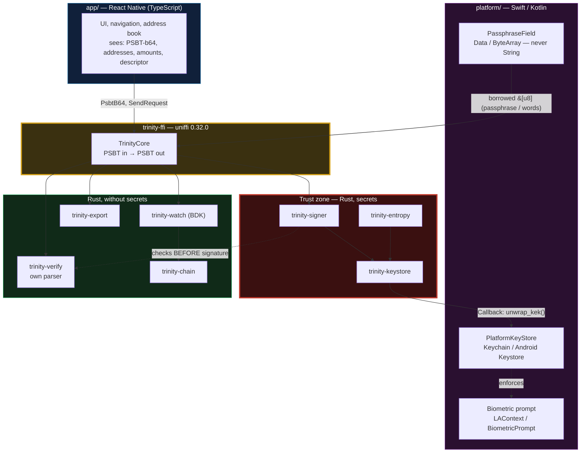
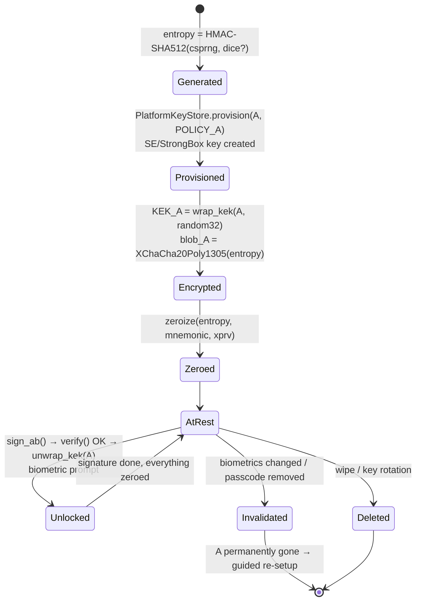
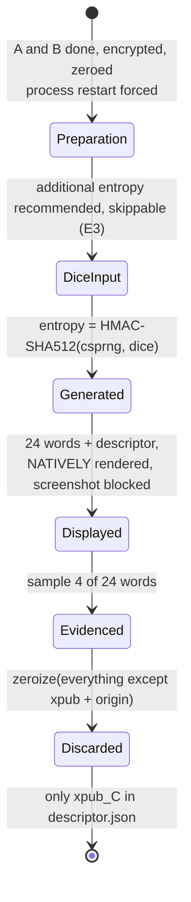
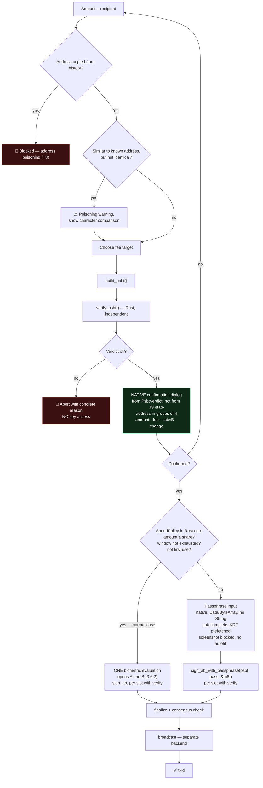
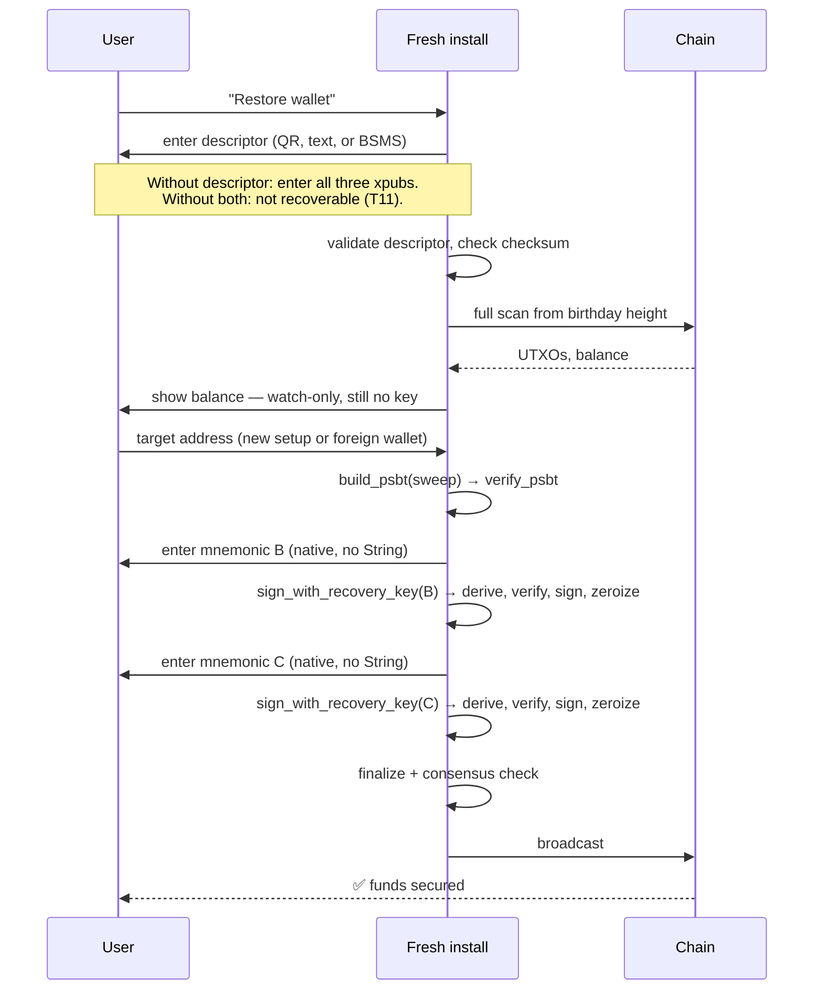
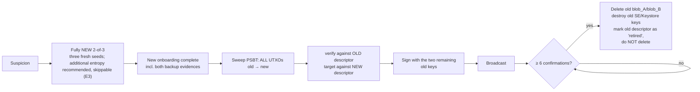
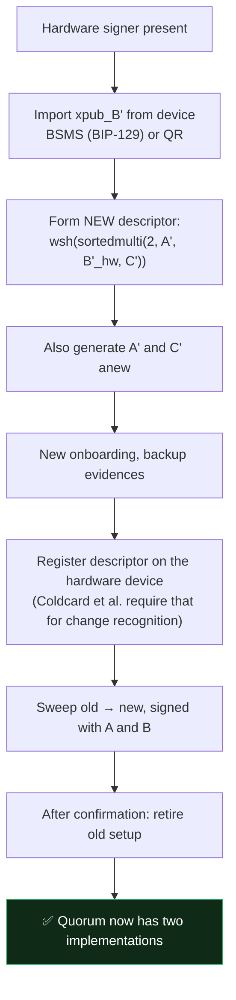

Trinity — serverloses 2-von-3 Wallet-Schema. Entwurf: Joshua Krüger, 2026.

# BTC Trinity — Technical Specification

**Bitcoin-only 2-of-3 multisig wallet, three equal keys, no state, no services.**

| | |
|---|---|
| Document version | 1.0-draft |
| Research cutoff | 2026-08-08 |
| Status | Specification for review — **no release for implementation until Section 7 is decided** |
| Dropped (out of scope) | Timelock recovery, watchtower, operating modes, miniscript policies beyond `sortedmulti`, monetization |

---

## 0. Executive Summary

### The architecture in six sentences

1. A Rust core (rust-bitcoin / BDK, bound via uniffi) holds **everything secret**; the interface to the UI layer is exclusively **PSBT in → PSBT out**, and neither seed nor xpriv nor passphrase ever crosses the JS bridge.
2. The wallet is a `wsh(sortedmulti(2, A, B, C))` over **three independently generated master seeds** on BIP-48 paths (`m/48'/0'/0'/2'`), of which A and B sit as hardware-bound, encrypted blobs on the phone (A: biometric access, B: hardware key ⊕ Argon2id passphrase) and C remains offline as a paper/steel backup.
3. A send costs the user, in the normal case, **one gesture**: one biometric evaluation opens A and B, and above that sits a **spending limit enforced in the Rust core** (default: `clamp(20 % of balance, €200, €500)` per 24 h, enforced on stored sat values), above which the passphrase becomes unavoidable — turning the classic "snatched phone = everything gone" into "up to the share gone, remainder recoverable with backup-B plus C".
4. The code is split into a **watch-only core with no key access at all** (descriptor, addresses, UTXOs, PSBT construction, chain connectivity) and a **signing module** — so most of the app is testable without key material, and Sparrow/Core export falls out as a byproduct.
5. Before every signature, a **`verify` module independent of the builder** re-checks the PSBT against the stored descriptor — change membership, derivation paths, fee plausibility — because a forged change address is the one real attack vector that remains after every other measure.
6. Correctness is not claimed by own assertions, but evidenced by **differential testing against Bitcoin Core 30.2** (`deriveaddresses`, `walletprocesspsbt`) and a **Signet recovery run in CI**.

### The three largest risks

| # | Risk | Why it is the largest | What the architecture does against it | Residual risk |
|---|---|---|---|---|
| **R1** | **Compromised phone** | A and B sit on the same device. Whoever runs native code in the app context has, after a biometric unlock, both keys and also bypasses the spending limit. No multisig scheme fixes that — on a single-sig wallet on the same phone the situation is identical. | Rust core instead of JS heap (no seed in crash dumps), passphrase never as String, `zeroize`, hardware-bound KEKs, verifier before signature. | **Not covered.** An attacker with code execution in the process *at the time of a signature* wins. Only real countermeasure: move B to external hardware (Section 6.6). |
| **R2** | **One implementation for two keys** | A and B share RNG, library, build, and update channel. An RNG bug or a supply-chain attack hits both at once — the quorum has factually **one** implementation, not two. The Coldcard incident of July 2026 (Section 2.1) is the evidence that exactly this happens. | Evidenced entropy (externally re-computable), dice option, C must be generated outside the A/B session, reproducible builds, `cargo vendor`, pinned deps, PSBT path to foreign hardware from v1. | **Partial.** C is the only real implementation diversity — and C alone can do nothing. Until B sits on foreign hardware, the quorum remains implementation-side 1-of-1. |
| **R3** | **Descriptor loss / wrong backup distribution** | The most common multisig total loss is not the lost key, but the lost descriptor. The second most common is backup-B and C in the same drawer — then a break-in is a total loss without any cryptography. | Descriptor as mandatory part of every backup printout, enforced backup evidence in onboarding, explicit location-separation prompt, BSMS export (BIP-129), documented recovery without this app. | **User behavior.** The app can neither check nor enforce physical separation. Only UX anchoring and repetition. |

### Decisions that must stand before the first line of code

These six cannot be corrected later, or only by rebuilding. Details and recommendations in **Section 7**.

| # | Decision | Why now | Recommendation |
|---|---|---|---|
| **E1** | Location of the FFI trust boundary: only `PSBT ⟶ PSBT` + callback interface for KEK unwrapping | If the boundary is drawn later, seeds have long since wandered through JS heaps. Practically not retrofit-able. | **Write it as binding** (Section 1.3), CI lint against forbidden FFI types. |
| **E2** | Verifier builds on its own minimal descriptor parser instead of `miniscript` | If the verifier uses the same library as the builder, a bug confirms itself. Rebuilding later means rewriting the verifier. | Own ~250-line parser for exactly the grammar `wsh(sortedmulti(2,…))`, own BIP-32 derivation; shared remain only secp256k1 and hashes (Section 1.5). |
| **E3** | Entropy construction and displayability of raw entropy | A seed born under wrong construction is not repaired by any update (Coldcard 2026). The format must stand from the very first generated seed. | ✅ **Decided.** `entropy = HMAC-SHA512(key = OS_CSPRNG(32), msg = zusatz_bytes)[0..L]`, raw entropy displayable, BIP-39 derivation externally re-computable. **Additional entropy is optional throughout** — also for C (Section 2.2). |
| **E3b** | Word length: 24 words (256 bit) vs. 12 (128 bit) | Determines backup format, steel-plate purchase, onboarding UX, and sample-quiz design. | ✅ **Decided: per key.** **C fixed 24**; **A and B choosable** 12 or 24, default 24. B is choosable because fixing it would violate constraint 2 (A/B symmetry) — rationale in 2.2.3. Immutable after onboarding. |
| **E4** | Argon2id parameters and their storage in the blob header | A later parameter change forces re-encryption of all blobs and a migration path. | ✅ **Decided.** `m = 262144 KiB (256 MiB), t = 3, p = 4`, fallback profile `m = 65536 KiB, t = 6, p = 4` on devices < 4 GB RAM, automatic choice; profile ID **in the blob header** (Section 2.4). |
| **E5** | B is from v1 a swappable signer behind the same PSBT interface | If `sign_with_b` is internally coupled to the local keystore, the switch to foreign hardware is an architecture change instead of a drop-in. | ✅ **Decided.** `trait Signer { fn sign(&self, psbt: Psbt) -> Result<Psbt>; }` with `LocalSigner` and `ExternalSigner` from day 1; the `ExternalSigner` path must be real-tested in v1 (Section 2.7, 6.6). |
| **E7** | **One-gesture signature with spending limit in the Rust core** | Whether A and B unlock with the same gesture determines the blob format, the platform flags, and the entire signature choreography. Retrofitting that is a rebuild of both keystores. | ✅ **Decided.** One biometric evaluation opens A **and** B; above that sits an amount and time-window limit enforced in the Rust core, above which the passphrase is required. A send thus costs **one gesture**. Full derivation, costs, and counter-check in Section 3.6. |
| **E6** | Hardware signer as optional source for C at wallet creation | The transport abstraction and BIP-388 registration must be in the data model before the first descriptor is generated — otherwise a hardware-C is a new setup after the fact. | ✅ **Decided.** C optionally generated in-app or on a connected hardware signer (only xpub imported) — **optional, but recommended**. Four transports behind one trait; **QR and NFC in v1, BLE for BitBox02 Nova and Ledger in v1.1**. **Coldcard is implemented and tested, but initially greyed out in the UI** — unlocked by a firmware check on the device (Section 2.7.9). |

> **A fourth point that is not a security hole and still belongs here:** The yardstick of this product is the setup the user comes from — exchange or single-sig — **not** a multisig of three hardware wallets in three places. That turns friction into a cost line in the threat model (T20): whoever abandons onboarding stays where a single failure means total loss. Section 0.1 develops that and from it justifies four decisions that would otherwise look like negligence.

> **Two assumptions that run through this document and that must be confirmed before implementation starts:**
> **(A1)** Target platforms are iOS ≥ 16 and Android ≥ 10 (API 29). Below that, `kSecAccessControlBiometryCurrentSet` semantics and `setUnlockedDeviceRequired` are missing in reliable form.
> **(A2)** The UI layer is React Native. Were it native (SwiftUI/Compose), requirement 1 would not go away — it would only become cheaper.

---

## 0.1 Positioning — the yardstick

**The goal is to be clearly safer than what the user had before. Not to match a multisig of three hardware wallets in three places.** This commitment stands here because it determines every trade-off in the rest of the document.

### What is measured against

| Starting position | What goes wrong there | BTC Trinity against that |
|---|---|---|
| **Exchange / custodial** | Insolvency, hack, freeze, seizure. The user owns nothing; they have a claim. | ✅ Self-custody, three keys, no third party in the signature path |
| **Single-sig on the phone** | One seed leak = everything gone. Device loss without backup = everything gone. One key, one failure, total loss. | ✅ Two of three needed; device loss, backup loss, and single-key leak are covered |
| **Single-sig hardware wallet** | One seed, one backup, **one implementation**. The Coldcard incident of July 2026 hit exactly this setup: a build-time RNG fault made single-sig seeds on affected firmware searchable (0.3). Theft of device and backup = total loss. | ✅ No single key and no single backup is enough for the attacker |
| **3× hardware wallet, 3 places, 3 vendors** | The reference standard. Additionally covers the compromised phone. | ❌ **We do not match that** — and do not aim to. See below. |

### What that means concretely

**We do not win through more security per transaction, but through more users who leave the worse setup at all.** The 3×-hardware multisig is superior on paper, but it costs ~€500, an afternoon of setup, three storage locations, and the willingness to deal with descriptors. Whoever does not do that stays on single-sig — and is then worse off than with everything specified here.

The practical gap is also smaller than the table suggests: **The most common total loss in multisig is not the compromised key, but the lost descriptor or a backup that was never correctly created.** A setup with enforced backup evidence, printed descriptor, and tested recovery path (Section 5, S4/S5) can in practice outperform a theoretically stronger setup that the user sets up wrong.

### The design principle that follows

> **Friction is a security cost item, not a security measure.** Every additional hurdle that raises the abandonment probability must remove more risk than it creates through non-use. Because the user who abandons does not land at a slightly less safe wallet — they stay at the exchange or at single-sig.

That is the justification for four decisions that would otherwise look like negligence:

| Decision | Why it is right under this yardstick |
|---|---|
| **Additional entropy optional** (E3) | 99 dice rolls as mandatory cost more users than the covered RNG-failure case is worth. Pre-selected with "Skip" captures most of the benefit at a fraction of the friction (2.2.1). |
| **Word length choosable** (E3b) | Writing down 3 × 24 words is the most common abandonment point in the onboarding of every multisig wallet. 12 words at 128 bit are **not** a real security loss against brute-force (2.2.3). |
| **Hardware optional** (E6) | A mandatory device purchase in onboarding halves the completion rate. Recommended and prepared, but not a prerequisite. |
| **Passphrase usability** (6.2.1) | ~45 seconds per send drives users back to the exchange. 10–15 seconds does not. Hence autocomplete and prefetched KDF instead of a weaker passphrase. |

### Where the security actually comes from

A common misunderstanding would be to book the entire gain to the quorum. In fact a large part comes from things that cost the user **zero effort** and that common software wallets simply do not do:

| Gain | User effort | What a typical software wallet does instead |
|---|---|---|
| **No backup alone is enough** — whoever finds B's word list has 1 of 3 | once, choose two places | One backup = everything. Photographed, found, burned → total loss |
| **No single-key leak is fatal** | none | One seed. One leak. Done. |
| **No seed in the JS heap** (Section 1.1) | none | React-Native wallets routinely hold seeds as JS strings — un-erasable until process end, included in crash dumps |
| **Independent verifier against change-address manipulation** (1.5) | none | Practically no consumer wallet checks change independently of the builder |
| **Deterministic nonces, re-computable entropy, reproducible builds** (2.2, 3.4, 1.7) | none | Exactly the class of bugs that hit Coldcard in 2026 (build-time RNG fault, not a crypto algorithm flaw — 0.3, 2.1) |
| **Recovery without this app documented and tested in CI** (S5/S6) | none | "Trust that the app still exists in five years" |
| **Spending limit against theft of the unlocked device** (3.6) | once, one number | Snatched unlocked phone = 100 % gone |

**Six of the seven rows cost the user nothing.** That is the real content of "exorbitantly safer at minimal extra effort" — not the quorum alone, but the quorum plus cleanly done fundamentals.

### Where the principle ends

Reducing friction does **not** mean giving up security properties that create the distance from the starting position in the first place. Two things therefore stay hard, even though they cost friction:

1. **The backup evidence for B and C is blocking** (6.1). Without it, a lost phone is total loss — then we would not be better than single-sig, only more complicated. That is the one point where abandonment is better than waving through.
2. **The spending limit cannot be changed without the passphrase** (3.6). It is what turns "snatched phone = everything gone" into "snatched phone = a portion gone, remainder recoverable". If it were disableable with the same gesture that also signs, it would be worthless.
3. **The limit is enforced in the Rust core, not in the UI** (3.6). A limit that the JS layer checks is ineffective against the most likely attack path — a compromised npm dependency.

---

## Stand der Technik und Abgrenzung

Ein 2-von-3-Wallet mit einem Tageslimit für Zahlungen allein über das Handy gibt es bereits:
[Bitkey von Block](https://bitkey.world/learning-hub/how-bitkey-works) verteilt seine drei
Schlüssel auf die App, das Hardware-Gerät und den Bitkey-Server. Für „Transfer without hardware“
zeichnet der Server Transaktionen bis zum vom Nutzer festgelegten Tageslimit mit. Würde der
kumulierte Abfluss die Grenze überschreiten, zeichnet der Server nicht mit; dann ist der
Hardware-Schlüssel erforderlich. Bitkey dokumentiert diese Durchsetzung sowohl in der
[Nutzeranleitung zum Transferlimit](https://support.bitkey.world/hc/en-us/articles/19427218356500-How-do-I-set-up-Transfer-without-hardware-and-a-transfer-limit)
als auch in seinem
[technischen Recovery-Paper](https://support.bitkey.world/hc/en-us/article_attachments/38300867748500).

Diese Grenze ist kryptografisch stärker als die Grenze von Trinity: Bei Bitkey fehlt oberhalb des
Limits ohne den Hardware-Schlüssel eine zweite Signatur für das 2-von-3-Quorum. Bei Trinity ist
das Limit dagegen App-Politik im eigenen Rust-Kern. Ein Angreifer mit nativem Codezugriff im
App-Prozess kann diese Politik umgehen und nach dem Entsperren auf A und B zugreifen; dann fällt
die Grenze. Das ist kein gleichwertiger Schutz und wird hier nicht so dargestellt.

Der beanspruchte Unterschied ist die fehlende Abhängigkeit von einem Dritten: In keinem
Schlüssel-, Signatur-, Policy- oder Recovery-Pfad muss ein externer Server, Dienst oder eine
Firma existieren. Austauschbare Quellen für Chain-Daten können selbst betrieben oder ersetzt
werden; sie halten keinen Schlüssel und setzen keine Ausgabepolitik durch.

Trinity beansprucht keine Erfindung. Es ist eine Referenzarchitektur, die bekannte Bausteine mit
dokumentierter Begründung und offengelegten Grenzen kombiniert, keine neue Kryptografie.

---

## 0.2 Scope, non-goals, honest limits

### In scope
Generation and custody of three keys; watch-only operation; PSBT construction, verification, signature, finalization, broadcast; backup and recovery; key rotation; test strategy; UX flows.

### Non-goals
Timelocks, time locks, inheritance schemes, watchtower, server services, fee models, operating modes, multi-account management, coinjoin, Lightning, altcoins, fiat rails.

### Honest limits — to communicate explicitly and non-negotiably

| Limit | Consequence |
|---|---|
| **Two of three keys sit on one device.** | A compromised phone is **not** a covered case. The model protects against device loss, theft, backup loss, and single-key leak — not against code execution in the app context. |
| **A does not sit in the Secure Enclave.** | The SE only supports NIST-P-256; Bitcoin needs secp256k1. A is an encrypted blob whose key-encryption key (KEK) is hardware-bound. **Biometrics is an access barrier, not a cryptographic factor** — it does not enter key material. |
| **A and B come from the same codebase.** | Same RNG, same library, same update channel. An implementation bug hits both at once. The quorum has factually one implementation. The PSBT path to foreign hardware is the answer and must exist from v1, not from v2. |
| **The passphrase protects only the device copy of B.** | The external backup of B is the BIP-39 word list on paper — it is **not** passphrase-protected. Whoever finds backup-B and C needs no passphrase. That is why spatial separation (constraint 3) carries the entire model. Users who believe their passphrase protects the paper backup are misinformed; that must be addressed in onboarding. |
| **`sortedmulti` does not hide which key signed.** | The witness shows publicly which two of the three pubkeys signed. No privacy problem for strangers without the descriptor, but against someone with the descriptor (e.g. the watch-only server) the signature pattern is visible. |
| **Watch-only backends see something.** | See privacy table in Section 1.6. No backend is without leak; the magnitudes differ by factors, not by degrees. |

---

## 0.3 Research status: verified versions and evidence

All version states below were queried on **2026-08-08** directly against `crates.io/api/v1`, not written from memory. Dependency-tree resolution likewise via the registry API.

### The actually resolving Rust stack

> **Important finding — "latest version" is the wrong rule here.** `bdk_wallet 3.1.0` declares `miniscript ^12.3.5` and `bitcoin ^0.32.8`. The newest registry versions are `miniscript 13.1.0` and `secp256k1 0.31.1` — both are **not** in the BDK tree. Whoever writes `secp256k1 = "0.31"` or `miniscript = "13"` directly into `Cargo.toml` gets two parallel linked copies of libsecp256k1 and incompatible types at module boundaries. The pins below are the versions that actually coexist.

| Crate | Pin | Registry state | Role |
|---|---|---|---|
| `bdk_wallet` | `=3.1.0` | 3.1.0 (2026-06-14) | Watch-only core, TxBuilder, descriptor wallet |
| `bdk_chain` | `=0.23.3` | 0.23.3 (2026-03-26) | Chain data structures |
| `bdk_core` | `=0.6.3` | 0.6.3 (2026-03-26) | Core primitives |
| `bitcoin` | `=0.32.11` | 0.32.11 (2026-07-22) | rust-bitcoin; do **not** use `0.33.0-beta` |
| `miniscript` | `=12.3.7` | 12.3.7 (2026-05-27) | **not 13.1.0** — BDK 3.1.0 requires `^12.3.5` |
| `secp256k1` | *transitive* `0.29.1` | 0.29.1 (2024-09-06) | via `bitcoin 0.32` (`^0.29.0`); **do not declare directly** |
| `bip39` | `=2.2.2` | 2.2.2 (2025-12-04) | Mnemonic; via BDK feature `keys-bip39` |
| `zeroize` | `=1.9.0` | 1.9.0 (2026-06-12) | Secret wiping, `ZeroizeOnDrop` |
| `argon2` | `=0.5.3` | 0.5.3 stable; `0.6.0-rc.8` (2026-03-22) | KDF for B. **RC not in the signature path.** |
| `getrandom` | `=0.4.3` | 0.4.3 (2026-06-17) | OS-CSPRNG access |
| `uniffi` | `=0.32.0` | 0.32.0 (2026-06-30) | FFI generation Swift/Kotlin |
| `bdk_electrum` | `=0.24.0` | 0.24.0 (2026-05-08) | → `electrum-client 0.25.0` |
| `bdk_bitcoind_rpc` | `=0.22.0` | 0.22.0 (2025-09-12) | → `bitcoincore-rpc 0.19.0` |
| `bdk_kyoto` | `=0.17.0` | 0.17.0 (2026-05-12) | → `bip157 0.6.3` (2026-07-21), BIP-157/158 |
| `bbqr` | `=0.5.0` | 0.5.0 (2026-07-16) | BBQr animated QR — hardware transport v1 |
| `ur` | `=0.5.2` | 0.5.2 (2026-07-29) | Uniform Resources — hardware transport v1 |
| `bitbox-api` | `=0.13.0` | 0.13.0 (2026-07-18) | BitBox02 — **v1.1**, features `usb`/`wasm`/`simulator`/`multithreaded` only — **no BLE** (Appendix B.8, measured 2026-08-10) |
| `ledger-transport`, `ledger-apdu` | `=0.11.0` | 0.11.0 (2024-05-09) | Ledger — **v1.1**, only generic; **no** app-level crate for the Bitcoin app (Appendix B.9) |
| ~~`hwi`~~ | **do not use** | 0.10.0 (2024-09-13) | Wrapper around Python HWI, needs a Python runtime → **unusable on mobile** |

**Compatibility check:** `bdk_electrum 0.24.0` requires `bdk_core ^0.6.1`, `bdk_bitcoind_rpc 0.22.0` requires `bdk_core ^0.6.1` and `bitcoin ^0.32.0`, `bdk_kyoto 0.17.0` requires `bdk_wallet ^3`. All three coexist with the pinning above. ✔

### External references and incidents

| Fact | State | Source / evidence quality |
|---|---|---|
| **Coldcard entropy incident** | Advisory published **2026-07-30**, updated **2026-08-01**. Affected: Mk2/Mk3 **4.0.1–4.1.9**; Mk4/Mk5 before 5.6.0 or Edge 6.6.0X; Q before 1.5.0Q or Edge 6.6.0QX. Fixed in: Mk2/Mk3 **4.2.0**, Mk4/Mk5 5.6.0, Q 1.5.0Q, Edge 6.6.0X / 6.6.0QX. Effective entropy: the vendor states **≈ 72 bit** for Mk4/Mk5/Q; an independent analysis by Block Bitcoin Engineering calculates a search space of **at most 2^32** (Secure Element reseed contributes only four bytes). **The conservative figure (≤ 2^32) is the one that governs here.** For Mk2/Mk3 the advisory does **not** quantify; the analysis reports "no cryptographic entropy" — from 2^0 with known UID and call history to an estimated range of about 2^16.3–2^40.7 with unknown timers. Root cause: board header `#define MICROPY_HW_ENABLE_RNG (0)`; `libngu` tests whether the macro is **defined** rather than whether it is **enabled**, and binds MicroPython's deterministic Yasmarang fallback. Dice: ≥ 50 independent private rolls yield **≥ 128 bit from the dice alone**; 99+ rolls ≈ 256 bit — unaffected by the RNG fault. A firmware update does **not** repair an already generated seed. Stolen-funds figures (e.g. ≈ 594 BTC / ≈ 38 M USD from ≈ 500 wallets in ≈ 25 minutes) appear only in secondary reporting and are **contested** (TRM Labs frames the same incident at 116 M USD); neither primary source states them — they are not used as fact in this document. | **Primary source** (Coinkite advisory 2026-07-30 / updated 2026-08-01) plus independent technical analysis (Block Bitcoin Engineering, 2026-07-30). Read 2026-08-10. |
| **Bitcoin Core reference version** | Use **30.2**. 30.0 and 30.1 had a wallet-migration bug that, when migrating an unnamed legacy BDB wallet in a custom wallet directory with pruning enabled, could delete **all** wallet files of the node; binaries were withdrawn from bitcoincore.org on 2026-01-05. | bitcoincore.org advisory 2026-01-05; release notes 30.2 |
| **Argon2id parameters** | RFC 9106 option 1: `m=2 GiB, t=1, p=4`. Option 2 (memory-constrained): `m=64 MiB, t=3, p=4`. OWASP minimum: `m=19 MiB, t=2, p=1`. | RFC 9106; OWASP Password Storage Cheat Sheet |
| **iOS Keychain** | `kSecAttrAccessibleWhenPasscodeSetThisDeviceOnly`: only with passcode set, **never** in iCloud or local backup; removing the passcode **deletes** the items. `kSecAccessControlBiometryCurrentSet`: binds to the current biometric enrollment set; re-enrollment invalidates. | Apple Developer Documentation |
| **Android Keystore** | `setIsStrongBoxBacked(true)` (dedicated security chip, e.g. Titan M2); `setInvalidatedByBiometricEnrollment(true)` invalidates on biometric enrollment change; `setUnlockedDeviceRequired(true)` forbids use while device is locked. | Android Developers / AOSP Keystore Features |
| **Descriptor interop** | Sparrow translates `wsh(multi(...))` on import to `wsh(sortedmulti(...))`; BIP-48 support implies BIP-67 sorting. BSMS (BIP-129) since Sparrow v1.7.3; Coldcard as signer and coordinator. | bips.dev/129, Sparrow release notes, Coldcard docs |
| **BIP-388 wallet policies** | External signers — **Ledger, BitBox02, and Jade** — use BIP-388 for multisig to display and constrain descriptor policies on the device. Implemented in the Ledger Bitcoin app **since version 2.1.0**. After a registered and on-device confirmed policy, multisig signing behaves for the user like single-sig signing. | bips.dev/388, Ledger docs |
| **iOS USB restriction** | Access to arbitrary USB-HID devices is **not possible** for apps on iOS/iPadOS; HIDDriverKit and the IOKit HID APIs are not available there, and communication with USB-C accessories without MFi certification is excluded. Same for serial Bluetooth outside profiles supported by iOS. | Apple Developer Forums (several threads), Apple MFi program FAQ |
| **BitBox02 Nova / Whisper** | Uses BLE for iOS because USB communication there is heavily restricted. Dedicated Bluetooth chip **DA14531** with its own open-source firmware (reproducible when obtaining a vendor SDK file), **without** access to the main MCU flash and without knowledge of wallet secrets. **Two encryption layers:** the highest security levels of the BLE standard (authenticated and encrypted after pairing) **plus** the native end-to-end encryption of the BitBox firmware from main MCU to the app above. Pairing-code confirmation on device; Bluetooth disableable via BitBoxApp over USB, then radio fully off. | ⚠️ **Secondary sources** — `blog.bitbox.swiss` was not reachable from the research environment. Details of key exchange (Noise? which AEAD?) **not verified**, see Appendix B.13. |
| **BBQr** | Animated QR protocol by Coinkite, open specification. Target file types PSBT (BIP-174) and finished transactions; each frame carries file type, total count, and index. Multisig PSBTs typically sit at **5–20 KB** and therefore need multiple frames. Coldcard supports PSBT v0 (BIP-174) and v2 (BIP-370). | bbqr.org, Coldcard docs |
| **bdk-ffi** | 3.0.0 (June 2026): production-ready bindings for Kotlin/JVM, Swift, Python. React-Native and Dart bindings 2026 in integration tests. | ⚠️ Secondary source (blog aggregation); `github.com/bitcoindevkit/bdk-ffi` was not reachable in this session. |
| **Address poisoning 2026** | Industrialized: bots generate lookalike addresses with identical start and end characters and place dust in the victim's history. A single attacker contract reached ≈ 3 M dust transfers to > 1 M addresses for ≈ 5,175 USD. Advanced variants watch the mempool for test transactions and poison immediately after. | Chainalysis, Blockaid, industry reports 2026 |

### Known gaps of this research

Named honestly rather than filled. Three of the four original gaps are closed; one remains:

1. ~~**`docs.rs` was blocked by egress proxy**~~ — ✅ **Resolved 2026-08-10.** Signatures of `bdk_wallet 3.1.0` read from the **pinned crate source** (`~/.cargo/registry/src/…/bdk_wallet-3.1.0/`), not from docs.rs. Concrete methods, coin-selection types, `finish` / `finish_with_aux_rand`, persistence, and `KeychainKind` are recorded in 1.3, 1.6, 3.2, and Appendix B.1. Two consequences beyond signatures: build path draws RNG via `thread_rng` unless `finish_with_aux_rand` is used; sixteen `Wallet` methods take `&mut self`, so the uniffi facade needs interior mutability.
2. ~~**Coldcard primary advisory not read directly**~~ — ✅ **Resolved 2026-08-10.** Coinkite advisory and Block Bitcoin Engineering analysis recorded in 0.3. What remains is applying the same claims to **user-visible app texts** (5.5, criterion 14) — those texts do not exist yet.
3. **Kyoto peer selection on block download** — whether a match block is loaded from a *different* peer than the filter peer could not be evidenced. That is relevant for the privacy claim in 1.6 and **must be read in the source of `bip157 0.6.3`** before CBF is advertised as a "private default". **Still open.**
4. ~~**`secp256k1 0.29.1` advisories**~~ — ✅ **Resolved 2026-08-10.** `cargo audit` against the full lockfile: **174 crates scanned, zero findings**, exit 0. Advisory database was freshly loaded (1190 advisories).

---

## 1. Module cut and data flow

### 1.1 Repo structure

```
btc-trinity/
├── Cargo.toml                     # Workspace, resolver = "2", [workspace.dependencies] with '=' pins
├── Cargo.lock                     # checked in, mandatory
├── rust-toolchain.toml            # exact toolchain version, no "stable"
├── vendor/                        # cargo vendor, checked in; .cargo/config.toml points here
├── deny.toml                      # cargo-deny: licenses, advisories, duplicates
│
├── crates/
│   ├── trinity-types/             # ⬜ core types: Descriptor string, PsbtB64, Fingerprint,
│   │                              #    KeySlot{A,B,C}, Network. No I/O, no secrets.
│   ├── trinity-entropy/           # 🟥 entropy generation, dice, BIP-39 derivation
│   ├── trinity-keystore/          # 🟥 blob format, AEAD, Argon2id, KEK handling, zeroize
│   ├── trinity-signer/            # 🟥 Signer trait, LocalSigner, ExternalSigner adapter
│   ├── trinity-transport/         # ⬜ PsbtTransport: QR (bbqr/ur), NFC, BLE, USB.
│   │                              #    Sees only PSBTs, xpubs, BIP-388 policies.
│   ├── trinity-verify/            # ⬜ INDEPENDENT PSBT verifier. Must NOT use `miniscript`.
│   ├── trinity-watch/             # ⬜ BDK wallet, descriptor persistence, TxBuilder, addresses
│   │                              #    KeychainKind::External = receive, ::Internal = change
│   ├── trinity-chain/             # ⬜ ChainBackend trait + Electrum / Core-RPC / CBF
│   ├── trinity-export/            # ⬜ Sparrow JSON, BSMS (BIP-129), Core `importdescriptors`,
│   │                              #    backup PDF/print view
│   └── trinity-ffi/               # 🟨 uniffi facade. ONLY crate with #[uniffi::export].
│
├── platform/
│   ├── ios/TrinityPlatform/       # Swift: Keychain, SecAccessControl, LAContext,
│   │                              #    PassphraseField (no String!), PlatformKeyStore impl
│   └── android/trinity-platform/  # Kotlin: KeyStore, BiometricPrompt, StrongBox,
│                                  #    PassphraseField (CharArray/ByteArray), PlatformKeyStore impl
│
├── app/                           # React Native / TypeScript. Sees exclusively PSBTs,
│                                  #    addresses, amounts, descriptor. Never a secret.
│
├── tests/
│   ├── differential/              # against Bitcoin Core 30.2 (regtest)
│   ├── property/                  # proptest
│   ├── vectors/                   # frozen test vectors, incl. BIP-48/67 cases
│   └── signet-e2e/                # full recovery run, runs in CI
│
└── docs/
    ├── SPECIFICATION.md           # this document
    └── RECOVERY.md                # recovery without this app (Sparrow, Bitcoin Core)
```

**Legend:** 🟥 sees key material · 🟨 trust boundary · ⬜ never key material

### 1.2 Responsibilities and dependency direction



**Rule:** Dependencies never point from `CLEAN` to `SECRET`. `trinity-verify` depends neither on `trinity-signer` nor on `trinity-keystore` nor on `miniscript` — enforced via `cargo-deny` `[bans]` and CI check.

### 1.3 The trust boundary — exact (Decision E1)

The crate `trinity-ffi` is the **only** one with `#[uniffi::export]`. Everything that crosses this boundary is listed here completely:

#### Allowed types across the boundary

| Type | Direction | Content |
|---|---|---|
| `String` (PSBT base64) | ⇄ | PSBT per BIP-174. Contains xpubs and derivation paths, **never** private material. |
| `String` (descriptor) | ⇄ | `wsh(sortedmulti(2,…))` with origin info and checksum. |
| `String` (address, txid, tx hex) | ⇄ | Public. |
| `u64` (satoshi), `u32` (height, index) | ⇄ | Public. |
| `&[u8]` (borrowed bytes) | **only ⟶ Rust** | Passphrase or recovery word list as a **platform-owned** buffer. uniffi borrows for the call duration and does **not** copy into a `RustBuffer`. Never from JS. Not nestable (no `Option<&[u8]>`). |
| `Arc<dyn PlatformKeyStore>` | Callback ⟵ Rust | Rust calls the platform. Not the reverse. |
| Structs from `trinity-types` | ⇄ | Pure value types without secrets (`Balance`, `AddressInfo`, `PsbtVerdict`, `SendRequest`). |

#### Forbidden types across the boundary — CI-enforced

`Mnemonic`, `Xpriv`, `SecretKey`, `[u8; 32]` entropy, `Seed`, every type from `trinity-keystore` except `KeySlot`, and **every `String` that could carry secrets**.

> **CI gate `ffi-boundary`:** A script parses all `#[uniffi::export]` signatures in `trinity-ffi` and compares them against a checked-in allowlist (`crates/trinity-ffi/ffi-allowlist.toml`). Every new or changed signature breaks the build until the allowlist is deliberately adjusted. This boundary is too important to leave to code review.

#### Passphrase across the boundary — borrowed `&[u8]`, crate-internal `SecretBytes`

**Measured against uniffi `=0.32.0` (2026-08-10, Appendix B.2):** a probe crate compiled these signatures:

| Signature | Result |
|---|---|
| `pub fn f(data: &[u8]) -> u32` | ✅ compiles |
| `pub fn f(data: Vec<u8>) -> u32` | ✅ compiles |
| `pub fn f(data: Option<&[u8]>) -> u32` | ❌ **compile error** — `&[u8]: Lift<UniFfiTag>` is not satisfied; `TypeId` not implemented for `&[u8]` |
| two separate exports, each taking `&[u8]` directly | ✅ compiles |

uniffi documents that `&[u8]` *allows Rust to borrow a foreign-owned byte buffer during an FFI call without making a copy* — foreign→Rust only, argument position only, not nested, valid only for the duration of the call. That is exactly the passphrase lifecycle this architecture requires, and it **removes** the intermediate copy that would otherwise need zeroing.

**What crosses the boundary:** the passphrase (and recovery word list) enters as **`&[u8]`** — a borrowed, platform-owned buffer. uniffi does **not** copy it into a `RustBuffer`. There is therefore **no Rust-side intermediate copy** that the core would have to zero after the fact. That closes the previous gap (a non-zeroable FFI buffer).

**What remains — and becomes more important, not less:** the buffer is owned by the platform, and the **platform must zero it**. Swift `String` and Kotlin `String` are — like JS strings — immutable and not overwritable. **The passphrase must never exist as a `String` in Swift or Kotlin either.**

- iOS: `UITextField` with custom `UIKeyInput` delegate, characters directly into an `UnsafeMutableRawBufferPointer`; wipe via `memset_s`. No `.text` access, no SwiftUI `@State private var pass: String`.
- Android: `EditText` with `getText().getChars(...)` into a `CharArray`, conversion to `ByteArray`, then `Arrays.fill(chars, '\u0000')` and `ByteArray.fill(0)`. No `.toString()`.

**`SecretBytes` does not disappear — it moves inward.** It remains the crate-internal `ZeroizeOnDrop` wrapper into which the core copies the borrowed buffer immediately on entry. It is **not** an exported uniffi type. WP-10 acceptance still applies: no `Clone`, no `Debug`/`Display` except `"[redacted]"`, `trybuild` proof.

```rust
// crates/trinity-types/src/secret.rs — crate-internal, NOT #[uniffi::export]
pub struct SecretBytes(zeroize::Zeroizing<Vec<u8>>);
// Drop ⇒ zeroize. No Clone. No Debug of contents.
```

**Measured restriction that shapes the facade:** `Option<&[u8]>` is **not** possible — `&[u8]` does not implement `Lift` when nested. That is why passphrase-bearing calls are **split** into separate exports (below) rather than a single `Option` parameter.

- ❌ **Not achieved:** protection against swapping, OS memory snapshots, or a debugger in the process. `mlock`/`memlock` is not available for apps on iOS; on Android only limited. **This gap remains open and is not closable.**

#### The exported facade

**Interior mutability is part of the facade, not an implementation detail.** In
`bdk_wallet 3.1.0`, sixteen `Wallet` methods take `&mut self` (including
`reveal_next_address`, `build_tx`, and `apply_update` — source:
`wallet/mod.rs`). uniffi objects are shared behind `Arc`, and
`#[uniffi::export]` methods take `&self`. Therefore `TrinityCore` holds the BDK
wallet behind a `Mutex` or `RwLock`. The lock is acquired for short wallet
mutations only and **must not** be held across a signing call that waits on
user input (biometrics, passphrase, hardware confirmation). Holding the lock
over that wait would freeze every other facade call for the duration of the
prompt.

```rust
// crates/trinity-ffi/src/lib.rs — full exported surface

#[derive(uniffi::Object)]
pub struct TrinityCore {
    // Wallet behind Mutex/RwLock: BDK Wallet has 16 &mut self methods;
    // uniffi exports take &self on an Arc-shared object.
    /* Wallet, Backend, Keystore handles */
}

#[uniffi::export]
impl TrinityCore {
    // ── Watch-only ─────────────────────────────────────────────────
    pub fn descriptor(&self) -> String;
    pub fn balance(&self) -> Balance;
    // BDK 3.1.0 (`wallet/mod.rs:651`):
    //   pub fn reveal_next_address(&mut self, keychain: KeychainKind) -> AddressInfo
    // Facade locks the wallet briefly; receive path passes KeychainKind::External.
    pub fn reveal_next_address(&self) -> AddressInfo;
    // BDK returns impl Iterator + '_ (list_unspent / list_output / transactions);
    // the facade collects into Vec before crossing the FFI boundary.
    pub fn list_transactions(&self) -> Vec<TxSummary>;
    pub fn sync(&self) -> Result<SyncReport, ChainError>;

    // ── PSBT construction ──────────────────────────────────────────
    pub fn build_psbt(&self, req: SendRequest) -> Result<String, TxError>;

    // ── Verification (independent of the builder) ──────────────────
    pub fn verify_psbt(&self, psbt_b64: String) -> Result<PsbtVerdict, VerifyError>;

    // ── Signature: PSBT in → PSBT out ──────────────────────────────
    /// Below the spending limit: one gesture, no passphrase.
    /// Fails with SignError::PassphraseRequired when the policy demands one.
    /// Checks SpendPolicy, verifies before each of the two signatures, and
    /// returns the doubly signed PSBT. `sign_a`/`sign_b` remain crate-internal.
    pub fn sign_ab(&self, psbt_b64: String) -> Result<String, SignError>;

    /// Above the limit, on policy changes, on export, and on first use after install.
    /// `pass` is a borrowed buffer owned and zeroed by the platform layer; uniffi does
    /// not copy it, and it is valid only for the duration of this call.
    pub fn sign_ab_with_passphrase(&self, psbt_b64: String, pass: &[u8])
        -> Result<String, SignError>;

    /// Recovery path (§6.4): signs with a key derived from a word list.
    /// `words` is a borrowed buffer from the NATIVE layer — never from JS,
    /// never persisted; the core copies into crate-internal SecretBytes and zeros after sign.
    pub fn sign_with_recovery_key(&self, psbt_b64: String, slot: KeySlot, words: &[u8])
        -> Result<String, SignError>;

    // ── Completion ─────────────────────────────────────────────────
    pub fn finalize(&self, psbt_b64: String) -> Result<String, FinalizeError>;   // → tx hex
    pub fn broadcast(&self, tx_hex: String) -> Result<String, ChainError>;       // → txid

    // ── Onboarding / export ────────────────────────────────────────
    /// SetupConfig { word_count: 24|12, c_source: InApp|Hardware, extra_entropy: Vec<ExtraSource> }
    /// word_count and c_source are immutable after begin_setup (E3b, E6).
    pub fn begin_setup(&self, cfg: SetupConfig) -> Result<SetupHandle, SetupError>;
    pub fn quiz_challenge(&self, slot: KeySlot) -> Vec<u32>;        // word indices, not words
    pub fn quiz_answer(&self, slot: KeySlot, answers: Vec<String>) -> QuizResult;

    // ── Hardware signer (Section 2.7) ──────────────────────────────
    pub fn hw_discover(&self, kind: TransportKind) -> Result<Vec<DeviceRef>, TransportError>;
    pub fn hw_import_xpub(&self, dev: DeviceRef, slot: KeySlot)
        -> Result<XpubWithOrigin, TransportError>;               // confirmation on device display
    pub fn hw_register_policy(&self, dev: DeviceRef) -> Result<String, TransportError>; // PolicyId
    pub fn hw_sign(&self, dev: DeviceRef, psbt_b64: String) -> Result<String, TransportError>;
    pub fn export_bsms(&self) -> String;
    pub fn export_sparrow(&self) -> String;
    pub fn export_core_importdescriptors(&self) -> String;
}

/// Rust calls the platform — not the reverse. No JS in the path.
#[uniffi::export(with_foreign)]
pub trait PlatformKeyStore: Send + Sync {
    /// Unwraps the KEK. iOS: SE-ECIES unwrap. Android: Keystore AES-GCM unwrap.
    /// Triggers platform-side biometrics (slot A) or passcode (slot B).
    fn unwrap_kek(&self, slot: KeySlot, wrapped: Vec<u8>) -> Result<Vec<u8>, PlatformError>;
    fn wrap_kek(&self, slot: KeySlot, plain: Vec<u8>) -> Result<Vec<u8>, PlatformError>;
    fn provision(&self, slot: KeySlot, policy: SlotPolicy) -> Result<(), PlatformError>;
    fn destroy(&self, slot: KeySlot) -> Result<(), PlatformError>;
}
```

**Why two signing exports is not a regression:** The split is along *whether a passphrase is required*, not along the two signatures. Each of `sign_ab` and `sign_ab_with_passphrase` still runs crate-internal `verify → sign A → verify → sign B`, so the app layer never sits between the signatures and the guarantee of **exactly one biometric prompt** per send (S27) is unchanged. The split is forced by the measured uniffi restriction that `Option<&[u8]>` does not compile (Appendix B.2); a single `Option` parameter is not available without reintroducing a copied `Vec<u8>`/`RustBuffer` path.

**What does *not* cross this boundary and why that is the central claim:** There is no exported function that returns a seed, a mnemonic, or an xpriv. Not even for "show backup" — the backup screen is rendered **natively** (Section 6.1), from data that the Rust core writes via a callback directly into a platform-side non-`String` representation. The JS heap never sees the words.

### 1.4 Data flow: what sits where

| Datum | Location | Encrypted | Backup | JS visible |
|---|---|---|---|---|
| Seed A (32 B entropy) | `blob_A` in app-sandbox filesystem | ✔ XChaCha20-Poly1305 | **no** (deliberate) | no |
| Seed B (32 B entropy) | `blob_B` in app-sandbox filesystem | ✔ XChaCha20-Poly1305 | paper (mandatory) | no |
| Seed C | exclusively paper/steel | — | paper (mandatory) | no |
| KEK A | iOS: SE-wrapped · Android: Keystore-wrapped | ✔ hardware-bound | no | no |
| KEK B | Keystore/SE-wrapped, `.userPresence` | ✔ hardware-bound | no | no |
| Passphrase verifier `H` | policy record, `SHA-256(Argon2id(pass))` | no — hash, not a key | no | no |
| `SpendPolicy` + window counter | encrypted core state | ✔ | no | display values only |
| xpubs A/B/C + origin | `descriptor.json`, plaintext | no | paper + cloud allowed | **yes** |
| Descriptor | `descriptor.json`, plaintext | no | **paper, mandatory** | **yes** |
| UTXO set, address index, tx history | SQLite (`bdk_chain` rusqlite) | no | optional | yes |
| PSBTs | ephemeral | no | — | **yes** |

> **Why blob_A deliberately has no backup:** A is the key whose loss the system *must* tolerate (device loss → B + C). A backup of A would increase the number of places where key material exists without improving the security claim. That is a deliberate decision, not an omission — and must be explained as such in onboarding.

> **Privacy note on the JS heap:** PSBTs and the descriptor contain xpubs. An attacker with JS access thus knows all addresses of the wallet, past and future — but can spend nothing. Since the descriptor already sits in the watch-only DB, this is **not** an additional leak through the JS layer. Mentioned so nobody mistakes it for a hole.

### 1.5 `trinity-verify` — independence from the builder (Decision E2)

**The problem:** If `miniscript` parses the descriptor both when building and when checking, a parser bug confirms itself. The verifier would be a tautology.

**The solution — and its exact reach:**

`trinity-verify` implements an **own, minimal parser** for exactly one grammar:

```
descriptor := "wsh(" sortedmulti ")" "#" checksum
sortedmulti := "sortedmulti(" k "," keyexpr ("," keyexpr){2} ")"
keyexpr := "[" fingerprint "/" origin_path "]" xpub "/" derivation
```

Everything else is a **hard error**, not a fallback. The parser accepts neither `multi`, nor `sh(wsh(…))`, nor `tr(…)`, nor other k/n. The value domain is so small that ~250 lines suffice and full test coverage is realistic.

The verifier derives **itself**:

```rust
// crates/trinity-verify/src/lib.rs — no miniscript dependency
pub fn verify(psbt: &Psbt, descriptor: &str, policy: &VerifyPolicy) -> Result<PsbtVerdict, VerifyError> {
    let d = parse_trinity_descriptor(descriptor)?;   // own parser
    // own BIP-32 CKDpub, own BIP-67 sorting, own witnessScript construction
    // ...
}
```

**Check list — every item is a hard rejection, not a warning:**

| # | Check | Against |
|---|---|---|
| V1 | Descriptor checksum (BIP-380) valid | Transmission errors, manipulated descriptor string |
| V2 | Every input `witness_utxo.script_pubkey` is `OP_0 <sha256(witnessScript)>` and the witnessScript is independently reconstructed from the descriptor | Foreign inputs, wrong script |
| V3 | For **every** output: either in `policy.declared_recipients` **or** a change address independently derived from the descriptor in the current gap window | **Forged change address** — the central attack |
| V4 | For every change derivation: `bip32_derivation` contains all three fingerprints, paths are `m/48'/0'/0'/2'/1/i`, and the pubkeys derived from them yield after BIP-67 sorting exactly the witnessScript of the output | Manipulated derivation paths, substituted keys |
| V5 | `fee = Σ inputs − Σ outputs`, `fee > 0`, `fee ≤ policy.max_absolute_fee` **and** `feerate ≤ policy.max_feerate` | Fee-sniping attack, "fee eats wallet" |
| V6 | Sum of non-change outputs == amount confirmed by the user, bit-exact | Amount manipulation between confirmation and signature |
| V7 | No inputs that are not in the watch-only UTXO list | Substituted foreign inputs |
| V8 | `PSBT_GLOBAL_UNSIGNED_TX` is consistent with all input/output maps; no unknown proprietary fields | PSBT field confusion |
| V9 | All inputs have `witness_utxo`; no `non_witness_utxo`-only | Fee manipulation via missing amount information |
| V10 | After signature: own signature is **low-s** and deterministically reproducible | Nonce failure (see 3.4) |

**Where independence ends — explicitly:**

| Layer | Builder | Verifier | Independent? |
|---|---|---|---|
| Descriptor parsing | `miniscript 12.3.7` | own parser | ✔ **yes** |
| BIP-32 derivation | `bitcoin::bip32` | own CKDpub implementation | ✔ **yes** |
| BIP-67 sorting | `miniscript` | own sorting | ✔ **yes** |
| Script construction | `miniscript` | own builder | ✔ **yes** |
| PSBT deserialization | `bitcoin::psbt` | `bitcoin::psbt` | ❌ shared |
| SHA-256 / RIPEMD-160 | `bitcoin_hashes` | `bitcoin_hashes` | ❌ shared |
| EC point arithmetic | `secp256k1 0.29.1` | `secp256k1 0.29.1` | ❌ shared |

Not sharing the shared cryptography would mean writing secp256k1 or SHA-256 yourself. That is forbidden (constraint: no custom cryptography) and would be worse. The third opinion for this layer comes from differential testing against Bitcoin Core (Section 5.1) — offline, in CI, not at runtime.

**Where the verifier runs:** In `sign_ab` / `sign_ab_with_passphrase` (exported) before each of the two crate-internal signature steps, **before** any access to key material. Additionally exported via `verify_psbt`, so the UI can show before confirmation what would be signed. A failure aborts before the KEK is even requested — the biometric prompt never appears.

### 1.6 `trinity-chain` — swappable connectivity

```rust
// crates/trinity-chain/src/lib.rs
// BDK 3.1.0 flow (`wallet/mod.rs`):
//   full:  Wallet::start_full_scan() -> FullScanRequestBuilder<KeychainKind>
//   sync:  Wallet::start_sync_with_revealed_spks()
//          -> SyncRequestBuilder<(KeychainKind, u32)>
//   apply: Wallet::apply_update(&mut self, update: impl Into<Update>)
//          -> Result<(), CannotConnectError>
// The trait runs the network half; the wallet still builds the request and
// applies the returned Update. Role unchanged — types match the pinned crate.
pub trait ChainBackend: Send + Sync {
    fn full_scan(
        &self,
        req: FullScanRequest<KeychainKind>,
    ) -> Result<Update, ChainError>;
    fn sync(
        &self,
        req: SyncRequest<(KeychainKind, u32)>,
    ) -> Result<Update, ChainError>;
    fn broadcast(&self, tx: &Transaction) -> Result<Txid, ChainError>;
    fn fee_estimates(&self) -> Result<FeeEstimates, ChainError>;
    fn tip_height(&self) -> Result<u32, ChainError>;
    fn privacy_profile(&self) -> PrivacyProfile;    // for UI display, see below
}
```

| Impl | Crates | Configuration |
|---|---|---|
| `ElectrumBackend` | `bdk_electrum 0.24.0` → `electrum-client 0.25.0` | Host, port, TLS pin, optional SOCKS5 (Tor) |
| `CoreRpcBackend` | `bdk_bitcoind_rpc 0.22.0` → `bitcoincore-rpc 0.19.0` | RPC URL, cookie or user/pass; tested against **Core 30.2** |
| `CbfBackend` | `bdk_kyoto 0.17.0` → `bip157 0.6.3` | Peer list or DNS seeds, optional fixed peers, optional Tor |

**No vendor default server.** There is no Electrum or Esplora endpoint we operate. The default is CBF; whoever wants a server enters it themselves.

#### What a backend sees in the standard case — honestly

| Backend | The counterparty learns | Magnitude |
|---|---|---|
| **Electrum, own server** | All scriptPubKeys, the full wallet graph, every balance, every sync time, the IP. | Only own hoster/VPS provider — when run at home: nobody outside. |
| **Electrum, third-party server** | The same, but for a third party. **The wallet is fully deanonymized toward this server.** | ⚠️ Must stand unmistakeably in the UI, not on a help page. |
| **Bitcoin Core RPC, own node** | Nothing beyond the node. The node itself leaks no wallet information on P2P traffic (no bloom filter). | Best option when a node exists. |
| **CBF (BIP-157/158)** | Peers learn: an IP loads headers and filters (reveals **nothing** about the wallet) and then loads **certain blocks fully** (reveals: "in this block there is likely a transaction relevant to me"). Across many blocks that is a statistical leak. | Clearly better than Electrum, **not** zero. |
| **Broadcast** | The peer/server that first sees the transaction can link it to the IP. | To be treated separately, see below. |

**Two requirements that follow:**

1. **Broadcast over a different path than sync.** Whoever syncs via Electrum and broadcasts via the same server delivers the strongest possible linkage. The `broadcast` call must be allowed to use its own independently configurable backend (default: CBF peers or Tor).
2. **The CBF privacy claim must be evidenced before it is asserted.** Whether `bip157 0.6.3` loads match blocks from a *different* peer than the one that supplied the filters is open (Section 0.3, gap 3). Without that evidence the UI may not label CBF as "private", only as "more private than a third-party Electrum server".

### 1.7 Dependency minimization and supply chain (Requirement 10)

| Measure | Concrete |
|---|---|
| Exact pins | `=` versions in `[workspace.dependencies]`, not `^`. `Cargo.lock` checked in. |
| Vendoring | `cargo vendor` into `vendor/`, checked in, `.cargo/config.toml` with `replace-with = "vendored-sources"`. The build pulls **nothing** from the network. |
| Toolchain pin | `rust-toolchain.toml` with exact version + component hashes. No `stable`. |
| Reproducible builds | Deterministic `--remap-path-prefix`, `SOURCE_DATE_EPOCH`, build in container with pinned digest. Verification by at least two independent builders before every release. |
| Audit gates | `cargo-deny` (advisories, licenses, **duplicate crates**, `[bans]` for `miniscript` in `trinity-verify`), `cargo-audit` against the full lockfile, `cargo-vet` for review status of deps. |
| **Licenses without fees** | Allowlist instead of denylist in `cargo-deny [licenses]`; an unknown license breaks the build. **Run against the real tree on 2026-08-08 and green.** There is **no** component with a usage fee, no commercial SDK, no service with ongoing costs — ongoing costs would force a server dependency the brief excludes. The distinction that matters is below. |

> **Copyleft is not all equal — the check forced that.** The first run of `cargo deny` failed on **uniffi, which is under MPL-2.0** — and uniffi carries Decision E1, the FFI trust boundary. A blanket "no copyleft" would have made the architecture impossible. The durable rule:
>
> | Class | Examples | Effect | Admission |
> |---|---|---|---|
> | **File copyleft** | MPL-2.0 (`uniffi`) | Whoever changes a covered **file** publishes that file. Does **not** reach into the rest of the application. No fee. | ✅ **admitted** |
> | **Project copyleft** | GPL-*, AGPL-*, SSPL, BUSL | Captures the entire application or requires source disclosure when operating. | ❌ **excluded**, without case-by-case review |
> | Commercial / fee-bearing | every SDK with license costs | ongoing costs | ❌ **excluded** |
>
> **Consequence for implementation:** As long as uniffi is *used* and not *changed*, no obligation arises. If any uniffi file is patched, exactly that file must be published — to be noted in the PR, and a fork of uniffi needs an explicit decision. In `deny.toml` this rationale sits on the allowlist itself so it is not lost.
>
> Further licenses uncovered by the check, unproblematic in the tree: `CC0-1.0` (rust-bitcoin, secp256k1, miniscript — public-domain dedication), `MITNFA`, `BlueOak-1.0.0`, `BSL-1.0`, `Unlicense`, `0BSD`, `Unicode-3.0`, `Zlib`.
| No dynamic reload paths | No OTA bundles, no CodePush, no remote config, no feature-flag service. The JS bundle is part of the signed app binary. **This rule must be actively enforced with React Native — it is not the default.** |
| Signature-path budget | Hard upper bound on the transitive external dependency count of `trinity-types`, `-entropy`, `-keystore`, `-signer`, and `-verify` (only `-e normal`, without dev and build deps). **Measured as the union over the shipped mobile targets `aarch64-apple-ios` and `aarch64-linux-android` (not the developer host): 40 external crates. Gate at 45.** The number comes from `scripts/dep_budget.py` (`MEASURED`), not from an estimate; raising only with justification in the PR. For comparison: `trinity-verify` alone gets by with **22**. |

> **Honest note on React Native:** The JS layer brings hundreds of npm dependencies. These sit outside the signature path (they never see a secret), but they can **display whatever they want** — in particular a wrong recipient address. The verifier (1.5) and the native confirmation display (Section 6.2) are the answer. The npm supply chain is thus not harmless, but reduced to "can deceive, cannot steal".

---

## 2. Key lifecycle

### 2.1 Why entropy comes first here

The Coldcard incident of July 2026 is why this section stands before everything else. In affected firmware the board header set `#define MICROPY_HW_ENABLE_RNG (0)`; `libngu` checked whether that macro was **defined** rather than **enabled**, and therefore bound MicroPython's deterministic Yasmarang fallback instead of the hardware RNG. For Mk4/Mk5/Q the vendor states effective entropy of ≈ 72 bit; an independent analysis by Block Bitcoin Engineering calculates a search space of **at most 2^32** because the Secure Element reseed contributes only four bytes — **the conservative figure (≤ 2^32) is the one that governs here.** For Mk2/Mk3 (4.0.1–4.1.9) the advisory does not quantify; the analysis reports "no cryptographic entropy" (from 2^0 with known UID and call history to an estimated range of about 2^16.3–2^40.7 with unknown timers). Fixed from Mk2/Mk3 **4.2.0**, Mk4/Mk5 5.6.0, Q 1.5.0Q, and the Edge track (6.6.0X / 6.6.0QX). **A firmware update does not repair an already generated seed.** Stolen-funds figures in secondary reporting are contested and are not used as fact here (0.3).

Three lessons that translate directly into requirements here:

1. A weak seed is **permanent**. There is no later repair, only migration.
2. ≥ 50 independent private dice rolls contributed **≥ 128 bit from the dice alone**, independent of the broken RNG (99+ rolls ≈ 256 bit). That is the justification for the class-A thresholds in 2.2.1 — not a vague claim that "dice users were fine".
3. The bug was **not** in the crypto algorithm, but in a board-header macro and a "defined vs enabled" check at build time. Reproducible builds and an externally re-computable derivation path are therefore security measures, not hygiene.

### 2.2 Entropy generation (Requirement 3, Decision E3)

```
L           := 32 (24 words) or 16 (12 words)         // chosen per wallet, see 2.2.3
raw_csprng  := getrandom(32)                              // OS-CSPRNG
extra_bytes := canonical encoding of the additional source // OPTIONAL, possibly empty
extract     := HMAC-SHA512(key = raw_csprng, msg = extra_bytes)
entropy     := extract[0..L]
mnemonic    := BIP-39(entropy)                            // 24 or 12 words
seed        := PBKDF2-HMAC-SHA512(mnemonic, "mnemonic", 2048, 64)   // BIP-39, without passphrase
xprv        := BIP-32-Master(seed)
```

**Why this construction is secure — the chain, not the claim:**

HMAC is the extract stage of HKDF (RFC 5869) and an established randomness extractor. For combining two sources:

| Case | `raw_csprng` | `extra_bytes` | Entropy of the result |
|---|---|---|---|
| Normal case | 256 bit good | empty or known | **min(256, 8·L) bit** — HMAC with unknown key is a PRF |
| CSPRNG broken (Coldcard scenario) | 0 bit, attacker knows the key | 128+ bit secret | **≥ 128 bit** — attacker must guess the additional source |
| **CSPRNG broken, no additional source** | 0 bit | empty | 🔴 **0 bit — the seed is predictable** |
| Both broken | 0 bit | 0 bit | 0 bit |

The construction is an **OR combiner**: it is as strong as the *stronger* of the two sources, and an additional source can **never make the result worse**. Exactly therefore any additional source may be fed in — the only question is how many bits one *credits* to it.

Row 3 of the table is the Coldcard case. Without additional source it is not covered (see T10).

#### 2.2.1 Additional entropy — what counts and what does not

Additional entropy is **optional** throughout (Decision E3), but **pre-selected**: the dice step is active by default in onboarding and is left with a visible "Skip", not entered with an "Activate". No compulsion, no block, no warning threshold — only the order of the default.

> **Why this default and not the reverse:** The Coldcard incident hit exclusively seeds without adequate own dice; ≥ 50 independent private rolls contributed **≥ 128 bit from the dice alone**, independent of the broken RNG (0.3, 2.1; same thresholds as the class-A table below). The additional source is thus the only known measure that worked against exactly this failure type — and it costs ten minutes once. A default is not compulsion: whoever does not want it taps "Skip" once. It only ensures that the safe path is also the convenient one. **Hardware alone does not replace this** — Coldcard *was* hardware.

The app offers several sources; they fall into two classes, and the distinction is the actual security claim.

**Class A — countable entropy.** The bits can be computed exactly from combinatorics, so the progress bar may credit them.

| Source | Bits per unit | For 128 bit | For 256 bit | Canonical encoding |
|---|---|---|---|---|
| **Dice (d6)** | log₂ 6 ≈ 2.585 | 50 rolls | 99 rolls | ASCII `1`–`6`, no separators |
| **Coin flip** | 1.000 | 128 flips | 256 flips | ASCII `0`/`1` |
| **Playing cards**, fully shuffled 52-card deck | log₂(52!) ≈ 225.6 per deck | 1 deck (truncated) | 2 shuffles | ASCII, rank+suit per card, e.g. `AS`, `10H`, `KD` |
| **Hardware signer as source** | device RNG | — | — | **No `extra_bytes`** — the device generates the seed itself, the app sees only the xpub (Section 2.7) |
| **Second phone / other OS-CSPRNG** | ⚠️ 0 credit | — | — | Do not offer. Both devices can share the same implementation bug; "other device" is not another implementation. |

**Class B — non-countable entropy.** May be fed in, but **never credited**.

| Source | Why not countable |
|---|---|
| Camera noise | In a dark or evenly lit room the image is nearly constant. The sensor often already delivers denoised, compressed frames. |
| Microphone noise | In a quiet environment nearly constant; many devices apply noise reduction before the app sees the samples. |
| Accelerometer, gyroscope | Device lying still = constant values. In motion few bits, strongly autocorrelated. |
| Touch jitter, input timing | Few bits, systematically biased, partly reconstructible from sensor data. |
| System time, uptime, device ID | Public or guessable. Zero bits. |

> **The rule on this, and it is non-negotiable:** Class-B sources are included in `extra_bytes` when the user activates them — the OR combiner never makes that worse. The entropy counter in the UI credits them **exactly 0 bit**. The classic failure mode of homemade entropy sources is not that sensor noise is used, but that it is credited 128 bits it does not have. A progress bar that jumps to 100 % on "shake the phone" creates false security — and false security is worse here than no additional source at all, because the user then skips the countable source.

#### 2.2.2 Canonical encoding of `extra_bytes`

Must be externally re-computable, hence fixed exactly. Multiple activated sources are concatenated in fixed order separated by `0x1E` (Record Separator); the order is the enum order `Dice < Coin < Cards < SensorNoise`, not activation order.

```
extra_bytes = [dice_ascii] 0x1E [coin_ascii] 0x1E [cards_ascii] 0x1E [sensor_blob]
```

Inactive sources yield an empty byte sequence; their separator is omitted. If **no** sources are active, `extra_bytes` is the empty byte sequence, and `extract = HMAC-SHA512(raw_csprng, "")`. Example dice: 5 rolls 3,1,6,6,2 → `"31662"` → `0x33 0x31 0x36 0x36 0x32`.

The verification sheet (2.2.4) prints `extra_bytes` as hex as well, otherwise the derivation is not re-computable.

#### 2.2.3 Word length — per key (Decision E3b)

Word length is fixed **per key**, not uniformly per wallet. That is technically unproblematic because A, B, and C already come from independent entropy (constraint 1) and the descriptor only sees the xpubs — seed length is indifferent to it.

| Key | Word length | Rationale |
|---|---|---|
| **A** | **12 or 24, choosable** (default 24) | Of A there deliberately exists no backup (1.4). A is the key whose loss the system *must* tolerate. Here the user has the choice. |
| **B** | **12 or 24, choosable** (default 24) | See box below — follows mandatorily from constraint 2 (A/B symmetry). |
| **C** | **fixed 24** | C is pure paper/steel key, written once and sits for decades. No convenience saving justifies an option here that nobody can correct later. |

> **Why B is choosable and not fixed like C:** Constraint 2 of the brief is non-negotiable — A and B are implemented symmetrically, "one code path, two configurations, they differ **only in the unlock factor**". If I nailed B to 24 while A is choosable, a second difference between A and B would arise. That would be a violation of a set constraint, not a discretionary decision. **UI recommendation:** set B to the same length as C (i.e. 24), so the two paper backups that together carry recovery have the same format — but as recommendation, not compulsion.

| | 24 words | 12 words |
|---|---|---|
| `L` | 32 bytes | 16 bytes |
| Entropy | 256 bit | 128 bit |
| Countable additional source for full coverage | 99 dice / 256 coins / 2 card shuffles | 50 dice / 128 coins / 1 card deck |
| Quiz sample | 4 of 24 | **3 of 12** |

**On the security question:** 128 bit is sufficient against brute-force by today's standard — the effort sits beyond the physically reachable, and Bitcoin's own security level for a single key sits at ~128 bit (secp256k1). 12 words are thus **not a security compromise against a computational attack.** The real difference is another: with 12 words the additional source carries only half as much reserve if the CSPRNG partially fails. UI text accordingly factual — **without** fear language, because 12 words are not a mistake.

**Immutable after onboarding.** A later change would be a new setup with sweep.

**Important for the data model:** `word_count` sits **per blob** in the header (2.4) and **per key** in `descriptor.json`. A single wallet-wide field no longer suffices — the recovery UI must be able to show different numbers of input fields for B and C, and the quiz generator draws per slot from a different range.

#### 2.2.4 Evidencability

What the app must be able to display and export:

1. `raw_csprng` as 64 hex characters, displayable on request
2. `extra_bytes` as hex **and** in the respective input representation (digit sequence, card list), displayable
3. `entropy` as 32 or 64 hex characters, displayable
4. The 24 or 12 BIP-39 words
5. A **verification sheet** with exactly the formula chain above including `L` and the separator rule from 2.2.2, so anyone can re-compute the derivation offline with `openssl dgst -sha512 -hmac` and a BIP-39 tool

Point 5 is the actual requirement. Without it, "evidenced entropy" is a word without content.

#### 2.2.5 Generation of C — three paths

C is the key that can establish implementation diversity (R2). How far it does depends on the chosen path, and the app must name that instead of blurring it.

| Path | Procedure | Covers T10 (RNG failure) | Covers T9 (supply chain) | Effort |
|---|---|---|---|---|
| **(a) Hardware signer** ⭐ | C is generated on the connected device, the app imports only `xpub_C` with origin (Section 2.7) | ✅ other chip, other firmware, other RNG | ✅ **other codebase** — the only path that truly does that | device purchase |
| **(b) In-app with countable additional source** | process restart, then dice/coins/cards | ✅ with enough rolls | ❌ same codebase as A and B | ~10 min |
| **(c) In-app without additional source** | process restart, only OS-CSPRNG | ❌ | ❌ | ~0 min |

**Path (a) is the recommended default** and is offered as the first option in onboarding (Decision E6). If the user chooses (b) or (c), the app shows in one sentence what remains open — once, without repetition and without blocking.

**For (b) and (c) — generate C outside the A/B session:** Flow (a) starts only after A and B have been generated, encrypted, and zeroed from memory, (b) forces an explicit process restart (`exit(0)` and cold start, not only a screen change), (c) checks airplane mode and warns on active network connection, (d) has no write access to `blob_A`/`blob_B`. After completion, of C there exists **only** the xpub in `descriptor.json`.

> **Honest about the reach of path (b):** The process restart separates the *session*, not the *implementation*. A bug in the RNG call or in BIP-39 derivation hits C just as A and B — the restart only helps against memory remnants and accidental coupling. Against the Coldcard failure type only the countable additional source (class A) or path (a) helps.

### 2.3 Derivation and descriptor (Requirement 6)

```
Path per key:  m / 48' / 0' / 0' / 2'
                          │     │    │    └─ script type 2 = P2WSH (BIP-48)
                          │     │    └────── account 0
                          │     └─────────── coin 0 = Bitcoin mainnet (Signet/Testnet: 1')
                          └───────────────── purpose 48 (BIP-48, multisig)

Descriptor (receive):
wsh(sortedmulti(2,
  [fpA/48h/0h/0h/2h]xpubA/0/*,
  [fpB/48h/0h/0h/2h]xpubB/0/*,
  [fpC/48h/0h/0h/2h]xpubC/0/*))#checksum

Descriptor (change):  identical, /1/* instead of /0/*
```

In `bdk_wallet 3.1.0` these map to `KeychainKind` (`types.rs:24`):
`KeychainKind::External` (0) = receive descriptor `/0/*`,
`KeychainKind::Internal` (1) = change descriptor `/1/*`.
Decision O8 (two separate descriptors, not multipath) is what BDK consumes via
`public_descriptor(&self, keychain: KeychainKind) -> &ExtendedDescriptor`
(`wallet/mod.rs:1875`).

| Rule | Rationale |
|---|---|
| `sortedmulti`, not `multi` | BIP-67: keys are sorted lexicographically by the 33-byte compressed pubkey. Key order in the descriptor thus becomes irrelevant for address derivation — one fewer recovery error. Sparrow and Nunchuk sort automatically anyway. **Measured 2026-08-10** with `miniscript 12.3.7` and `bitcoin 0.32.11`: three keys from fixed seeds at `m/48'/0'/0'/2'`, all **six** permutations, five addresses each — **identical** addresses in every case (first address always `bc1quvscw5l6klcfukf0g32n4dlx8k6zee95k8vm6elwrstwrnnwz6gqay4u74`). **Counter-check:** the same construction with `multi` instead of `sortedmulti` yields **different** addresses under reordered keys — the test exercises the sort, not a vacuous truth. |
| Origin info `[fingerprint/path]` **always** | Without it a foreign signer cannot know which derivation path to take. Its absence is one of the most common causes of failed multisig recovery. |
| Checksum (BIP-380) **always** export with it | Bitcoin Core requires it for `importdescriptors` and `deriveaddresses`. |
| Separate receive/change descriptors | Explicit instead of BIP-389 multipath. `bdk_wallet 2.1.0+` supports multipath, but interop support in other wallets is weaker. Two lines on paper are cheaper than a failed recovery. BDK keychains: External = receive, Internal = change (O8 ↔ `KeychainKind`). |
| Three separate master seeds | Constraint 1. One seed with three derivation paths makes the quorum worthless: whoever has the seed has all three keys. **CI test:** setup is rejected if two of the three master fingerprints are identical (Section 5.2, P7). |
| Network separation | Signet/Testnet use coin type `1'` and a separate descriptor store. No shared state with mainnet. |

**Descriptor persistence:** `descriptor.json` with plaintext descriptor, all three xpubs with origin, `birthday_height` per key, network, creation timestamp, format version, **`word_count` per key** (`{"A":24,"B":24,"C":24}`, E3b), **`source` per key** (`InApp` | `Hardware{model}`) and — for hardware keys — **`policy_id` per registered device** (BIP-388, Section 2.7.3). Additionally exportable as **BSMS record (BIP-129)** — the standard Sparrow has supported since v1.7.3 and Coldcard as signer and coordinator.

> **These extra fields belong on the backup printout.** `word_count` tells the recovery UI how many input fields to show **per key** — with mixed lengths (e.g. B with 12, C with 24) that is no longer guessable. `policy_id` saves re-confirming all three xpubs on the device display when changing devices. None of the fields is secret.

### 2.4 Keys A and B: symmetric implementation (Requirement 2)

**One code path, two configurations.** The difference between A and B is exclusively a `SlotPolicy`:

```rust
// crates/trinity-keystore/src/policy.rs
pub struct SlotPolicy {
    pub slot: KeySlot,                    // A or B
    pub unlock: UnlockFactor,             // Biometry | Passphrase
    pub hw_binding: HwBinding,            // SecureEnclaveEcies | KeystoreAesGcm
    pub argon: Option<ArgonProfile>,      // None for A, Some(..) for B
    pub invalidate_on_biometric_change: bool,
    pub require_device_unlocked: bool,
}

pub const POLICY_A: SlotPolicy = SlotPolicy {
    slot: KeySlot::A,
    unlock: UnlockFactor::Biometry,
    argon: None,
    invalidate_on_biometric_change: true,
    require_device_unlocked: true,
    /* … */
};

pub const POLICY_B: SlotPolicy = SlotPolicy {
    slot: KeySlot::B,
    // blob_B opens with user presence — biometrics OR device passcode.
    // The passphrase authorizes (SpendPolicy, export, rotation), it does not decrypt.
    unlock: UnlockFactor::UserPresence,
    argon: None,                             // Argon2id sits in the policy record, not here
    invalidate_on_biometric_change: false,   // B survives a new biometric enrollment
    require_device_unlocked: true,
    /* … */
};
```

> **Deviation from constraint 4 of the brief — deliberate and named.** The brief originally required that there be "no biometric shortcut" for the passphrase. That requirement was overridden by E7 after the yardstick in 0.1 was fixed: measurement is against a software wallet, not against a 3×-hardware multisig. What of constraint 4 **remains**: the passphrase still must not be the device passcode, does not sit in the keychain, is never persisted, and there is no way to *read it out*. What **falls away**: that it is required on every signature. The security property lost thereby is partly replaced by the spending limit in 3.6.3 — partly, not fully, and exactly so it stands in T4b and T5a.

#### Blob format (identical for A and B)

```
┌─ Header (AAD, authenticated, unencrypted) ──────────────────┐
│ magic       "TRIN"                        4 B                     │
│ version     u8 = 1                        1 B                     │
│ slot        u8 (0=A, 1=B)                 1 B                     │
│ reserved    u8 = 0                        1 B                     │
│ word_count  u8 (24 or 12)                 1 B    ← Decision E3b│
│ nonce       24 B (XChaCha20 random)                               │
│ birthday    u32 LE (block height)         4 B                     │
├─ Ciphertext ──────────────────────────────────────────────────────┤
│ entropy     L bytes (32 for 24 words, 16 for 12)                 │
│ created_at  u64 LE                         8 B                    │
├─ Tag ─────────────────────────────────────────────────────────────┤
│ Poly1305    16 B                                                  │
└───────────────────────────────────────────────────────────────────┘
```

- **AEAD:** XChaCha20-Poly1305. Chosen against AES-256-GCM because of the 192-bit nonce (random nonces without collision risk, no counter state) and because the software implementation on mobile without AES-NI is not side-channel-vulnerable via table lookups.
- **Header as AAD:** `word_count` is manipulation-protected — that is more important than it looks: without AAD protection an attacker could set `word_count` from 24 to 12 and make the decryptor read only half the entropy.
- **No KDF field in the blob anymore.** Since the correction in 2.4, Argon2id no longer protects the blob but the passphrase verifier. `kdf_profile` and `pp_salt` therefore sit in the policy record (3.6.3), not here — where they are needed. The blob thus becomes **bit-identical in format** for A and B, which makes the symmetry from constraint 2 cleaner than before.
- **`word_count` in the header:** Decision E3b. Determines `L` and thus ciphertext length; the recovery UI and quiz generator read it here.
- **What is stored is `entropy` (L bytes), not the mnemonic string.** The mnemonic is regenerated deterministically when needed. One fewer string in memory.

#### KEK derivation

```
Slot A:   KEK_A = unwrap_kek(A, wrapped_A)   // platform, .biometryCurrentSet
Slot B:   KEK_B = unwrap_kek(B, wrapped_B)   // platform, .userPresence
```

Both blobs are thus protected **exclusively** by hardware-bound keys. The passphrase does **not** enter KEK_B.

> ### ⚠️ Correction versus the original concept — and the price of E7
>
> The concept foresaw `KEK_B = hardware-bound ⊕ Argon2id(Passphrase)`. That is **incompatible** with one-gesture signature (E7), and fundamentally so, not only in implementation terms:
>
> Every spend needs B's signature. If one gesture is to complete a send, `blob_B` must open with that gesture. If it opens with the gesture, the passphrase cannot be part of its key. **The same key B signs small and large amounts — the amount is a property of the transaction, not of the key.** There is therefore no construction that opens B biometrically for small amounts and via passphrase for large ones. Amount-dependent encryption does not exist.
>
> **What is lost thereby, named exactly:** Previously an attacker who extracted `blob_B` **and** the hardware-bound key would additionally have had to break the passphrase offline against Argon2id. That second hurdle falls away. It only applied when Secure Enclave or StrongBox were overcome — but then B would now be open immediately.
>
> **What takes its place:** the spending limit (3.6.3) against theft and against the JS layer, and the passphrase as authorization secret (below). Both are app policy, not cryptography — ineffective against a native attacker. That is the honest price of E7.
>
> **Whoever wants the property back gets it via hardware-B** (6.6): there B's key sits in the secure element of a separate device behind its PIN, with wipe after N failed attempts — a real second factor, and structurally stronger against brute-force than the original passphrase construction (6.6.1).

#### The passphrase as authorization secret

It no longer encrypts anything; it authorizes. What is stored is an Argon2id verifier, not a key:

```
verifier = Argon2id(pass, pp_salt, profile)          // 32 B
// in core state sits ONLY H = SHA-256(verifier), never `verifier` itself
```

Comparison runs in constant time in the Rust core. The passphrase is required for:

1. Spends above the `SpendPolicy` limit (3.6.3)
2. Every relaxation of the policy — raising floor or cap, increasing share, shortening window (3.6.6)
3. Export, wallet deletion, key rotation
4. The first signature after a reinstall

The Argon2id costs (2.4, profiles) remain unchanged. They no longer harden breaking `blob_B`, but brute-forcing the verifier by someone who has read `H` — the same calculation, different attack point.

#### Separate access classes for A and B

A and B continue to be implemented symmetrically (constraint 2 — one code path, two configurations), but get **different access classes**, and that is a deliberate improvement:

| | Slot A | Slot B |
|---|---|---|
| iOS | `.biometryCurrentSet` | `.userPresence` (biometrics **or** device passcode) |
| Android | `AUTH_BIOMETRIC_STRONG`, `setInvalidatedByBiometricEnrollment(true)` | `AUTH_BIOMETRIC_STRONG \| AUTH_DEVICE_CREDENTIAL`, `setInvalidatedByBiometricEnrollment(false)` |
| New biometrics registered | 🔴 **A is irretrievably gone** | ✅ **B survives** |

**One Face ID evaluation satisfies both classes** — the one-gesture flow remains untouched. The gain shows in failure cases: if someone registers a new face (the user themselves or an attacker with the device passcode), only A dies. The user then has **B on the device and C on paper** — thus the quorum — and can migrate into a fresh setup without the paper backup of B. If both slots hung on `biometryCurrentSet`, an additional fingerprint would be a full recovery case from paper.

**And the counter-check:** An attacker who only knows the device passcode opens B with it — but not A, because A requires current biometrics, and a re-enrollment destroys A. They thus hold **one** of three keys. That is T1, covered by the model.

#### Argon2id profiles (Decision E4)

| Profile | m (KiB) | t | p | Output | Target device | Expected duration |
|---|---|---|---|---|---|---|
| `HIGH` (default) | 262144 (**256 MiB**) | 3 | 4 | 32 B | ≥ 4 GB RAM | ~1.5–3 s |
| `LOW` (fallback) | 65536 (**64 MiB**) | 6 | 4 | 32 B | < 4 GB RAM | ~1.5–3 s |

**Rationale — and what this does *not* protect against:**

- `LOW` is exactly RFC 9106 option 2 (`m=64 MiB, t=3, p=4`) with doubled `t` to partially compensate the lower memory. RFC 9106 option 1 (`m=2 GiB`) is not practical on iOS — a 2 GiB allocation reliably leads to Jetsam termination.
- Both profiles sit **clearly above** the OWASP minimum (`m=19 MiB, t=2, p=1`), which is appropriate: this does not protect a server login, but a Bitcoin key against an attacker with physical device access and unlimited time.
- **Honestly:** Argon2id slows offline brute-force by a constant factor. At 256 MiB and ~2 s per attempt an attacker with specialized hardware might manage 10³–10⁵ attempts/second instead of 10¹⁰. That saves a **strong** passphrase; a weak one it does **not**. The real security sits in passphrase entropy, not in the KDF. Hence:

#### Passphrase requirements (constraint 4)

| Requirement | Value | Enforced? |
|---|---|---|
| Generation | **Diceware**, in the app with dice or CSPRNG, EFF Long Wordlist (7776 words) | offered, recommended |
| Minimum length | **6 Diceware words** ≈ 77.5 bit | **hard enforced** |
| Recommended | 7 words ≈ 90.5 bit | default of the generation helper |
| On self-choice | At least 6 words **or** a measured entropy estimate ≥ 77 bit (zxcvbn-like, conservative), plus check against an embedded list of common passwords | hard enforced |
| **No PIN** | Numeric inputs are rejected entirely | hard |
| **Not the device passcode** | Comparison against the device passcode is technically impossible; instead explicit confirmation prompt and warning in onboarding | UX measure, not enforceable — **to name honestly** |
| **Not in the keychain** | The passphrase is persisted at **no** point. No "Remember" switch, no autofill integration, `isSecureTextEntry`/`IMPORTANT_FOR_AUTOFILL_NO`, screenshot block on the input screen | hard |
| **Biometrics replaces it only below the limit** | Above the `SpendPolicy`, on policy changes, on export, and on first use after installation the passphrase is **unavoidable** — enforced in the Rust core (3.6.3), not in the UI | hard |
| **Make input tolerable** | Diceware autocomplete, prefetched Argon2id, per-word feedback — lowers a passphrase entry from ~45 to 10–15 s **without** entropy loss (6.2.1) | mandatory |
| **It remains the anchor** | The passphrase is the only thing a thief with an unlocked phone does not have. If it falls, the spending limit falls — hence all requirements above remain unchanged, even though it is entered less often | hard |

> **Why constraint 4 and E7 fit together:** Below the spending limit one biometric gesture opens A and B (`sign_ab`, E7). Above the limit, on policy changes, on export, and on first use after installation the passphrase remains **unavoidable** — enforced in the Rust core before unlocking B, via `sign_ab_with_passphrase` (or any other exported call that takes a passphrase parameter). What remains type-system enforced: no exported call changes the `SpendPolicy` or exports key material without a passphrase parameter (S23).

#### Platform flags — exact

**iOS (≥ 16):**

```swift
// KEK wrapping key: P-256 in the Secure Enclave.
// The SE cannot do secp256k1 — but it can do ECIES over P-256,
// and with that wrap/unwrap a 32-byte KEK. That is the whole trick.
let access = SecAccessControlCreateWithFlags(
    nil,
    kSecAttrAccessibleWhenPasscodeSetThisDeviceOnly,   // never in a backup, gone without passcode
    [.privateKeyUsage, .biometryCurrentSet],           // slot A: new biometrics ⇒ invalidated
    &error)!

let attrs: [String: Any] = [
    kSecAttrKeyType as String:        kSecAttrKeyTypeECSECPrimeRandom,
    kSecAttrKeySizeInBits as String:  256,
    kSecAttrTokenID as String:        kSecAttrTokenIDSecureEnclave,
    kSecPrivateKeyAttrs as String: [
        kSecAttrIsPermanent as String:   true,
        kSecAttrApplicationTag as String: tag(for: slot),
        kSecAttrAccessControl as String:  access,
    ],
]
// Slot B: [.privateKeyUsage, .userPresence] instead of .biometryCurrentSet
// → one Face ID evaluation satisfies both (E7), but B survives a
//   new biometric enrollment because the device passcode also suffices.
// Unwrap: SecKeyCreateDecryptedData(privKey, .eciesEncryptionCofactorX963SHA256AESGCM, wrapped)
```

| Flag | Effect | Why here |
|---|---|---|
| `kSecAttrAccessibleWhenPasscodeSetThisDeviceOnly` | Not in iCloud **and not in local** backups; requires set passcode; **is deleted when the user removes the passcode** | Blob key never migrates into a backup. Side effect: passcode removal ⇒ A is gone ⇒ device is a "loss case". That is intended and **must stand in onboarding**. |
| `.biometryCurrentSet` (slot A) | Binds to the current enrollment set; adding/changing a fingerprint or face invalidates the key | An attacker who has the unlocked device and adds their own face gets **no** A. |
| `.userPresence` (slot B) | Biometrics **or** device passcode | Satisfies one-gesture evaluation and survives a biometric enrollment. An attacker with only the passcode gets B with it — but not A, thus one of three keys (T1). |

**Android (≥ 10 / API 29):**

```kotlin
val spec = KeyGenParameterSpec.Builder(alias(slot),
        KeyProperties.PURPOSE_ENCRYPT or KeyProperties.PURPOSE_DECRYPT)
    .setBlockModes(KeyProperties.BLOCK_MODE_GCM)
    .setEncryptionPaddings(KeyProperties.ENCRYPTION_PADDING_NONE)
    .setKeySize(256)
    .setRandomizedEncryptionRequired(true)
    .setUnlockedDeviceRequired(true)                      // both slots
    .setUserAuthenticationRequired(true)
    .apply {
        if (slot == Slot.A) {
            setUserAuthenticationParameters(0, KeyProperties.AUTH_BIOMETRIC_STRONG)
            setInvalidatedByBiometricEnrollment(true)     // pendant to .biometryCurrentSet
        } else {
            setUserAuthenticationParameters(5,           // 5 s, covers both slots (3.6.2)
                KeyProperties.AUTH_BIOMETRIC_STRONG
                    or KeyProperties.AUTH_DEVICE_CREDENTIAL)
            setInvalidatedByBiometricEnrollment(false)    // B survives new enrollment
        }
        if (hasStrongBox()) setIsStrongBoxBacked(true)    // Titan M2 or similar
    }
    .build()
```

| Flag | Effect |
|---|---|
| `setIsStrongBoxBacked(true)` | Key sits in a dedicated security chip instead of only in the TEE. **Feature detection needed** (`FEATURE_STRONGBOX_KEYSTORE`); StrongBox is slower and has size limits — hence it wraps only the 32-byte KEK, not the payload. |
| `setInvalidatedByBiometricEnrollment(true)` | Key becomes permanently invalid on biometric enrollment change. |
| `setUnlockedDeviceRequired(true)` | No use while device locked — prevents background use. |
| `AUTH_BIOMETRIC_STRONG \| AUTH_DEVICE_CREDENTIAL` for B | One evaluation covers A and B; B remains additionally reachable via device passcode and survives a new biometric enrollment. |

> **Observable consequence of both platforms:** A new fingerprint or a removed passcode **destroys A**. That is the intended security property and simultaneously a support case. The app must (a) detect this state on start, (b) name it clearly ("Key A is no longer available — your wallet is still safe, but you now need B + C"), (c) offer a guided path to a fresh setup. A silent error at this point is a trust loss and potentially a fund loss.

### 2.5 Lifecycle per key

#### Memory handling — the rules

| Rule | Implementation |
|---|---|
| Every secret type implements `ZeroizeOnDrop` | `zeroize 1.9.0`, `#[derive(ZeroizeOnDrop)]`; CI lint checks that no `struct` in `trinity-keystore`/`trinity-signer` holds secret fields without this derive |
| No `Clone` on secret types | Type system prevents unnoticed copies |
| No `Debug`/`Display` on secret types | Manual impls that print `"[redacted]"`; prevents leaks in logs and panics |
| No `String` representation | Mnemonic internally as `[u16; 24]` word indices, not as string |
| Signature session is tight | The xpriv exists only within a `sign_*` call. No caching, no `static`, no `OnceCell`. The call is the lifetime. |
| `panic = "abort"` in release | No unwinding ⇒ no half-cleaned secrets on the stack; additionally no panic handler that dumps memory |
| No backtrace, no crash reporter over the Rust core | No Sentry/Crashlytics with memory access. If crash reporting is desired: only metadata, no memory content — **to decide explicitly (Section 7, O6)** |
| No logging in `trinity-keystore`/`trinity-signer` | `#![deny(clippy::print_stdout, clippy::dbg_macro)]` plus `[bans]` against `log`/`tracing` in these crates |

> **What `zeroize` cannot do — honestly:** The compiler may copy values in registers and on the stack before `zeroize` runs. `zeroize` uses `write_volatile` + compiler fence and is thus protected against optimization away, but **not** against intermediate copies already made in registers or spilled stack slots. Nor against swapping or OS memory snapshots. That is a known gap not finally solvable in Rust. It reduces the time window from "until process end" to "fractions of a second" — that is the real gain, and more should not be claimed.

#### A — lifecycle



**No backup, no display.** A's mnemonic is **never again** shown to the user after the onboarding evidence. There is no exported function for that. Loss of A is a planned, covered state.

#### B — lifecycle

Identical to A except: `POLICY_B` (access class `.userPresence` instead of `.biometryCurrentSet`) **and a forced external backup** (constraint 2). The unlock edge from outside is the same as for A: `sign_ab()` (not a separate exported `sign_b` call). Without passed backup evidence for B the setup is not completed — the wallet receives no receive address. Details in Section 6.1.

#### C — lifecycle



**C is never persisted.** After onboarding the app knows of C exclusively `[fpC/48h/0h/0h/2h]xpubC`. There is no code path that stores C's xpriv — not even temporarily, not even "for the signature".

**C does not sign in normal operation.** The 2-of-3 is fulfilled by A + B. C comes into play only on device loss or key rotation, and then via the import path: mnemonic entry into a fresh install or — preferably — signature in Sparrow.

### 2.6 Deletion

| Trigger | Effect |
|---|---|
| User chooses "Delete wallet" | `destroy(A)`, `destroy(B)` (SE/Keystore keys irretrievably gone), overwrite `blob_A`/`blob_B` with random data and delete, delete watch-only DB. **`descriptor.json` remains** with an explicit prompt — without the descriptor the paper backups are worthless (R3). |
| Key rotation completed | Only after confirmed confirmation of the sweep transaction (Section 6.5), then as above. Before that **not**. |
| Biometric change | A alone invalidates; B, C, and descriptor remain untouched. |
| App uninstall | iOS: Keychain items with `…ThisDeviceOnly` **may** survive an uninstall depending on iOS version. `blob_A`/`blob_B` disappear with the sandbox, so the KEK is useless. ⟨**verify**: test and document behavior under iOS 17/18/19⟩ |

### 2.7 Hardware-signer integration (Decision E6)

A connected hardware signer fulfills two roles in this architecture: it can **generate C at wallet creation** (only `xpub_C` is imported, Section 2.2.5 path a) and it can later **replace B as an external signer** (Section 6.6). Both run over the same abstraction because both only move PSBTs and xpubs.

#### 2.7.1 The hard constraint: iOS allows no USB

The finding that determines the entire transport plan: **iOS does not grant apps access to arbitrary USB-HID devices.** HIDDriverKit and the IOKit HID APIs are not available on iOS/iPadOS; communication with a USB-C accessory without MFi certification is not possible. The same applies to serial Bluetooth outside profiles supported by iOS.

Exactly therefore BitBox built its own BLE path for iOS support of the **BitBox02 Nova** ("Whisper"): a **separate Bluetooth chip (DA14531)** with its own firmware, without access to the main MCU flash and without knowledge of wallet secrets, with end-to-end encrypted transfer and pairing confirmation on the device. Ledger solves the same problem via BLE (Nano X) and NFC.

Consequence for this project: **USB is an Android-only transport.** Whoever wants platform-equal integration cannot avoid BLE, NFC, or QR.

#### 2.7.2 Transport abstraction

```rust
// crates/trinity-signer/src/transport.rs
pub trait PsbtTransport: Send + Sync {
    fn kind(&self) -> TransportKind;                 // Qr | Nfc | Ble | Usb
    fn discover(&self) -> Result<Vec<DeviceRef>, TransportError>;
    fn get_xpub(&self, dev: &DeviceRef, path: &DerivationPath)
        -> Result<XpubWithOrigin, TransportError>;
    /// BIP-388: register policy on the device. Without that the
    /// signer does not recognize the multisig change addresses as its own.
    fn register_policy(&self, dev: &DeviceRef, policy: &WalletPolicy)
        -> Result<PolicyId, TransportError>;
    fn sign_psbt(&self, dev: &DeviceRef, psbt: Psbt) -> Result<Psbt, TransportError>;
}
```

Because `ExternalSigner` (E5) only consumes `PsbtTransport`, a new transport or device is an additional implementation — no intervention in the signature path.

#### 2.7.3 BIP-388 wallet policies — not optional

External signers such as **Ledger, BitBox02, and Blockstream Jade** use **BIP-388 wallet policies** for multisig to display and constrain the descriptor policy on the device. In the Ledger Bitcoin app this has been implemented since version 2.1.0.

What that means practically: the descriptor must be **registered once on the device before first use**. Without that registration the device does not recognize the change addresses of the 2-of-3 wallet as its own and shows them to the user as foreign recipients — a transaction then looks as if it were losing money.

```
Wallet-policy template:  wsh(sortedmulti(2,@0/**,@1/**,@2/**))
Key-information vector:  [ [fpA/48'/0'/0'/2']xpubA,
                           [fpB/48'/0'/0'/2']xpubB,
                           [fpC/48'/0'/0'/2']xpubC ]
```

Registration produces a device-side `PolicyId` (on Ledger an HMAC) that is passed with every later signature. **This ID belongs in `descriptor.json` and on the backup printout** — if it is lost, the policy must be re-registered, which means re-confirming all three xpubs on the device display.

> **The security value of registration sits in the confirmation, not in the storage.** At registration the user reads all three xpubs on the hardware signer's display — i.e. on a screen that neither our app nor a compromised phone controls. That is the one place in the entire flow where T4b (compromised phone) does not apply. The step must therefore not be framed as a tiresome formality.

#### 2.7.4 Transport matrix

| Transport | iOS | Android | Rust crate | Effort | Attack surface |
|---|---|---|---|---|---|
| **QR** (BBQr + UR) | ✅ camera + screen | ✅ | `bbqr 0.5.0` (2026-07-16), `ur 0.5.2` (2026-07-29) | 🟢 low | **Smallest.** No vendor SDK, no entitlements, no pairing, no radio link. Data channel is optical and visible to the user. |
| **NFC** | ✅ CoreNFC, entitlement needed | ✅ full access | none — implement per device | 🟡 medium | Short range, but proprietary protocols per vendor. |
| **BLE** | ✅ only path for BitBox/Ledger | ✅ | none — vendor protocol (Whisper or Ledger BLE) | 🔴 high | Radio link, pairing, vendor E2E crypto. Security depends on the vendor protocol we do not control. |
| **USB** | ❌ **not possible** without MFi | ✅ USB-OTG | `bitbox-api 0.13.0` (2026-07-18), `ledger-transport`/`ledger-apdu 0.11.0` (2024-05) | 🟡 medium, Android-only | Physical connection, no radio. |

**On `hwi 0.10.0`:** That is a Rust wrapper around Python HWI and requires a Python runtime. **Unusable on mobile** — excluded as a shortcut, even if the crate name suggests otherwise.

#### 2.7.5 Device matrix

| Device | Transport to phone | BIP-388 | As C source | As hardware-B |
|---|---|---|---|---|
| **Coldcard Q** | QR (BBQr, own camera + display), NFC, microSD | ✅ | 🔒 **greyed out**, release from FW 1.5.0Q (2.7.9) | 🔒 same |
| **Coldcard Mk4/Mk5** | NFC, microSD | ✅ | 🔒 **greyed out**, release from FW 5.6.0 | 🔒 same |
| **Coldcard Mk2/Mk3** | microSD | ✅ | ❌ **not released** — affected device generation | ❌ |
| **Keystone** | QR (UR, animated) | ✅ | ✅ | ✅ |
| **SeedSigner** | QR (UR) | ✅ | ✅ | ⚠️ does not store seeds itself |
| **Blockstream Jade Plus** | QR, USB, BLE | ✅ | ✅ | ✅ |
| **Foundation Passport** | QR, microSD | ✅ | ✅ | ✅ |
| **BitBox02 Nova** | **BLE (Whisper)** on iOS · USB-C on Android | ✅ | ✅ | ✅ |
| **BitBox02** (without Nova) | USB-C — **Android-only** | ✅ | ✅ | ✅ |
| **Ledger Nano X** | **BLE** · NFC | ✅ from app 2.1.0 | ✅ | ✅ |
| **Ledger Nano S Plus** | USB — **Android-only** | ✅ from app 2.1.0 | ✅ | ✅ |
| **Coinkite Tapsigner** | NFC | ❌ single-key card, no policy registration | ✅ | ⚠️ signs PSBT but shows nothing — no own display, thus no protection per 2.7.3 |

#### 2.7.6 Staging and rationale

| Phase | Transports | Thus covered |
|---|---|---|
| **v1** | **QR + NFC** | Coldcard Q/Mk4, Keystone, SeedSigner, Jade Plus, Passport, Tapsigner |
| **v1.1** | **+ BLE** | **BitBox02 Nova, Ledger Nano X** |
| **v1.1** | **+ USB (Android)** | BitBox02, Ledger Nano S Plus, Jade |

**Why QR first and not BitBox/Ledger first:** QR is identical on both platforms, needs no vendor SDK, no pairing, no entitlements, and no radio link — and the Rust crates are currently maintained (`bbqr` July 2026, `ur` July 2026). Thus the `ExternalSigner` path stands **real-tested** in v1 (requirement from E5), instead of existing only as an interface.

**Why BitBox02 Nova and Ledger are still firmly planned:** They are the devices you named, and for many users they are the realistic choice. The reason for v1.1 is effort, not rejection:

- **BitBox02 Nova:** `bitbox-api 0.13.0` is currently maintained. **Measured 2026-08-10** (crates.io API, version `0.13.0`): declared features are exactly `usb` (via `dep:hidapi`), `wasm`, `simulator`, `multithreaded` — **no BLE feature, no Whisper**. Without a self-built Whisper BLE protocol there is **no BitBox support on iOS**, because iOS allows no USB access. The crate covers USB (Android) and related targets; BLE is own work.
- **Ledger:** `ledger-transport`/`ledger-apdu 0.11.0` are generic and unchanged since May 2024. **Measured 2026-08-10** (crates.io search): present are only transport/SDK layers — `ledger` (APDU exchange), `ledger-sdk-apdu`, `ledger-sdk-transport`, `ledger_device_sdk` (the last is for *writing* device apps, not for driving them). App-level crates exist for **other** chains (`near-ledger`, `stellar-ledger`, `iota-ledger-nano`) — **none for the Bitcoin app**. BIP-388 registration and PSBT signing would be self-written APDU sequences without a maintained reference. That remains the most expensive item on the whole list and the reason it is not in v1.

Both BLE paths (BitBox Whisper and Ledger APDU) are therefore **own protocol work**; the staging rationale above is stronger for that reason, not weaker. The order between them is still open (O14).

#### 2.7.7 What the integration changes security-wise

| Threat | Without hardware-C | With hardware-C |
|---|---|---|
| **T9 supply chain** | 🔴 A, B, C share one codebase — one attack hits all three | 🟡 C comes from foreign codebase, foreign RNG, foreign firmware. The quorum has for the first time **two** implementations. |
| **T10 RNG failure** | 🔴 not covered without additional source | ✅ C has an independent RNG |
| **T4b compromised phone** | 🔴 unchanged | 🔴 **unchanged** — C does not sign in normal operation. Only hardware-**B** (6.6) changes that. |

> **The most important row is the last.** A hardware-C improves generation and the supply-chain situation, but **not** day-to-day operation — in the normal case A and B still sign on the same phone. Whoever wants to address T4b must move B, not C. That is not an argument against hardware-C, but against the expectation that it solves the phone problem.

#### 2.7.8 New threat from the integration

Hardware integration introduces an additional attack path: the transport channel itself. It is tracked as **T19** in the threat model (4.1) — there the full attack chain stands. Short version: only PSBTs and xpubs move over the channel, never private material; the weakest point is the **xpub import**, and the countermeasure is confirmation on the device display (2.7.3).

#### 2.7.9 Device release — Coldcard initially greyed out

Not every technically integrated device should be selectable from day 1. The device matrix therefore carries a release state that is **independent of the code path**:

```rust
pub enum DeviceGate {
    Enabled,
    /// Visible, greyed out, with reason. Code path exists and is tested.
    Greyed { reason: GateReason, unlock: UnlockCondition },
    Hidden,
}

pub enum UnlockCondition {
    /// Device reports its firmware version; release from minimum version per model.
    MinFirmware(BTreeMap<ModelId, Version>),
    Manual,                 // only by deliberate user action in settings
    None,
}
```

**Coldcard starts as `Greyed`** — reason: the entropy incident of July/August 2026 (Section 2.1). The code path is still fully implemented and tested; Coldcard Q is in any case the reference device for the BBQr transport (D19, S16–S18). It is only about the default in the selection, not missing functionality.

**The release condition, and why it applies cleanly in our case:**

| Model | Minimum version for release |
|---|---|
| Mk4, Mk5 | ≥ 5.6.0 |
| Q | ≥ 1.5.0Q |
| Edge-track Mk4/Mk5 | ≥ 6.6.0X |
| Edge-track Q | ≥ 6.6.0QX |
| Mk2, Mk3 | **no release in any version** — even though **4.2.0** fixes the RNG fault: a firmware update does not repair an existing seed, and for slot C the app accepts only seeds freshly generated on the device, so the block is a decision about the device generation, not about the firmware patch level |

> **Why a pure firmware check suffices here — and where it would not.** A firmware update does not repair an already generated seed. On an *existing* device the app could thus never know whether the seed on it was created on an affected version. **In our flow C is created exactly now**, during wallet creation, on the firmware just checked. Thus the incident is covered for our use case, and evidentially — not by trust, but by the order of steps.
>
> **From that follows a hard rule:** For slot C **exclusively a seed freshly generated on the device** is accepted. Import of an xpub from an *existing* wallet on the device is locked for C — on that path the app cannot check the seed's origin history, and then current firmware does not help either. This rule applies **model-independently for all vendors**, not only for Coldcard; Coldcard is only the occasion from which it was formulated.

**For slot B (hardware-B, Section 6.6) it does not apply** — there the user deliberately replaces an existing key and may bring an already set-up device. There the app instead shows a notice with the affected version ranges and the question whether the seed was generated with ≥ 50 private dice rolls — the only known condition under which a seed from affected firmware remained harmless (≥ 128 bit from the dice alone; 0.3). Only the user can answer that; the app can only ask and log the answer.

⚠️ **Still open before automation** (Appendix B, point 12): whether Coldcard Q/Mk4 report their firmware version over QR or NFC in a form evaluable before xpub import. Without that, the release gate falls back to `Manual`. The version numbers themselves are verified against the primary source (0.3; Appendix B.6 resolved 2026-08-10).

---

## 3. Signature flow

### 3.1 Sequence diagram — full send

```mermaid
sequenceDiagram
    autonumber
    participant U as User
    participant JS as app/ (React Native)
    participant NAT as platform/ (Swift·Kotlin)
    participant FFI as trinity-ffi
    participant W as trinity-watch (BDK)
    participant V as trinity-verify
    participant S as trinity-signer
    participant KS as trinity-keystore
    participant PKS as Keychain / Keystore
    participant CH as trinity-chain

    U->>JS: recipient + amount + fee target
    JS->>FFI: build_psbt(SendRequest)
    FFI->>W: TxBuilder (tests: finish_with_aux_rand; prod: finish)
    W->>W: coin selection (BranchAndBound, fallback SingleRandomDraw)
    W->>W: change address from change descriptor /1/i (KeychainKind::Internal)
    W->>W: nLockTime = tip_height (anti-fee-sniping)
    W-->>FFI: PSBT (unsigned)
    FFI-->>JS: psbt_b64

    Note over JS,V: Verification BEFORE every display and BEFORE every key access
    JS->>FFI: verify_psbt(psbt_b64)
    FFI->>V: verify(psbt, stored descriptor, policy)
    V->>V: V1–V9 (own parser, own BIP-32/67 derivation)
    V-->>FFI: PsbtVerdict{ok, recipient, amount, change, fee, feerate}
    FFI-->>JS: verdict
    JS->>NAT: render confirmation dialog NATIVELY (from verdict, not from JS state)
    NAT-->>U: "X sat to bc1q… · fee Y sat (Z sat/vB)"
    U->>NAT: confirm

    Note over NAT,S: Spending limit — in Rust core, before every key access
    NAT->>FFI: sign_ab(psbt_b64)  — or sign_ab_with_passphrase when policy requires
    FFI->>S: check SpendPolicy (3.6.3)
    alt amount ≤ share, window free, not first use
        Note over NAT,FFI: sign_ab(psbt_b64) — no passphrase parameter
        S-->>NAT: needs only biometrics
        NAT->>PKS: ONE evaluation (LAContext or 5-s window)
        PKS-->>U: Face ID / fingerprint
        U-->>PKS: gesture
        PKS-->>KS: KEK_A and KEK_B — separate keys, one prompt
    else amount > share · policy change · export · first use
        S-->>NAT: passphrase required (or SignError::PassphraseRequired from sign_ab)
        NAT->>U: input (Data/ByteArray, NEVER String, autocomplete)
        U->>NAT: passphrase
        NAT->>FFI: sign_ab_with_passphrase(psbt_b64, pass: &[u8])
        PKS-->>U: biometrics for KEK_A
        KS->>KS: Argon2id(pass, pp_salt) — prefetched, ≈ 2 s
        S->>S: check verifier in constant time
    end

    Note over S,V: Signature A, then B — each with its own verification
    S->>V: verify(...) before slot A
    V-->>S: ok
    KS->>KS: entropy_A = AEAD-decrypt(blob_A, KEK_A)
    S->>S: ECDSA, RFC-6979 nonce, low-s, self-verification
    S->>S: zeroize(xprv_A, entropy_A, KEK_A)
    S->>V: verify(...) before slot B — unsigned_tx unchanged?
    V-->>S: ok
    KS->>KS: entropy_B = AEAD-decrypt(blob_B, KEK_B)
    S->>S: ECDSA, RFC-6979, low-s, self-verification
    S->>S: zeroize(everything, incl. crate-internal SecretBytes)
    S->>S: advance SpendPolicy counter (encrypted)
    S-->>FFI: psbt_ab
    FFI-->>NAT: psbt_ab (2 of 2)

    NAT->>FFI: finalize(psbt_ab)
    FFI->>W: build witness: OP_0 sigA sigB witnessScript
    W->>W: consensus check of finalized tx
    W-->>FFI: tx_hex
    FFI->>CH: broadcast(tx_hex) — separate backend
    CH-->>FFI: txid
    FFI-->>JS: txid
    JS-->>U: confirmation
```

### 3.2 PSBT construction and coin selection

| Aspect | Specification | Rationale |
|---|---|---|
| Coin selection | BDK default confirmed in `bdk_wallet 3.1.0`: `BranchAndBoundCoinSelection<Cs = SingleRandomDraw>` (`wallet/coin_selection.rs:404`); also `DefaultCoinSelectionAlgorithm = BranchAndBoundCoinSelection<SingleRandomDraw>` (`:121`). Adjacent algorithms: `LargestFirstCoinSelection`, `OldestFirstCoinSelection`. Fallback is the **type-parameter default**, not a separate runtime switch. | BnB finds changeless solutions when possible — no change output means no change attack vector and no fingerprint. Spec claim in this table was already correct; the enum/struct names are now fixed from source. |
| **Build determinism** | `TxBuilder::finish()` is a thin wrapper around `finish_with_aux_rand(&mut thread_rng())` (`wallet/tx_builder.rs:748–762`). Production may use `finish()`. **Every test that bit-compares a built PSBT or raw tx against a reference** (differential D2/D3/D10 where construction is in the path; property P1/P8) **must** call `finish_with_aux_rand` with a fixed seeded RNG. Fixed seeds are already required by `TESTING.md` §2.4. | Same request built twice can otherwise pick different UTXOs and output order — incomparable to Bitcoin Core or to a second run. **Does not touch the signature path:** §3.4 and RFC 6979 remain unchanged; this is only about comparability of the **build result**. |
| `nLockTime` | `= current tip height`, `nSequence = 0xFFFFFFFE` | Anti-fee-sniping: a reorg miner cannot pull the transaction into an older block. Standard behavior of Core and Sparrow — deviation would be a fingerprint. |
| RBF | `nSequence` signals replaceability | Fee increase without new key access possible; fee-bump flow runs the same verification. |
| Change derivation | Always from the change descriptor `/1/*` (`KeychainKind::Internal`), next unused index | Never reuse. |
| Dust threshold | Change below the dust threshold goes into the fee | No unspendable output. |
| Fee caps | `max_absolute_fee` and `max_feerate` in `VerifyPolicy`, user-configurable with conservative defaults | V5. Protects against a compromised fee estimator. |
| **Consolidation after poisoning** | UTXOs that arrive as dust below a threshold are by default **not** taken into coin selection and are marked in the UI | Address poisoning deposits dust in the history; see threat T8. |

### 3.3 Verification before signature

The verifier runs **three times** per transaction, and that is intentional, not redundancy from uncertainty. The exported entry is `sign_ab` or `sign_ab_with_passphrase` (one call, one gesture — the split is only whether a passphrase is required); the two signature steps and their verifier runs sit **crate-internal**:

1. **After construction, for display** (`verify_psbt`) — the user sees what the verifier sees, not what the builder claims.
2. **In the signing export, before access to key A** — if the check fails, the biometric prompt never appears.
3. **In the signing export, before access to key B** — between the two signatures the `unsigned_tx` must not have changed; comparison runs over its txid. **This third run is the most important** and the reason verification is not done once centrally.

Additionally the internal step for B checks that the already present signature of A belongs to the expected pubkey.

### 3.4 Signature — deterministic nonces (Requirement 4)

| Specification | Detail |
|---|---|
| Algorithm | ECDSA over secp256k1, nonce per **RFC 6979** |
| Implementation | `secp256k1 0.29.1` → libsecp256k1, `secp256k1_ecdsa_sign` with the default nonce function `nonce_function_rfc6979`. **Nothing self-written, no own nonce derivation, no own RNG in the signature path.** |
| Low-s | Signatures are normalized (BIP-62/policy rule). libsecp256k1 produces low-s by default; additionally checked. |
| SIGHASH | `SIGHASH_ALL` (0x01), exclusively. Any other value in the PSBT is a hard error. |
| **Self-verification** | After every signature the signer verifies its own signature against its own pubkey and the sighash. Costs microseconds, catches mis-derivation and memory corruption. |
| **Determinism test** | Signing the same PSBT twice with the same key must yield **bit-identical** signatures. As property test in CI (Section 5.2, P4) and as optional runtime self-check. |

> **Why that suffices and where the limit sits:** A weak nonce leaks the private key from a **single** signature — with a reused nonce over two signatures extraction is trivial. RFC 6979 derives the nonce deterministically from private key and message hash; there is no RNG that can fail. The remaining limit is a side channel in libsecp256k1 itself — against that only helps that libsecp256k1 is the most intensively reviewed implementation and aims for constant time. A self-implementation would be worse in every respect.

### 3.5 Finalization and broadcast

| Step | Check |
|---|---|
| Finalization | Witness `OP_0 <sigA> <sigB> <witnessScript>`; signature order must follow the **BIP-67-sorted pubkey order** in the witnessScript, not signature order. Common error source. |
| Consensus check | The finalized transaction is validated locally against script rules before it leaves the device ⟨optional `bitcoinconsensus` — trade-off: one more dependency in the critical path vs. a real consensus validation. **Recommendation: yes**, because it excludes a whole bug class.⟩ |
| Size/fee final | vsize of the finished transaction is measured; effective feerate is checked against `max_feerate`. A finalized transaction above the cap is **not** sent. |
| Broadcast | Via a separately configurable backend (1.6). Failure ⇒ the transaction is kept locally and can be resent; no automatic rebroadcast over another path without user action. |

### 3.6 One-gesture signature and spending limits (Decision E7)

**Requirement:** A send costs one gesture. The app should feel like a common software wallet and still be a 2-of-3 in the background.

#### 3.6.1 What is cryptographically impossible here — and why that is not a disaster

Every spend needs two signatures. On the phone sit A and B. So for every phone-side spend **both** blobs must open, and thus the weaker of the two unlocks determines security. If one gesture opens both, that is one factor. No amount tiering changes that: what opens with biometrics always opens with biometrics.

There is **no trick** for that. Whoever claims otherwise has a reasoning error or is selling something. So the right question is not "how do I work around that", but "where do I get the security from instead".

The comparison that matters (yardstick from 0.1) — one-gesture Trinity against a normal software wallet:

| | Software wallet (single-sig) | **Trinity, one-gesture mode** |
|---|---|---|
| Compromised phone | 🔴 everything gone | 🔴 everything gone — **level, not worse** |
| Backup found / photographed / stolen | 🔴 everything gone | ✅ **1 of 3, worthless to the finder** |
| One key leaks | 🔴 everything gone | ✅ **covered, sweep possible** |
| Backup burned / lost | 🔴 everything gone | ✅ second backup carries |
| RNG failure at generation | 🔴 everything gone | ✅ covered with hardware-C or additional entropy |
| **Snatched, unlocked phone** | 🔴 **everything gone** | ⚠️ **only up to the limit — remainder recoverable** (3.6.3) |
| Manipulated change address | 🔴 usually unchecked | ✅ independent verifier |

**Six of seven rows improve, one stays equal, none gets worse.** That is the honest balance of one-gesture mode — and it is clearly better than "one factor instead of two" sounds.

#### 3.6.2 One gesture, two keys — platform-side

Both blobs remain protected by **separate** hardware-bound keys; only the user interaction is shared, not the key material. An attacker who extracts one KEK does not get the other from that.

**iOS** — one evaluation, two Keychain accesses:

```swift
let ctx = LAContext()
ctx.touchIDAuthenticationAllowableReuseDuration = 10   // covers exactly the two accesses
try await ctx.evaluatePolicy(.deviceOwnerAuthenticationWithBiometrics,
                             localizedReason: "Sign transaction")
// same context for both SE keys — one prompt, two separate keys
let kekA = try unwrap(slot: .A, context: ctx)
let kekB = try unwrap(slot: .B, context: ctx)
```

**Android** — time-based authorization instead of CryptoObject binding:

```kotlin
// One BiometricPrompt can bind only ONE Cipher via CryptoObject.
// For two keys therefore time-based auth with a short window:
setUserAuthenticationParameters(5 /* seconds */, KeyProperties.AUTH_BIOMETRIC_STRONG)
```

⚠️ **Named trade-off:** Time-based authorization is weaker than per-use CryptoObject binding — for 5 seconds the keys are usable without re-evaluation. That is the price of a send having only one prompt. The window is chosen **as short as technically possible** and is not configurable.

The remaining flags from 2.4 stay unchanged and apply **per slot**: slot A with `.biometryCurrentSet` or `setInvalidatedByBiometricEnrollment(true)` — a newly registered face or fingerprint invalidates **only A**. Slot B with `.userPresence` or `AUTH_BIOMETRIC_STRONG | AUTH_DEVICE_CREDENTIAL` and `setInvalidatedByBiometricEnrollment(false)` **survives** the enrollment; exactly from that arises the recovery path with B (device) + C (paper), without the paper backup of B (T14, S33, S34, RECOVERY.md §4).

#### 3.6.3 The spending limit — enforced in the Rust core

Here comes the security that the one gesture costs.

```rust
// crates/trinity-signer/src/limits.rs — NOT in the JS layer
pub struct SpendPolicy {
    /// Share of balance in the sliding window.
    pub window_fraction: Option<Ratio>,        // Default: 20 %
    /// Floor: this much ALWAYS goes without passphrase. In sats.
    pub window_floor_sat: Option<u64>,         // Default: sat equivalent of €200
    /// Cap: above this ALWAYS passphrase. In sats.
    pub window_cap_sat: Option<u64>,           // Default: sat equivalent of €500
    pub window: Duration,                      // Default: 24 h
    /// First signature after reinstall always requires the passphrase.
    pub passphrase_on_first_use: bool,         // Default: true, not disableable
}

/// What may be spent in the window without passphrase.
fn allowance(p: &SpendPolicy, balance_sat: u64) -> u64 {
    let by_fraction = p.window_fraction.map(|f| f * balance_sat).unwrap_or(u64::MAX);
    let floor = p.window_floor_sat.unwrap_or(0);
    let cap   = p.window_cap_sat.unwrap_or(u64::MAX);
    debug_assert!(floor <= cap, "floor above cap — to enforce on every set");
    by_fraction.clamp(floor, cap)
    // Naturally also limited by the balance itself.
}
```

**The curve that results** — and in practice almost every user only experiences two of the three ranges:

| Balance | Without passphrase per 24 h | What applies |
|---|---|---|
| under €1,000 | **€200** (or the entire balance if smaller) | **floor** |
| €1,000 – €2,500 | €200 – €500, sliding | **the 20% share** |
| over €2,500 | **€500** | **cap** |

For user communication that means: **"€200 a day without passphrase, with larger balance up to €500."** The share only provides the soft transition in between and that the rule is reasoned rather than arbitrary.

> **The floor is a deliberate relaxation, and the only one in the design.** With a balance under €1,000 a thief can take up to €200 — with very small holdings thus almost everything. That is intentional: whoever holds €150 needs no theft brake, but a wallet that can be used (T20). From the point where real money is at stake, share and cap apply.

**On the cap as a daily and not a per-transaction limit:** The €500 apply cumulatively per 24 hours, not per transfer. A per-transaction limit would achieve nothing because a thief splits — same rationale as above, S29 tests it.

`sign_ab` checks the policy **before** unlocking B and fails with `SignError::PassphraseRequired` on exceedance; the platform then calls `sign_ab_with_passphrase` with a borrowed `&[u8]`. The tracked counter sits in the encrypted state of the core, not in a JS-readable file.

**Why there is no per-transaction limit.** Such a limit achieves **nothing** security-wise: a thief who may not move 20% in one transfer makes three smaller ones. Only the cumulative window limit bounds the damage — the transaction limit creates exclusively friction. It is therefore dropped without replacement. One number instead of two, same security, fewer questions.

**Why not recipient-based instead of amount-based.** The obvious idea: known recipients without passphrase, new ones with. A thief always sends to a new address and would be fully blocked — on an account-based chain that would be the superior solution. **On Bitcoin it does not work:** addresses change with every payment, and that is intentional. Almost every recipient would be "new", the passphrase would come constantly, and recognition "same recipient, new address" is exactly what address poisoning (T8) exploits. Amount-based is the only viable variant here.

**Why all three quantities together.** The share alone scales with balance — whoever holds 10 BTC would lose two BTC at 20%; against that the **cap**. The share alone is also too strict at small balances — at €200, 20% would be only €40, and the passphrase would come on every normal payment; against that the **floor**. Together: `clamp(20 % of balance, €200, €500)`.

**What the limit achieves — and what it does nothing against:**

| Attacker | Does the limit work? | Why |
|---|---|---|
| **Thief with unlocked phone** (T5a) | ✅ **Yes** | They operate the app through the UI. The core requires the passphrase above the share, which they do not have. |
| **Compromised npm dependency** (JS level) | ✅ **Yes** | The check sits in Rust. The JS layer can neither read nor bypass it. That is the **most likely** supply-chain path with React Native. |
| **Native code-execution attack, jailbreak/root** (T4b) | ❌ **No** | Whoever runs code in the process bypasses every app policy. |
| **Coercion** (T17) | ❌ No | The user hands over the passphrase. |

So: **a real limit against the two most common real attacks, none against the strongest.** Exactly so it is to be described in the UI — as a theft brake, not as a cryptographic barrier.

#### 3.6.4 The property that follows and that no software wallet has

> If the unlocked phone is snatched from you, the thief gets at most €200 a day — with larger holdings a fifth, but never more than €500. For everything above they need the passphrase. **You take your backup of B, fetch C from the second storage place, and move the rest into a fresh setup** — with exactly the two keys the thief does not have.

That claim holds only if the window clock is tamper-resistant (3.6.7); without that, "per day" becomes "per settings change" and the sentence does not hold — the same blunt register in which this section already names what the limit does **not** stop (3.6.3 table, T4b, T17).

On a single-sig wallet the same incident is a total loss without any course of action. That is the concrete, one-sentence reason the switch is worth it — and it costs the user one once-set number.

For that to hold, three things are **not** changeable with the signature gesture, but always require the passphrase:

1. Change or disable the `SpendPolicy`
2. Export keys, delete wallet, start key rotation
3. The first signature after a reinstall

#### 3.6.5 Defaults and configurability

| Setting | Default | Range |
|---|---|---|
| Sliding window | **20 % of balance in 24 h** | 1 %–100 %, window 1 h–7 d, or off |
| Floor | **sat equivalent of €200** | free in sats or fiat, or off |
| Cap | **sat equivalent of €500** | free in sats or fiat, or off |
| Combination | `clamp(share, floor, cap)` | floor ≤ cap enforced on set |
| Per transaction | **none** | deliberately dropped, see above |
| First use after install | passphrase | **not disableable** |

#### 3.6.6 The fiat cap — the rate sets the limit, it does not enforce it

A cap in euro is the understandable size for the user, but a rate in the signature path would be a serious attack surface. If the app converts at signature time and an attacker manipulates the rate source to "1 BTC = €1", then €500 suddenly equals 500 BTC — the cap would be silently lifted. Source failure would be equally awkward: "fail open" is a hole, "fail closed" makes the wallet unusable offline.

**Hence the separation:**

| | Who does it | When |
|---|---|---|
| **Set the limit** | rate source, once, with explicit consent | when the user sets or re-anchors the cap |
| **Enforce the limit** | Rust core, **exclusively on the stored sat value** | on every signature |

The enforced value is **always** a sat number in encrypted core state. At signature time there is **no** network fetch, no conversion, no rate dependence. The limit works offline and is influenceable by no external source.

**Re-anchoring on rate movement.** If the rate rises, the stored sat cap corresponds to fewer euros in reality; if it falls, correspondingly more. The app points that out once the deviation exceeds a threshold ("Your daily cap now corresponds to about €900 instead of €500 — adjust?"). There:

- **Lower sat value** — anytime without passphrase. A tightening is never a risk.
- **Raise sat value** — **requires the passphrase.** It is a policy relaxation and falls under the same rule as every other (3.6.4).

That applies to **floor and cap equally**, and the directions work out cleanly:

| Rate movement | The stored sat value corresponds to | Adjustment would be | Passphrase? |
|---|---|---|---|
| Rate **rises** | more euros than intended → limit too loose | **lower** sat value | ✅ no — the safe direction is free |
| Rate **falls** | fewer euros than intended → limit too strict | **raise** sat value | 🔒 yes |

This asymmetry is the core: a thief can neither widen the limit by waiting for a rate move nor by a manipulated re-anchor — and the only direction where inaction hurts is the one that costs no passphrase anyway.

**Where the rate comes from.** Rate source is **optional and off by default**. Whoever uses it learns beforehand what it costs: the provider learns the IP and that a Bitcoin wallet there is asking for the rate — the same category of disclosure as a third-party Electrum server (1.6), and equally clearly to label. Without a configured source the user sets the cap directly in sats.

**When asked.** Not in onboarding — with an empty wallet nobody can sensibly answer how high a daily cap should be. Instead **the first time the limit actually applies**: the user is standing in front of it, understands the question, and can answer. Until then the default from the table above applies.

**Invariant on every set:** `floor ≤ cap`. If the floor is raised above the cap or the cap lowered under the floor, the input is rejected instead of silently reshaped — a swapped bracket would otherwise be a silent lift of the limit.

**Plausibility check on every anchoring**, even when the rate only serves setting: a rate outside a compile-time fixed plausibility range or with a jump of more than one order of magnitude versus the last known value is rejected, not applied. Costs nothing and excludes the coarsest manipulation attempt.

#### 3.6.7 What counts against the limit — exact

Imprecise definitions here are an error source with direct security effect. Hence spelled out:

| Question | Specification | Rationale |
|---|---|---|
| **What counts?** | Sum of outputs that do **not** belong to the own descriptor, **plus the fee** | That is the actual outflow. Counting the fee prevents an attacker from draining via an absurd fee to a miner, which the limit would otherwise not see. |
| Change | does **not** count | Stays in the wallet. Membership is established independently by `trinity-verify` (V3/V4) — not the builder. |
| **Balance reference** | confirmed UTXOs **plus** unconfirmed own change | Foreign unconfirmed money does not count: otherwise an attacker could artificially raise the reference by an unconfirmed payment to the wallet and thus widen the 20% share. |
| Measurement time | balance **before** the transaction, determined in the Rust core | Do not take from the JS layer. |
| **RBF fee increase** | only the **difference** in fee counts | Otherwise a fee bump would count the full amount a second time and close the window without reason. |
| Replaced transaction | its contribution stays booked but is not doubled | The counter tracks transactions by their input set, not by txid. |
| **Dropped / never confirmed transaction** | stays counted until window end | The safe direction. Otherwise an attacker could reset the counter via deliberately failing transactions. |
| Self-transfer to own descriptor | does **not** count (except fee) | No outflow. |
| Window | sliding, not calendar day | A calendar day allows "23:59 plus 00:01" and doubles the limit at a predictable point. |
| **Window time source** | Not the wall clock for enforcement. The window may advance only by as much time as is **provably** elapsed | A thief with the unlocked phone can open Settings, disable automatic time sync, and set the clock forward — without passphrase or exploit. If the window advances on wall time, the share can be drained repeatedly (T21). |

**Window time source — enforcement, not display.** The sliding window is **not** measured against wall-clock time. It may advance only by as much as is **provably** elapsed. Candidate sources: a monotonic, boot-relative clock with a persisted anchor; and the **block height** of the chain attachment (about **144 blocks per 24 hours as an expectation**, not a guarantee — difficulty and hash rate move the real interval). Source choice is open (O18); WP-34 implements whichever is decided.

**Fail-closed rule, independent of source choice:** if the wall clock jumps farther forward than the monotonic difference allows, or jumps backward, the window is **not** advanced. The user then pays once with the passphrase; the attacker does not get a fresh share. A time jump must **never** loosen the limit — only tighten it, at most.

The wall clock remains responsible for **display** only ("€140 left today"), never for enforcement — the same split §3.6.6 already draws for the exchange rate: **whoever sets the figure does not enforce it.**

The counter sits in encrypted core state, not in a JS-readable file, and survives app restart and device reboot (S29).

#### 3.6.8 The forgotten passphrase — a new risk that E7 itself creates

Before E7 the passphrase was entered on every send and was thus practiced. Now a user can go months without needing it. **Rarely used secrets are forgotten** — that is not an edge case, but the normal case.

**The good news first, and it belongs exactly so in the UI:** A forgotten passphrase is **not fund loss**. Since the correction in 2.4 it encrypts nothing anymore. Whoever forgets it loses the ability to send above the daily limit and to change the policy — not access to the funds. The way out is the already documented and tested path: backup-B plus C into a fresh setup (S4, 6.4).

**Three measures:**

1. **Reminder drill.** If the passphrase has not been used for 60 days, the app once asks for entry on next open — pure check, no transaction, anytime deferrable. Costs 15 seconds every two months and is the difference between "practiced" and "forgotten".
2. **The notice in the right place.** At setup and at every reminder drill one sentence: *"If you forget it, you lose no money — you then need your backup of B and C."* Without that sentence a forgotten passphrase creates panic and rushed actions.
3. **If it is written down, then at a third place.** Not on B's backup sheet and not on C's.

> **Why a third place — the attack chain, not the rule of thumb.** The obvious idea is to write the passphrase next to B's word list: whoever finds that sheet has B anyway, the passphrase seems to add nothing. For the finder alone that is true. But there is a combination where it does hurt: **unlocked phone plus found B sheet.** There the attacker holds A and B via the app, but is braked by the spending limit — and the passphrase on the sheet lifts exactly that brake. The same applies to C's sheet. A third place costs nothing and closes both combinations.

> **The floor is subject to the same anchoring as the cap.** Both are fiat inputs converted once into sats and thereafter enforced exclusively as sat values. For the floor the asymmetry is especially important: raising it widens the limit for **every** balance and is thus the most effective conceivable relaxation — it requires the passphrase.

**"Always ask"** restores the state before this decision — passphrase on every send, two real factors. That remains available for everyone who wants it, and with the usability work from 6.2.1 is brought to 10–15 seconds. It is not the default because it contradicts the yardstick from 0.1.

**The path to two real factors without friction remains hardware-B** (6.6): an NFC tap takes about two seconds — thus roughly as long as biometrics — and delivers a second, physically separate factor. That is the level the app should work toward, without presupposing it.

---

## 4. Threat model

**Reading the columns:** "Architecture holds" describes the concrete place where the attack chain breaks. Where the chain does **not** break, that stands there.

### 4.1 Threat table

| ID | Attack | Keys affected | Architecture holds — where exactly the chain breaks | Residual risk |
|---|---|---|---|---|
| **T1** | **Seed leak of a single key** (e.g. C photographed) | C (or A or B) | ✅ **Yes.** 2-of-3: one key does not sign. The chain breaks at script evaluation — `OP_CHECKMULTISIG` with k=2 rejects one signature. Response: sweep into a fresh setup with the two remaining (6.5). | The attacker knows they have one key and can hunt the second deliberately. **Time-critical:** the sweep must happen, not only be possible. |
| **T2** | **Device loss** (theft without unlock, loss, defect, water damage) | A and B (device copies) | ✅ **Yes.** Backup-B + C reconstruct the quorum immediately, without wait, without service. The chain breaks because the device copies were never the only instance of B (constraint 2, enforced). | **Only if the B backup exists.** Without it device loss is total loss — hence backup evidence is blocking, not advisory. |
| **T3** | **Malware without root/jailbreak**, other app on same device | none | ✅ **Yes.** iOS/Android sandbox separates process memory and filesystem; `…ThisDeviceOnly` + SE/StrongBox prevent KEK export; `blob_*` sits in the app sandbox. The chain breaks at OS process isolation. | A kernel hole or sandbox escape lifts that. Then T4b applies. **Evidence:** S9 (no key access without passed check) and the memory-hygiene test from 5.4 evidence that nothing secret leaves the sandbox; the isolation itself is provided by the OS and is not testable by us. |
| **T4a** | **Compromised JS layer** — malicious npm dependency, without native code execution | none directly | ✅ **Yes, and that is the most likely supply-chain path with React Native.** The JS layer sees no key material (1.3), can neither read nor bypass the spending limit (3.6.3), and cannot push through a manipulated PSBT (verifier, 1.5) — the confirmation dialog is rendered natively from the `PsbtVerdict`. | It can **deceive**, not steal: show a wrong address. Against that the native dialog (6.2) and the address book. **Evidence:** S23 (no path to B above the limit without a passphrase parameter; no policy/key export without one — build-breaking), S28 and S30 (limit and policy not bypassable from the JS layer), P2 (every change mutation is rejected). |
| **T4b** | **Compromised phone** — native code execution in app context, jailbreak/root, zero-day | **A and B** | ❌ **No.** The attacker waits for the biometric unlock and reads both keys at the moment of signature. Rust core, `zeroize`, and hardware binding **shrink the time window**, but do not close it. The spending limit does **not** help here — whoever runs code in the process bypasses every app policy. | 🔴 **Full loss. Explicitly not covered** — exactly as with every single-sig wallet on the same phone; we are level here, not worse. Only real countermeasure: B on external hardware (6.6). |
| **T5a** | **Snatched, unlocked phone** without knowledge of the passphrase — the most common real attack on phone wallets | A and B, limited | ⚠️ **Partial, and exactly here sits the main gain over single-sig.** The thief can spend up to the `SpendPolicy` limit (default `clamp(20 % of balance, €200, €500)` in 24 h — practically €200 at small and €500 at large holdings). Above that the **Rust core** requires the passphrase — `sign_ab` fails with `PassphraseRequired` and `sign_ab_with_passphrase` is the only path that unlocks B. Disabling the policy also only works with passphrase (3.6.4). **Depends on a tamper-resistant window clock (3.6.7, T21)** — without it the share can be drained repeatedly by setting the device clock. | ⚠️ **Loss up to the share.** The rest is recoverable: backup-B plus C into a fresh setup, with exactly the two keys the thief does not have. **On a single-sig wallet the same incident is a total loss without course of action.** Share user-settable to "always ask" (3.6.5). |
| **T5b** | **Theft with observed passphrase** (shoulder surfing, camera, coercion) + unlockable device | **A and B** | ❌ **No with software-B.** Whoever has the unlocked device and the passphrase has both keys and can additionally disable the spending limit. ✅ **Yes with hardware-B:** B then does not sit on the phone at all; the attacker additionally needs the physical device **and** its PIN, which a secure element enforces with wipe after N failed attempts (6.6.1). | 🔴 **Full loss with software-B.** Partial mitigations: screenshot block and no character preview on the input screen, no autofill — and the passphrase is entered **less often** through E7, which reduces opportunities to watch. A duress wallet is **not** planned (state, dropped). |
| **T6** | **Manipulated change address** — compromised builder or JS layer directs change to the attacker | none (keys stay safe) | ✅ **Yes, that is the core purpose of `trinity-verify`.** The chain breaks at V3/V4: every output that is neither a declared recipient nor a change address **independently derived from the stored descriptor** leads to rejection **before** any key access. Since the verifier uses neither `miniscript` nor the builder code, a builder bug cannot confirm itself. | An attacker who additionally replaces `descriptor.json` **and** `trinity-verify` wins — but that is already T4b or T9. Residual risk: a bug in the own parser — see T18. **Evidence:** P2 and P3 (every mutation of change address and derivation path leads to rejection), S9 (rejection **before** any key access, with mock assertion), D4 and D5 (verifier against Core and against the builder). |
| **T7** | **Manipulated recipient address** — JS layer shows X, PSBT contains Y | none | ✅ **Largely.** The chain breaks at the **native** confirmation display: the dialog is rendered from the Rust verifier's `PsbtVerdict`, not from JS state. The user sees what actually sits in the PSBT. | The user must **read** the address. Countermeasure: display in groups of four, first and last 8 characters highlighted, plus an address book with recognition of known recipients. |
| **T8** | **Address poisoning** — lookalike address with identical start/end characters is placed via dust in the history; 2026 industrialized (≈ 3 M dust transfers by a single contract) | none | ⚠️ **Partial.** Measures: (a) **No copy-paste from transaction history** — addresses from incoming transactions are not selectable as send targets in the UI; (b) incoming dust below a threshold is marked and excluded from coin selection; (c) address-book entries only creatable explicitly with label; (d) warning when a new target address matches a known one in the first/last 6 characters but is not identical. | A user who copies outside the app (messenger, email) is unprotected. The warning per (d) is the last protection and depends on the real address already being known. |
| **T9** | **Supply-chain attack on the app** — compromised dependency, build server, or update | **A and B simultaneously** | ⚠️ **Partial, and that is the most uncomfortable row of the table.** Measures: `cargo vendor`, exact pins, reproducible builds with ≥ 2 independent verifiers, `cargo-deny`/`-audit`/`-vet`, no dynamic reload paths, dependency budget for the signature path. **But:** A and B share the codebase — a successful attack hits both. The Coldcard case was exactly that: a build error, not a cryptography weakness. | 🟡 **Reducible from v1.** The only structural answer is implementation diversity. **Generating C on a hardware signer (2.2.5 path a) is possible from wallet creation** and turns 1-of-1 into 2-of-1. Fully solved only with hardware-**B** (6.6). Whoever generates C in the app stays at 1-of-1 — **must stand so in onboarding.** |
| **T10** | **RNG failure** — OS-CSPRNG weak, virtualized, or build error as with Coldcard | all three at generation | ⚠️ **Only with used additional source or hardware-C.** The chain breaks at the OR combiner (2.2): with a countable class-A source (≥ 50 dice / 128 coins / 1 card deck) ≥ 128 bit remain, even if the CSPRNG is fully predictable. A C generated on hardware has an independent RNG anyway. Additionally: raw entropy displayable, derivation externally re-computable. | 🔴 **Additional entropy is optional throughout (E3).** Whoever skips it for all three keys **and** generates C in the app is unprotected against exactly the failure type that hit Coldcard in 2026 (searchable seeds from a build-time RNG fault; 0.3, 2.1). The app must say that at the skip point — once, factually, without blocking. Class-B sources (sensor noise) change that **nothing**, because they are credited 0 bit (2.2.1). |
| **T19** | **Manipulated transport channel to the hardware signer** — BLE MITM at pairing, forged QR, NFC relay | none (only public material goes over the channel) | ✅ **Partial.** Only PSBTs and xpubs move over the channel, never private material. A substituted PSBT is checked on the **signer's display** — a screen outside our app's control — and the return again by `trinity-verify` against the stored descriptor. The chain breaks at one of the two displays. | MITM at **xpub import** can put a foreign key into the descriptor. **Countermeasure: imported xpub and BIP-388 policy are confirmed on the device display, not only on the phone** (2.7.3). Without that step import is the weakest point of hardware integration. **Evidence:** D19 (round-trip byte-identical), S16 (import with display confirmation), S18 (device recognizes change as own — evidences correct policy registration), S17. Display behavior itself is only checkable on a real device, see TESTING.md §4. |
| **T20** | **Abandonment and non-use** — the user abandons onboarding, creates a backup only half-way, or never migrates from exchange or single-sig | all three, indirectly | ⚠️ **The only entry where additional security measures *worsen* the situation.** Whoever abandons does not land at a slightly less safe wallet — they stay at the setup from the table in 0.1, where a single failure means total loss. Countermeasures here are omissions: additional entropy optional (E3), word length choosable (E3b), hardware optional (E6), passphrase in 10–15 s instead of 45 (6.2.1). | **Not solvable by technology, only by measurement.** Abandonment rate per onboarding step belongs instrumented (local, no telemetry outward) and collected in user tests — see 5.5, criterion 15. **Two hurdles stay hard anyway**, because without them the distance from the starting position disappears: the blocking backup evidence (6.1) and the spending limit plus passphrase requirement above it (3.6.3, E7) — without them a snatched phone would again be total loss. |
| **T11** | **Descriptor loss** — backups present, but the wallet configuration is missing | none, but funds inaccessible | ✅ **Yes, if the UX measures take hold.** Descriptor is mandatory part of every backup printout, is co-checked at backup evidence, is exportable as BSMS record (BIP-129), and additionally sits unencrypted in `descriptor.json` (cloud backup expressly **allowed** — it is not secret). | With all three xpubs but without descriptor, reconstruction is trivial (`wsh(sortedmulti(2,…))`, order irrelevant thanks to BIP-67). With only two seeds and **without** third xpub the wallet is **irretrievably lost** — no brute-force possible. 🔴 Hence the descriptor on paper is not optional. |
| **T12** | **Backup-B and C in the same place** — break-in, house search, fire | **B and C** | ❌ **No — and this rule carries the entire model.** Whoever finds both paper backups has the quorum. The passphrase does **not** help: it protects only the device copy of B, not the paper. | 🔴 **Full loss.** Only addressable via UX: location separation is a mandatory prompt in onboarding, is repeated at backup printout, and the app periodically asks for confirmation. The app cannot check it. **Fire/water are the counter-case:** the same separation that protects against break-in also protects against losing both backups in a fire. |
| **T13** | **Nonce failure / nonce reuse** | the signing key | ✅ **Yes.** RFC 6979 via libsecp256k1, no RNG in the signature path, plus determinism test in CI and self-verification after every signature (3.4). | Side channel in libsecp256k1 itself. Not addressable by us; libsecp256k1 is the most intensively reviewed implementation. **Evidence:** P4 (signing twice yields bit-identical signatures), D7 and D8 (bit-identical to `walletprocesspsbt` — only possible as comparison because of RFC 6979). |
| **T14** | **Biometric bypass** — attacker registers own face/fingerprint on the unlocked device | A | ✅ **Yes.** `.biometryCurrentSet` (iOS) or `setInvalidatedByBiometricEnrollment(true)` (Android) invalidate the KEK key on every enrollment change. The chain breaks at the `unwrap_kek` call: the key no longer exists. | A is then **gone** — for the attacker as for the user. That is a loss case, not a theft case, and since the access-class split in 2.4 **B survives**: recovery runs over B on the device plus C, without the paper backup of B. **Evidence:** S33 (enrollment change: A gone, B lives), S34 (only passcode ⇒ only B), S14. |
| **T15** | **Malicious PSBT from outside** (imported, via QR, from a foreign app) | none | ✅ **Yes.** Every PSBT runs V1–V9, wherever it comes from. Foreign inputs (V7), foreign scripts (V2), and implausible fees (V5) lead to rejection. | The user can confirm a correctly built transaction to a wrong recipient. That is T7. **Evidence:** P1 to P3 and P11 to P12 (grammar, mutations, SIGHASH, missing `witness_utxo`), S9 and S10 (rejection before key access, also on manipulation between A and B), S11 (fee attack). |
| **T16** | **Watch-only server as observer** (Electrum operator, CBF peers) | none | ⚠️ **Only privacy, no fund loss.** A third-party Electrum server sees the full wallet graph. CBF reduces that considerably. Backend is freely choosable, no vendor default. | Full deanonymization toward a third-party Electrum server. **Must stand in the UI directly at selection, not on a help page.** **Evidence:** S2 (all three backends deliver the same balance — choice is real), S13 (failure ⇒ clean error, **no silent fallback** to another backend that would see more); `privacy_profile()` per backend is acceptance criterion in WP-14 to WP-16. |
| **T17** | **Coercion** ("$5 wrench attack") | all | ❌ **No.** A duress wallet would introduce state and is dropped. | 🔴 **Explicitly not covered.** To name honestly: whoever can coerce the user can empty the wallet. |
| **T18** | **Bug in the own verifier parser** | none, but V3/V4 ineffective | ⚠️ **Partial.** The parser is small (~250 lines, one grammar) and fully test-covered; additionally differential testing against Bitcoin Core `deriveaddresses` and property-based tests over random descriptors. | A bug that equally affects both the own parser and the Core reference is practically excluded — they are too different for that. **Evidence:** D4 (against Core `deriveaddresses`, 500 setups), D5 (against the builder — every divergence is an alarm), D1 (checksum), P9 (foreign grammar is rejected), plus 100% branch coverage without exception and ≥ 24 h fuzzing (TESTING.md §3.2). |
| **T21** | **Device-clock manipulation** by an attacker with the unlocked phone — disable automatic time sync, set the wall clock forward (or back), empty the sliding spend window, drain the share again | none directly — lifts a policy, breaks no cryptography | ❌ **No through the quorum.** The chain does not need the passphrase or an exploit: drain the share under T5a → open system Settings → turn automatic time sync off → set the clock +24 h → the window looks empty if it advances on wall time → drain again, repeat until the wallet is empty. That turns "at most €200 a day" into "€200 per settings change" and drops the product claim in 3.6.4 against the attacker it was built for. **The countermeasure is the window time source and fail-closed rule in 3.6.7**, not the 2-of-3 quorum. After that rule a wall-clock jump never advances or resets the window. **Evidence:** S29k. | After the requirement in 3.6.7: a user with a **legitimate** large time change (travel, daylight-saving shift, first setup abroad) hits a non-advanced window once and needs the passphrase for the next spend above remaining capacity. That is the price of fail-closed; it is named, not hidden. |

### 4.2 What is expressly not covered

This list belongs in the app, not only in this document.

1. **Compromised phone with native code execution** (T4b) — two keys on one device. No multisig scheme repairs code execution in its own process.
2. **Theft with observed passphrase** (T5b) — device + passphrase = quorum. Without passphrase the spending limit (T5a) applies and loss stays limited to the share.
3. **Both paper backups in the same place** (T12) — the one rule the user must keep and that the app cannot check.
4. **Coercion** (T17).
5. **Supply-chain attack on the app** (T9) — only reduced, not excluded, as long as A and B share the same implementation. A hardware-C improves the situation but does not solve it.
6. **Loss of descriptor *and* third xpub** with only two seeds present (T11) — cryptographically irrecoverable.
7. **User who does not read the recipient address** (T7, T8).
8. **RNG failure with fully skipped additional entropy and in-app generated C** (T10) — the decision to keep additional entropy optional (E3) deliberately moves this case into the user's responsibility. The app makes that visible at the skip point; it does not block.

**And a framing that is as important as the list itself:** Seven of the eight points above apply to a single-sig setup equally — usually in sharper form, because there already a single compromised or lost key means total loss. The list is not an enumeration of weaknesses versus the user's starting position, but versus the theoretical optimum of three hardware wallets in three places (0.1). That difference belongs in user communication, otherwise honest disclosure reads like a warning against the own product.

---

## 5. Test strategy

### 5.1 Differential test matrix

The core idea: Own assertions evidence that the code does what the author thought. Differential testing evidences that it does the same as an independent reference implementation. Only the second is here a statement about correctness.

**Reference: Bitcoin Core 30.2** (not 30.0/30.1 — wallet-migration bug, binaries withdrawn; see 0.3).

| ID | What | Our path | Reference | Comparison criterion | Scope |
|---|---|---|---|---|---|
| **D1** | Descriptor checksum | own BIP-380 impl in `trinity-verify` | `getdescriptorinfo` | checksum bit-identical | 10,000 random descriptors |
| **D2** | Receive addresses | `trinity-watch` (BDK/miniscript); `KeychainKind::External` | `deriveaddresses(desc, [0,999])` | all 1,000 addresses identical | 500 random 2-of-3 setups. Where the path builds a PSBT, finish via `finish_with_aux_rand` with a fixed seed (TESTING.md §2.4 / §3.2) |
| **D3** | Change addresses | `trinity-watch`, `/1/*`; `KeychainKind::Internal` | `deriveaddresses` | identical | as D2. Where the path builds a PSBT, finish via `finish_with_aux_rand` with a fixed seed |
| **D4** | **Verifier against reference** | `trinity-verify` (own parser + own BIP-32) | `deriveaddresses` | identical | as D2 — **the most important test: it checks independence itself** |
| **D5** | **Verifier against builder** | `trinity-verify` | `trinity-watch` | identical | as D2 — divergence is an alarm, not a test failure |
| **D6** | BIP-67 sorting | own sorting | `sortedmulti` in Core | addresses identical under permuted key order | all 6 permutations per setup. **Pre-verified 2026-08-10** with `miniscript 12.3.7` / `bitcoin 0.32.11` (six permutations identical; `multi` counter-check diverges — §2.3). CI locks the property rather than discovering it. |
| **D7** | PSBT signature A | `sign_a` | `walletprocesspsbt` with imported xprv_A | signature **bit-identical** (RFC 6979 ⇒ deterministic) | 1,000 PSBTs |
| **D8** | PSBT signature B | `sign_b` | `walletprocesspsbt` with xprv_B | bit-identical | 1,000 PSBTs |
| **D9** | PSBT signature C | Sparrow / Core with C | `walletprocesspsbt` | bit-identical | 200 PSBTs |
| **D10** | Finalization | `finalize` | `finalizepsbt` | raw-tx hex bit-identical | 1,000 PSBTs. Input PSBTs built with `finish_with_aux_rand` and a fixed seed so construction is bit-reproducible before finalize (§3.2) |
| **D11** | Consensus validity | `finalize` + local check | `testmempoolaccept` | `allowed = true` | all finalized tx |
| **D12** | BIP-39 derivation | `trinity-entropy` | BIP-39 test vectors + independent tool | mnemonic and seed identical | official vectors + 1,000 random |
| **D13** | Entropy re-computability | displayed formula chain | `openssl dgst -sha512 -hmac` in a shell script | `entropy` identical | 1,000 cases |
| **D14** | Descriptor import Sparrow | `export_sparrow` | Sparrow import, address comparison | first 20 receive and change addresses identical | manual per release, documented |
| **D15** | BSMS record | `export_bsms` | Sparrow BSMS import (≥ v1.7.3) | wallet identically reconstructed | manual per release |
| **D16** | Argon2id | `argon2 0.5.3` | RFC-9106 test vectors + `argon2` CLI | output bit-identical for both profiles | vectors + 100 random |
| **D17** | **12-word derivation** | `trinity-entropy` with `L=16` | BIP-39 test vectors + independent tool | mnemonic and seed identical | official vectors + 1,000 random |
| **D18** | **BIP-388 wallet policy** | `trinity-export` policy serialization | Bitcoin Core `importdescriptors` from the expanded template **and** device-display comparison | expanded policy yields bit-identical addresses as the descriptor | 200 setups + 1 manual device comparison per release |
| **D19** | **BBQr / UR roundtrip** | `bbqr 0.5.0`, `ur 0.5.2` | Coldcard Q or Keystone: PSBT out, signed PSBT back | PSBT after roundtrip byte-identical; signature valid | 200 PSBTs, incl. multi-frame 5–20 KB multisig PSBTs |

**D7/D8 deserve an explanation:** That two independent implementations produce *bit-identical* signatures is only possible because of RFC 6979. Were the nonce random, one could only check "both verify" — clearly weaker. Determinism is thus not only a security property, but also what makes this test sharp at all.

### 5.2 Property-based tests (`proptest`)

| ID | Property | Generated parameters |
|---|---|---|
| **P1** | For every valid setup and every PSBT built from it: `verify(build(req)) == Ok` | amounts, fee rates, UTXO sets, recipient count. Build via `finish_with_aux_rand` with a fixed seed (§3.2; TESTING.md §2.4) so coin selection and output order are reproducible |
| **P2** | Every mutation of a change output (address, amount, derivation path) leads to `verify → Err` | random bitflips and semantic mutations |
| **P3** | Every mutation of derivation paths in `bip32_derivation` leads to `verify → Err` | random paths |
| **P4** | `sign(k, psbt) == sign(k, psbt)`, bit-identical | random keys and PSBTs |
| **P5** | `sortedmulti` is permutation-invariant: all 6 key orders yield identical addresses | random xpubs |
| **P6** | Blob roundtrip: `decrypt(encrypt(e, kek), kek) == e` for all profiles; every header mutation ⇒ AEAD error | random entropy, salts, nonces, header bitflips |
| **P7** | **A setup with two identical master fingerprints is rejected** | constructed collision cases — constraint 1 |
| **P8** | `fee = Σin − Σout` holds for every built PSBT; no overflow, no negative value | extreme values near `u64::MAX`, dust bounds. Build via `finish_with_aux_rand` with a fixed seed (§3.2) |
| **P9** | The verifier accepts **no** descriptor outside the grammar `wsh(sortedmulti(2,·,·,·))` | random valid miniscript descriptors as negative cases |
| **P10** | Entropy combiner: with fixed `raw_csprng`, different dice sequences ⇒ different entropy (collision-freedom in the sample) | random dice sequences |
| **P11** | A PSBT with SIGHASH other than `SIGHASH_ALL` is rejected | all SIGHASH values |
| **P12** | A PSBT with `non_witness_utxo` instead of `witness_utxo` is rejected (V9) | constructed |
| **P13** | **Every mutation of `word_count` in the blob header leads to AEAD error**, never to a partial decryption | header bitflips over both valid values |
| **P14** | **Canonical `extra_bytes` encoding is injective:** different source combinations never yield the same byte sequence (separator rule from 2.2.2) | random combinations of dice, coins, cards, incl. empty subsets |
| **P15** | **The entropy counter credits class-B sources exactly 0 bit**, independent of data volume | random sensor blobs of any length |
| **P16** | A 12-word and a 24-word setup with identical `raw_csprng` and `extra_bytes` yield **different** master fingerprints | random inputs |

### 5.3 Signet CI scenarios

Runs on every merge to `main` against Signet **and** against a local regtest node (Core 30.2). Signet because it supplies real network conditions; regtest because it is deterministic and fast.

| ID | Scenario | Success criterion |
|---|---|---|
| **S1** | Full onboarding: generate A, B, C; simulate backup evidence; export descriptor | descriptor valid, three different fingerprints, BSMS record parses |
| **S2** | Receive: derive address, send coins, sync over **all three** backends | balance identical in all three |
| **S3** | Send: build PSBT → verify → sign A → sign B → finalize → broadcast → confirmation | transaction confirmed, recipient and amount match |
| **S4** | **Full recovery scenario:** delete `blob_A` and `blob_B` (simulate device loss) → fresh install → import B from mnemonic + C from mnemonic + descriptor → move entire balance | **The central test.** Successful sweep. If this test breaks, the release is blocked, independent of everything else. |
| **S5** | Recovery **without this app:** import descriptor into Bitcoin Core 30.2, build PSBT, sign with B and C, broadcast — fully script-driven | sweep successful. Requirement 6 of the constraints. |
| **S6** | Recovery **in Sparrow:** import descriptor, build and sign PSBT | sweep successful. **Partly automated** — Sparrow import manually verified and documented per release. |
| **S7** | Key rotation after compromise: generate new 2-of-3, move everything from old to new | old balance 0, new balance = old minus fee |
| **S8** | Switch software-B → hardware-B: new setup with `ExternalSigner`, sweep | sweep successful with external signer in the PSBT path |
| **S9** | Manipulated PSBT: replace change address with a foreign one, call `sign_a` | `sign_a` returns `Err(VerifyError::ForeignChangeOutput)` **and** `unwrap_kek` was evidentially **not** called (mock assertion) |
| **S10** | Manipulated PSBT between A and B: after `sign_a` alter the PSBT, call `sign_b` | `sign_b` rejects — the third verifier run (3.3) |
| **S11** | Fee attack: PSBT with 0.5 BTC fee | rejection by V5 before any key access |
| **S12** | RBF fee bump | new transaction runs full verification and confirms |
| **S13** | Backend failure: shut down Electrum server during sync | clean error, no data loss, no crash, no silent fallback to another backend |
| **S14** | Biometric invalidation: simulate enrollment change | app detects the state, reports it correctly, offers re-setup, loses **no** descriptor data |
| **S15** | **Mixed word lengths:** A=12, B=12, C=24, fully through first address, then S4 recovery | quiz draws 3 of 12 for B and 4 of 24 for C; `word_count` per slot correct in header and in `descriptor.json`; recovery UI shows **per key** the right field count; sweep successful |
| **S15b** | **C word length is not overwritable:** apply `SetupConfig` with `word_count.C = 12` | is rejected (`SetupError::InvalidWordCountForSlotC`); there is no code path that generates a 12-word C |
| **S16** | **Onboarding with hardware-C over QR** (Coldcard-Q emulator or device in the test bank): import xpub, register BIP-388 policy, complete wallet | descriptor contains the device xpub with correct origin; `PolicyId` persisted; first address identical to Core reference |
| **S17** | **Signature with hardware-C** in the recovery case: PSBT out via BBQr, signed back | signature valid, transaction confirmed |
| **S18** | **BIP-388 change recognition:** give sweep PSBT with change to the hardware signer | device shows the change output **as own**, not as foreign recipient. If that fails, policy registration is faulty. |
| **S19** | **Additional entropy fully skipped** for A, B, and C | setup completes (no block, E3), the T10 notice appears exactly once per key, and the raw-entropy display is still complete |
| **S20** | **Entropy re-computation** from the verification sheet for all source combinations | an external shell script reproduces `entropy` from `raw_csprng` and `extra_bytes` for dice, coins, cards, and mixtures |
| **S21** | **Device release:** Coldcard with reported firmware below and above the threshold (2.7.9) | below: stays greyed out, reason shown, **no** xpub import possible. Above: unlocked, import completes. Mk2/Mk3 stay locked in **every** version. |
| **S22** | **Import of an existing device seed for slot C** attempt | is rejected — for C exclusively a seed freshly generated on the device is allowed (2.7.9), vendor-independent |
| **S23** | **FFI facade and key material:** check all exported functions and all `SlotPolicy` values | (1) No exported call returns seed, mnemonic, or xpriv. (2) No exported call decrypts `blob_B` **without the `SpendPolicy` having been checked first** (§3.6.3) — below the limit `sign_ab` may open B after biometrics (E7); above only `sign_ab_with_passphrase` (borrowed `&[u8]`). (3) No exported call changes the `SpendPolicy` or exports key material without a **passphrase parameter** (`&[u8]` on the export surface). This is a type and signature check, not a runtime test — it must **break the build**, not trigger an assertion. |
| **S24** | **Session window:** activate, then background the app · lock device · let time expire · let verification fail | KEK_B is immediately zeroed in **all four** cases; the next signature requires the passphrase again. Additionally heap-dump check after window end. |
| **S25** | **Input performance:** 6-word passphrase with autocomplete, time until signable transaction | ≤ 15 s on a lower-tier reference device, including Argon2id. If the value is missed, KDF prefetch is not effective and the measure from 6.2.1 is not implemented. |
| **S26** | **NFC tap performance** with hardware-B: time from confirm to fully signed PSBT | ≤ 5 s. Evidences the core claim from 6.2.1 that hardware-B is faster than any passphrase. |
| **S27** | **One-gesture send** below the share: from confirm to broadcast | **Exactly one** biometric prompt. Two prompts are a failure — then context reuse (iOS) or the time window (Android) is not working. Total duration ≤ 5 s. |
| **S28** | **Spending limit applies:** transaction above the share without passphrase | `SignError::SpendLimitExceeded`, **and** mock assertion that neither `unwrap_kek(A)` nor `unwrap_kek(B)` was called. No biometric prompt appears. |
| **S29** | **Window limit applies cumulatively:** many small transactions until the 24 h window is exhausted | from exceedance the passphrase is required. **The test evidences that splitting does not help** — exactly why there is no transaction limit. Counter survives app restart and device reboot and cannot be reset by deleting JS-readable files. |
| **S29b** | **`clamp(share, floor, cap)`:** vary balance over all three ranges — under €1,000, between €1,000 and €2,500, over €2,500 | in every range the right quantity applies. Edge cases at exactly €1,000 and €2,500 tested, also balance **smaller than the floor** (then the balance itself limits) and `floor == cap`. |
| **S29f** | **Invariant `floor ≤ cap`:** set floor above cap, lower cap under floor | both are rejected, not reshaped. Also checked directly over the FFI facade. |
| **S29g** | **Raise floor without passphrase** attempt | is rejected. The floor is the most effective relaxation of all, because it applies for every balance — it is subject to the same asymmetry as the cap. |
| **S29h** | **Counting (3.6.7):** transaction with change, with absurdly high fee, self-transfer, RBF bump, and a never-confirmed transaction | counted are foreign outputs + fee each time; change and self-transfer do not count; the bump only with the fee difference; the dropped transaction stays booked until window end. |
| **S29i** | **Manipulate reference size:** send unconfirmed foreign payment to the wallet, then spend immediately | the share does **not** rise from that. Only confirmed UTXOs and own unconfirmed change count toward balance. |
| **S29j** | **Window limit across calendar boundary:** spends at 23:59 and 00:01 | the sliding window prevents the doubling. |
| **S29k** | **Device-clock manipulation (T21):** exhaust the share, then set the device clock **+24 h** and send again; also a **backward** jump; also with **automatic time sync off** | in **none** of the cases is the window reset; the second spend requires the passphrase. **Mock assertion that `unwrap_kek` was not called** — same hardness as S28. |
| **S33** | **Biometric enrollment changed** (new fingerprint) | **A is gone, B lives.** The app detects the state, names it correctly, and offers migration with B (device) + C (paper) — **without** requiring the paper backup of B. Descriptor data remains complete. |
| **S34** | **Attacker knows only the device passcode**, not biometrics | they open B, but not A. A re-enrollment destroys A permanently. Result: **one** key, no quorum. |
| **S35** | **Passphrase reminder drill:** pretend clock 60 days ahead | prompt appears once on open, is deferrable, blocks no transaction below the limit, and the notice text "no fund loss" is present. |
| **S36** | **Forgotten passphrase, full:** deliberately miss the verifier, then recovery via backup-B + C | spends below the limit continue. Above is rejected. The sweep into a fresh setup succeeds. **Evidences the claim from 3.6.8 that a forgotten passphrase is not fund loss.** |
| **S29c** | **Rate manipulation:** rate source delivers "1 BTC = €1", "1 BTC = 10⁹ €", a jump of several orders of magnitude, nothing, or a timeout | in **all** cases the enforced sat limit stays unchanged. The plausibility filter rejects instead of applying. At signature time there is **evidentially no** network fetch (assertion on the network mock). |
| **S29d** | **Re-anchor asymmetrically:** lower and raise cap in sats | lowering succeeds without passphrase, raising is rejected without passphrase. Also checked directly over the FFI facade, not only over the UI. |
| **S29e** | **Signature in airplane mode** below the limit | runs fully through. The spending limit has no network dependence. |
| **S30** | **Policy change without passphrase** attempt — also directly over the FFI facade, not only over the UI | is rejected. There exists no exported call that writes `SpendPolicy` without a passphrase parameter (`&[u8]`). |
| **S31** | **First use after reinstall:** restore wallet from descriptor + blobs, send immediately | passphrase is required, independent of amount and independent of policy. Not disableable. |
| **S32** | **Theft simulation, full:** unlocked device, attacker drains the share; then recovery with backup-B + C on a second device | attacker gets at most the share. The sweep of the remaining balance succeeds. **That is the test case that evidences the central product claim from 3.6.4** — if it breaks, the claim is not tenable. |

### 5.4 Further test levels

| Level | Content |
|---|---|
| **Fuzzing** | `cargo-fuzz` on: descriptor parser in `trinity-verify` (**highest priority** — it is custom-built), PSBT deserialization, blob-header parser. Continuous, at least 24 h per release candidate. |
| **Memory-hygiene tests** | After `sign_*`: search heap dump of the test process for the known entropy. Must be empty. Runs under Linux with `gcore`; on Android via instrumentation. On iOS **only limited possible** — name the gap honestly. |
| **FFI boundary test** | Automated comparison of all `#[uniffi::export]` signatures against `ffi-allowlist.toml` (1.3). |
| **Reproducible-build test** | Two independent CI runners build the same tag; artifact hashes must match. |
| **Dependency gates** | `cargo-deny`, `cargo-audit`, `cargo-vet`; dependency count of the signature path ≤ 45, measured (1.7). |
| **Interop regression** | On every Sparrow and Core update: D14, D15, S5, S6 again. On every firmware update of a supported hardware signer: D18, D19, S16–S18 again. A descriptor or QR format that worked yesterday may not work tomorrow. |
| **Hardware test bank** | Physical devices in CI reach for the QR paths (camera rig or frame injection at protocol level). For BLE/USB from v1.1 additionally BitBox02 Nova and Ledger Nano X. Without real devices the `ExternalSigner` path is not to be claimed as tested. |

### 5.5 "Release-ready" — definition of done

A release candidate is release-ready when **all** criteria are met. No criterion is negotiable or skippable by exception.

| # | Criterion |
|---|---|
| 1 | D1–D19 green. **Zero** divergences against Bitcoin Core 30.2. |
| 2 | P1–P16 green with ≥ 100,000 cases per property. |
| 3 | S1–S36 green on Signet **and** regtest (incl. S29b–S29j). |
| 3b | **Both word lengths** (24 and 12) as well as **mixed combinations** complete S1, S3, S4, and S5 fully — a choice that is only tested in one variant is none. |
| 3c | **At least one real hardware signer** over QR in the test bank: S16, S17, S18 green. Emulator alone does not suffice, because BIP-388 display behavior is only checkable on device. |
| 4 | **S4 and S5 green** — recovery with and without this app. These two alone are a veto. |
| 5 | S9 green **including** the assertion that no key access occurred. |
| 5b | **S28, S29k, S30, S31, S32 green** — the spending limit applies, is not changeable without passphrase, is not resettable by device-clock manipulation, and the theft case ends evidentially with rescued remaining balance. That is the central product claim (3.6.4); if one of these five breaks, the release is blocked. |
| 5c | **S27 green** — exactly one biometric prompt per send below the share. Two prompts are a product bug, not a cosmetic flaw. |
| 6 | Fuzzing ≥ 24 h without crash or timeout on all three targets. |
| 7 | Memory-hygiene test green on Linux and Android; iOS gap documented. |
| 8 | Reproducible build confirmed by ≥ 2 independent verifiers, hashes published. |
| 9 | `cargo-deny`, `cargo-audit`, `cargo-vet` without open findings; signature path within budget limit 45 (`scripts/dep_budget.py`; measured **40 external crates** as the union over shipped targets `aarch64-apple-ios` and `aarch64-linux-android`). |
| 9b | **License check:** every dependency matches the allowlist in `deny.toml` and the distinction from §1.7 — **file copyleft (MPL-2.0) admitted**, **project copyleft (GPL/AGPL/SSPL/BUSL) and everything with a usage fee excluded**; no service with ongoing costs in the signature or chain path. `cargo-deny [licenses]` with allowlist instead of denylist, so an unknown license breaks the build instead of slipping through. |
| 10 | FFI allowlist unchanged **or** change with documented security rationale and second review. |
| 11 | D14/D15/S6 manually against the **current** Sparrow version performed and logged. |
| 12 | `docs/RECOVERY.md` verified against this build — someone who does not know the app completes S5 only from the document. |
| 13 | External security audit of the signature path (`trinity-keystore`, `trinity-signer`, `trinity-verify`, `trinity-ffi`) for v1.0. Critical and high severity findings closed. |
| 14 | Coldcard version ranges, fix versions, and entropy claims in this specification are verified against the primary sources (0.3, resolved 2026-08-10). What remains: the same claims must still be checked against those sources **before** they appear in **user-visible app texts** — which do not exist yet. Document verification does not waive that gate. |
| 15 | **Onboarding abandonment rate collected in a moderated user test with ≥ 10 participants** (T20), instrumentation purely local without outward telemetry. No target value as gate — but the number must exist and the three most common abandonment points named. A setup nobody finishes protects nobody. |
| 16 | **S25 and S26 green** — the usability commitments from 6.2.1 are measured, not claimed.

---

## 6. UX flows

### 6.1 Onboarding

```mermaid
flowchart TD
    A0["Start"] --> A1["Briefing: 3 keys, 2 suffice<br/>What is NOT protected (T4b, T5b, T12, T17)<br/>— not skippable, dwell time enforced"]
    A1 --> A1b{"Choose word length for A and B<br/>each 24 (default) or 12<br/>C is always 24 — immutable"}
    A1b --> A1c{"Choose origin of C<br/>optional, hardware recommended"}
    A1c -->|"Hardware signer ⭐"| HW1
    A1c -->|"in this app"| A2

    A2["Generate key A<br/>CSPRNG + optional additional entropy<br/>raw entropy displayable"]
    A2 --> A3["Set up biometrics<br/>provision SE/StrongBox<br/>write blob_A, zeroize"]
    A3 --> A4["Passphrase for B<br/>Diceware generator, min. 6 words<br/>OR self-choice with hard entropy check"]
    A4 --> A5["Generate key B<br/>CSPRNG + optional additional entropy"]
    A5 --> A6["B: show words + descriptor<br/>NATIVELY rendered, screenshot blocked<br/>print/steel instructions"]
    A6 --> A7{"Backup evidence B<br/>4 of 24 or 3 of 12 positions"}
    A7 -->|wrong| A6
    A7 -->|right| A8["write blob_B, zeroize"]
    A8 --> A9["⚠️ PROCESS RESTART<br/>A and B are out of memory"]
    A9 --> A10["Key C in-app — always 24 words<br/>additional entropy OPTIONAL<br/>on skip: one sentence on T10<br/>airplane mode recommended"]
    A10 --> A11["C: show 24 words + descriptor<br/>native, screenshot blocked"]
    A11 --> A12{"Backup evidence C<br/>4 of 24 positions"}
    A12 -->|wrong| A11
    A12 -->|right| A13

    HW1["Connect device<br/>QR · NFC · BLE · USB<br/>check release state (2.7.9)"] --> HW1b{"Device released?"}
    HW1b -->|"greyed out / locked"| HW1c["Show reason<br/>optionally firmware check on device"]
    HW1c --> HW1b
    HW1b -->|"yes"| HW2["Generate C NEW on the device<br/>own RNG, foreign codebase<br/>⚠️ no import of existing seeds"]
    HW2 --> HW3["Import xpub_C<br/>⚠️ confirm on the DEVICE DISPLAY"]
    HW3 --> A2b["Generate A and B as on the left<br/>no process restart needed —<br/>C was never in this process"]
    A2b --> HW4["Register BIP-388 wallet policy<br/>on the device<br/>check all 3 xpubs on device display"]
    HW4 --> HW5["Store PolicyId<br/>→ descriptor.json + printout"]
    HW5 --> A13

    A13["⚠️ LOCATION SEPARATION<br/>Backup-B and C NEVER in the same place<br/>Have two places named (free text)"]
    A13 --> A14{"Confirm: separate places?"}
    A14 -->|no| A13
    A14 -->|yes| A15["Export descriptor:<br/>print, BSMS, Sparrow, Core<br/>confirm printout"]
    A15 --> A16["C zeroize — only xpub_C remains"]
    A16 --> A17["✅ First receive address unlocked"]

    style A7 fill:#3a1010,stroke:#c0392b,color:#fff
    style A12 fill:#3a1010,stroke:#c0392b,color:#fff
    style A13 fill:#3a1010,stroke:#c0392b,color:#fff
    style A9 fill:#3a3010,stroke:#d4a017,color:#fff
    style HW3 fill:#3a3010,stroke:#d4a017,color:#fff
    style HW4 fill:#3a3010,stroke:#d4a017,color:#fff
    style HW1 fill:#102a18,stroke:#27ae60,color:#fff
    style HW1c fill:#3a1010,stroke:#c0392b,color:#fff
```



**Two choice points right at the front, and both are immutable:** word length for A and B (E3b) and origin of C (E6). Both determine the backup format and the data model; changing them later means generating a new setup and sweeping. Hence they stand before the first key generation and not in a settings menu.

**Both choice points are real options, not hurdles.** Word length is pre-set to 24; the hardware option is recommended, but the in-app path stands equally beside it and is not blocked with warnings. Whoever touches nothing gets a fully working 24/24/24 setup without an extra device.

**The hardware branch saves the process restart.** If C is generated on an external device, its key material was never in this app's memory — the session separation that path (b) laboriously creates is given structurally here.

**Backup evidence — without the app seeing the seeds:**

The app **knows** the words at this point anyway (it generated them). The requirement "without the app seeing the seeds" is therefore to be read precisely as: **the JS layer** does not see them, and **after** onboarding nobody sees them anymore.

Implementation:
- `quiz_challenge(slot)` returns random **word positions** (e.g. `[3, 9, 17, 22]`) — only `u32`, no words, over FFI. Count depends on `word_count`: **4 for 24 words, 3 for 12**.
- The user types four words into a native input field (not React Native — the words must not touch the JS heap).
- `quiz_answer(slot, answers)` compares in Rust **in constant time** against the word indices and returns only `QuizResult{passed: bool, wrong_positions: Vec<u32>}`.
- On failure: new, **different** positions. No guessing by repetition.
- **Blocking:** without passed evidence for B **and** C, `reveal_next_address()` returns an error. There is no receive address and thus no way to send money into an unsecured wallet. That is the technical enforcement of constraint 2 — not a notice text.

**Why a sample and not all words:** Typing all 24 leads to abandonment or photographing the screen. Four random positions of 24 (or three of 12) evidence with sufficient probability that a full write-down exists, and are tolerable. On failure it is repeated with other positions.

**On the hardware branch, evidence for C drops away.** The device generated the seed and runs its own backup flow (word list or microSD); our app never sees the words and thus cannot quiz anything. In its place comes the notice to create the device backup per its instructions — **plus the same location-separation prompt**, because backup-B and the device backup of C must not sit together either (T12).

**Descriptor printout:** The backup printout always contains both — the 24 words **and** the full descriptor with all three xpubs and origin information — plus a QR code of the descriptor and the short guide "Recovery in Sparrow". Constraint 5 thus becomes a layout, not a recommendation.

### 6.2 Send



**The native confirmation dialog is not cosmetics.** It is the place where T7 breaks. Were it rendered in React Native, a compromised JS layer could show a different address than the one in the PSBT. The dialog is therefore built from the `PsbtVerdict` that the Rust verifier read from the PSBT itself — not from what the UI believes it knows.

**The normal case is one gesture.** Below the spending limit (3.6) one biometric evaluation opens A and B; the user sees a Face ID prompt and then the confirmation. A send thus takes about as long as in a common software wallet.

#### 6.2.1 When the passphrase is required after all, it must be fast

Above the limit, on first use after an install, and on every policy change the passphrase is unavoidable. Those are the moments in which the app either convinces or is lost — typing six Diceware words and then waiting two seconds is the most unpleasant moment of the whole application. The answer is **not** to lower the passphrase requirement: it is the only thing a thief with an unlocked phone does not have, and thus the foundation of the entire spending limit. The answer is to shorten the path there.

| Measure | Effect | Security cost |
|---|---|---|
| **Diceware autocomplete** | The EFF Long Wordlist (7776 words) sits in the Rust core. After 3–4 characters a word is unique. Typing effort drops by roughly 60 %. | **None.** Entropy sits in the *choice* of words, not in the typing. Whoever reads the prefix is reading the whole input anyway. Every BIP-39 entry has worked that way for years. |
| **Prefetch Argon2id** | The KDF starts as soon as the last word is unique — parallel to the confirmation display, not after. The 2 seconds disappear behind an interaction that happens anyway. | **None.** Pure concurrency. On abort the result is discarded and zeroed. |
| **Per-word feedback** | A checkmark per recognized word instead of an error at the end. Typos show immediately instead of after two seconds of KDF. | **None.** The word list is public. |
| **Optional session window** | After successful entry B stays unlocked for a configurable time. For follow-up transactions. | ⚠️ **Real.** See below. |

**Together that brings a send from roughly 45 to 10–15 seconds** — without giving up a single bit of security. The first three measures are therefore mandatory, not optional.

**On the session window, because it is the only one with real cost:**

- **Default: off.** Whoever enables it chooses a duration (suggestion: 1, 5, or 15 minutes). It only affects cases *above* the spending limit — below, no passphrase is required anyway.
- During the window the derived KEK_B sits in the Rust core's memory — not the passphrase itself, but functionally equivalent.
- **What that costs:** In this window the spending limit is factually lifted. If the phone is then stolen in the unlocked state, T5a no longer applies.
- The window ends **hard** on: app backgrounded, device lock, time expiry, every verification failure. No extension by activity.
- It **never** applies to policy changes, export, key rotation, and first use after install.

> **The path to two real factors without friction is hardware-B** (6.6). An NFC tap takes about two seconds — roughly as long as the biometric evaluation — and delivers a second, physically separate factor with its own PIN and its own brute-force brake. That is the only configuration in which a send *simultaneously* costs one gesture and has two factors. The app should work toward that without presupposing it.

### 6.3 Receive

| Element | Behavior |
|---|---|
| Address | Always the next unused index from the receive descriptor. Never reuse. |
| Display | QR + text in groups of four. |
| **Verification** | One-tap check: the displayed address is **independently** re-derived by `trinity-verify` from the stored descriptor and compared. Protects against a manipulated display layer that shows a foreign receive address — an attack often overlooked because it moves no money but redirects incoming money. |
| Gap limit | 20 (standard). On exceedance warning, because recovery in foreign software otherwise misses addresses. |

### 6.4 Device-loss recovery



**Important:** On recovery B and C are **not** persisted. They are derived for exactly one signature and immediately zeroed. The result of recovery is a transaction into a fresh setup, not a restored old wallet. Rationale: after device loss it is unknown whether the old device was compromised — the old keys are treated as potentially exposed. **`sign_with_recovery_key` is the only exported path on which a word list enters the core** — as a borrowed `&[u8]` from the native layer (platform-owned, zeroed by the platform; crate-internal `SecretBytes` after copy-on-entry), never from JS, never persisted (S4).

**Alternative path that must work without this app** (`docs/RECOVERY.md`, test cases S5/S6): import descriptor into Sparrow or Bitcoin Core 30.2, build PSBT, sign with B and C, broadcast. This path is the real insurance — it works even if this app no longer exists.

### 6.5 Key rotation after compromise

Trigger: a seed was exposed, a device was lost, or the suspicion merely exists.



**Two rules that are often done wrong:**
1. **No "replace key" in the existing descriptor.** A descriptor with two old and one new key means: the attacker with the old key only needs one more. A rotation is always a fully new setup and a sweep.
2. **The old descriptor is not deleted.** Late transactions to old addresses must still be collectable. It is marked retired and continues to be watched.

### 6.6 Switch from software-B to hardware-B (Requirement 7, Decision E5)

This is the path out of R2 and the reason PSBT is the internal signature path from the start.

```rust
// crates/trinity-signer/src/lib.rs — from v1, not retrofitted
pub trait Signer: Send + Sync {
    fn fingerprint(&self) -> Fingerprint;
    fn sign(&self, psbt: Psbt) -> Result<Psbt, SignError>;
    fn kind(&self) -> SignerKind;   // Local | ExternalNfc | ExternalQr | ExternalUsb
}

pub struct LocalSigner   { slot: KeySlot, keystore: Arc<Keystore> }
pub struct ExternalSigner{ transport: Box<dyn PsbtTransport> }  // NFC, QR (BBQr/UR), USB
```

Because `sign_b` internally only calls `Signer::sign(psbt) -> psbt`, the swap is a configuration change, not an architecture change. **The `ExternalSigner` path is real-tested in v1** (test cases S8, S16–S18) — over the QR transport that is built for hardware-C anyway (Section 2.7). Transports, device matrix, and BIP-388 registration are specified there and apply here unchanged.

**The switch procedure:**



**Why a fully new setup here too:** Only swapping `xpub_B` would mean continuing to use the old A and C — both from the same codebase. The gain in implementation diversity would then be limited to one of three keys, and the old software-B would remain valid as a paper backup that can still serve the old descriptor. A clean cut is more expensive and correct.

**After the switch:** A is software (phone, biometrics), B is hardware (separate device, own firmware, own RNG, own PIN), C is paper or a second device. Thus T9 (supply chain) is for the first time no longer "hits both at once", and T4b (compromised phone) loses the second key. **That is the actual target configuration of this product** — the pure software variant is the entry, not the goal. That framing should also carry the product communication.

#### 6.6.1 Theft of the hardware signer — the counter-check

The obvious objection to hardware-B is: then the device can just be stolen. True — but the calculation falls clearly in favor of the hardware, and in each of the three cases.

| Scenario | Software-B (passphrase) | Software-B with biometric path | **Hardware-B** |
|---|---|---|---|
| **Only phone stolen**, unlocked | Attacker has **A**. B needs the passphrase from your head. | 🔴 Attacker has **A and B** → quorum | ✅ Attacker has **A**. B does not sit on the device at all. |
| **Only signer stolen** | — | — | ✅ Attacker has **B**, protected by the device PIN with secure element and wipe after N failed attempts. That is T1, covered by the model. |
| **Phone and signer together** (same bag) | Attacker has **A**, needs the passphrase | 🔴 **Quorum** | ⚠️ Attacker has **A**, additionally needs the **device PIN**. Two independent secrets, one of them on hardware with a real brute-force brake. |

**The decisive difference from the passphrase:** A passphrase can be tried offline and arbitrarily fast once the attacker gets the blob and the hardware-bound KEK — Argon2id only slows that by a constant factor. A device PIN is enforced by a secure element that deletes the seed after a fixed number of failed attempts. **Against brute-force the hardware PIN is structurally stronger than any passphrase**, even though it is shorter.

**What hardware-B does not solve:** loss of *both* devices. Then the same path as device loss today applies — backup-B (the signer's word list) plus C, in separate places. Constraint 3 remains unchanged, only "backup-B" now means "the backup the signer creates per its own instructions".

**And the honest inconvenience:** Whoever always carries phone and signer together gives away part of the last-row advantage again. The recommendation "store separately" collides with "send quickly on the go". That is a real goal conflict that the app should name and not moderate away — it cannot resolve it.

---

## 7. Open decisions

| ID | Question | Options | Trade-off | **Recommendation** |
|---|---|---|---|---|
| ~~**O1**~~ | ~~Where is C generated?~~ | — | — | ✅ **Decided (E6):** user chooses at creation; hardware signer is highlighted default, in-app remains possible. Implemented in 2.2.5 and 2.7. |
| ~~**O2**~~ | ~~Additional entropy mandatory?~~ | — | — | ✅ **Decided (E3): optional throughout**, also for C — diverging from my recommendation. Consequence is documented in T10 and 4.2 point 8: whoever skips for all three keys and generates C in the app is unprotected against the Coldcard failure type. The app makes that visible at the skip point and does not block. |
| ~~**O15**~~ | ~~Default limit of the `SpendPolicy`~~ | — | — | ✅ **Decided: `clamp(20 % of balance, €200, €500)` per 24 h** (share + floor from O17 + cap), no transaction limit. The earlier version was `min(20 %, €500)` without floor; O17 added the €200 floor. Implemented in 3.6.3 and 3.6.5. The numbers remain to be checked in the user test (5.5, criterion 15) — they are the design parameters that place security and usability directly against each other. |
| ~~**O17**~~ | ~~Floor amount for small balances~~ | — | — | ✅ **Decided: €200.** Together with share and cap yields `clamp(20 %, €200, €500)`. Implemented in 3.6.3; to re-check in the user test (5.5, criterion 15), because the floor is the only deliberate relaxation of the design. |
| ~~**O16**~~ | ~~Absolute cap in addition to the share?~~ | — | — | ✅ **Decided: yes, €500 as default.** The rate sets the limit once; enforcement is exclusively a stored sat value — derivation and manipulation protection in 3.6.6. Asked when the limit first applies, not in onboarding. |
| **O13** | Scope of additional-entropy sources in v1 | (a) dice only · (b) dice + coins + cards · (c) additionally class-B sensor sources | Every source is own code, own canonical encoding, and own test vectors. Class B brings no credit bits and tempts to false security (2.2.1). | **(b).** Dice, coins, and cards are all three countable, share the same ASCII encoding logic, and cover the realistic cases ("I have no dice, but a card deck"). Class B **not in v1** — the benefit is zero credit bits, the risk is a progress bar that lies. |
| **O14** | BLE transport: order BitBox02 Nova vs. Ledger | (a) BitBox first · (b) Ledger first · (c) parallel | **Both paths are own protocol work** (measured 2026-08-10). BitBox: `bitbox-api 0.13.0` has no BLE/Whisper feature — Whisper must be reimplemented for iOS (B.8). Ledger: crates.io has transport/SDK layers and app crates for other chains, but **no** maintained Bitcoin-app reference — BIP-388 + PSBT are self-written APDU sequences (B.9, 2.7.6). The choice is no longer "finished crate vs own APDU", but **two self-written protocols**. | **Open — not decided here.** Prior recommendation "(a) BitBox first after Whisper clarification" no longer holds as stated: the Whisper clarification is **negative**. The planner must re-weigh (a)/(b)/(c) between two own-build efforts. |
| **O3** | Default chain backend | (a) CBF (Kyoto) · (b) user must choose, no default · (c) Electrum with entered server | (a) best compromise of privacy and convenience, but the privacy claim is still unproven (0.3, gap 3). (b) highest honesty, highest abandonment rate. | **(a) CBF as default**, with honest label ("more private than a third-party server, not anonymous") — **but only after gap 3 is closed.** Until then (b). |
| **O4** | Argon2id profile choice | (a) automatic by RAM · (b) user chooses · (c) fixed `LOW` for all | (a) best security on good device, but different levels between users. (c) uniform, but wastes security on modern devices. | **(a) automatic**, profile visible in settings, `kdf_profile` in the policy record. A profile change is since the correction in 2.4 **no longer** a blob migration, but only a recomputation of the verifier on the next passphrase entry — clearly cheaper than before. |
| ~~**O5**~~ | ~~KEK combiner for B~~ | — | — | ⛔ **Moot through E7.** The passphrase no longer enters KEK_B; there is nothing to combine. Correction and its price in 2.4. |
| **O6** | Crash reporting | (a) none · (b) only metadata, no memory content, opt-in · (c) standard SDK | (c) is excluded — memory access over the Rust core contradicts requirement 1 directly. (a) makes production error diagnosis practically impossible. | **(b), opt-in, without third-party SDK.** Custom-built, only crash type, stack symbol, and build hash; never memory contents, never register dumps. `panic = "abort"` remains. |
| **O7** | Consensus validation before broadcast | (a) `bitcoinconsensus` dependency · (b) only script check in Rust · (c) none | (a) one more dependency in the critical path, but libbitcoinconsensus is Core code and excludes a whole error class (faulty finalization). | **(a).** The gain — a finalized but invalid transaction is never sent — outweighs the one additional, very well reviewed dependency. |
| **O8** | Receive/change descriptor: separate or multipath (BIP-389) | (a) two separate descriptors · (b) one multipath descriptor (`bdk_wallet` ≥ 2.1.0 supports it) | (b) is more compact and one fewer backup entry. (a) has clearly broader interop support — and interop is here the real insurance (S5/S6). | **(a).** Two more lines on the printout are cheaper than a descriptor that Sparrow or Core will not import in five years. |
| ~~**O9**~~ | ~~Word length of the mnemonics~~ | — | — | ✅ **Decided (E3b): choosable per wallet** at creation, default 24, thereafter immutable. Implemented in 2.2.3; `word_count` sits in the blob header and in `descriptor.json`. |
| **O10** | Gap limit | (a) 20 (standard) · (b) 100 · (c) configurable | A higher limit allows more unused addresses but costs scan time and breaks recovery in foreign software that stops at 20. | **(a) 20**, with warning on approach. Compatibility with Sparrow and Core beats flexibility. |
| **O11** | Timing of the external security audit | (a) before v1.0 · (b) after v1.0 with limited beta circle · (c) none | An audit before v1.0 delays; one after exposes real money to an unaudited signature path. | **(a) before v1.0**, scope: `trinity-keystore`, `trinity-signer`, `trinity-verify`, `trinity-ffi`, and both platform keystore implementations. Critical and high findings are release blockers (5.5, criterion 13). |
| **O12** | Handling of the ⟨API-VERIFY⟩ places | (a) spike week before implementation start · (b) clarify along the way | Remaining open places that still touch architecture: Kyoto peer behavior (B.3). BDK-3.1 signatures closed 2026-08-10 (B.1); uniffi passphrase path and `secp256k1` advisories closed 2026-08-10 — Appendix B. | **(a) spike week.** Result is an update of this document that resolves all ⟨API-VERIFY⟩ marks before production code arises. |
| **O18** | Time source of the spend window | (a) monotonic clock with persisted anchor · (b) block height of the chain attachment · (c) both combined with `min(…)` | (a) works offline and needs no chain; a reboot can lose boot-relative continuity unless the anchor design covers it. (b) an attacker without network control cannot mint blocks; offline or stalled tips freeze advancement (fail-closed). (c) offline progress from the monotonic clock, restart coverage from block height; more state and two clocks to keep consistent. | **(c)** — monotonic carries offline; block height covers the reboot a monotonic clock alone does not survive. **Open — not decided here.** Implementing work package: **WP-34**. The fail-closed rule in 3.6.7 applies under every option. |

---

## Appendix A — Sources

**Version states** (queried directly against the crates.io API, 2026-08-08):
`bdk_wallet` 3.1.0 · `bdk_chain` 0.23.3 · `bdk_core` 0.6.3 · `bdk_electrum` 0.24.0 · `bdk_esplora` 0.22.2 · `bdk_bitcoind_rpc` 0.22.0 · `bdk_kyoto` 0.17.0 · `bip157` 0.6.3 · `bitcoin` 0.32.11 · `miniscript` 12.3.7 / 13.1.0 · `secp256k1` 0.29.1 (transitive) · `bip39` 2.2.2 · `zeroize` 1.9.0 · `argon2` 0.5.3 · `getrandom` 0.4.3 · `uniffi` 0.32.0 · `electrum-client` 0.25.0 · `bitcoincore-rpc` 0.19.0

**Standards:**
[BIP-32](https://github.com/bitcoin/bips/blob/master/bip-0032.mediawiki) · [BIP-39](https://github.com/bitcoin/bips/blob/master/bip-0039.mediawiki) · [BIP-48](https://github.com/bitcoin/bips/blob/master/bip-0048.mediawiki) · [BIP-67](https://github.com/bitcoin/bips/blob/master/bip-0067.mediawiki) · [BIP-125](https://github.com/bitcoin/bips/blob/master/bip-0125.mediawiki) · [BIP-129 BSMS](https://bips.dev/129/) · [BIP-157/158](https://bitcoinops.org/en/topics/compact-block-filters/) · [BIP-174 PSBT](https://github.com/bitcoin/bips/blob/master/bip-0174.mediawiki) · [BIP-380 Descriptors](https://github.com/bitcoin/bips/blob/master/bip-0380.mediawiki) · [RFC 6979](https://datatracker.ietf.org/doc/html/rfc6979) · [RFC 5869 HKDF](https://datatracker.ietf.org/doc/html/rfc5869) · [RFC 9106 Argon2](https://datatracker.ietf.org/doc/html/rfc9106)

**Libraries and projects:**
[Bitcoin Dev Kit](https://bitcoindevkit.org/) · [BDK Q1-2026-Update](https://bitcoindevkit.org/blog/2026_q1_update/) · [bdk_wallet Releases](https://github.com/bitcoindevkit/bdk_wallet/releases) · [Book of BDK — Bindings](https://bookofbdk.com/design/bindings/) · [Kyoto (BIP-157/158)](https://github.com/rustaceanrob/kyoto) · [BDK Compact-Filters-Demo](https://bitcoindevkit.org/blog/compact-filters-demo/) · [UniFFI User Guide](https://mozilla.github.io/uniffi-rs/latest/swift/overview.html) · [UniFFI — Byte buffers (`&[u8]`) — borrow without copy](https://mozilla.github.io/uniffi-rs/latest/types/bytes.html) (B.2; measured against uniffi `=0.32.0` on 2026-08-10)

**Platform:**
[kSecAttrAccessibleWhenPasscodeSetThisDeviceOnly](https://developer.apple.com/documentation/security/ksecattraccessiblewhenpasscodesetthisdeviceonly) · [Android Keystore System](https://developer.android.com/privacy-and-security/keystore) · [AOSP Keystore Features](https://source.android.com/docs/security/features/keystore/features)

**Bitcoin Core:**
[Wallet-migration bug in 30.0/30.1 (2026-01-05)](https://bitcoincore.org/en/2026/01/05/wallet-migration-bug/) · [Release notes 30.2](https://github.com/bitcoin/bitcoin/blob/master/doc/release-notes/release-notes-30.2.md) · [listdescriptors 30.0 RPC](https://bitcoincore.org/en/doc/30.0.0/rpc/wallet/listdescriptors/) · [descriptors.md](https://github.com/bitcoin/bitcoin/blob/master/doc/descriptors.md)

**Coldcard entropy incident 2026** — primary sources read 2026-08-10:
[Coinkite Advisory (primary, 2026-07-30 / updated 2026-08-01)](https://blog.coinkite.com/coldcard-mk3-seed-generation-warning/) · [Coinkite Technical Backgrounder](https://blog.coinkite.com/entropy-technical-backgrounder/) · [Block Bitcoin Engineering — Predictable RNG fallback and 32-bit reseed (independent analysis, 2026-07-30)](https://engineering.block.xyz/blog/predictable-rng-fallback-and-32-bit-reseed-in-coldcard-firmware) · Secondary only (stolen-funds figures contested, not used as fact): [Bitcoin Magazine](https://bitcoinmagazine.com/business/coinkite-releases-fixed-firmware-after-coldcard-bug-ai-likely-involved-in-the-hack) · [Casa](https://blog.casa.io/coldcard-vulnerability/) · [crypto.news](https://crypto.news/coldcard-firmware-bug-drains-38-million-bitcoin/)

**Address poisoning:**
[Chainalysis](https://www.chainalysis.com/blog/address-poisoning-scam/) · [Blockaid](https://www.blockaid.io/blog/address-poisoning-the-growing-threat-draining-millions-from-crypto-users)

**Wallet interoperability:**
[Sparrow Features](https://sparrowwallet.com/features/) · [Sparrow v1.7.3 (BSMS)](https://www.nobsbitcoin.com/sparrow-wallet-v1-7-3/) · [Coldcard BSMS docs](https://coldcard.com/docs/bsms/)

**Hardware-signer integration:**
[BIP-388 Wallet Policies](https://bips.dev/388/) · [BIP-388 PR #1389](https://github.com/bitcoin/bips/pull/1389) · [Bitcoin Core PR #33008 — BIP-388 with External Signer](https://github.com/bitcoin/bitcoin/pull/33008) · [BBQr specification](https://bbqr.org/) · [BBQr on GitHub](https://github.com/coinkite/BBQr) · [Blockchain Commons — Animated QRs / UR](https://developer.blockchaincommons.com/animated-qrs/) · [Coldcard Air-Gap Signing](https://coldcard.com/learn/advanced-concepts/air-gap-signing-methods) · [Whisper — BitBox02 Nova BLE](https://blog.bitbox.swiss/en/whisper-how-the-secure-bluetooth-integration-of-the-bitbox02-nova-works/) · [BitBox Support: Nova on iOS](https://support.bitbox.swiss/en_US/use-bitboxapp-ios-bitbox02-nova) · [Apple Developer Forums: USB-C without MFi](https://developer.apple.com/forums/thread/756763) · [Apple Developer Forums: Custom HID over USB](https://developer.apple.com/forums/thread/756692) · [Apple MFi Program FAQ](https://mfi.apple.com/en/faqs.html)

**Passphrase:**
[OWASP Password Storage Cheat Sheet](https://github.com/OWASP/CheatSheetSeries) · EFF Long Wordlist (7776 words)

---

## Appendix B — Open ⟨API-VERIFY⟩ items

To clarify before implementation start in the spike week (O12). Deliberately **not** guessed.

**Status (2026-08-10):** **7 of 14** points closed (B.1, B.2, B.5, B.6, B.7, B.8, B.9); **7 still open** (B.3, B.4, B.10–B.14). The open items predominantly need device access or further source reading, not registry queries alone.

| # | Open | Affects | Why it touches architecture |
|---|---|---|---|
| ~~**1**~~ | ~~Exact signatures of `bdk_wallet::Wallet` and `TxBuilder` in 3.1.0: coin-selection enum, `finish()`, `sign_with_signers`, `reveal_next_address`, persistence API~~ | 1.3, 1.6, 3.2 | ✅ **Resolved 2026-08-10.** Source: **pinned crate** `bdk_wallet-3.1.0` under `~/.cargo/registry/src/…` (not docs.rs). Recorded signatures include `reveal_next_address(&mut self, KeychainKind) -> AddressInfo` (`wallet/mod.rs:651`), `balance`, `list_unspent` / `list_output` / `transactions` (lifetime-bound iterators), `apply_update`, `start_full_scan` / `start_sync_with_revealed_spks`, `public_descriptor`, `sign`, `load`, `PersistedWallet::{create,load,persist}`, `TxBuilder::finish` / `finish_with_aux_rand` (`tx_builder.rs:748,762`), `KeychainKind::{External,Internal}` (`types.rs:24`), `BranchAndBoundCoinSelection<Cs = SingleRandomDraw>` (`coin_selection.rs:404`). **Two findings beyond signatures:** (1) `finish()` wraps `finish_with_aux_rand(&mut thread_rng())` — build is non-deterministic unless tests inject a seeded RNG; signature path (§3.4 / RFC 6979) is untouched. (2) sixteen `Wallet` methods take `&mut self` while uniffi exports use `&self` on `Arc` — facade needs interior mutability and must not hold the lock over user-waiting sign calls. Iterators must be collected to `Vec` before FFI. Spec sections 1.3, 1.6, 3.2, 5.1/5.2 updated. |
| ~~**2**~~ | ~~Does `uniffi 0.32.0` offer a hook to zero the `RustBuffer` on `Vec<u8>` transfer, or is manual `destroy` needed?~~ | 1.3 | ✅ **Resolved 2026-08-10.** Probe against uniffi `=0.32.0`: `&[u8]` compiles as a direct argument (foreign-owned borrow, **no** uniffi copy); `Vec<u8>` also compiles; `Option<&[u8]>` does **not** (`Lift`/`TypeId` missing for nested `&[u8]`). Facade therefore uses borrowed `&[u8]` and two separate exports (`sign_ab` / `sign_ab_with_passphrase`); crate-internal `SecretBytes` remains, not exported. Platform zeroing is still mandatory. |
| 3 | Does `bip157 0.6.3` load match blocks from a different peer than the filter peer? | 1.6, O3 | Decides whether CBF may be advertised as default |
| 4 | Do Keychain items with `…ThisDeviceOnly` survive an app uninstall under iOS 17/18/19? | 2.6 | Determines whether an additional wipe path is needed |
| ~~**5**~~ | ~~Are advisories open for `secp256k1 0.29.1` (2024-09-06)?~~ | 0.3 | ✅ **Resolved 2026-08-10.** `cargo audit` on the full lockfile: **174 crates scanned, zero findings**, exit 0; advisory DB freshly loaded (1190 advisories). |
| ~~**6**~~ | ~~Coldcard advisory details against the primary source~~ | 0.3, 2.1 | ✅ **Resolved 2026-08-10.** Coinkite advisory (2026-07-30, updated 2026-08-01) and Block Bitcoin Engineering analysis (2026-07-30) read. Affected ranges, fix versions including Mk2/Mk3 4.2.0, dual entropy estimates (vendor ≈ 72 bit vs independent ≤ 2^32 — conservative governs), root cause, dice math, and the fact that a firmware update does not repair existing seeds recorded in 0.3 and 2.1. Stolen-funds figures are secondary and contested; not used as fact. |
| ~~**7**~~ | ~~Behavior of `bdk_wallet` with `sortedmulti` under permuted descriptor order — identical addresses guaranteed?~~ | D6 | ✅ **Resolved 2026-08-10.** `miniscript 12.3.7` + `bitcoin 0.32.11`: six permutations of three fixed-seed keys at `m/48'/0'/0'/2'`, five addresses each — **identical**. First address always `bc1quvscw5l6klcfukf0g32n4dlx8k6zee95k8vm6elwrstwrnnwz6gqay4u74`. Counter-check with `multi` diverges under reorder. D6 CI locks the property. |
| ~~**8**~~ | ~~Does `bitbox-api 0.13.0` cover the **Whisper BLE transport** or only USB?~~ | 2.7.6, O14 | ✅ **Resolved 2026-08-10.** crates.io `bitbox-api 0.13.0` features: `usb`, `wasm`, `simulator`, `multithreaded` only — **no BLE, no Whisper**. Without own Whisper reimplementation: **no BitBox on iOS**. |
| ~~**9**~~ | ~~Does a maintained Rust or Swift/Kotlin reference exist for the **Ledger Bitcoin app at app level** (BIP-388 registration, PSBT signing)?~~ | 2.7.6, O14 | ✅ **Resolved 2026-08-10.** crates.io: transport/SDK only (`ledger`, `ledger-sdk-apdu`, `ledger-sdk-transport`, `ledger_device_sdk`); app-level crates for other chains (NEAR, Stellar, IOTA) — **none for Bitcoin**. BIP-388 + PSBT = self-written APDU without maintained reference. |
| 10 | Does Apple's **CoreNFC** suffice for ISO-7816 communication with Coldcard Mk4/Q and Tapsigner, and which entitlement is needed? | 2.7.4 | Decides whether NFC really fits in v1 or whether v1 becomes pure QR |
| 11 | Behavior of hardware signers with **12-word setups** in a BIP-388 policy — do all devices accept mixed and short seeds without special case? | 2.2.3, D18 | Word length is now choosable per key; a device chain only tested with 24 would be a gap |
| 12 | **Do Coldcard Q/Mk4 report their firmware version** over QR or NFC in a form evaluable before xpub import? | 2.7.9 | Without evaluable version report the release gate is not automatable and falls back to `Manual` |
| 13 | **Whisper cryptography in detail:** which key exchange, which AEAD, how is the pairing code bound to the channel? | 0.3, 2.7.4 | Determines whether we trust the BLE channel for BitBox in v1.1 without our own extra layer |
| 14 | Can the app also read the firmware version for **slot B on foreign hardware**, or does it stay at the user query? | 2.7.9 | Determines whether the hardware-B switch can be checked or only logged |

---

*End of the specification. All security claims are evidenced with attack chain and break point; where the chain does not break, that is expressly noted. All research gaps are named in 0.3 and Appendix B rather than filled.*
