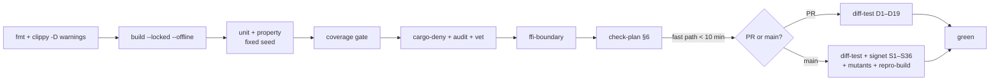

Trinity — serverloses 2-von-3 Wallet-Schema. Entwurf: Joshua Krüger, 2026.

# Test environment, coverage and CI

**Reference documents:** [`SPECIFICATION.md`](SPECIFICATION.md) §5 (test strategy, test cases,
release criteria) · [`IMPLEMENTATION_PLAN.md`](IMPLEMENTATION_PLAN.md) (which WP owes which
test)

---

## 1. The principle

> **Own assertions show that the code does what the author thought. Differential testing
> shows that it does the same as an independent reference. Only the second is a statement
> about correctness.**

From that follows the ranking: **Differential before Property before Unit.** A unit test that only holds
the own implementation against the own expectation counts little for release — it
counts for coverage, and that is exactly why coverage alone is not enough (§3).

---

## 2. Test environment

### 2.1 Requirements

| | |
|---|---|
| Reproducible | Same versions on every machine and in CI, pinned by digest |
| Offline-capable | Runnable without network after the first pull |
| Deterministic | Regtest with fixed starting state and fixed seeds |
| Fast | Full regtest cycle < 5 min local |
| Platforms | Linux **and** macOS (iOS development needs macOS) |

### 2.2 Components

| Service | Version | Purpose |
|---|---|---|
| **Bitcoin Core** | **30.2** (regtest + signet) | Reference for all D-tests, recovery tests S5 |
| **electrs** | pinned | Backend for `ElectrumBackend` (WP-14) |
| **CBF peer** | dedicated Core node with `blockfilterindex=1`, `peerblockfilters=1` | Backend for `CbfBackend` (WP-16) |
| **Sparrow** | current, manual | D14, D15, S6 — not automatable |
| **Hardware bench** | see §4 | D18, D19, S16–S18, S21, S22 |

> ### ⚠️ Bitcoin Core 30.0 and 30.1 are forbidden
> Both had a bug that when migrating an unnamed legacy wallet in a
> custom wallet directory with pruning enabled could delete **all** wallet files of the node;
> the binaries were withdrawn on 2026-01-05 (SPECIFICATION.md §0.3).
> **The start script checks `getnetworkinfo.version` and hard-aborts on 30.0 or 30.1** —
> not as a warning, but as an error.

### 2.3 Operation

```bash
just test-env-up        # Core 30.2 regtest + electrs + CBF peer, 101 blocks, funded wallet
just test-env-down      # full cleanup, incl. volumes
just test-env-reset     # Down + Up, deterministically same state

just test               # Unit + Property, no network          (< 2 min)
just diff-test          # D1–D19 against Core 30.2              (< 20 min)
just signet-test        # S1–S36 on regtest and signet       (< 45 min)
just fuzz <target>      # cargo-fuzz
just coverage           # report + gate check
just mutants            # cargo-mutants on verify and signer
just check-plan         # §6: Test-IDs ↔ WPs ↔ Spec
```

### 2.4 Determinism

| Rule | Implementation |
|---|---|
| Fixed seeds | All property tests run with fixed `PROPTEST_RNG_SEED`; a failure is reproducible |
| No wall clock | Time-dependent logic (window counters, 60-day reminder) gets an injected `Clock`; tests set it **explicitly** |
| No network time | No NTP, no rate fetches on the test path — the rate is a fake with set values (S29c) |
| Fixed regtest state | 101 blocks, fixed coinbase recipients, fixed descriptor set from `tests/vectors/` |

---

## 3. Coverage policy

### 3.1 The honest frame

**100 % line and branch coverage is required for the security cores and is
reachable there.** For two areas it is not, and naming that honestly is better than
forcing a number that says nothing:

- **Platform code** (Keychain, Secure Enclave, StrongBox, BiometricPrompt) cannot be fully
  executed without real devices. Simulators do not model enclave behaviour.
- **Hardware transports** need the devices from §4.

For both: **quantified exception with justification**, not silent omission.

**Branch coverage and toolchain (measured 2026-08-09, WP-03):**

- `cargo llvm-cov --workspace --lcov` (without `--branch`) on toolchain **1.94.1**: on empty
  scaffolds the report aborts with `no coverage data found` (no instrumented code
  executed). Once domain code and tests exist, this path yields lines (`LF`/`LH`),
  but **no** `BRF`/`BRH` lines.
- `cargo llvm-cov --workspace --lcov --branch` on the same toolchain: **aborts**.
  `--branch` sets `-Z coverage-options=branch` and requires **nightly**; the pinned
  stable 1.94.1 rejects the option (`the option Z is only accepted on the nightly compiler`).

**Named gap:** The 100 % branch threshold for the security cores is **not measurable** on the pinned
toolchain. The gate reports missing branch data as a finding
("branch data missing — did `cargo llvm-cov` run without `--branch`?") instead of silently reporting 100 %.
The gap closes when either (a) the pinned toolchain supports branch coverage
stably and CI/`just coverage` then set `--branch`, or (b) a deliberate
toolchain decision enables branch coverage and is updated in §0.3/WP-00.
**Do not claim a number that is not measured.** Until then the line threshold
remains enforceable; the branch threshold is fail-closed on "data missing".

> **And the more important point: coverage measures execution, not checking.** A test that
> runs a line without checking its result still counts fully. That is why **mutation testing**
> (§3.3) is the real gate for the security cores — 100 % coverage with surviving
> mutants is a red result, not a green one.

### 3.2 Thresholds per crate

| Crate | Lines | Branches | Tool | Exceptions |
|---|---|---|---|---|
| `trinity-types` | **100 %** | **100 %** | llvm-cov | none |
| `trinity-entropy` | **100 %** | **100 %** | llvm-cov | none |
| `trinity-keystore` | **100 %** | **100 %** | llvm-cov | none |
| `trinity-signer` | **100 %** | **100 %** | llvm-cov | none |
| `trinity-verify` | **100 %** | **100 %** | llvm-cov | **none — no exception is allowed here** |
| `trinity-watch` | ≥ 95 % | ≥ 90 % | llvm-cov | BDK error paths that require a broken DB |
| `trinity-chain` | ≥ 90 % | ≥ 85 % | llvm-cov | network error paths per backend |
| `trinity-transport` | ≥ 90 % | ≥ 85 % | llvm-cov | device-specific paths, see §4 |
| `trinity-export` | **100 %** | ≥ 95 % | llvm-cov | none |
| `trinity-ffi` | ≥ 95 % | ≥ 90 % | llvm-cov | uniffi generator |
| iOS layer | ≥ 80 % | — | xccov | Enclave paths — **device test instead of coverage** |
| Android layer | ≥ 80 % | — | JaCoCo | StrongBox paths — **device test instead of coverage** |
| `app/` (TypeScript) | ≥ 85 % | ≥ 80 % | vitest/c8 | rendering edge cases |

### 3.3 Mutation testing — the real gate

`cargo-mutants` against `trinity-verify`, `trinity-signer`, `trinity-keystore`,
`trinity-entropy`.

**Rule: no surviving mutant.** If one survives, a check is missing — the mutant is
not exempted; the test is extended. Exceptions are only allowed for mutants
that produce semantically equivalent code, and need an entry in
`mutants-exclusions.toml` **with justification**.

### 3.4 Exceptions file

`coverage-exclusions.toml`, one entry per exception:

```toml
[[exclusion]]
path   = "crates/trinity-chain/src/electrum.rs"
lines  = "142-158"
reason = "Connection drop mid TLS handshake; not deterministically simulable."
test   = "Manually covered by S13, protocol in tests/manual/S13.md"
owner  = "chain"
```

**An entry without `reason` or without `test` fails the build.** The file is reviewed at every
release; if it grows, that is a finding, not a detail.

---

## 4. Hardware test bench

Without real devices the `ExternalSigner` path is **not** to be claimed as tested
(SPECIFICATION.md §5.4).

| Device | Transport | Tests | Phase |
|---|---|---|---|
| **Coldcard Q** | QR (BBQr) | D19, S16, S17, S18, S21, S22 | v1 |
| Keystone or SeedSigner | QR (UR) | D19 as second source | v1 |
| Coldcard Mk4 | NFC | S26 | v1 |
| BitBox02 Nova | BLE | — | v1.1 |
| Ledger Nano X | BLE | — | v1.1 |

**Automation:** The QR path is tested at protocol level via frame injection
(deterministic, in CI) **and** once per release with a camera rig against a real
device. Only the second run evidences the display behaviour on which T19 and the BIP-388 claim
from §2.7.3 rest.

**Firmware protocol:** On every device firmware update, D18, D19 and S16–S18 run again
(SPECIFICATION.md §5.4). The checked firmware version is logged — without it a
green run is not attributable.

---

## 5. CI pipeline



| Stage | When | Breaks on |
|---|---|---|
| `fmt`, `clippy -D warnings` | every push | any warning |
| `build --locked --offline` | every push | network access or lockfile drift |
| Unit + Property | every push | failure; seed is printed in the log |
| Coverage gate | every push | under threshold, or exception without justification |
| `cargo-deny`/`audit`/`vet` | every push | unknown license, advisory, duplicate crate |
| `ffi-boundary` | every push | signature change outside the allowlist |
| `check-plan` | every push | test ID without WP, or WP with unknown test ID |
| Differential D1–D19 | every PR | any divergence against Core 30.2 |
| Signet S1–S36 | merge to `main` | any failure |
| `cargo-mutants` | merge to `main` | any surviving mutant |
| Reproducible build | merge to `main` | differing hashes |
| Fuzzing 24 h | nightly + before release | any finding |

**Two special rules.** A failure of **S4** or **S5** (recovery with and without this app)
blocks independently of everything else — they have their own veto. A failure of
**S23** (FFI facade: no secret export; `blob_B` only after SpendPolicy check; no
policy/key exports without `SecretBytes`) breaks compilation, not the test.

---

## 6. Self-check of the plan

`just check-plan` checks that specification, plan and code fit together. It is a
CI step, not a helper.

| Check | Breaks when |
|---|---|
| Every test ID (D/P/S) defined in SPECIFICATION.md sits on exactly one `**Tests:**` line of a WP block | an ID is missing or assigned twice |
| Every test ID named on `**Tests:**` exists in the Spec | an ID was invented |
| Every due test ID (WP on `DONE`) has a test function with matching name (`d1_…`, `p5_…`, `s15b_…`, `s29h_…` — lowercase, **no** leading zero) | a test exists only on paper |
| Every threat T1–T20 is touched by at least one test or an explicit "not covered" line in §4.2 | a threat remains untreated |
| Every decision E1–E7 has an implementing WP | a decision lands nowhere |
| Every section reference in the documents and in `README.md` points to an existing section | a reference is dead |
| No ID is defined twice | two definitions of the same ID exist |
| Every WP block has the required fields; every referenced WP-ID has its own block; dependencies exist and form no cycle | structure incomplete or cyclic |
| Counts (release criteria §5.5, WP blocks, crates, external crates/`MEASURED`) match the measurement | number copied and stale |

> This check already found an error at introduction — T19 was defined twice,
> in §2.7.8 and in §4.1. That is exactly what it is for.

---

## 7. What "done" means

A WP is done when **all** of its test cases are green and the coverage gate of its crate
holds. No WP is merged without tests, and no test debt is deferred —
the exceptions file from §3.4 is the only allowed place for gaps, and every line in it
costs a justification.

A **release** is done when the 21 criteria in SPECIFICATION.md §5.5 are checked off and evidenced.
The four with their own veto:

| # | Criterion |
|---|---|
| 4 | **S4 and S5** green — recovery with and without this app |
| 5b | **S28, S30, S31, S32** green — the spending limit applies and is not changeable without passphrase |
| 5c | **S27** green — exactly one biometric prompt per send below the limit |
| 13 | External audit, critical and high findings closed |
