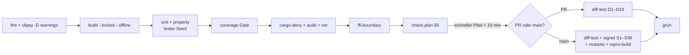

# Testumgebung, Coverage und CI

**Bezugsdokumente:** [`SPECIFICATION.md`](SPECIFICATION.md) §5 (Teststrategie, Testfälle,
Freigabekriterien) · [`IMPLEMENTATION_PLAN.md`](IMPLEMENTATION_PLAN.md) (welches WP welchen
Test schuldet)

---

## 1. Der Grundsatz

> **Eigene Assertions belegen, dass der Code tut, was der Autor dachte. Differential Testing
> belegt, dass er dasselbe tut wie eine unabhängige Referenz. Nur das Zweite ist eine Aussage
> über Korrektheit.**

Daraus folgt die Rangfolge: **Differential vor Property vor Unit.** Ein Unit-Test, der nur die
eigene Implementierung gegen die eigene Erwartung hält, zählt für die Freigabe wenig — er
zählt für die Coverage, und das ist genau der Grund, warum Coverage allein nicht genügt (§3).

---

## 2. Testumgebung

### 2.1 Anforderungen

| | |
|---|---|
| Reproduzierbar | Gleiche Versionen auf jedem Rechner und in CI, per Digest gepinnt |
| Offline-fähig | Nach dem ersten Pull ohne Netz lauffähig |
| Deterministisch | Regtest mit festem Startzustand und festen Seeds |
| Schnell | Voller Regtest-Zyklus < 5 min lokal |
| Plattformen | Linux **und** macOS (iOS-Entwicklung braucht macOS) |

### 2.2 Bestandteile

| Dienst | Version | Zweck |
|---|---|---|
| **Bitcoin Core** | **30.2** (Regtest + Signet) | Referenz für alle D-Tests, Recovery-Tests S5 |
| **electrs** | gepinnt | Backend für `ElectrumBackend` (WP-14) |
| **CBF-Peer** | eigener Core-Node mit `blockfilterindex=1`, `peerblockfilters=1` | Backend für `CbfBackend` (WP-16) |
| **Sparrow** | aktuell, manuell | D14, D15, S6 — nicht automatisierbar |
| **Hardware-Bench** | siehe §4 | D18, D19, S16–S18, S21, S22 |

> ### ⚠️ Bitcoin Core 30.0 und 30.1 sind verboten
> Beide hatten einen Fehler, der beim Migrieren einer unbenannten Legacy-Wallet in einem
> Custom-Wallet-Verzeichnis bei aktiviertem Pruning **alle** Wallet-Dateien des Knotens löschen
> konnte; die Binaries wurden am 2026-01-05 zurückgezogen (SPECIFICATION.md §0.3).
> **Das Startskript prüft `getnetworkinfo.version` und bricht bei 30.0 oder 30.1 hart ab** —
> nicht als Warnung, sondern als Fehler.

### 2.3 Bedienung

```bash
just test-env-up        # Core 30.2 regtest + electrs + CBF-Peer, 101 Blöcke, geförderte Wallet
just test-env-down      # vollständig aufräumen, inkl. Volumes
just test-env-reset     # Down + Up, deterministisch gleicher Zustand

just test               # Unit + Property, ohne Netz          (< 2 min)
just diff-test          # D1–D19 gegen Core 30.2              (< 20 min)
just signet-test        # S1–S36 auf Regtest und Signet       (< 45 min)
just fuzz <ziel>        # cargo-fuzz
just coverage           # Bericht + Gate-Prüfung
just mutants            # cargo-mutants auf verify und signer
just check-plan         # §6: Test-IDs ↔ WPs ↔ Spec
```

### 2.4 Determinismus

| Regel | Umsetzung |
|---|---|
| Feste Seeds | Alle Property-Tests laufen mit festem `PROPTEST_RNG_SEED`; ein Fehlschlag ist reproduzierbar |
| Keine Wanduhr | Zeitabhängige Logik (Fensterzähler, 60-Tage-Erinnerung) bekommt eine injizierte `Clock`; Tests stellen sie **explizit** |
| Keine Netzwerkzeit | Kein NTP, keine Kursabrufe im Testpfad — der Kurs ist ein Fake mit gesetzten Werten (S29c) |
| Fester Regtest-Zustand | 101 Blöcke, feste Coinbase-Empfänger, fester Descriptor-Satz aus `tests/vectors/` |

---

## 3. Coverage-Politik

### 3.1 Der ehrliche Rahmen

**100 % Zeilen- und Zweigabdeckung wird für die Sicherheitskerne verlangt und ist dort
erreichbar.** Für zwei Bereiche ist sie es nicht, und das ehrlich zu benennen ist besser, als
eine Zahl zu erzwingen, die nichts aussagt:

- **Plattformcode** (Keychain, Secure Enclave, StrongBox, BiometricPrompt) lässt sich ohne
  echte Geräte nicht vollständig ausführen. Simulatoren bilden Enclave-Verhalten nicht ab.
- **Hardware-Transporte** brauchen die Geräte aus §4.

Für beide gilt: **quantifizierte Ausnahme mit Begründung**, nicht stillschweigendes Weglassen.

**Zweigabdeckung und Toolchain (gemessen 2026-08-09, WP-03):**

- `cargo llvm-cov --workspace --lcov` (ohne `--branch`) auf Toolchain **1.94.1**: bei leeren
  Gerüsten bricht der Report mit `no coverage data found` ab (kein instrumentierter Code
  ausgeführt). Sobald Fachcode und Tests existieren, liefert dieser Pfad Zeilen (`LF`/`LH`),
  aber **keine** `BRF`/`BRH`-Zeilen.
- `cargo llvm-cov --workspace --lcov --branch` auf derselben Toolchain: **bricht ab**.
  `--branch` setzt `-Z coverage-options=branch` und verlangt **nightly**; die gepinnte
  stabile 1.94.1 lehnt die Option ab (`the option Z is only accepted on the nightly compiler`).

**Benannte Lücke:** Die 100-%-Zweigschwelle für die Sicherheitskerne ist auf der gepinnten
Toolchain **nicht erhebbar**. Das Gate meldet fehlende Zweigdaten als Befund
(„Zweigdaten fehlen — lief `cargo llvm-cov` ohne `--branch`?"), statt still 100 % zu
melden. Die Lücke schließt sich, wenn entweder (a) die gepinnte Toolchain Branch-Coverage
stabil unterstützt und CI/`just coverage` dann `--branch` setzen, oder (b) eine bewusste
Toolchain-Entscheidung Branch-Coverage freigibt und in §0.3/WP-00 nachgezogen wird.
**Keine Zahl behaupten, die nicht gemessen wird.** Bis dahin bleibt die Zeilenschwelle
durchsetzbar; die Zweigschwelle ist fail-closed auf „Daten fehlen".

> **Und der wichtigere Punkt: Coverage misst Ausführung, nicht Prüfung.** Ein Test, der eine
> Zeile durchläuft, ohne ihr Ergebnis zu prüfen, zählt voll. Deshalb ist **Mutation Testing**
> (§3.3) das eigentliche Gate für die Sicherheitskerne — 100 % Coverage mit überlebenden
> Mutanten ist ein rotes Ergebnis, kein grünes.

### 3.2 Schwellen je Crate

| Crate | Zeilen | Zweige | Werkzeug | Ausnahmen |
|---|---|---|---|---|
| `trinity-types` | **100 %** | **100 %** | llvm-cov | keine |
| `trinity-entropy` | **100 %** | **100 %** | llvm-cov | keine |
| `trinity-keystore` | **100 %** | **100 %** | llvm-cov | keine |
| `trinity-signer` | **100 %** | **100 %** | llvm-cov | keine |
| `trinity-verify` | **100 %** | **100 %** | llvm-cov | **keine — hier ist keine Ausnahme zulässig** |
| `trinity-watch` | ≥ 95 % | ≥ 90 % | llvm-cov | BDK-Fehlerpfade, die eine defekte DB voraussetzen |
| `trinity-chain` | ≥ 90 % | ≥ 85 % | llvm-cov | Netzwerkfehlerpfade je Backend |
| `trinity-transport` | ≥ 90 % | ≥ 85 % | llvm-cov | gerätespezifische Pfade, siehe §4 |
| `trinity-export` | **100 %** | ≥ 95 % | llvm-cov | keine |
| `trinity-ffi` | ≥ 95 % | ≥ 90 % | llvm-cov | uniffi-Generat |
| iOS-Schicht | ≥ 80 % | — | xccov | Enclave-Pfade — **Gerätetest statt Coverage** |
| Android-Schicht | ≥ 80 % | — | JaCoCo | StrongBox-Pfade — **Gerätetest statt Coverage** |
| `app/` (TypeScript) | ≥ 85 % | ≥ 80 % | vitest/c8 | Rendering-Randfälle |

### 3.3 Mutation Testing — das eigentliche Gate

`cargo-mutants` gegen `trinity-verify`, `trinity-signer`, `trinity-keystore`,
`trinity-entropy`.

**Regel: kein überlebender Mutant.** Überlebt einer, fehlt eine Prüfung — der Mutant wird
nicht ausgenommen, sondern der Test wird ergänzt. Ausnahmen sind nur zulässig für Mutanten,
die semantisch äquivalenten Code erzeugen, und brauchen einen Eintrag in
`mutants-exclusions.toml` **mit Begründung**.

### 3.4 Ausnahmen-Datei

`coverage-exclusions.toml`, ein Eintrag je Ausnahme:

```toml
[[exclusion]]
path   = "crates/trinity-chain/src/electrum.rs"
lines  = "142-158"
reason = "Verbindungsabbruch mitten im TLS-Handshake; nicht deterministisch simulierbar."
test   = "Manuell abgedeckt durch S13, Protokoll in tests/manual/S13.md"
owner  = "chain"
```

**Ein Eintrag ohne `reason` oder ohne `test` bricht den Build.** Die Datei wird bei jedem
Release gereviewt; wächst sie, ist das ein Befund, kein Detail.

---

## 4. Hardware-Testbank

Ohne echte Geräte ist der `ExternalSigner`-Pfad **nicht** als getestet zu behaupten
(SPECIFICATION.md §5.4).

| Gerät | Transport | Tests | Phase |
|---|---|---|---|
| **Coldcard Q** | QR (BBQr) | D19, S16, S17, S18, S21, S22 | v1 |
| Keystone oder SeedSigner | QR (UR) | D19 als zweite Quelle | v1 |
| Coldcard Mk4 | NFC | S26 | v1 |
| BitBox02 Nova | BLE | — | v1.1 |
| Ledger Nano X | BLE | — | v1.1 |

**Automatisierung:** Der QR-Pfad wird auf Protokollebene per Frame-Injection getestet
(deterministisch, in CI) **und** einmal je Release mit einem Kamera-Rig gegen ein echtes
Gerät. Nur der zweite Lauf belegt das Displayverhalten, auf dem T19 und die BIP-388-Aussage
aus §2.7.3 beruhen.

**Firmware-Protokoll:** Bei jedem Geräte-Firmware-Update laufen D18, D19 und S16–S18 erneut
(SPECIFICATION.md §5.4). Die geprüfte Firmware-Version wird protokolliert — ohne sie ist ein
grüner Lauf nicht zuordenbar.

---

## 5. CI-Pipeline



| Stufe | Wann | Bricht bei |
|---|---|---|
| `fmt`, `clippy -D warnings` | jeder Push | jeder Warnung |
| `build --locked --offline` | jeder Push | Netzzugriff oder Lockfile-Drift |
| Unit + Property | jeder Push | Fehlschlag; Seed wird im Log ausgegeben |
| Coverage-Gate | jeder Push | Unterschreitung, oder Ausnahme ohne Begründung |
| `cargo-deny`/`audit`/`vet` | jeder Push | unbekannte Lizenz, Advisory, Duplikat-Crate |
| `ffi-boundary` | jeder Push | Signaturänderung außerhalb der Allowlist |
| `check-plan` | jeder Push | Test-ID ohne WP, oder WP mit unbekannter Test-ID |
| Differential D1–D19 | jeder PR | jeder Divergenz gegen Core 30.2 |
| Signet S1–S36 | Merge nach `main` | jedem Fehlschlag |
| `cargo-mutants` | Merge nach `main` | jedem überlebenden Mutanten |
| Reproducible Build | Merge nach `main` | abweichenden Hashes |
| Fuzzing 24 h | nächtlich + vor Release | jedem Fund |

**Zwei Sonderregeln.** Ein Fehlschlag von **S4** oder **S5** (Recovery mit und ohne diese App)
blockiert unabhängig von allem anderen — sie haben ein eigenes Veto. Ein Fehlschlag von
**S23** (FFI-Fassade: kein Secret-Export; `blob_B` nur nach SpendPolicy-Prüfung; keine
Policy-/Schlüsselexporte ohne `SecretBytes`) bricht die Kompilierung, nicht den Test.

---

## 6. Selbstprüfung des Plans

`just check-plan` prüft, dass Spezifikation, Plan und Code zusammenpassen. Es ist ein
CI-Schritt, kein Hilfsmittel.

| Prüfung | Bricht, wenn |
|---|---|
| Jede in SPECIFICATION.md definierte Test-ID (D/P/S) steht auf genau einer `**Tests:**`-Zeile eines WP-Blocks | eine ID fehlt oder doppelt zugeordnet ist |
| Jede auf `**Tests:**` genannte Test-ID existiert in der Spec | eine ID erfunden wurde |
| Jede fällige Test-ID (WP auf `FERTIG`) hat eine Testfunktion mit passendem Namen (`d1_…`, `p5_…`, `s15b_…`, `s29h_…` — kleingeschrieben, **ohne** führende Null) | ein Test nur auf dem Papier steht |
| Jede Bedrohung T1–T20 wird von mindestens einem Test oder einer ausdrücklichen „nicht abgedeckt"-Zeile in §4.2 berührt | eine Bedrohung ohne Behandlung bleibt |
| Jede Entscheidung E1–E7 hat ein umsetzendes WP | eine Entscheidung nirgends landet |
| Jeder Abschnittsverweis in den Dokumenten und in `README.md` zeigt auf einen existierenden Abschnitt | ein Verweis tot ist |
| Keine ID ist doppelt definiert | zwei Definitionen derselben ID existieren |
| Jeder WP-Block hat die Pflichtfelder; jede referenzierte WP-ID hat einen eigenen Block; Abhängigkeiten existieren und bilden keinen Zyklus | Struktur unvollständig oder zyklisch |
| Anzahlen (Freigabepunkte §5.5, WP-Blöcke, Crates, externe Crates/`MEASURED`) stimmen mit der Messung überein | Zahl abgeschrieben und veraltet |

> Diese Prüfung hat bei ihrer Einführung bereits einen Fehler gefunden — T19 war doppelt
> definiert, in §2.7.8 und in §4.1. Genau dafür ist sie da.

---

## 7. Was „fertig" heißt

Ein WP ist fertig, wenn **alle** seine Testfälle grün sind und das Coverage-Gate seines Crates
hält. Kein WP wird ohne Tests gemerged, und keine Testschuld wird auf später verschoben —
die Ausnahmen-Datei aus §3.4 ist der einzige zulässige Ort für Lücken, und jede Zeile darin
kostet eine Begründung.

Ein **Release** ist fertig, wenn die 21 Punkte in SPECIFICATION.md §5.5 abgehakt und belegt
sind. Die vier mit eigenem Veto:

| # | Kriterium |
|---|---|
| 4 | **S4 und S5** grün — Recovery mit und ohne diese App |
| 5b | **S28, S30, S31, S32** grün — die Ausgabegrenze greift und ist nicht ohne Passphrase änderbar |
| 5c | **S27** grün — genau ein biometrischer Prompt pro Send unterhalb der Grenze |
| 13 | Externes Audit, kritische und hohe Findings geschlossen |
